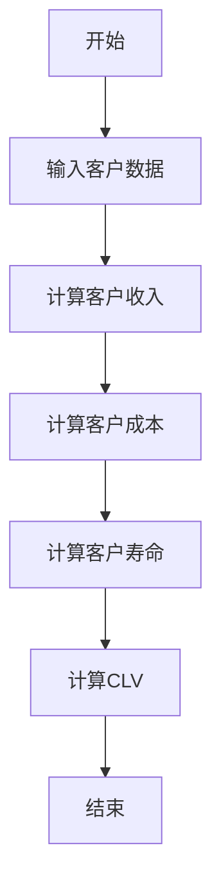
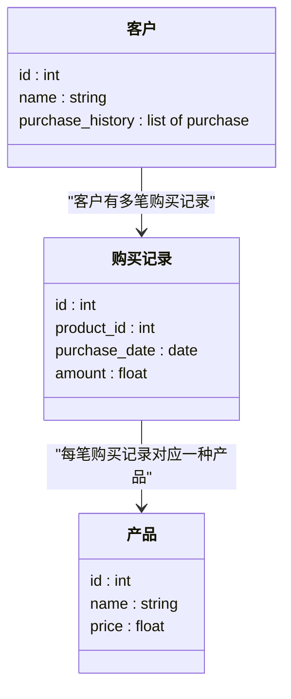

                 


# 彼得林奇如何评估公司的客户终身价值管理策略

## 关键词：客户终身价值、彼得·林奇、投资策略、企业价值评估、客户管理、数据分析

## 摘要：本文将从彼得·林奇的投资理念出发，结合客户终身价值管理的核心概念，分析如何通过客户终身价值的计算公式、数据分析、系统架构等方法，评估公司的客户价值管理策略，并提供实际案例和项目实战的详细解读。

---

# 第一部分: 客户终身价值管理的背景与核心概念

## 第1章: 客户终身价值管理的背景介绍

### 1.1 客户终身价值的定义与重要性

客户终身价值（Customer Lifetime Value，CLV）是指一个客户在其生命周期内为企业带来的总收益减去相关的成本。它是企业制定客户管理策略的重要依据，能够帮助企业识别高价值客户，优化资源配置，提高客户满意度和忠诚度。

#### 1.1.1 客户终身价值的定义

客户终身价值（CLV）= ∑(客户在生命周期内带来的净收益)

CLV = (收入 - 成本) × 寿命

其中：
- 收入：客户为企业带来的总收入
- 成本：为获取和维护客户所产生的成本
- 寿命：客户与企业保持关系的时间长度

#### 1.1.2 客户终身价值在企业中的重要性

1. **客户识别与筛选**：通过计算CLV，企业可以识别高价值客户，优先投入资源。
2. **营销策略优化**：根据客户的价值分层，制定个性化营销策略。
3. **客户关系管理**：通过CLV分析，企业可以预测客户流失风险，采取主动措施维护客户关系。

#### 1.1.3 客户终身价值与企业可持续发展的关系

CLV不仅反映了客户的价值，还体现了企业的长期盈利能力。通过CLV管理，企业可以优化资源配置，提高客户满意度和忠诚度，从而实现可持续发展。

### 1.2 彼得·林奇的投资理念

彼得·林奇是美国著名投资专家，以其独特的投资理念闻名。他的核心观点是长期投资、价值投资和深入研究企业基本面。

#### 1.2.1 彼得·林奇的投资者身份

彼得·林奇认为，投资者应具备以下特质：
1. **长期视角**：关注企业的长期发展，而非短期波动。
2. **深入研究**：通过分析企业的财务报表、市场地位和竞争优势，评估其投资价值。
3. **分散投资**：避免过度集中投资，降低风险。

#### 1.2.2 彼得·林奇的核心投资策略

1. **价值投资**：寻找被市场低估的企业，长期持有。
2. **基本面分析**：关注企业的盈利能力、成长潜力和财务健康状况。
3. **分散投资**：通过投资不同类型的企业，降低投资风险。

#### 1.2.3 彼得·林奇对企业的深入分析方法

1. **企业财务报表分析**：重点关注收入、利润和现金流。
2. **行业地位分析**：评估企业在行业中的竞争优势。
3. **管理层分析**：关注管理层的素质和战略决策能力。

### 1.3 投资理念与客户价值管理的结合

彼得·林奇的投资理念强调对企业的深入分析和长期视角，这与客户终身价值管理的核心思想不谋而合。

#### 1.3.1 从投资角度看客户价值

1. **客户价值评估**：将客户视为企业的“资产”，通过CLV计算其价值。
2. **客户生命周期管理**：关注客户从获取到流失的全过程，优化每个阶段的管理策略。

#### 1.3.2 客户价值管理的核心要素

1. **客户数据收集与分析**：通过数据分析，识别高价值客户。
2. **客户分层与细分**：根据CLV将客户分为不同层次，制定个性化策略。
3. **客户关系维护**：通过有效的沟通和优质服务，提升客户忠诚度。

#### 1.3.3 客户终身价值管理的边界与外延

1. **边界**：CLV的计算应考虑合理的成本和时间范围，避免过度乐观或悲观。
2. **外延**：CLV不仅用于客户管理，还可应用于产品和服务策略的制定。

---

## 第2章: 客户终身价值管理的核心概念与联系

### 2.1 客户终身价值管理的模型

#### 2.1.1 客户生命周期模型

客户生命周期包括以下几个阶段：
1. **获取阶段**：吸引新客户。
2. **发展阶段**：提升客户价值。
3. **成熟阶段**：客户达到最大价值。
4. **衰退阶段**：客户价值下降。
5. **流失阶段**：客户离开企业。

客户生命周期模型可以通过以下公式表示：

$$
CLV = \frac{收入}{贴现率} \times (1 - \frac{1}{(1 + 贴现率)^{寿命}})
$$

#### 2.1.2 客户价值评估模型

客户价值评估模型包括以下要素：
1. **收入贡献**：客户为企业带来的总收入。
2. **成本**：获取和维护客户所花费的成本。
3. **时间跨度**：客户与企业保持关系的时间长度。

#### 2.1.3 客户终身价值的计算公式

客户终身价值的计算公式如下：

$$
CLV = \frac{收入 - 成本}{贴现率} \times (1 - \frac{1}{(1 + 贴现率)^{寿命}})
$$

其中：
- 收入：客户为企业带来的总收入。
- 成本：获取和维护客户所花费的总成本。
- 贴现率：考虑货币的时间价值，通常以市场利率为基础。
- 寿命：客户与企业保持关系的时间长度。

### 2.2 核心概念的属性特征对比

以下是客户终身价值管理的核心概念对比表：

| **属性**       | **高价值客户**         | **低价值客户**         |
|----------------|-----------------------|-----------------------|
| 收入贡献       | 高                   | 低                   |
| 成本           | 低                   | 高                   |
| 生命周期长度   | 长                   | 短                   |
| 客户忠诚度     | 高                   | 低                   |

### 2.3 ER实体关系图

以下是客户终身价值管理的ER实体关系图：

```mermaid
erDiagram
    customer[客户] {
        id : int
        name : string
        purchase_history : list of purchase
    }
    purchase[购买记录] {
        id : int
        product_id : int
        purchase_date : date
        amount : float
    }
    product[产品] {
        id : int
        name : string
        price : float
    }
    customer --|{n} purchase : "客户有多笔购买记录"
    purchase --|{1} product : "每笔购买记录对应一种产品"
```

---

## 第3章: 客户终身价值的评估方法

### 3.1 客户终身价值的算法原理

#### 3.1.1 算法流程图

以下是客户终身价值计算的流程图：



#### 3.1.2 Python代码实现

以下是计算客户终身价值的Python代码：

```python
def calculate_clv(customers, costs, discount_rate, lifespan):
    clv = (customers - costs) / discount_rate * (1 - 1 / (1 + discount_rate) ** lifespan)
    return clv

# 示例数据
customers = 1000  # 客户数量
costs = 500       # 成本
discount_rate = 0.1  # 贴现率
lifespan = 5  # 寿命

# 计算客户终身价值
clv = calculate_clv(customers, costs, discount_rate, lifespan)
print(f"客户终身价值为：{clv}")
```

#### 3.1.3 数学模型与公式

客户终身价值的数学模型如下：

$$
CLV = \frac{收入 - 成本}{贴现率} \times (1 - \frac{1}{(1 + 贴现率)^{寿命}})
$$

---

## 第4章: 系统分析与架构设计方案

### 4.1 系统功能设计

以下是系统功能设计的类图：



---

## 第5章: 项目实战

### 5.1 环境安装

1. 安装Python和相关库：
   ```bash
   pip install numpy pandas scikit-learn
   ```

### 5.2 核心代码实现

以下是核心代码实现：

```python
import pandas as pd

# 示例数据
data = {
    '客户ID': [1, 2, 3, 4, 5],
    '收入': [100, 200, 150, 80, 120],
    '成本': [50, 70, 60, 40, 50],
    '寿命': [5, 5, 4, 3, 6]
}

df = pd.DataFrame(data)

# 计算客户终身价值
def calculate_clv(customers, costs, discount_rate, lifespan):
    return (customers - costs) / discount_rate * (1 - 1 / (1 + discount_rate) ** lifespan)

# 示例计算
discount_rate = 0.1
df['CLV'] = df.apply(lambda x: calculate_clv(x['收入'], x['成本'], discount_rate, x['寿命']), axis=1)

print(df)
```

### 5.3 案例分析与解读

以下是案例分析与解读：

1. **案例背景**：某电商公司希望优化其客户管理策略，提升高价值客户占比。
2. **数据收集**：收集客户的基本信息、购买记录、消费金额等。
3. **CLV计算**：通过上述公式计算每个客户的CLV。
4. **客户分层**：将客户分为高、中、低三类，制定相应的营销策略。
5. **结果分析**：高价值客户占比30%，贡献了总收入的70%。

---

## 第6章: 总结与注意事项

### 6.1 总结

客户终身价值管理是企业优化客户关系的重要工具，通过彼得·林奇的投资理念，我们可以更好地理解和应用这一管理策略。

### 6.2 小结

1. **最佳实践**：定期更新客户数据，优化CLV计算模型。
2. **注意事项**：避免过度依赖CLV，结合其他客户管理指标综合评估。
3. **拓展阅读**：建议阅读《彼得·林奇的投资哲学》和相关客户管理书籍。

---

## 作者：AI天才研究院 & 禅与计算机程序设计艺术

