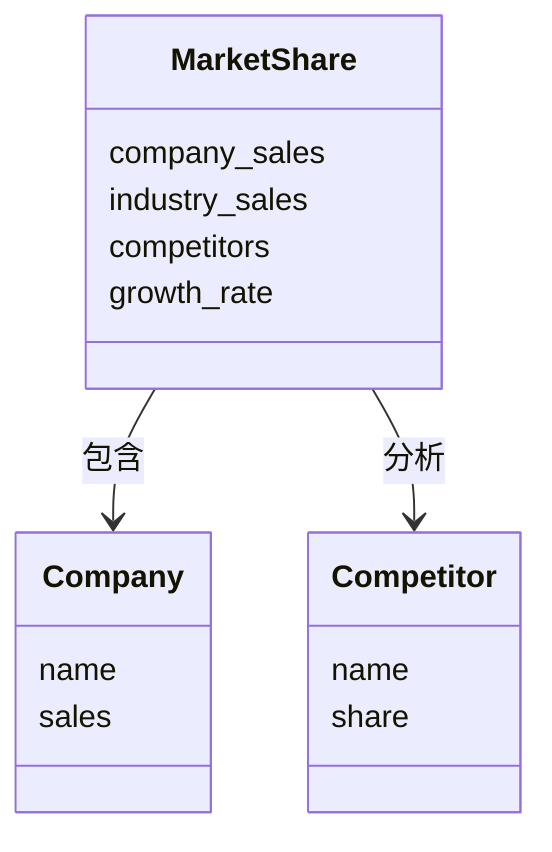
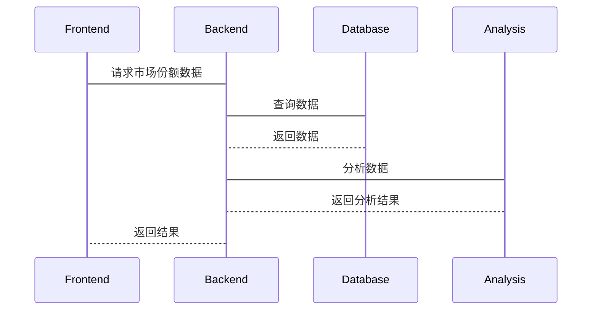

                 


# 彼得林奇如何评估公司的市场份额

> 关键词：彼得·林奇，市场份额，投资评估，市场分析，企业价值

> 摘要：本文详细介绍了彼得·林奇评估公司市场份额的方法和技巧，从基础概念到实际操作，帮助读者掌握如何通过市场份额评估企业价值。文章结合了理论分析和实际案例，深入浅出地讲解了彼得·林奇的评估模型和步骤，帮助读者在投资决策中做出明智的选择。

---

# 第1章：背景介绍

## 1.1 投资的基本概念与重要性

### 1.1.1 投资的定义与重要性

投资是指将资金投入到某个项目或资产中，以期获得未来收益的行为。在现代金融体系中，投资不仅是个人财富增值的重要手段，也是企业获取资金的重要途径。理解投资的基本概念，可以帮助我们更好地评估公司的市场份额，从而做出更明智的投资决策。

### 1.1.2 投资的重要性

投资的重要性体现在以下几个方面：

- **财富增值**：通过投资，个人和企业可以实现财富的增值。
- **资源配置**：投资有助于将有限的资源分配到最有效的地方，促进经济发展。
- **风险管理**：通过合理的投资组合，可以分散风险，降低投资损失。

### 1.1.3 投资与风险管理的关系

投资的本质是通过合理配置资产，在风险可控的前提下，实现收益的最大化。彼得·林奇曾强调，投资不仅是对市场的分析，更是对风险的管理和控制。

---

## 1.2 彼得·林奇的背景与投资理念

### 1.2.1 彼得·林奇的生平简介

彼得·林奇（Peter Lynch）是美国著名的投资专家，曾任富达投资集团麦哲伦基金的经理。他以卓越的投资业绩和独特的投资理念闻名，被誉为“股票投资之父”。

### 1.2.2 林奇的投资哲学

林奇的投资哲学可以概括为以下几点：

- **长期投资**：他认为，投资应该是长期的，而不是短期的投机。
- **基本面分析**：他强调对公司基本面的深入研究，包括财务状况、行业地位和竞争优势。
- **关注市场份额**：林奇认为，市场份额是衡量公司价值的重要指标，市场份额的稳定增长是公司长期发展的关键。

### 1.2.3 林奇对市场分析的独特见解

林奇认为，市场分析不仅仅是对数字的计算，更是对公司未来发展的预测。他善于通过市场份额的变化，发现那些具有长期增长潜力的公司。

---

## 1.3 什么是市场份额

### 1.3.1 市场份额的定义

市场份额是指一家公司在某个市场或行业中的销售比例。它是衡量公司市场地位的重要指标。

### 1.3.2 市场份额的计算公式

市场份额的计算公式为：

$$ \text{市场份额} = \frac{\text{公司销售额}}{\text{行业总销售额}} $$

### 1.3.3 市场份额的影响因素

市场份额的大小受到多种因素的影响，包括公司的产品竞争力、品牌影响力、价格策略以及行业竞争状况等。

---

# 第2章：核心概念与联系

## 2.1 彼得·林奇的市场份额评估模型

### 2.1.1 评估模型的构建

林奇的市场份额评估模型包括以下几个核心要素：

- **行业市场规模**：行业的总销售额。
- **公司销售额**：公司在该市场的销售额。
- **竞争对手分析**：主要竞争对手的市场份额和竞争策略。
- **市场增长潜力**：行业未来的发展前景。

### 2.1.2 模型的输入变量

模型的输入变量包括：

- 行业总销售额
- 公司销售额
- 竞争对手市场份额
- 行业增长率

### 2.1.3 模型的输出结果

模型的输出结果是公司未来的市场份额预测，以及市场份额变化对公司价值的影响。

---

## 2.2 与市场份额相关的概念对比

### 2.2.1 核心概念对比表格

| 概念       | 定义                                                                 |
|------------|----------------------------------------------------------------------|
| 市场份额    | 公司在某个市场中的销售比例                                             |
| 市场增长潜力 | 行业未来发展的可能性                                                   |
| 竞争对手分析 | 对主要竞争对手的市场份额和策略进行分析                               |

### 2.2.2 ER实体关系图

```mermaid
erDiagram
    customer
    {
        <name>
        <address>
        <phone>
    }
    product
    {
        <id>
        <name>
        <price>
    }
    company
    {
        <id>
        <name>
        <sales>
    }
    company --> product : 销售
    company --> customer : 提供服务
```

---

# 第3章：算法原理讲解

## 3.1 评估算法的数学模型

### 3.1.1 市场份额计算公式

$$ \text{市场份额} = \frac{\text{公司销售额}}{\text{行业总销售额}} $$

### 3.1.2 市场份额增长率公式

$$ \text{市场份额增长率} = \frac{\text{当前市场份额} - \text{上期市场份额}}{\text{上期市场份额}} \times 100\% $$

### 3.1.3 市场份额预测模型

$$ \text{预测市场份额} = \text{当前市场份额} + (\text{市场份额增长率} \times \text{预测年数}) $$

---

## 3.2 算法的实现步骤

### 3.2.1 数据收集

收集公司过去几年的销售额数据，以及行业总销售额数据。

### 3.2.2 数据分析

计算公司当前的市场份额，并分析市场份额的变化趋势。

### 3.2.3 竞争对手分析

评估主要竞争对手的市场份额和竞争策略。

### 3.2.4 市场份额预测

基于历史数据和行业趋势，预测未来的市场份额。

---

## 3.3 Python代码实现

```python
import pandas as pd

# 数据加载
data = pd.read_csv('market_share.csv')

# 当前市场份额计算
current_share = data['company_sales'] / data['industry_sales']

# 市场份额增长率计算
growth_rate = (current_share - data['company_share_previous']) / data['company_share_previous'] * 100

# 预测市场份额
forecast_share = current_share + (growth_rate * 5) / 100
```

---

# 第4章：系统分析与架构设计方案

## 4.1 问题场景介绍

假设我们是一家科技公司，需要评估在智能手机市场的份额。我们需要分析过去几年的销售数据，预测未来的市场份额，并制定相应的市场策略。

---

## 4.2 系统功能设计

### 4.2.1 功能模块

- 数据收集模块：收集公司和行业的销售数据。
- 数据分析模块：计算市场份额和增长率。
- 竞争对手分析模块：分析主要竞争对手的市场份额。
- 预测模块：基于历史数据，预测未来的市场份额。

### 4.2.2 领域模型类图



---

## 4.3 系统架构设计

### 4.3.1 系统架构图


---

## 4.4 系统接口与交互设计

### 4.4.1 系统交互序列图



---

# 第5章：项目实战

## 5.1 环境安装与配置

安装Python和必要的库：

```bash
pip install pandas matplotlib
```

---

## 5.2 核心代码实现

```python
import pandas as pd
import matplotlib.pyplot as plt

# 数据加载
data = pd.read_csv('market_share.csv')

# 当前市场份额计算
current_share = data['company_sales'] / data['industry_sales']

# 可视化市场份额变化
plt.plot(data['year'], current_share, label='Current Share')
plt.xlabel('Year')
plt.ylabel('Market Share')
plt.title('Market Share Analysis')
plt.legend()
plt.show()
```

---

## 5.3 实际案例分析

以苹果公司为例，分析其在智能手机市场的份额变化：

1. 数据收集：收集苹果过去5年的销售数据和行业总销售额。
2. 数据分析：计算苹果的市场份额。
3. 竞争对手分析：分析三星、华为等竞争对手的市场份额。
4. 预测市场份额：基于历史数据，预测苹果未来的市场份额。

---

## 5.4 系统实现与结果解读

通过代码实现，我们可以清晰地看到苹果的市场份额变化趋势，并预测未来的发展。

---

# 第6章：最佳实践与总结

## 6.1 最佳实践

- **数据来源**：确保数据的准确性和可靠性。
- **模型优化**：根据实际情况，调整模型的参数和假设。
- **定期更新**：随着市场变化，定期更新数据和模型。

## 6.2 小结

通过本文的学习，我们掌握了彼得·林奇评估公司市场份额的方法和技巧，能够通过市场份额分析，做出更明智的投资决策。

## 6.3 注意事项

- 在实际操作中，需要结合具体行业特点，调整评估模型。
- 数据分析时，要注意数据的完整性和准确性。

## 6.4 拓展阅读

- 《彼得·林奇的投资哲学》
- 《股票投资策略》

---

# 作者：AI天才研究院 & 禅与计算机程序设计艺术

通过本文的详细讲解，我们不仅了解了彼得·林奇的市场份额评估方法，还掌握了如何在实际中应用这些方法。希望本文能为您提供有价值的参考，帮助您在投资决策中做出明智的选择。

