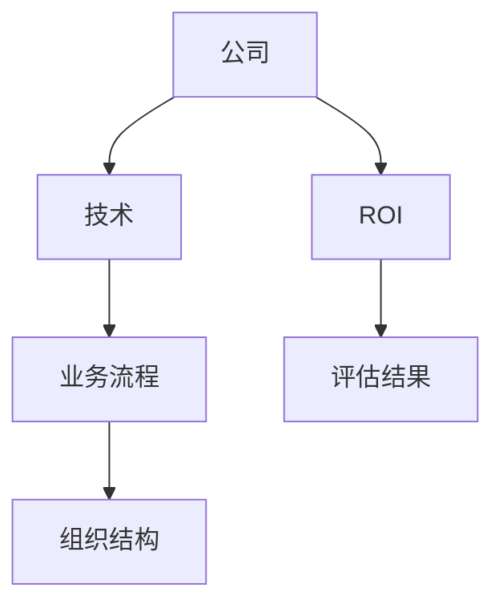
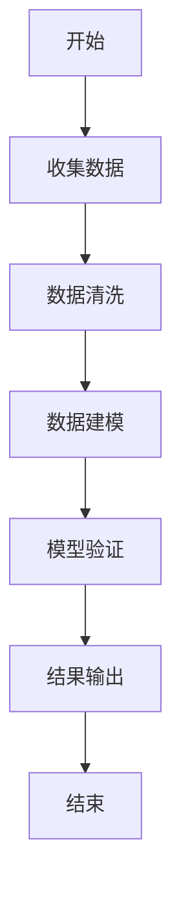
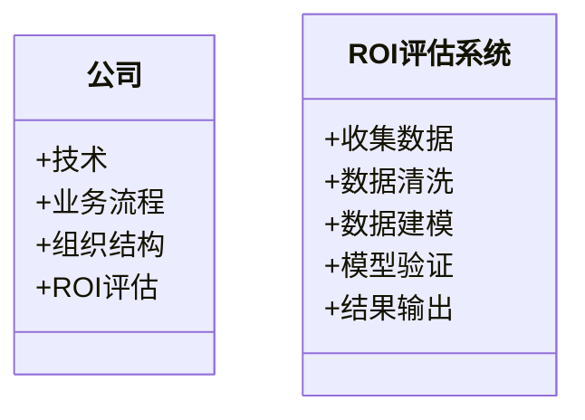

                 


# 彼得林奇如何评估公司的数字化转型ROI

## 关键词：数字化转型, ROI, 彼得林奇, 投资回报率, 技术评估

## 摘要：本文详细探讨了彼得林奇如何评估公司的数字化转型ROI。从数字化转型的定义、核心要素到具体评估方法，结合实例分析，帮助读者全面理解如何通过技术手段实现高效的数字化转型投资回报评估。

---

## 第一部分: 数字化转型与ROI评估背景

## 第1章: 数字化转型概述

### 1.1 数字化转型的定义与内涵

#### 1.1.1 数字化转型的定义
数字化转型是指企业利用数字技术（如大数据、人工智能、云计算等）改造业务流程、组织结构和决策模式，以提高效率、降低成本并创造新的价值。

#### 1.1.2 数字化转型的核心要素
- **技术**：包括云计算、大数据、人工智能、物联网等。
- **业务流程**：重新设计和优化流程，使其更高效。
- **组织结构**：调整组织结构以适应数字化需求。
- **文化**：员工思维方式和工作习惯的转变。

#### 1.1.3 数字化转型的驱动因素
- 技术进步：如AI、区块链等技术的发展。
- 市场需求：客户期望更高的数字化服务。
- 竞争压力：数字化转型成为企业竞争的关键。

---

### 1.2 ROI（投资回报率）的定义与重要性

#### 1.2.1 ROI的定义
ROI（Return On Investment）是衡量投资回报率的指标，计算公式为：
$$ ROI = \frac{净收益}{投资成本} \times 100\% $$

#### 1.2.2 ROI在企业决策中的作用
- 帮助企业评估投资项目的可行性。
- 优化资源配置，确保资金用于高回报项目。
- 用于比较不同投资项目的效益。

#### 1.2.3 数字化转型中的ROI评估挑战
- 数据收集困难：需要大量历史数据。
- 评估模型复杂：涉及多因素分析。
- 测量周期长：数字化转型见效慢。

---

## 第2章: 彼得林奇的数字化转型评估方法

### 2.1 彼得林奇的背景与投资理念

#### 2.1.1 彼得林奇的个人简介
彼得·林奇是著名投资家，强调基本面分析和长期投资。

#### 2.1.2 彼得林奇的投资哲学
- 长期投资。
- 重视基本面分析。
- 选择具有竞争优势的企业。

#### 2.1.3 彼得林奇对数字化转型的重视
彼得林奇认为，数字化转型是企业保持竞争优势的关键。

---

### 2.2 彼得林奇的数字化转型评估框架

#### 2.2.1 评估框架的核心要素
- **技术可行性**：技术是否成熟。
- **业务需求匹配度**：是否解决实际问题。
- **投资成本**：初期投入和维护成本。
- **预期收益**：数字化转型带来的收益。

#### 2.2.2 评估框架的实施步骤
1. 收集数据：包括成本、收益预测等。
2. 建立模型：如净现值模型。
3. 评估结果：判断是否值得投资。

#### 2.2.3 评估框架的适用范围
适用于需要数字化转型的企业，尤其是技术驱动型行业。

---

## 第二部分: 数字化转型的核心概念与联系

## 第3章: 数字化转型的核心要素

### 3.1 技术要素

#### 3.1.1 数字化转型的关键技术
- 云计算：提供弹性计算资源。
- 大数据：处理海量数据。
- 人工智能：自动化决策支持。

#### 3.1.2 技术在数字化转型中的作用
- 提高效率。
- 支持数据驱动的决策。
- 创新商业模式。

#### 3.1.3 技术选型的注意事项
- 选择适合企业需求的技术。
- 考虑可扩展性和维护成本。

---

### 3.2 业务流程要素

#### 3.2.1 业务流程优化的目标
- 提高效率。
- 减少错误。
- 提升客户满意度。

#### 3.2.2 业务流程的数字化改造
- 自动化处理。
- 数据实时监控。
- 智能化决策。

#### 3.2.3 业务流程中的关键控制点
- 数据完整性。
- 安全性。
- 可追溯性。

---

### 3.3 组织结构要素

#### 3.3.1 数字化转型对组织结构的影响
- 扁平化管理。
- 跨部门协作。
- 新兴岗位出现。

#### 3.3.2 组织文化的转变
- 从传统到数字化思维。
- 员工培训。
- 鼓励创新。

#### 3.3.3 人员技能的提升
- 技术技能培训。
- 数字化思维培养。
- 团队协作能力提升。

---

## 第4章: 核心概念与联系

### 4.1 核心概念的原理

#### 4.1.1 数字化转型的核心原理
- 技术驱动。
- 数据支持。
- 业务与组织的协同。

#### 4.1.2 ROI评估的数学模型
$$ ROI = \frac{收入增加 - 成本增加}{初始投资} \times 100\% $$

---

### 4.2 核心概念的属性特征对比

#### 4.2.1 技术与业务的对比分析
| 属性 | 技术 | 业务 |
|------|------|------|
| 目标 | 支持业务 | 提高效率 |
| 资源 | 技术人员 | 业务人员 |

---

### 4.3 ER实体关系图架构



---

## 第三部分: 数字化转型ROI评估的算法原理

## 第5章: 算法原理讲解

### 5.1 评估流程



---

### 5.2 数据建模

```python
import pandas as pd
from sklearn.metrics import accuracy_score

# 示例数据
data = {'投资': [100, 200, 150, 300], '收益': [150, 300, 200, 450]}
df = pd.DataFrame(data)

# 计算ROI
def calculate ROI(row):
    return (row['收益'] - row['投资']) / row['投资'] * 100

df['ROI'] = df.apply(calculate ROI, axis=1)
print(df)
```

---

## 第四部分: 数字化转型的系统分析与架构设计

## 第6章: 系统分析与架构设计

### 6.1 问题场景介绍
假设某制造企业希望评估数字化转型的ROI，采用MES系统优化生产流程。

---

### 6.2 系统功能设计



---

## 第五部分: 项目实战

## 第7章: 项目实战

### 7.1 环境安装

```bash
pip install pandas scikit-learn
```

---

### 7.2 核心代码实现

```python
import pandas as pd
from sklearn.metrics import accuracy_score

# 示例数据
data = {'投资': [100, 200, 150, 300], '收益': [150, 300, 200, 450]}
df = pd.DataFrame(data)

# 计算ROI
def calculate ROI(row):
    return (row['收益'] - row['投资']) / row['投资'] * 100

df['ROI'] = df.apply(calculate ROI, axis=1)
print(df)
```

---

## 第六部分: 最佳实践

## 第8章: 最佳实践

### 8.1 小结
彼得林奇的评估方法强调技术可行性、业务需求匹配度和投资成本，结合数学模型，帮助企业实现高效的数字化转型ROI评估。

---

### 8.2 注意事项
- 数据准确性。
- 模型选择。
- 结果验证。

---

### 8.3 拓展阅读
- 《彼得林奇的投资哲学》。
- 数字化转型的技术实现。

---

## 结语

通过本文的详细讲解，读者可以全面理解彼得林奇如何评估公司的数字化转型ROI，从理论到实践，为企业提供切实可行的指导。

---

## 作者

作者：AI天才研究院/AI Genius Institute & 禅与计算机程序设计艺术 /Zen And The Art of Computer Programming

