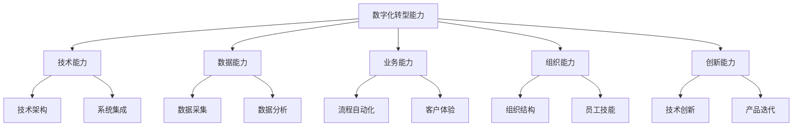
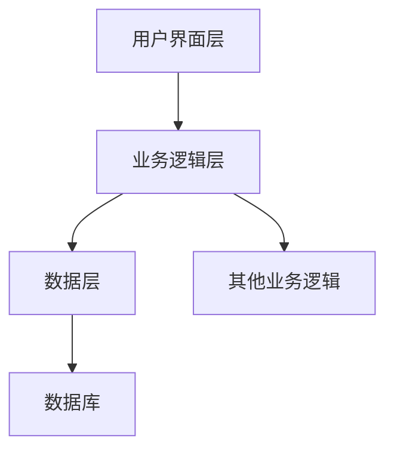
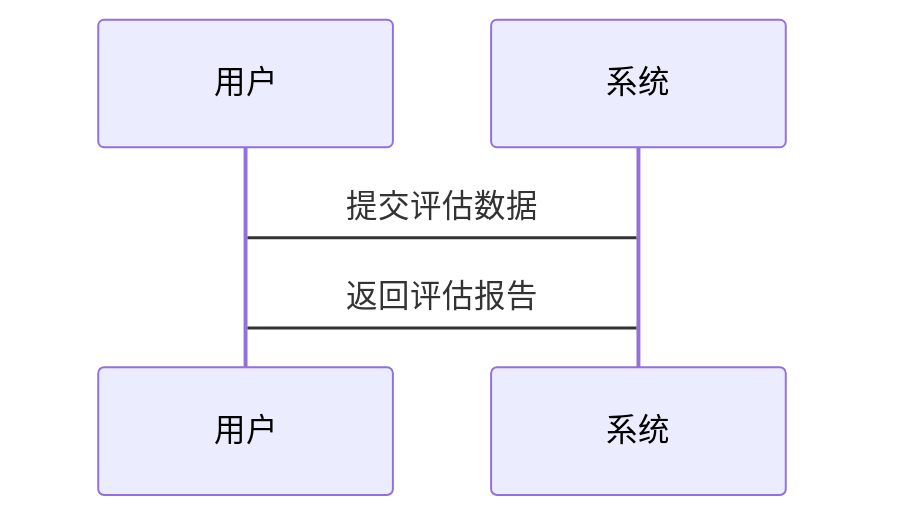

                 


# 彼得林奇如何评估公司的数字化转型能力

> 关键词：彼得林奇、数字化转型、能力评估、企业转型、数字化能力、技术能力、业务能力

> 摘要：本文深入探讨了如何基于彼得·林奇的投资理念和方法，系统性地评估公司的数字化转型能力。通过数字化转型能力评估的核心概念、算法原理、系统分析与架构设计、项目实战等多维度展开，详细阐述了如何科学、全面地评估企业数字化转型的能力，为企业制定数字化转型战略提供重要的参考和指导。

---

## 第1章：数字化转型的定义与重要性

### 1.1 数字化转型的定义与内涵

数字化转型（Digital Transformation）是指企业利用数字技术改变业务模式、流程、文化或战略，以实现业务创新和竞争优势。这一过程不仅仅是技术的升级，更是对企业整体能力的重构和优化。数字化转型的核心在于通过数据驱动的决策、自动化流程、智能化系统等手段，提升企业的运营效率、客户体验和创新能力。

### 1.2 数字化转型能力评估的必要性

在当前数字化浪潮的推动下，企业必须具备数字化转型能力才能在市场竞争中立于不败之地。通过评估数字化转型能力，企业可以识别自身的优势和不足，制定针对性的改进计划。同时，数字化转型能力评估也是投资者评估企业长期发展潜力的重要依据。

### 1.3 数字化转型能力评估的核心要素

数字化转型能力评估可以从以下几个核心维度展开：
- **技术能力**：包括企业IT基础设施、系统集成能力、技术创新能力等。
- **数据能力**：包括数据采集、存储、处理和分析能力。
- **业务能力**：包括业务流程的数字化程度、客户体验优化能力等。
- **组织能力**：包括组织结构的灵活性、员工数字化技能等。
- **创新能力**：包括产品创新、服务创新、商业模式创新能力等。

---

## 第2章：数字化转型能力评估的核心概念与联系

### 2.1 核心概念原理

数字化转型能力评估是一个复杂的过程，需要综合考虑多个维度的相互作用。例如，技术能力为数据处理提供支持，数据能力为业务决策提供依据，业务能力为组织能力提供应用场景，而组织能力则是数字化转型成功的关键保障。

### 2.2 核心概念属性特征对比表格

以下表格对比了数字化转型能力评估的五个核心维度及其关键特征：

| 要素       | 技术能力               | 数据能力               | 业务能力               | 组织能力               | 创新能力               |
|------------|------------------------|------------------------|------------------------|------------------------|------------------------|
| 定义       | 技术基础设施的成熟度   | 数据采集、处理和分析的能力 | 业务流程的数字化程度 | 组织结构对数字化的支持 | 创新能力在数字化中的体现 |
| 特征       | 技术架构、系统集成     | 数据质量、分析能力     | 流程自动化、客户体验   | 组织敏捷性、员工技能   | 技术创新、产品迭代     |

### 2.3 ER实体关系图架构

以下是一个简化的ER图，展示了数字化转型能力评估的核心要素及其关系：



---

## 第3章：数字化转型能力评估的算法原理

### 3.1 算法原理概述

基于彼得·林奇的投资理念，我们可以构建一个层次分析法（AHP）模型来评估企业的数字化转型能力。该模型通过将各个评估维度进行权重分配，计算出每个维度对整体能力的贡献度。

### 3.2 层次分析法（AHP）模型

层次分析法是一种定性和定量相结合的决策分析方法。在数字化转型能力评估中，我们可以将五个核心维度（技术能力、数据能力、业务能力、组织能力、创新能力）作为评价指标，并分别赋予权重。

#### 3.2.1 数学模型

假设我们有五个评价指标，权重分别为 \( w_1, w_2, w_3, w_4, w_5 \)，企业的各个维度得分分别为 \( s_1, s_2, s_3, s_4, s_5 \)。则整体数字化转型能力得分为：

$$
S = w_1 \times s_1 + w_2 \times s_2 + w_3 \times s_3 + w_4 \times s_4 + w_5 \times s_5
$$

其中，权重 \( w_i \) 的总和为1，即：

$$
w_1 + w_2 + w_3 + w_4 + w_5 = 1
$$

#### 3.2.2 权重计算

通过专家打分法，我们可以确定各个维度的权重。例如，假设权重分配如下：

| 维度       | 技术能力 | 数据能力 | 业务能力 | 组织能力 | 创新能力 |
|------------|----------|----------|----------|----------|----------|
| 权重 \( w_i \) | 0.25     | 0.20     | 0.30     | 0.15     | 0.10     |

---

## 第4章：系统分析与架构设计

### 4.1 系统功能设计

基于数字化转型能力评估的需求，我们可以设计一个评估系统，其核心功能包括：
- 数据采集与处理
- 维度评估与打分
- 结果分析与报告生成

### 4.2 系统架构设计

采用分层架构设计，系统分为数据层、业务逻辑层和用户界面层。



### 4.3 系统接口与交互设计

系统交互流程如下：



---

## 第5章：项目实战

### 5.1 环境配置与代码实现

以下是一个简单的评估系统代码示例：

```python
# 数字化转型能力评估系统
import pandas as pd

# 定义权重
weights = {
    '技术能力': 0.25,
    '数据能力': 0.20,
    '业务能力': 0.30,
    '组织能力': 0.15,
    '创新能力': 0.10
}

# 读取评估数据
data = pd.read_csv('assessment.csv')

# 计算整体得分
data['整体得分'] = data.apply(lambda row: sum(weights[dim] * row[dim] for dim in weights), axis=1)

# 输出结果
print(data)
```

### 5.2 代码解读与分析

上述代码通过读取评估数据，并根据权重计算出每个企业的整体得分。整体得分反映了企业在数字化转型能力上的综合表现。

### 5.3 案例分析与解读

以某制造企业为例，假设其各维度得分为：

| 维度       | 技术能力 | 数据能力 | 业务能力 | 组织能力 | 创新能力 |
|------------|----------|----------|----------|----------|----------|
| 得分 \( s_i \) | 0.8      | 0.7      | 0.6      | 0.5      | 0.4      |

则整体得分为：

$$
S = 0.25 \times 0.8 + 0.20 \times 0.7 + 0.30 \times 0.6 + 0.15 \times 0.5 + 0.10 \times 0.4 = 0.2 + 0.14 + 0.18 + 0.075 + 0.04 = 0.635
$$

---

## 第6章：总结与展望

### 6.1 本章小结

本文基于彼得·林奇的投资理念，系统性地探讨了如何评估企业的数字化转型能力。通过层次分析法和系统设计的方法，我们提供了一个科学的评估框架，为企业制定数字化转型战略提供了重要的参考。

### 6.2 注意事项与最佳实践

- 在评估过程中，需结合企业的实际情况，灵活调整权重分配。
- 数据的准确性和完整性是评估结果的关键，需加强数据质量管理。
- 数字化转型能力评估是一个持续的过程，需定期更新和优化。

### 6.3 拓展阅读

- 《Digital Transformation: A Primer》
- 《Analytics for Business Leaders》

---

## 作者

作者：AI天才研究院/AI Genius Institute & 禅与计算机程序设计艺术/Zen And The Art of Computer Programming

