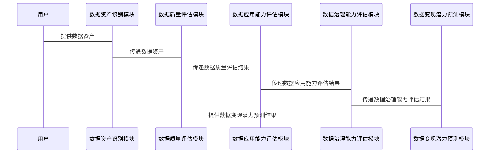

                 


# 彼得林奇如何评估公司的数据变现能力

## 关键词：数据变现，彼得林奇，投资评估，数据资产，数据价值

## 摘要：本文深入探讨了彼得·林奇如何评估公司数据变现能力的核心方法，从数据资产识别、数据质量评估、数据治理能力等多维度进行系统分析，结合实际案例和数学模型，详细阐述了数据变现能力评估的逻辑和实现路径。

---

# 第一章: 数据变现能力评估的背景与核心概念

## 1.1 数据经济的崛起

### 1.1.1 数据作为核心资产的演进

数据在现代经济中的地位日益重要，从简单的记录工具演变为企业核心资产。彼得·林奇通过长期投资实践，总结出数据资产对企业价值的关键作用。

- 数据资产化：数据从简单的记录工具演变为企业的核心资产。
- 数据驱动决策：数据驱动的决策模式正在改变传统的商业逻辑。
- 数据经济的新范式：数据成为经济增长的新引擎。

### 1.1.2 数据驱动商业价值的新范式

- 数据驱动的商业模式：通过数据收集、分析和应用，创造新的商业价值。
- 数据资产的增值潜力：数据的深度挖掘和创新应用能够显著提升企业价值。
- 数据驱动的创新：数据驱动的创新正在成为企业差异化竞争的关键。

### 1.1.3 数据变现能力与企业竞争力的关系

- 数据变现能力是企业核心竞争力的重要组成部分。
- 数据资产的质量和数量直接影响企业的市场价值。
- 数据驱动的创新是企业可持续发展的关键。

## 1.2 彼得·林奇投资方法的启示

### 1.2.1 彼得·林奇的投资哲学

- 价值投资：彼得·林奇强调长期投资，关注企业的内在价值。
- 数据驱动的决策：通过数据分析和洞察，发现投资机会。
- 风险控制：通过数据驱动的方法降低投资风险。

### 1.2.2 数据驱动投资决策的创新

- 数据驱动的投资策略：通过数据分析发现投资机会。
- 数据驱动的市场洞察：利用数据揭示市场趋势和潜在机会。
- 数据驱动的决策优化：通过数据优化投资决策。

### 1.2.3 数据变现能力评估的核心意义

- 数据变现能力是企业长期价值的关键指标。
- 数据驱动的投资决策能够显著提升投资回报。
- 数据变现能力评估是投资决策的重要工具。

---

# 第二章: 数据变现能力的核心概念与框架

## 2.1 数据变现的定义与关键要素

### 2.1.1 数据变现的定义

数据变现是指通过数据的收集、分析和应用，为企业创造经济价值的过程。数据变现的关键在于数据的深度挖掘和创新应用。

### 2.1.2 数据变现的关键要素

- 数据资产：数据资产的完整性和质量直接影响数据变现能力。
- 数据质量：数据的准确性和一致性是数据变现的基础。
- 数据应用：数据的应用场景和创新能力决定数据变现的潜力。
- 数据治理：数据治理能力是数据变现的重要保障。

### 2.1.3 数据变现能力的评估维度

- 数据资产的完整性：数据资产的完整性和覆盖范围。
- 数据质量：数据的准确性、一致性和及时性。
- 数据应用能力：数据的应用场景和创新能力。
- 数据治理能力：数据治理的制度和执行能力。

## 2.2 数据变现能力的评估框架

### 2.2.1 数据资产识别与分类

- 数据资产识别：识别企业中的数据资产，包括结构化数据、非结构化数据和半结构化数据。
- 数据资产分类：根据数据的类型、用途和重要性进行分类。

### 2.2.2 数据质量评估标准

- 数据准确性：数据的准确性和可靠性。
- 数据一致性：数据的一致性和完整性。
- 数据及时性：数据的及时性和新鲜度。

### 2.2.3 数据变现潜力的评估指标

- 数据资产的经济价值：数据资产的市场价值和潜在收益。
- 数据应用的创新性：数据的应用场景和创新能力。
- 数据治理的完善性：数据治理的制度和执行能力。

---

# 第三章: 数据变现能力评估的核心方法论

## 3.1 彼得·林奇的数据驱动投资策略

### 3.1.1 数据驱动的决策逻辑

- 数据驱动的投资决策：通过数据分析和洞察，发现投资机会。
- 数据驱动的市场洞察：利用数据揭示市场趋势和潜在机会。
- 数据驱动的决策优化：通过数据优化投资决策。

### 3.1.2 数据质量与商业价值的关系

- 数据质量是数据变现的基础：数据的准确性和一致性直接影响数据的商业价值。
- 数据质量的提升：通过数据清洗和预处理，提升数据质量。
- 数据质量的评估：通过数据质量评估指标，量化数据质量。

### 3.1.3 数据变现能力的长期视角

- 数据资产的长期价值：数据资产的长期价值和可持续性。
- 数据驱动的长期投资：通过数据驱动的投资策略，实现长期收益。
- 数据治理的长期性：数据治理的长期性和持续性。

## 3.2 数据变现能力评估的五维度模型

### 3.2.1 数据资产的完整性评估

- 数据资产的完整性：数据资产的完整性和覆盖范围。
- 数据资产的分类：根据数据的类型、用途和重要性进行分类。
- 数据资产的价值评估：通过数据资产的价值评估，量化数据资产的经济价值。

### 3.2.2 数据质量的标准化评估

- 数据准确性：数据的准确性和可靠性。
- 数据一致性：数据的一致性和完整性。
- 数据及时性：数据的及时性和新鲜度。

### 3.2.3 数据变现的场景化评估

- 数据应用的创新性：数据的应用场景和创新能力。
- 数据应用的经济价值：数据的应用场景和创新能力的经济价值。
- 数据应用的可持续性：数据应用的可持续性和长期性。

### 3.2.4 数据治理能力的评估

- 数据治理的制度：数据治理的制度和政策。
- 数据治理的执行：数据治理的执行和监督。
- 数据治理的效果：数据治理的效果和效益。

### 3.2.5 数据变现的可持续性评估

- 数据资产的长期价值：数据资产的长期价值和可持续性。
- 数据驱动的长期投资：通过数据驱动的投资策略，实现长期收益。
- 数据治理的长期性：数据治理的长期性和持续性。

---

# 第四章: 数据变现能力评估的数学模型

## 4.1 数据资产价值评估模型

### 4.1.1 数据资产价值的公式化表达

$$ V = f(Q, C, S, G) $$

其中，$V$ 表示数据资产价值，$Q$ 表示数据质量，$C$ 表示数据合规性，$S$ 表示数据稀缺性，$G$ 表示数据治理能力。

### 4.1.2 数据资产价值评估模型的实现

- 数据质量评估：通过数据质量评估指标，量化数据质量。
- 数据合规性评估：通过数据合规性评估指标，量化数据合规性。
- 数据稀缺性评估：通过数据稀缺性评估指标，量化数据稀缺性。
- 数据治理能力评估：通过数据治理能力评估指标，量化数据治理能力。

## 4.2 数据变现潜力预测模型

### 4.2.1 数据变现潜力的线性回归模型

$$ P = \beta_0 + \beta_1 Q + \beta_2 C + \beta_3 S + \epsilon $$

其中，$P$ 表示数据变现潜力，$\beta$ 表示回归系数，$\epsilon$ 表示误差项。

### 4.2.2 数据变现潜力预测模型的实现

- 数据质量评估：通过数据质量评估指标，量化数据质量。
- 数据合规性评估：通过数据合规性评估指标，量化数据合规性。
- 数据稀缺性评估：通过数据稀缺性评估指标，量化数据稀缺性。

---

# 第五章: 数据变现能力评估的系统架构设计

## 5.1 系统功能设计

### 5.1.1 数据资产识别与分类

- 数据资产识别：识别企业中的数据资产，包括结构化数据、非结构化数据和半结构化数据。
- 数据资产分类：根据数据的类型、用途和重要性进行分类。

### 5.1.2 数据质量评估

- 数据质量评估：通过数据质量评估指标，量化数据质量。
- 数据清洗：通过数据清洗和预处理，提升数据质量。

### 5.1.3 数据应用能力评估

- 数据应用的创新性：数据的应用场景和创新能力。
- 数据应用的经济价值：数据的应用场景和创新能力的经济价值。

## 5.2 系统架构设计

### 5.2.1 系统架构设计


### 5.2.2 系统交互设计



---

# 第六章: 数据变现能力评估的实战案例

## 6.1 环境安装

### 6.1.1 数据资产识别工具安装

- 安装数据资产识别工具：使用数据资产识别工具，识别企业中的数据资产。
- 数据资产分类工具安装：使用数据资产分类工具，对数据资产进行分类。

### 6.1.2 数据质量评估工具安装

- 数据质量评估工具安装：使用数据质量评估工具，评估数据质量。
- 数据清洗工具安装：使用数据清洗工具，清洗数据。

## 6.2 核心实现

### 6.2.1 数据资产识别与分类

```python
def identify_data_assets(data):
    # 数据资产识别逻辑
    pass

def classify_data_assets(data_assets):
    # 数据资产分类逻辑
    pass
```

### 6.2.2 数据质量评估

```python
def assess_data_quality(data):
    # 数据质量评估逻辑
    pass
```

### 6.2.3 数据应用能力评估

```python
def assess_data_application_capabilities(data_assets):
    # 数据应用能力评估逻辑
    pass
```

### 6.2.4 数据治理能力评估

```python
def assess_data_governance_capabilities(data_assets):
    # 数据治理能力评估逻辑
    pass
```

## 6.3 案例分析

### 6.3.1 数据资产识别与分类

- 案例背景：某企业希望通过数据资产识别和分类，提升数据管理水平。
- 数据资产识别：识别企业中的数据资产，包括结构化数据、非结构化数据和半结构化数据。
- 数据资产分类：根据数据的类型、用途和重要性进行分类。

### 6.3.2 数据质量评估

- 数据质量评估：通过数据质量评估指标，量化数据质量。
- 数据清洗：通过数据清洗和预处理，提升数据质量。

### 6.3.3 数据应用能力评估

- 数据应用的创新性：数据的应用场景和创新能力。
- 数据应用的经济价值：数据的应用场景和创新能力的经济价值。

---

# 第七章: 数据变现能力评估的总结与展望

## 7.1 最佳实践 tips

- 数据资产识别与分类：通过数据资产识别和分类，提升数据管理水平。
- 数据质量评估：通过数据质量评估指标，量化数据质量。
- 数据应用能力评估：通过数据应用能力评估指标，量化数据应用能力。
- 数据治理能力评估：通过数据治理能力评估指标，量化数据治理能力。

## 7.2 小结

- 数据变现能力评估是一个复杂的过程，需要综合考虑数据资产、数据质量、数据应用能力和数据治理能力等多个方面。
- 通过彼得·林奇的数据驱动投资策略，可以有效提升数据变现能力评估的准确性和可靠性。

## 7.3 注意事项

- 数据资产识别与分类：数据资产识别和分类需要结合企业的实际情况，制定合理的数据资产识别和分类策略。
- 数据质量评估：数据质量评估需要结合企业的实际情况，制定合理的数据质量评估指标。
- 数据应用能力评估：数据应用能力评估需要结合企业的实际情况，制定合理的数据应用能力评估指标。
- 数据治理能力评估：数据治理能力评估需要结合企业的实际情况，制定合理的数据治理能力评估指标。

## 7.4 拓展阅读

- 《彼得·林奇的投资哲学》：深入探讨彼得·林奇的投资哲学和数据驱动投资策略。
- 《数据资产化与数据变现》：系统介绍数据资产化与数据变现的理论和实践。
- 《数据驱动的决策优化》：详细讲解数据驱动的决策优化方法和实践。

---

# 作者：AI天才研究院/AI Genius Institute & 禅与计算机程序设计艺术 /Zen And The Art of Computer Programming

---

**这篇文章通过系统分析彼得·林奇的数据驱动投资策略，结合数据资产识别、数据质量评估、数据应用能力评估和数据治理能力评估等多个维度，详细阐述了数据变现能力评估的理论和实践。通过实际案例和数学模型的分析，为读者提供了全面的数据变现能力评估方法。**

