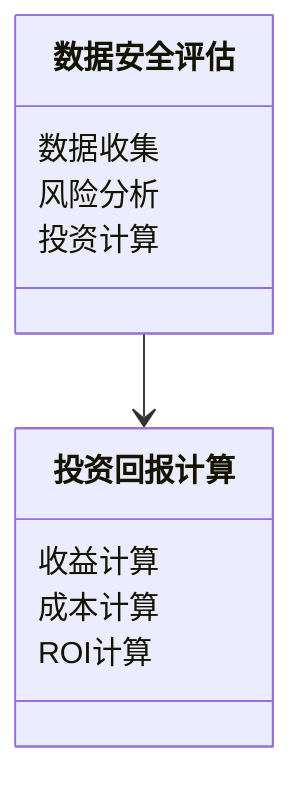
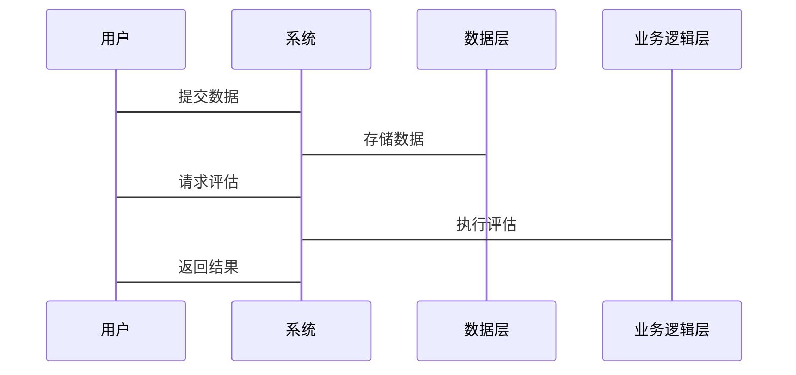

                 


# 彼得林奇如何评估公司的数据安全投资回报

## 关键词：数据安全，投资回报，彼得林奇，风险评估，企业安全

## 摘要：本文详细探讨了如何将彼得林奇的投资评估方法应用于数据安全领域，分析了数据安全投资回报的核心概念、算法原理、系统架构及项目实战，为读者提供了全面的评估框架和实践指南。

---

# 第一部分: 数据安全投资回报评估的背景与基础

## 第1章: 数据安全投资回报评估的背景与重要性

### 1.1 数据安全的重要性

#### 1.1.1 数据在现代企业中的核心地位

数据已成为企业最重要的资产之一。从客户信息到商业机密，数据的完整性和安全性直接关系到企业的生存和发展。随着数字化转型的推进，数据的影响力进一步扩大，数据安全问题也随之变得更加关键。

#### 1.1.2 数据安全面临的挑战

现代企业面临的数据安全威胁多种多样，包括网络攻击、内部泄密、数据泄露等。这些威胁不仅可能导致经济损失，还可能损害企业的声誉和客户信任。

#### 1.1.3 数据安全对企业的影响

数据安全事件对企业的影响是深远的，可能包括直接的经济损失、声誉损失、客户信任度下降等。因此，评估数据安全的投资回报不仅是技术问题，更是企业战略问题。

---

### 1.2 投资回报评估的基本概念

#### 1.2.1 投资回报的定义

投资回报（ROI）是衡量一项投资的价值的重要指标，通常表示为投资收益与投资成本的比率。在数据安全领域，ROI 的计算需要考虑安全措施带来的收益与投入的成本。

#### 1.2.2 数据安全投资回报的特殊性

数据安全的投资回报具有一定的特殊性。例如，数据安全投入的直接收益往往难以量化，但其对企业的潜在风险防范作用是巨大的。

#### 1.2.3 数据安全与企业战略的关系

数据安全不仅是技术问题，更是企业战略的重要组成部分。企业的数据安全战略需要与整体业务战略相匹配，才能真正实现投资回报的最大化。

---

### 1.3 数据安全投资回报评估的现状

#### 1.3.1 当前数据安全投资的主要方式

目前，企业通常通过购买安全设备、雇佣安全人员、实施安全培训等方式进行数据安全投资。然而，这些投资的回报率往往难以量化。

#### 1.3.2 数据安全投资回报评估的难点

数据安全投资回报评估的难点在于其复杂性。数据安全涉及多个方面，包括技术、人员、流程等，如何将这些因素纳入评估体系是关键。

#### 1.3.3 数据安全投资回报评估的必要性

随着数据的重要性不断提升，企业必须重视数据安全投资回报的评估，以确保每一分钱都花在刀刃上。

---

### 1.4 数据安全投资回报评估的框架

#### 1.4.1 数据安全投资的基本要素

数据安全投资的基本要素包括技术投入（如安全设备、软件）、人力投入（如安全人员、培训）以及管理投入（如安全策略、流程）。

#### 1.4.2 投资回报评估的关键指标

数据安全投资回报的关键指标包括：避免的损失、减少的风险、提升的效率等。

#### 1.4.3 数据安全投资回报评估的流程

数据安全投资回报评估的流程通常包括：明确目标、收集数据、建立模型、分析评估、优化调整。

---

### 1.5 本章小结

本章介绍了数据安全投资回报评估的背景与重要性，分析了数据安全对企业的影响，探讨了数据安全投资回报评估的难点与必要性，并提出了评估框架。

---

## 第2章: 数据安全与投资回报的核心概念

### 2.1 数据安全的核心概念

#### 2.1.1 数据安全的定义

数据安全是指通过技术手段和管理措施，保护数据的机密性、完整性和可用性。

#### 2.1.2 数据安全的关键要素

数据安全的关键要素包括：技术手段（如加密、访问控制）、管理措施（如安全策略、人员培训）、法律合规（如数据保护法规）。

#### 2.1.3 数据安全的分类与层次

数据安全可以分为物理安全、网络安全、应用安全、数据存储安全等多个层次。

---

### 2.2 投资回报的核心概念

#### 2.2.1 投资回报的定义与计算方法

投资回报（ROI）= (投资收益 - 投资成本) / 投资成本。

#### 2.2.2 数据安全投资回报的特殊性

数据安全投资回报的特殊性在于其收益往往体现在风险的降低和潜在损失的避免，而非直接的收益。

#### 2.2.3 数据安全与企业战略的关系

数据安全是企业战略的重要组成部分，需要与企业的整体业务目标相结合。

---

### 2.3 数据安全与投资回报的关系

#### 2.3.1 数据安全对投资回报的影响

数据安全通过降低风险和避免损失，间接影响投资回报。

#### 2.3.2 投资回报对数据安全的反向影响

投资回报的评估结果会影响企业的数据安全投资决策。

#### 2.3.3 数据安全与投资回报的平衡点

企业在进行数据安全投资时，需要在成本与收益之间找到平衡点，确保投资回报最大化。

---

### 2.4 数据安全投资回报的核心要素对比

#### 2.4.1 数据安全与传统投资的对比

| 对比维度 | 数据安全投资 | 传统投资 |
|----------|---------------|----------|
| 投资对象 | 数据相关资产 | 传统资产 |
| 收益类型 | 风险降低 | 直接收益 |
| 风险特征 | 高不确定性 | 较低不确定性 |

#### 2.4.2 数据安全投资回报的特征

数据安全投资回报具有间接性、长期性、不确定性等特点。

#### 2.4.3 数据安全投资回报的不确定性

数据安全投资回报的不确定性主要来源于威胁的多样性和安全措施的有效性。

---

### 2.5 本章小结

本章详细探讨了数据安全与投资回报的核心概念，分析了数据安全与传统投资的差异，并总结了数据安全投资回报的特征和不确定性。

---

## 第3章: 数据安全投资回报评估的算法原理

### 3.1 数据安全投资回报评估的基本模型

#### 3.1.1 数据安全投资回报的数学模型

$$ ROI = \frac{收益 - 成本}{成本} $$

其中，收益可以是由于数据安全措施避免的损失，成本是数据安全投资的总成本。

#### 3.1.2 数据安全投资回报的计算公式

数据安全投资回报的计算公式可以表示为：

$$ ROI = \frac{避免的损失 - 投资成本}{投资成本} $$

#### 3.1.3 数据安全投资回报的评估指标

数据安全投资回报的评估指标包括：避免的损失、减少的风险、提升的效率、投资成本等。

---

### 3.2 数据安全风险评估的算法

#### 3.2.1 数据安全风险的定义与分类

数据安全风险是指由于数据泄露、网络攻击等原因可能导致的损失。根据威胁来源的不同，数据安全风险可以分为内部风险和外部风险。

#### 3.2.2 数据安全风险评估的步骤

数据安全风险评估的步骤包括：识别风险源、评估风险概率、评估风险影响、计算风险值。

#### 3.2.3 数据安全风险评估的数学模型

数据安全风险的评估公式为：

$$ 风险值 = 概率 \times 影响 $$

---

### 3.3 数据安全投资回报的优化算法

#### 3.3.1 数据安全投资回报的优化目标

数据安全投资回报的优化目标是最大化投资收益与成本的比值。

#### 3.3.2 数据安全投资回报的优化方法

数据安全投资回报的优化方法包括：优化投资组合、选择最优安全措施、合理分配资源。

#### 3.3.3 数据安全投资回报的优化模型

数据安全投资回报的优化模型可以表示为：

$$ \max ROI = \frac{收益 - 成本}{成本} $$

---

### 3.4 数据安全投资回报的预测算法

#### 3.4.1 数据安全投资回报预测的基本原理

数据安全投资回报的预测基于历史数据和相关因素，通过建立数学模型进行预测。

#### 3.4.2 数据安全投资回报预测的数学模型

数据安全投资回报预测的数学模型可以表示为：

$$ 预测 ROI = \alpha \times 收益 + \beta \times 成本 $$

其中，$\alpha$ 和 $\beta$ 是模型的参数。

#### 3.4.3 数据安全投资回报预测的实现步骤

数据安全投资回报预测的实现步骤包括：数据收集、模型建立、参数估计、预测结果分析。

---

### 3.5 数据安全投资回报评估的算法实现

#### 3.5.1 数据安全投资回报评估的算法流程

数据安全投资回报评估的算法流程包括：数据收集、模型建立、参数估计、预测结果分析。

#### 3.5.2 数据安全投资回报评估的数学模型

数据安全投资回报评估的数学模型可以表示为：

$$ ROI = \frac{避免的损失 - 投资成本}{投资成本} $$

---

## 第4章: 系统分析与架构设计方案

### 4.1 问题场景介绍

假设我们有一家互联网企业，需要对其数据安全投资回报进行评估。企业面临的主要数据安全威胁包括网络攻击、数据泄露、内部泄密等。

### 4.2 系统功能设计

#### 4.2.1 领域模型设计

领域模型设计可以采用类图的方式，包括数据安全评估、投资回报计算、风险评估等模块。



---

### 4.3 系统架构设计

#### 4.3.1 系统架构设计

系统架构设计可以采用分层架构，包括数据层、业务逻辑层和用户界面层。


---

### 4.4 系统接口设计

系统接口设计需要定义数据输入输出接口，例如数据收集接口、风险评估接口等。

---

### 4.5 系统交互设计

系统交互设计可以采用序列图的方式，展示用户与系统之间的交互流程。



---

## 第5章: 项目实战

### 5.1 环境安装

需要安装Python、数据分析库（如Pandas）、可视化库（如Matplotlib）等。

---

### 5.2 系统核心实现

#### 5.2.1 数据收集模块

数据收集模块负责收集企业的数据安全投资成本和潜在收益数据。

```python
import pandas as pd

# 数据收集
data = pd.DataFrame({
    '投资成本': [100000],
    '避免的损失': [200000]
})
```

---

#### 5.2.2 风险评估模块

风险评估模块基于收集的数据，计算数据安全风险的评估值。

```python
def calculate_risk(avoid_loss, cost):
    probability = 0.2  # 假设风险概率为20%
    impact = 100000  # 假设风险影响为10万元
    return probability * impact

risk = calculate_risk(200000, 100000)
print(risk)
```

---

#### 5.2.3 投资回报计算模块

投资回报计算模块根据风险评估结果，计算投资回报率。

```python
def calculate_roi(avoid_loss, cost):
    return (avoid_loss - cost) / cost

roi = calculate_roi(200000, 100000)
print(roi)
```

---

### 5.3 实际案例分析

以某企业为例，假设其数据安全投资成本为10万元，避免的损失为20万元，计算其投资回报率。

```python
# 实际案例分析
cost = 100000
avoid_loss = 200000
roi = calculate_roi(avoid_loss, cost)
print(f"投资回报率: {roi}")
```

---

### 5.4 项目小结

本章通过实际案例，详细展示了数据安全投资回报评估系统的实现过程，包括环境安装、数据收集、风险评估和投资回报计算等步骤。

---

## 第6章: 最佳实践、小结、注意事项和拓展阅读

### 6.1 最佳实践

- 在进行数据安全投资时，应优先考虑高风险、高影响的资产。
- 数据安全投资回报评估应结合企业的实际情况，制定个性化的评估模型。
- 定期更新和优化数据安全投资回报评估模型，以应对新的威胁和挑战。

---

### 6.2 小结

本文详细探讨了彼得林奇如何评估公司的数据安全投资回报，分析了数据安全与投资回报的核心概念，提出了数据安全投资回报评估的算法和系统架构设计方案，并通过实际案例展示了系统的实现过程。

---

### 6.3 注意事项

- 数据安全投资回报评估需要结合企业的实际情况，避免一刀切。
- 在进行数据安全投资时，应注重成本与收益的平衡。
- 数据安全投资回报评估是一个动态过程，需要定期更新和优化。

---

### 6.4 拓展阅读

建议读者进一步阅读以下内容：
- 彼得林奇的其他投资理念。
- 数据安全领域的最新技术和发展趋势。
- 数据安全投资回报评估的其他方法和工具。

---

## 作者：AI天才研究院/AI Genius Institute & 禅与计算机程序设计艺术 /Zen And The Art of Computer Programming

