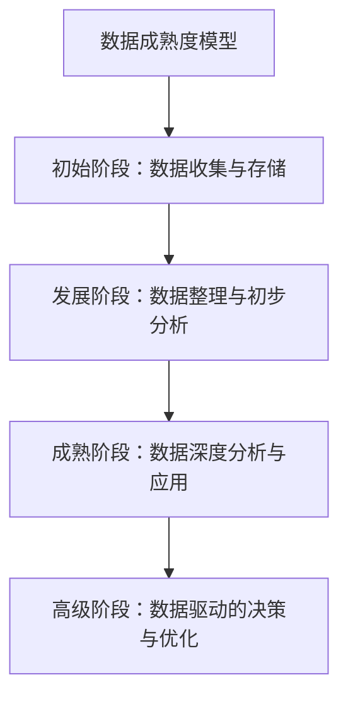
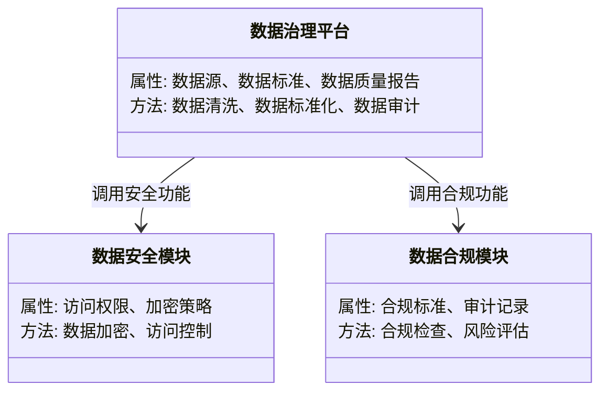
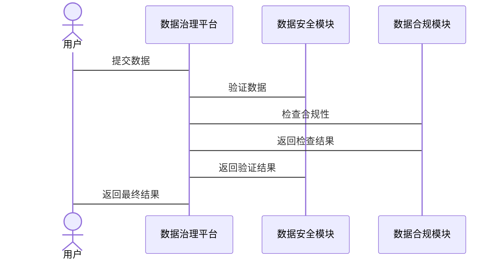

                 


# 彼得林奇如何评估公司的数据治理能力

> 关键词：数据治理，彼得林奇，评估方法，数据质量，数据安全，合规性，数据成熟度

> 摘要：本文详细探讨了如何借鉴彼得·林奇的投资者评估方法，系统地评估公司的数据治理能力。通过分析数据治理的核心概念、评估方法、系统架构以及实战案例，结合丰富的图表和代码示例，全面展示如何有效提升企业的数据治理水平。

---

## 第1章: 数据治理的背景与重要性

### 1.1 数据治理的基本概念

#### 1.1.1 数据治理的定义
数据治理是通过制定和实施一系列政策、标准和流程，确保数据的完整性、一致性、可用性和安全性。它是企业信息化管理的重要组成部分，涵盖数据的全生命周期管理。

#### 1.1.2 数据治理的核心要素
数据治理涉及多个关键要素，包括：
- **数据质量**：数据的准确性、一致性和完整性。
- **数据安全**：保护数据不被未经授权的访问或泄露。
- **数据合规性**：确保数据的使用和存储符合相关法律法规。
- **数据可用性**：数据能够被及时访问和使用。

#### 1.1.3 数据治理的目标与价值
数据治理的目标是最大化数据的业务价值，同时降低数据管理风险。其价值体现在：
- 提高数据质量，支持决策的准确性。
- 降低数据泄露风险，保护企业声誉。
- 提升数据资产的利用效率，创造更大的业务价值。

### 1.2 数据治理的现状与挑战

#### 1.2.1 数据爆炸时代的治理需求
随着数据量的指数级增长，企业对数据治理的需求日益迫切。数据的来源多样化、分布广泛化，使得传统的数据管理方式难以应对新的挑战。

#### 1.2.2 数据治理中的主要挑战
- 数据孤岛问题：不同部门或系统之间的数据孤立，难以统一管理。
- 数据安全威胁：数据泄露、黑客攻击等安全风险不断增加。
- 数据合规压力：随着《GDPR》等法规的实施，企业需要确保数据处理的合法性。

#### 1.2.3 数据治理的行业差异性
不同行业的数据治理需求存在显著差异。例如，金融行业对数据安全和合规性要求更高，而互联网行业则更关注数据的实时性和可用性。

### 1.3 彼得林奇评估方法的背景介绍

#### 1.3.1 彼得林奇的投资者背景
彼得·林奇是美国著名投资家，以其独特的选股方法闻名。他强调深入分析企业的基本面，挖掘具有长期增长潜力的企业。

#### 1.3.2 彼得林奇方法的核心理念
彼得林奇的评估方法注重对企业基本面的全面分析，包括财务状况、管理团队、市场竞争力等多个维度。这种方法强调细致观察和长期跟踪。

#### 1.3.3 该方法在数据治理中的应用潜力
数据治理与企业基本面分析有相似之处，都需要对企业数据的全生命周期进行细致评估。彼得林奇的评估方法为数据治理提供了一种系统化、结构化的思路。

---

## 第2章: 数据治理的核心概念与联系

### 2.1 数据治理的核心要素

#### 2.1.1 数据质量
数据质量是数据治理的基石。通过数据清洗、数据标准化等技术，确保数据的准确性、一致性和完整性。

#### 2.1.2 数据安全
数据安全是数据治理的重要组成部分。通过加密技术、访问控制等手段，确保数据在存储和传输过程中的安全性。

#### 2.1.3 数据合规性
数据合规性要求企业遵守相关法律法规，如《个人信息保护法》、《数据安全法》等。这需要企业在数据收集、存储、使用等环节中严格遵循法律要求。

#### 2.1.4 数据可用性
数据可用性是数据治理的最终目标。通过建立高效的数据访问机制和数据共享平台，确保数据能够快速响应业务需求。

### 2.2 数据治理与相关概念的关系

#### 2.2.1 数据治理与数据管理
数据治理是数据管理的高级阶段，强调对数据的战略性规划和管理。数据管理则更关注数据的日常操作和维护。

#### 2.2.2 数据治理与数据架构
数据治理为数据架构提供指导和规范，确保数据架构的设计能够支持企业的业务目标。数据架构则为数据治理提供具体的实现方案。

#### 2.2.3 数据治理与数据安全
数据安全是数据治理的重要组成部分，而数据治理则为数据安全提供整体策略和框架。

### 2.3 数据治理的ER实体关系图

```mermaid
erDiagram
    actor 数据治理人员 {
        关键属性: 治理策略、治理流程、治理工具
    }
    actor 数据管理者 {
        关键属性: 数据所有者、数据使用方、数据维护方
    }
    actor 数据安全人员 {
        关键属性: 安全策略、访问控制、加密技术
    }
    actor 数据审计人员 {
        关键属性: 审计标准、审计流程、审计结果
    }
    数据治理人员 --> 数据管理者 : 制定治理策略
    数据治理人员 --> 数据安全人员 : 确保数据安全
    数据治理人员 --> 数据审计人员 : 监督治理效果
```

---

## 第3章: 数据治理能力的评估方法与指标

### 3.1 数据治理能力的评估框架

#### 3.1.1 评估框架的构建原则
评估框架的构建需要遵循全面性、可操作性和动态性原则。全面性要求覆盖数据治理的各个维度；可操作性要求框架能够被企业实际应用；动态性要求框架能够根据企业需求进行调整。

#### 3.1.2 评估框架的组成部分
评估框架通常包括以下几个部分：
- 评估目标：明确评估的目的和范围。
- 评估指标：设定具体的评估指标。
- 评估方法：选择合适的评估方法。
- 评估工具：选用辅助评估的工具。

#### 3.1.3 评估框架的应用场景
评估框架适用于企业内部审计、第三方评估以及行业对标等多种场景。

### 3.2 数据治理能力的评估指标

#### 3.2.1 数据质量指标
- 数据准确性：数据与实际业务相符的程度。
- 数据一致性：数据在不同系统中的表现是否一致。
- 数据完整性：数据是否包含所有必要信息。

#### 3.2.2 数据安全指标
- 数据访问控制：是否实施了严格的访问权限管理。
- 数据加密：数据在存储和传输过程中是否加密。
- 数据备份：是否定期进行数据备份，并确保备份数据的可用性。

#### 3.2.3 数据合规性指标
- 合规性检查：是否定期进行合规性审查。
- 法律风险：是否存在违反法律法规的行为。

#### 3.2.4 数据可用性指标
- 数据响应时间：数据查询的平均响应时间。
- 数据访问权限：用户是否能够快速获得所需数据。

### 3.3 数据成熟度模型



---

## 第4章: 彼得林奇评估方法的具体步骤

### 4.1 评估前的准备工作

#### 4.1.1 确定评估目标
明确评估的目标，例如评估数据治理的成熟度、数据安全的合规性等。

#### 4.1.2 收集相关数据
收集与数据治理相关的各种数据，包括企业的组织架构、数据流程、系统日志等。

#### 4.1.3 组建评估团队
组建一个多学科的评估团队，包括数据工程师、法律顾问、信息安全专家等。

### 4.2 数据治理能力的评估步骤

#### 4.2.1 制定评估计划
明确评估的时间表、评估范围、评估方法等。

#### 4.2.2 数据收集与分析
通过访谈、问卷调查、系统日志分析等多种方式收集数据，并进行初步分析。

#### 4.2.3 评估实施
根据评估指标和评估框架，对企业的数据治理能力进行详细评估。

#### 4.2.4 评估结果分析
对评估结果进行分析，识别问题和改进机会。

#### 4.2.5 制定改进计划
根据评估结果，制定切实可行的改进计划，并跟踪改进效果。

---

## 第5章: 系统分析与架构设计方案

### 5.1 数据治理平台的系统功能设计

#### 5.1.1 领域模型


#### 5.1.2 系统架构设计
```mermaid
container 数据治理平台 {
    数据源
    数据清洗模块
    数据标准化模块
    数据审计模块
    数据安全模块
    数据合规模块
}
```

#### 5.1.3 系统接口设计
- 数据源接口：负责与企业内部系统的数据对接。
- 数据清洗接口：用于数据清洗和转换。
- 数据审计接口：用于数据的合规性检查。

#### 5.1.4 系统交互设计


---

## 第6章: 项目实战

### 6.1 项目背景
某金融公司希望通过数据治理提升其数据管理能力，降低数据风险。

### 6.2 核心实现源代码

```python
import pandas as pd
from datetime import datetime

def load_data(filepath):
    """加载数据"""
    return pd.read_csv(filepath)

def data_cleaning(df):
    """数据清洗"""
    df.dropna(inplace=True)
    df['datetime'] = pd.to_datetime(df['datetime'])
    return df

def data_standardization(df):
    """数据标准化"""
    df['year'] = df['datetime'].dt.year
    df['month'] = df['datetime'].dt.month
    return df

def data_audit(df):
    """数据审计"""
    audit_report = {}
    if df.empty:
        audit_report['status'] = 'failed'
        audit_report['message'] = '数据为空'
    else:
        audit_report['status'] = 'success'
        audit_report['message'] = '数据审计通过'
    return audit_report

# 示例代码
if __name__ == '__main__':
    df = load_data('data.csv')
    df = data_cleaning(df)
    df = data_standardization(df)
    report = data_audit(df)
    print(report)
```

### 6.3 代码应用解读与分析
上述代码展示了数据清洗、标准化和审计的具体实现。通过数据治理平台，企业能够高效地管理其数据资产，确保数据的高质量和合规性。

---

## 第7章: 最佳实践与小结

### 7.1 最佳实践
- **数据治理是一项长期任务**：企业需要建立长效机制，持续优化数据治理能力。
- **注重数据安全**：数据安全是数据治理的核心内容，必须引起高度重视。
- **借助工具和技术**：利用数据治理平台和自动化工具，提升数据治理效率。

### 7.2 小结
彼得林奇的评估方法为数据治理提供了一种系统化、结构化的思路。通过本文的探讨，我们能够更好地理解数据治理的核心概念和评估方法，并将其应用于实际工作中。

### 7.3 注意事项
- 数据治理需要全员参与，从高管到基层员工都应意识到数据治理的重要性。
- 数据治理需要与业务目标相结合，避免为治理而治理。

### 7.4 拓展阅读
- 《Data Governance: How to Design, Implement and Sustain an Effective Data Governance Program》
- 《企业级数据架构与治理》

---

## 作者信息

作者：AI天才研究院/AI Genius Institute & 禅与计算机程序设计艺术/Zen And The Art of Computer Programming

---

以上就是《彼得林奇如何评估公司的数据治理能力》的完整文章结构和内容。

