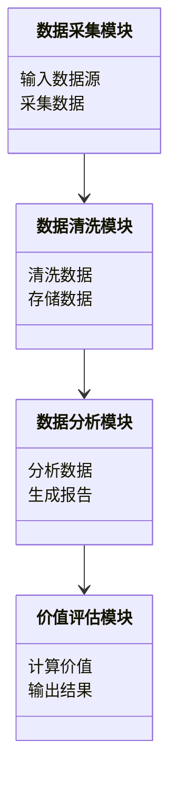

                 


# 彼得林奇如何评估公司的数据资产价值

## 关键词
- 数据资产
- 数据价值
- 彼得·林奇
- 评估方法
- 数据管理

## 摘要
数据资产是现代企业的重要组成部分，其价值评估对于企业决策至关重要。本文通过分析彼得·林奇的投资理念，探讨如何将这些理念应用于数据资产价值评估。文章详细介绍了数据资产的定义、特征、分类，以及如何结合彼得·林奇的方法构建评估指标体系和数学模型。通过实际案例和系统架构设计，本文为读者提供了从理论到实践的全面指导，帮助企业在数字经济时代有效管理和评估数据资产。

---

## 第1章: 数据资产价值评估的背景与重要性

### 1.1 数据资产的定义与特征
数据资产是指企业在运营过程中积累的所有数据，包括结构化和非结构化数据，具有可衡量的经济价值。数据资产的特征包括多样性、动态性、共享性、衍生性和潜在价值。

#### 数据资产与传统资产的对比
- **传统资产**：如固定资产、存货等，具有明确的物理形态和价值评估标准。
- **数据资产**：无形资产，价值依赖于数据的质量、用途和处理能力。

通过对比表（见表1-1）可以更清晰地理解两者的区别。

### 表1-1 数据资产与传统资产对比

| 特性        | 数据资产            | 传统资产          |
|-------------|---------------------|-------------------|
| 形态        | 无形                | 有形             |
| 价值来源    | 数据质量、处理能力  | 物理特性、使用价值|
| 评估难度    | 高                  | 较低             |
| 生命周期     | 动态变化            | 较长             |

### 1.2 数据资产价值评估的重要性
在数字经济时代，数据资产已成为企业核心竞争力的来源。通过科学的评估方法，企业可以识别高价值数据，优化资源配置，提升决策效率。

---

## 第2章: 数据资产价值评估的核心概念与联系

### 2.1 数据资产的分类与属性
数据资产可以分为结构化数据（如数据库中的表格数据）和非结构化数据（如文本、图像）。其属性包括完整性、准确性、一致性、及时性和安全性。

#### 数据资产的生命周期
数据资产的生命周期包括数据生成、采集、存储、处理、分析和销毁。每个阶段都需要不同的管理策略。

### 2.2 数据资产价值评估的指标体系
构建评估指标体系是数据资产评估的关键步骤。常用指标包括数据的可用性、稳定性、相关性和敏感性。

---

## 第3章: 彼得·林奇的评估方法与数据资产价值评估

### 3.1 彼得·林奇的核心思想
彼得·林奇的投资哲学强调基本面分析，注重企业的财务状况、管理层能力和市场地位。他通过深入研究企业数据，识别其竞争优势和潜在风险。

#### 数据资产评估的核心步骤
1. **数据收集与清洗**：确保数据的准确性和完整性。
2. **数据分析与建模**：使用统计方法和机器学习模型评估数据价值。
3. **价值计算**：结合企业目标和市场环境，确定数据的最终价值。

---

## 第4章: 数据资产评估的数学模型与算法

### 4.1 数据质量评估模型
数据质量是影响其价值的重要因素。可以通过以下公式计算数据质量分数：

$$
Q = \frac{C + A + R}{3}
$$

其中，Q为质量分数，C为一致性，A为准确性，R为可重复性。

### 4.2 数据收益能力评估
数据的收益能力可以通过以下步骤计算：

1. **收益潜力**：基于数据的使用场景，预测其带来的收益。
2. **成本分析**：包括数据存储、处理和分析的成本。
3. **净收益**：收益减去成本。

---

## 第5章: 系统架构与数据资产评估

### 5.1 系统功能设计
一个典型的评估系统包括数据采集模块、数据清洗模块、数据分析模块和价值评估模块。

#### 领域模型（Mermaid 类图）


### 5.2 系统架构设计
系统架构采用分层设计，包括数据层、业务逻辑层和用户界面层。

#### 系统架构图（Mermaid 架构图）


---

## 第6章: 项目实战与案例分析

### 6.1 项目环境与工具安装
需要安装Python、Pandas、Scikit-learn等工具。

### 6.2 核心代码实现
以下是数据清洗和评估的Python代码示例：

```python
import pandas as pd
from sklearn.linear_model import LinearRegression

# 数据加载
data = pd.read_csv('data.csv')

# 数据清洗
data_clean = data.dropna()

# 特征工程
X = data_clean[['feature1', 'feature2']]
y = data_clean['target']

# 模型训练
model = LinearRegression()
model.fit(X, y)

# 预测价值
predicted_value = model.predict(X)
```

### 6.3 案例分析与解读
以电商企业的用户行为数据为例，通过上述代码进行数据清洗和建模，预测数据的潜在价值。

---

## 第7章: 最佳实践与未来展望

### 7.1 最佳实践
- 定期评估数据资产，动态调整评估策略。
- 注重数据安全，防止数据泄露。
- 建立专业的数据管理团队。

### 7.2 未来展望
随着人工智能和大数据技术的发展，数据资产评估将更加智能化和自动化。

---

## 作者
作者：AI天才研究院/AI Genius Institute  
联系：[禅与计算机程序设计艺术](https://github.com/ZenAndTheArtOfProgramming)

