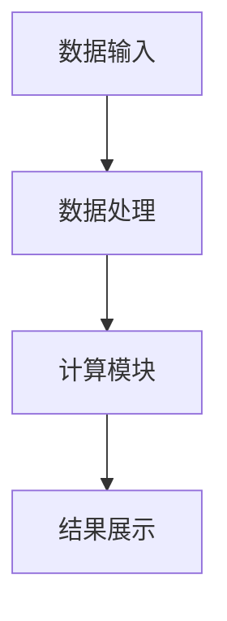

                 


# 彼得林奇如何评估公司的研发投入回报率

> 关键词：研发投入回报率、彼得林奇、投资评估、净现值、内部收益率

> 摘要：本文深入探讨了彼得林奇评估公司研发投入回报率的方法，结合定量和定性分析，详细讲解了净现值、内部收益率等关键指标的计算方法，并通过实际案例分析，展示了如何在现代企业中应用这些方法来优化投资决策。

---

## 第一部分：背景介绍

### 第1章：研发投入回报率的核心概念

#### 1.1 研发投入回报率的定义
- **研发投入**：公司用于研究和开发新产品的资金投入，包括人力成本、设备采购、试验费用等。
- **投资回报率（ROI）**：衡量投资收益与投入资金的比率，是评估投资效益的重要指标。
- **研发投入回报率**：专注于研发领域内的投资回报，是公司评估研发项目经济效益的关键指标。

#### 1.2 问题背景与重要性
- **问题背景**：研发投入是公司创新的核心，但如何量化其收益一直是投资决策中的难题。
- **评估的重要性**：准确评估研发投入回报率有助于优化资源配置，提升投资效率，降低财务风险。
- **现代企业的挑战**：随着市场竞争加剧，企业需要更精准的方法来评估研发投资的长期效益。

### 第2章：研发投入回报率的理论基础

#### 2.1 投资评估的基本原理
- **资本预算**：企业在评估投资项目时，通常会使用净现值（NPV）、内部收益率（IRR）等方法。
- **时间价值**：资金的时间价值是评估投资回报的关键因素，资金的机会成本需要被考虑在内。

#### 2.2 传统评估方法的局限性
- **短期收益忽视**：传统方法往往关注短期回报，忽视长期战略价值。
- **风险因素**：市场波动、技术风险等不确定性因素难以量化。

---

## 第二部分：核心概念与联系

### 第3章：研发投入回报率的定量评估方法

#### 3.1 净现值（NPV）计算
- **公式**：
  $$ NPV = \sum_{t=0}^{n} \frac{C_t}{(1 + r)^t} $$
  其中，\( C_t \) 是第 \( t \) 年的现金流，\( r \) 是折现率。
- **步骤**：
  1. 确定各年的现金流。
  2. 选择合适的折现率。
  3. 计算每期现金流的现值。
  4. 求和得到净现值。
- **应用案例**：假设某公司投入100万元研发新项目，预计三年内现金流分别为40万、50万、70万，折现率10%。计算其NPV。

#### 3.2 内部收益率（IRR）计算
- **公式**：
  $$ IRR = r \text{ 使得 } \sum_{t=0}^{n} \frac{C_t}{(1 + r)^t} = 0 $$
- **步骤**：
  1. 确定各年的现金流。
  2. 试算不同利率，找到使NPV为零的利率。
- **应用案例**：继续使用上述现金流，计算IRR。

#### 3.3 其他定量方法
- **投资回收期**：计算收回初始投资所需的时间。
- ** profitability index（PI）**：评估项目的收益与成本比率。

### 第4章：研发投入回报率的定性评估方法

#### 4.1 市场潜力分析
- **市场需求**：评估目标市场的规模、增长潜力和竞争状况。
- **技术可行性**：分析研发项目的技术难度和实现的可能性。

#### 4.2 竞争优势分析
- **技术壁垒**：评估研发项目的技术独占性和竞争优势。
- **成本优势**：分析研发项目是否能降低生产成本。

---

## 第三部分：算法原理与系统分析

### 第5章：研发投入回报率的数学模型

#### 5.1 净现值计算的详细推导
- **折现因子**：每期的折现因子为 \( \frac{1}{(1 + r)^t} \)。
- **现金流的加权和**：各期现金流乘以对应的折现因子，求和得到NPV。

#### 5.2 内部收益率的计算方法
- **试算法**：通过不断试算不同的 \( r \) 值，找到使NPV为零的点。
- **财务计算器或软件**：使用Excel的IRR函数进行计算。

### 第6章：系统架构与功能设计

#### 6.1 系统功能模块
- **数据输入模块**：收集研发项目的现金流数据和相关参数。
- **计算模块**：执行NPV、IRR等计算。
- **结果展示模块**：以图表形式展示计算结果。

#### 6.2 系统架构设计


---

## 第四部分：项目实战与应用

### 第7章：项目实战

#### 7.1 环境与工具安装
- **Python环境**：安装Anaconda，配置Jupyter Notebook。
- **库的安装**：使用 `pip install pandas numpy matplotlib` 安装必要的库。

#### 7.2 数据收集与预处理
- **数据来源**：从公司财务报表或项目计划中获取研发项目的现金流数据。
- **数据清洗**：处理缺失值和异常值。

#### 7.3 模型实现
```python
import numpy as np
import pandas as pd

# 案例数据：现金流和折现率
cash_flows = [100, 40, 50, 70]
discount_rate = 0.1

# 计算净现值
npv = 0
for t in range(len(cash_flows)):
    npv += cash_flows[t] / (1 + discount_rate) ** t

print(f"净现值为：{npv}")
```

#### 7.4 结果分析与优化
- **NPV结果**：正数表示项目可行。
- **IRR结果**：与行业基准比较，判断项目是否具有吸引力。

---

## 第五部分：最佳实践与总结

### 第8章：最佳实践

#### 8.1 小结
- **定量与定性结合**：仅依靠定量指标可能忽略市场和竞争因素。
- **动态调整模型**：根据市场变化及时更新评估模型。

#### 8.2 注意事项
- **数据准确性**：确保输入数据的准确性。
- **模型假设**：合理假设，避免偏差。

#### 8.3 未来展望
- **智能化评估**：结合AI技术，提高评估的准确性和效率。
- **多维度分析**：引入更多指标，如风险调整后的回报率。

---

## 作者

作者：AI天才研究院/AI Genius Institute & 禅与计算机程序设计艺术 /Zen And The Art of Computer Programming

---

通过以上详细分析和结构化内容，本文系统地阐述了彼得林奇评估研发投入回报率的方法，从理论到实践，为投资者和企业提供了一套科学的评估体系。

