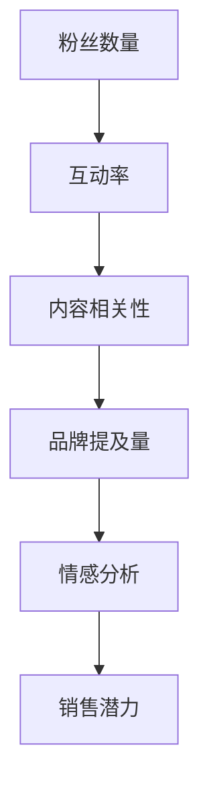
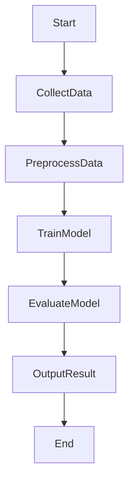

                 


# 彼得·林奇如何评估公司的社交媒体影响力转化为销售的能力

## 关键词：彼得·林奇, 社交媒体影响力, 销售能力, 算法模型, 投资策略

## 摘要：本文详细探讨了彼得·林奇如何通过评估公司社交媒体影响力来预测和提升其销售能力。我们从核心概念、算法原理到系统架构，全面分析了如何将社交媒体数据转化为销售优势，帮助投资者和企业做出更明智的决策。

---

# 第一部分: 背景介绍与核心概念

## 第1章: 社交媒体影响力与销售能力的关联

### 1.1 社交媒体营销的现状与趋势

#### 1.1.1 社交媒体在现代营销中的地位
社交媒体已经从单纯的沟通工具演变为强大的营销渠道。企业通过社交媒体平台与目标客户建立联系，推广产品和服务，提升品牌知名度。社交媒体营销不仅是现代营销策略的重要组成部分，更是企业增长的关键驱动力。

#### 1.1.2 社交媒体对销售能力的影响
社交媒体的影响力直接关系到企业的销售能力。高互动率和高粉丝参与度的社交媒体账号通常能带来更高的转化率。通过分析社交媒体数据，企业可以更好地了解客户需求，优化营销策略，从而提升销售业绩。

#### 1.1.3 彼得·林奇的社交媒体评估方法
彼得·林奇以其独特的投资策略闻名，他善于通过分析社交媒体数据来评估公司的销售潜力。他提出，社交媒体影响力是公司销售能力的重要指标，通过分析粉丝数量、互动频率和内容相关性，可以预测公司的销售增长潜力。

---

## 第2章: 彼得·林奇评估体系的核心要素

### 2.1 社交媒体影响力评估的关键指标

#### 2.1.1 粉丝数量与增长率
粉丝数量是衡量社交媒体影响力的重要指标。快速增长的粉丝数量表明公司的社交媒体账号正在吸引更多的关注者。然而，单纯依赖粉丝数量可能忽略互动质量，因此需要结合增长率和互动率进行综合评估。

#### 2.1.2 互动率与内容相关性
互动率（点赞、评论、转发）是衡量粉丝参与度的关键指标。高互动率表明粉丝对内容感兴趣，愿意与品牌互动。内容相关性则指内容是否与目标受众的需求和兴趣相关，相关性越高，互动率越高，销售转化潜力越大。

#### 2.1.3 品牌提及量与情感分析
品牌提及量反映了市场对品牌的关注程度。通过分析社交媒体上的品牌提及量，可以了解品牌在市场中的地位和影响力。情感分析则帮助判断公众对品牌的看法，正面情感越多，品牌影响力越大。

### 2.2 彼得·林奇评估体系的核心要素对比

| 核心要素               | 定义与重要性                         | 彼得·林奇的评估方法                |
|------------------------|--------------------------------------|--------------------------------------|
| 粉丝数量               | 账号的关注者数量，反映影响力         | 看重粉丝数量的增长率和质量         |
| 互动率                 | 粉丝与内容的互动程度，反映参与度     | 通过互动率预测用户参与度和忠诚度   |
| 内容相关性             | 内容与目标受众需求的匹配程度         | 通过内容分析评估品牌相关内容的产出能力 |
| 品牌提及量与情感分析   | 市场对品牌的关注和情感倾向             | 通过情感分析判断品牌影响力和风险   |

### 2.3 实体关系图（ER图）



---

# 第二部分: 核心概念与联系

## 第3章: 社交媒体影响力评估的算法模型

### 3.1 算法原理概述

#### 3.1.1 线性回归模型
线性回归是一种简单而有效的预测模型，适用于社交媒体影响力与销售能力之间的线性关系分析。通过收集社交媒体数据和对应的销售数据，建立线性回归模型，预测未来的销售潜力。

#### 3.1.2 随机森林模型
随机森林是一种基于决策树的集成学习算法，适用于处理高维数据和非线性关系。通过随机森林模型，我们可以更准确地预测社交媒体影响力对销售能力的影响。

#### 3.1.3 贝叶斯分类器
贝叶斯分类器适用于分类问题，可以用来判断社交媒体影响力对销售转化的影响。通过分析用户行为数据，分类用户为高潜力客户或低潜力客户。

### 3.2 算法流程图



### 3.3 数学模型与公式

#### 线性回归模型公式：
$$ y = \beta_0 + \beta_1x_1 + \beta_2x_2 + \dots + \beta_nx_n + \epsilon $$
其中：
- $y$ 是目标变量（销售能力）
- $x_i$ 是自变量（社交媒体影响力指标）
- $\beta_i$ 是回归系数
- $\epsilon$ 是误差项

---

## 第4章: 系统架构设计

### 4.1 问题场景介绍

通过社交媒体数据预测销售能力，我们需要一个完整的系统来处理数据、分析数据并输出结果。系统架构设计需要考虑数据采集、处理、分析和可视化等多个环节。

### 4.2 系统功能设计

#### 4.2.1 数据采集模块
负责从社交媒体平台采集数据，包括粉丝数量、互动率、内容相关性等。

#### 4.2.2 数据处理模块
对采集到的数据进行清洗、转换和预处理，确保数据质量。

#### 4.2.3 数据分析模块
使用机器学习算法对数据进行建模和预测，输出销售潜力评估结果。

#### 4.2.4 数据可视化模块
将分析结果以图表形式展示，帮助用户直观理解。

### 4.3 系统架构图


### 4.4 系统接口设计

- 数据采集模块接口：
  ```python
  def collect_data(platform, start_date, end_date):
      # 从指定平台收集数据
      pass
  ```

- 数据分析模块接口：
  ```python
  def predict_sales(influence_metrics):
      # 使用机器学习模型预测销售潜力
      pass
  ```

### 4.5 系统交互图


---

## 第5章: 项目实战

### 5.1 项目环境安装

```bash
pip install pandas numpy scikit-learn matplotlib
```

### 5.2 核心实现代码

```python
import pandas as pd
from sklearn.linear_model import LinearRegression
from sklearn.metrics import r2_score

# 数据加载
data = pd.read_csv('social_media_data.csv')

# 特征与目标分离
X = data[['followers', 'engagement_rate', 'content_relevance']]
y = data['sales_potential']

# 模型训练
model = LinearRegression()
model.fit(X, y)

# 模型评估
y_pred = model.predict(X)
print(f"R² Score: {r2_score(y, y_pred)}")
```

### 5.3 案例分析

假设我们有一个公司，其社交媒体数据如下：

| 账号 | 粉丝数量 | 互动率 | 内容相关性 | 销售潜力 |
|------|----------|--------|------------|----------|
| A    | 10000    | 5%      | 80%         | 100       |
| B    | 8000     | 7%      | 70%         | 80        |

通过上述代码训练的线性回归模型，我们可以预测未来的销售潜力。

---

## 第6章: 最佳实践与小结

### 6.1 小结

通过分析社交媒体数据，彼得·林奇能够准确评估公司的销售潜力。结合线性回归等算法，我们可以进一步优化预测模型，提升销售能力评估的准确性。

### 6.2 注意事项

- 数据质量对模型预测结果影响重大，需要确保数据的准确性和完整性。
- 不同社交媒体平台的特点不同，需根据具体平台调整评估指标。
- 模型需要定期更新，以适应市场变化和用户行为的变迁。

### 6.3 拓展阅读

- 《Data Analytics Using Python》
- 《Machine Learning for Investment》
- 《社交媒体营销实战手册》

---

# 结语

通过本文的详细分析，我们了解了如何利用社交媒体数据评估公司的销售潜力。从核心概念到算法模型，再到系统设计和项目实战，我们逐步构建了一个完整的评估体系。希望本文能为投资者和企业提供有价值的参考，帮助他们更好地利用社交媒体提升销售能力。

---

# 作者：AI天才研究院/AI Genius Institute & 禅与计算机程序设计艺术 /Zen And The Art of Computer Programming

