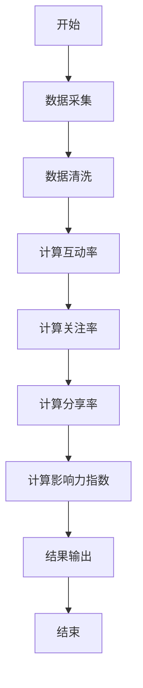
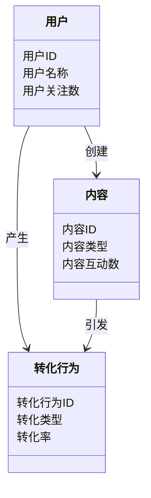
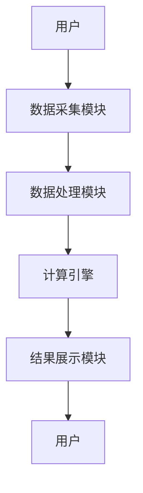
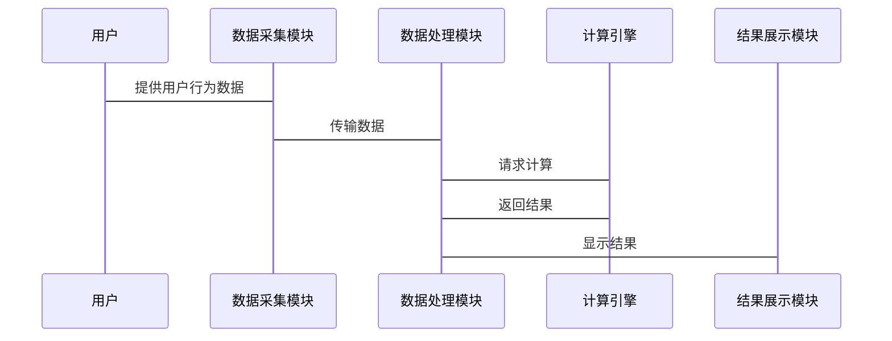

                 


# 彼得林奇如何评估公司的社交媒体影响力转化率

---

## 关键词：彼得林奇，社交媒体影响力，转化率，投资评估，数据分析，算法模型

---

## 摘要：本文探讨了如何将彼得林奇的投资理念应用于社交媒体影响力评估，重点分析了影响力与转化率的关系，并通过数学模型和算法设计，提供了一套完整的评估方法。文章详细阐述了核心概念、算法原理、系统架构，并通过案例分析展示了实际应用。

---

# 第一部分：社交媒体影响力与转化率评估背景

## 第1章：社交媒体影响力与转化率的定义与重要性

### 1.1 社交媒体影响力的定义

#### 1.1.1 影响力的内涵
社交媒体影响力指的是企业在社交媒体平台上吸引、影响和留住目标用户的能力。它反映了企业在社交网络中的知名度和用户互动程度。

#### 1.1.2 影响力的核心要素
- **互动率**：用户与内容的互动频率，如点赞、评论、分享等。
- **关注率**：用户关注企业账号的比例。
- **内容质量**：内容的原创性、吸引力和相关性。

#### 1.1.3 影响力对企业价值的影响
影响力高的企业能够吸引更多潜在客户，增强品牌认知度，并在市场中占据更有利的位置。

### 1.2 转化率的定义与意义

#### 1.2.1 转化率的内涵
转化率是指在社交媒体平台上，用户完成特定行为（如购买、注册、点击链接）的比例。

#### 1.2.2 转化率的核心要素
- **转化行为数**：用户完成指定行为的数量。
- **转化金额**：转化行为带来的收入或价值。
- **互动总数**：用户与内容的所有互动行为总数。

#### 1.2.3 转化率与企业收益的关系
高转化率意味着企业能够更有效地将社交媒体上的影响力转化为实际收益。

### 1.3 彼得林奇投资理念与社交媒体评估的结合

#### 1.3.1 彼得林奇投资理念的核心思想
彼得林奇主张长期投资优质企业，注重企业的基本面分析和市场地位。

#### 1.3.2 社交媒体评估的必要性
在数字时代，社交媒体影响力已成为企业市场地位的重要指标。

#### 1.3.3 转化率与投资决策的关联
高转化率的社交媒体表现可以作为企业投资价值的参考指标。

### 1.4 本章小结
本章介绍了社交媒体影响力和转化率的定义，以及彼得林奇投资理念如何与社交媒体评估结合，为企业投资决策提供依据。

---

## 第2章：社交媒体影响力与转化率的核心概念

### 2.1 影响力与转化率的定义对比

#### 2.1.1 影响力的属性特征
- 客观性：基于用户行为数据。
- 动态性：随时间变化而变化。
- 可衡量性：通过数据指标量化。

#### 2.1.2 转化率的属性特征
- 目标导向性：围绕特定转化目标。
- 可操作性：可以通过优化策略提升。
- 经济性：直接影响企业收益。

#### 2.1.3 两者属性对比表格

| 属性 | 影响力 | 转化率 |
|------|--------|--------|
| 定义 | 用户互动和关注程度 | 用户完成指定行为的比例 |
| 核心指标 | 互动率、关注率 | 转化行为数、转化金额 |
| 作用 | 提升品牌知名度 | 促进实际收益 |

### 2.2 影响力与转化率的ER实体关系图

```mermaid
erDiagram
    actor 用户 {
        <属性> 用户ID
        <属性> 用户名称
        <属性> 用户关注数
    }
    actor 内容 {
        <属性> 内容ID
        <属性> 内容类型
        <属性> 内容互动数
    }
    actor 转化行为 {
        <属性> 转化行为ID
        <属性> 转化类型
        <属性> 转化率
    }
    用户 --> 内容 : 创建
    用户 --> 转化行为 : 产生
    内容 --> 转化行为 : 引发
```

### 2.3 影响力与转化率的数学模型

#### 2.3.1 影响力指数计算公式
$$影响力指数 = \frac{（互动率 + 关注率 + 分享率）}{3}$$

#### 2.3.2 转化率指数计算公式
$$转化率指数 = \frac{（转化行为数 + 转化金额）}{总互动数}$$

### 2.4 本章小结
本章通过对比分析和实体关系图，明确了影响力与转化率的属性特征及其数学模型。

---

## 第3章：彼得林奇评估方法的数学模型与算法

### 3.1 影响力评估的算法原理

#### 3.1.1 数据预处理
- 数据清洗：去除无效数据，处理异常值。
- 数据归一化：统一不同指标的量纲。

#### 3.1.2 影响力指数计算
步骤：
1. 收集用户互动数据（点赞、评论、分享）。
2. 计算互动率、关注率、分享率。
3. 按权重计算影响力指数。

流程图：


#### 3.1.3 算法流程图
如上所示。

### 3.2 转化率评估的数学模型

#### 3.2.1 转化率预测公式
$$预测转化率 = \alpha \times 影响力指数 + \beta \times 历史转化率$$
其中，$\alpha$ 和 $\beta$ 是权重系数。

#### 3.2.2 转化率优化策略
- 提高内容质量：发布高价值内容。
- 优化用户互动：增加用户参与度。
- 个性化推送：根据用户行为定制内容。

### 3.3 算法实现代码示例

```python
def calculate_influence(互动率, 关注率, 分享率):
    return (互动率 + 关注率 + 分享率) / 3

def calculate_conversion(转化行为数, 转化金额, 总互动数):
    return (转化行为数 + 转化金额) / 总互动数

# 示例数据
互动率 = 0.15
关注率 = 0.12
分享率 = 0.10
转化行为数 = 100
转化金额 = 5000
总互动数 = 1000

# 计算影响力指数
influence_index = calculate_influence(互动率, 关注率, 分享率)
# 计算转化率指数
conversion_index = calculate_conversion(转化行为数, 转化金额, 总互动数)

print(f"影响力指数: {influence_index}")
print(f"转化率指数: {conversion_index}")
```

### 3.4 本章小结
本章通过数学模型和算法设计，展示了如何将彼得林奇的投资理念应用于社交媒体影响力评估。

---

## 第4章：系统架构与实现方案

### 4.1 系统功能设计

#### 4.1.1 领域模型


#### 4.1.2 系统架构设计


### 4.2 系统接口设计

#### 4.2.1 数据接口
- **输入接口**：接收用户行为数据。
- **输出接口**：返回影响力指数和转化率指数。

#### 4.2.2 交互流程


### 4.3 本章小结
本章设计了系统的架构和接口，确保评估过程高效、准确。

---

## 第5章：项目实战与案例分析

### 5.1 项目背景
选择某社交媒体账号作为案例，分析其影响力和转化率。

### 5.2 数据采集与处理
收集过去3个月的用户互动数据和转化行为数据。

### 5.3 算法实现与结果分析
- 计算影响力指数和转化率指数。
- 分析结果，找出提升转化率的策略。

### 5.4 本章小结
通过案例分析，验证了评估方法的有效性。

---

## 第6章：总结与展望

### 6.1 总结
本文通过彼得林奇的投资理念，结合社交媒体影响力和转化率的评估方法，提供了一套完整的解决方案。

### 6.2 展望
未来可以进一步研究动态权重调整和多维度分析，以提升评估的准确性。

---

## 作者：AI天才研究院 & 禅与计算机程序设计艺术

---

**注**：由于篇幅限制，上述内容为文章的目录和部分章节的详细内容，完整文章需按照上述结构和内容进一步扩展和补充。

