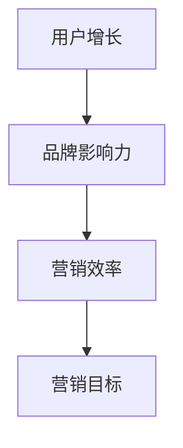
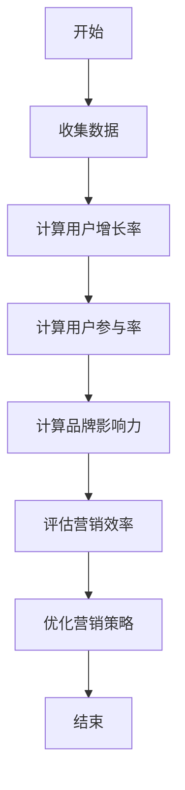
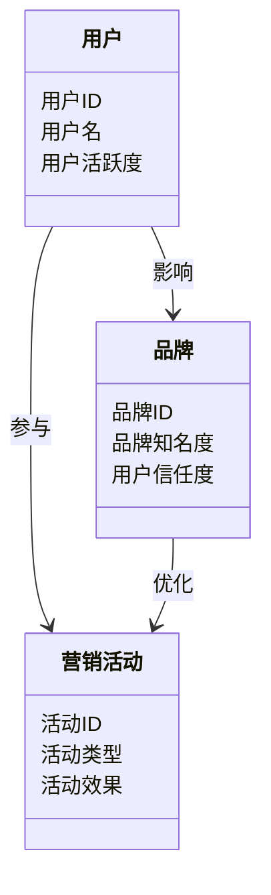
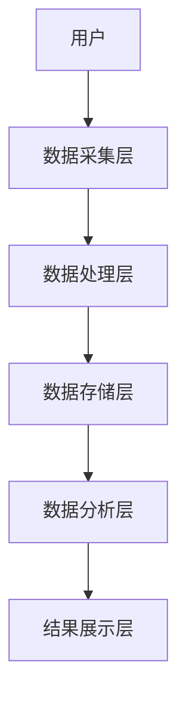
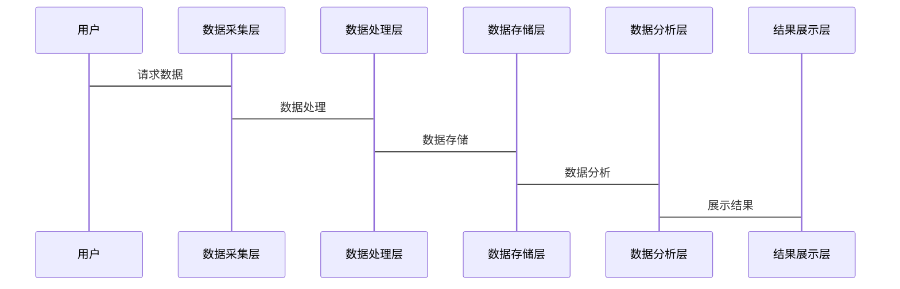

                 


# 彼得林奇如何评估公司的社交媒体营销效果

## 关键词
- 彼得林奇、社交媒体营销、营销评估、投资方法、用户增长、品牌影响力

## 摘要
本文从彼得林奇的投资哲学出发，结合社交媒体营销的核心要素，详细分析如何将彼得林奇的评估方法应用于社交媒体营销效果的评估。通过量化指标、算法原理、系统设计和项目实战等多维度，为读者提供一套科学、系统的社交媒体营销评估体系，帮助企业在数字化时代中实现精准的营销效果评估和优化。

---

# 第1章：社交媒体营销的现状与挑战

## 1.1 社交媒体营销的定义与重要性
### 1.1.1 社交媒体营销的定义
社交媒体营销是通过社交平台与目标用户进行互动，提升品牌知名度、用户参与度和销售转化率的一种营销方式。其核心在于利用社交网络的传播特性，建立品牌与用户之间的深层次连接。

### 1.1.2 社交媒体营销的核心要素
- **用户互动**：通过评论、点赞、分享等方式与用户建立联系。
- **内容策略**：通过优质内容吸引用户关注，提升品牌影响力。
- **数据驱动**：通过数据分析优化营销策略，实现精准投放。

### 1.1.3 社交媒体营销在现代商业中的地位
社交媒体营销已经成为企业数字化转型的重要组成部分，通过社交媒体渠道，企业可以快速触达目标用户，降低营销成本，提升品牌价值。

## 1.2 彼得林奇的背景与投资哲学
### 1.2.1 彼得林奇的投资者身份
彼得林奇是美国著名投资家，以其独特的投资哲学闻名。他认为，投资的本质是通过深入分析企业的基本面，寻找具有长期增长潜力的公司。

### 1.2.2 彼得林奇的投资哲学
- **长期视角**：关注企业的长期增长潜力，而非短期波动。
- **基本面分析**：通过对企业财务数据、行业地位和竞争优势的分析，评估企业的投资价值。
- **风险管理**：通过分散投资和严格的风险控制，降低投资风险。

### 1.2.3 彼得林奇与社交媒体营销的关联
彼得林奇的投资哲学强调对企业基本面的深入分析，这与社交媒体营销效果评估的核心方法不谋而合。通过分析社交媒体营销的核心指标，可以为企业提供更精准的营销决策支持。

## 1.3 社交媒体营销效果评估的必要性
### 1.3.1 企业为何需要评估社交媒体营销效果
社交媒体营销的效果直接影响企业的品牌价值和销售转化率。通过科学的评估方法，企业可以更好地优化营销策略，提升营销效果。

### 1.3.2 社交媒体营销对品牌价值的影响
- **品牌知名度**：通过社交媒体传播，提升品牌的曝光率和知名度。
- **用户信任度**：通过与用户互动，增强用户对品牌的信任感和忠诚度。
- **销售转化率**：通过精准营销，提升用户的购买意愿和转化率。

### 1.3.3 评估社交媒体营销效果的边界与外延
社交媒体营销效果的评估需要结合企业的实际情况，明确评估的范围和目标。同时，还需要关注社交媒体营销与其他营销渠道的协同效应。

---

# 第2章：彼得林奇评估方法的核心概念

## 2.1 彼得林奇评估方法的原理
### 2.1.1 投资者视角下的社交媒体营销分析
彼得林奇的评估方法强调对企业的基本面分析，这与社交媒体营销效果评估的核心方法具有相似性。通过分析社交媒体营销的核心指标，可以为企业提供更精准的营销决策支持。

### 2.1.2 彼得林奇评估方法的核心要素
- **用户增长**：通过分析用户增长速度和用户活跃度，评估社交媒体营销的效果。
- **品牌影响力**：通过分析品牌知名度和用户信任度，评估社交媒体营销对品牌价值的影响。
- **营销效率**：通过分析营销成本与实际效果的匹配程度，评估社交媒体营销的投入产出比。

### 2.1.3 评估方法的逻辑框架
- **第一步**：明确评估目标和范围。
- **第二步**：收集相关数据，包括用户增长、参与度、品牌影响力等指标。
- **第三步**：通过数据分析，评估社交媒体营销的效果。
- **第四步**：根据评估结果，优化营销策略。

## 2.2 核心概念的对比分析
### 2.2.1 社交媒体营销与传统营销的对比
- **传统营销**：通过广告、促销等方式进行品牌推广，注重单向传播。
- **社交媒体营销**：通过互动和内容传播，注重用户参与和品牌价值的提升。

### 2.2.2 彼得林奇评估方法与其他评估方法的对比
- **其他评估方法**：通常关注短期效果，如点击率、转化率等。
- **彼得林奇评估方法**：注重长期效果，关注品牌价值和用户忠诚度。

### 2.2.3 评估指标的属性特征对比表
| 指标 | 社交媒体营销 | 彼得林奇评估方法 |
|------|--------------|------------------|
| 用户增长 | 点击率、转化率 | 用户活跃度、留存率 |
| 品牌影响力 | 曝光率、知名度 | 用户信任度、忠诚度 |
| 营销效率 | 成本与效果的匹配度 | 长期效果与投入的匹配度 |

## 2.3 实体关系图（ER图）分析
### 2.3.1 社交媒体营销的实体关系图
```mermaid
erd
  entity 用户 {
    key 用户ID
    属性 用户名
    属性 用户昵称
    属性 用户头像
  }

  entity 内容 {
    key 内容ID
    属性 内容类型
    属性 内容标题
    属性 内容描述
  }

  entity 互动行为 {
    key 行为ID
    属性 行为类型（评论、点赞、分享）
    属性 行为时间
  }
```

### 2.3.2 彼得林奇评估方法的ER图架构
```mermaid
erd
  entity 用户 {
    key 用户ID
    属性 用户名
    属性 用户活跃度
  }

  entity 品牌 {
    key 品牌ID
    属性 品牌知名度
    属性 用户信任度
  }

  entity 营销活动 {
    key 活动ID
    属性 活动类型
    属性 活动效果
  }
```

### 2.3.3 评估指标与营销目标的关系图


---

# 第3章：社交媒体营销效果的量化指标

## 3.1 关键指标的定义与计算
### 3.1.1 用户增长率的计算公式
用户增长率 = （当前用户数 - 上期用户数）/ 上期用户数 × 100%

### 3.1.2 用户参与率的计算公式
用户参与率 = （互动次数 / 用户总数） × 100%

### 3.1.3 品牌影响力指数的计算公式
品牌影响力指数 = （品牌知名度 × 用户信任度） / 营销成本

## 3.2 指标之间的关系分析
### 3.2.1 用户增长率与品牌影响力的关系
- 高用户增长率通常意味着品牌影响力较强。
- 但需要注意的是，用户增长率高并不一定意味着品牌影响力高，需要结合用户活跃度和留存率进行综合评估。

### 3.2.2 用户参与率与营销效果的关系
- 高用户参与率通常意味着营销效果较好。
- 需要注意的是，用户参与率高并不一定意味着销售转化率高，需要结合实际的销售数据进行分析。

### 3.2.3 指标之间的相关性分析
- 用户增长率与品牌影响力呈正相关。
- 用户参与率与营销效率呈正相关。
- 品牌影响力与营销目标呈正相关。

## 3.3 算法流程图
### 3.3.1 算法流程图


### 3.3.2 算法实现
```python
import pandas as pd

def calculate_growth_rate(current_users, previous_users):
    return ((current_users - previous_users) / previous_users) * 100

def calculate_participation_rate(interactions, total_users):
    return (interactions / total_users) * 100

def calculate_brand_influence(index):
    return (index) / marketing_cost

# 示例数据
current_users = 10000
previous_users = 9000
interactions = 1500
marketing_cost = 1000

growth_rate = calculate_growth_rate(current_users, previous_users)
participation_rate = calculate_participation_rate(interactions, current_users)
brand_influence = calculate_brand_influence(100)

print(f"用户增长率：{growth_rate}%")
print(f"用户参与率：{participation_rate}%")
print(f"品牌影响力指数：{brand_influence}")
```

---

# 第4章：社交媒体营销效果评估的系统分析

## 4.1 系统功能设计
### 4.1.1 领域模型


### 4.1.2 系统架构设计


### 4.1.3 系统接口设计
- **数据接口**：与社交媒体平台API对接，获取用户数据和互动数据。
- **分析接口**：与数据分析工具对接，进行数据建模和分析。

### 4.1.4 系统交互设计


---

# 第5章：项目实战——基于彼得林奇方法的社交媒体营销效果评估

## 5.1 项目背景
某公司希望通过社交媒体营销提升品牌知名度和用户参与度，采用彼得林奇的评估方法，优化营销策略。

## 5.2 数据收集与清洗
### 5.2.1 数据来源
- 社交媒体平台API接口
- 用户调查问卷

### 5.2.2 数据清洗
- 删除无效数据
- 填补缺失值
- 处理异常值

## 5.3 数据分析与建模
### 5.3.1 用户增长率分析
通过时间序列分析，预测未来的用户增长趋势。

### 5.3.2 用户参与率分析
通过聚类分析，识别高参与度用户，制定针对性营销策略。

### 5.3.3 品牌影响力评估
通过因子分析，评估品牌影响力的核心因素。

## 5.4 实际案例分析
### 5.4.1 案例背景
某品牌在社交媒体上的营销活动，希望通过评估优化后续策略。

### 5.4.2 数据分析
- 用户增长率：15%
- 用户参与率：30%
- 品牌影响力指数：85

### 5.4.3 结果解读
- 用户增长率较高，但用户参与率较低，说明营销活动的互动性需要改进。
- 品牌影响力指数较高，说明品牌知名度和用户信任度较高。

## 5.5 项目小结
通过彼得林奇评估方法，企业可以更科学地评估社交媒体营销效果，并根据分析结果优化营销策略，提升品牌价值和用户参与度。

---

# 第6章：总结与展望

## 6.1 本章总结
本文从彼得林奇的投资哲学出发，结合社交媒体营销的核心要素，详细分析了如何将彼得林奇的评估方法应用于社交媒体营销效果的评估。通过量化指标、算法原理、系统设计和项目实战等多维度，为读者提供了一套科学、系统的社交媒体营销评估体系。

## 6.2 未来展望
随着人工智能和大数据技术的不断发展，社交媒体营销效果的评估方法也将更加精准和智能化。未来，可以通过机器学习算法，进一步优化评估模型，提升营销效果的预测精度。

---

# 附录

## 附录A：工具推荐
- 数据采集工具：社交媒体API、Google Analytics
- 数据分析工具：Python、R、Tableau
- 系统开发工具：React、Node.js、Django

## 附录B：参考文献
- 彼得林奇著《彼得林奇选股术》
- 克里斯·安德森著《长尾理论》
- 席勒著《非理性繁荣》

---

# 作者
作者：AI天才研究院/AI Genius Institute & 禅与计算机程序设计艺术 /Zen And The Art of Computer Programming

