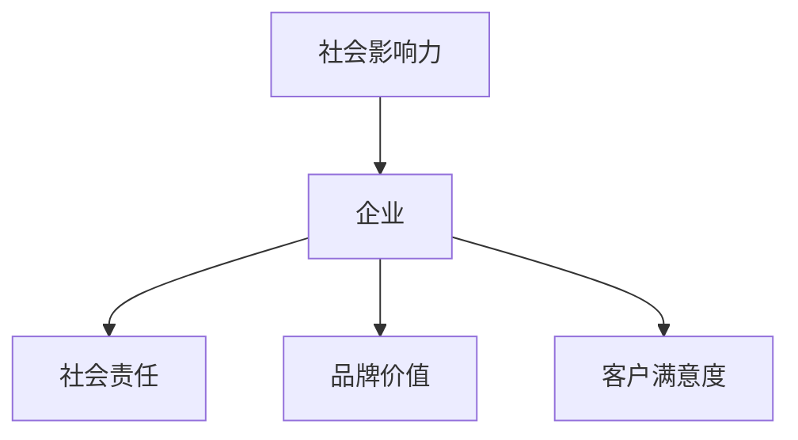
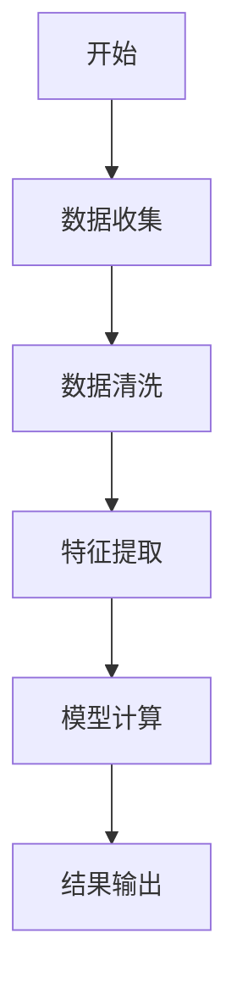
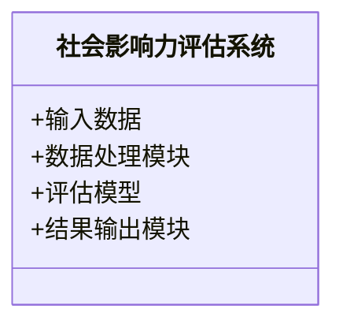
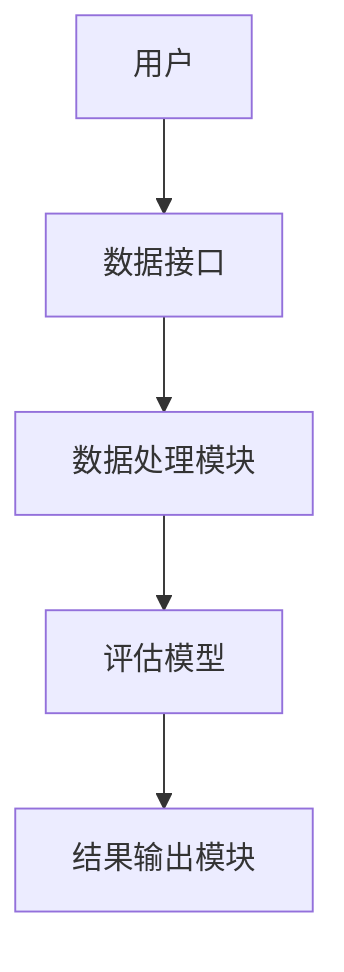
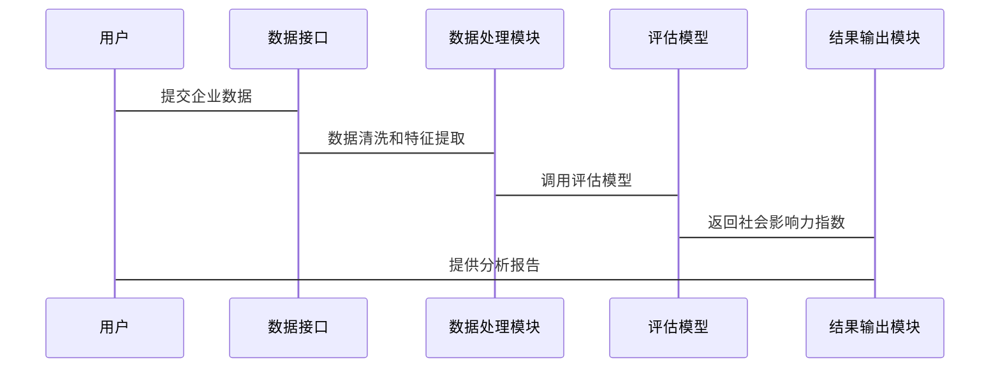

                 


# 彼得林奇如何评估公司的社会影响力

## 关键词
- 彼得林奇
- 社会影响力
- 企业评估
- 评估模型
- 算法原理

## 摘要
彼得·林奇以其独特的投资哲学和对企业社会影响力的关注而闻名。本文将详细探讨彼得林奇如何评估公司的社会影响力，从背景介绍到核心概念，从算法原理到系统架构设计，再到项目实战，全面解析其评估方法。通过本文，读者将能够理解如何将社会影响力评估与企业价值评估相结合，为企业投资决策提供新的视角。

---

# 第1章: 社会影响力评估的背景与意义

## 1.1 什么是社会影响力
### 1.1.1 社会影响力的基本定义
社会影响力是指企业在社会中的正面影响和贡献，包括社会责任履行、品牌价值提升、客户满意度等方面。

### 1.1.2 社会影响力的核心要素
- **社会责任**：企业对环境保护、员工福利、公益活动等方面的投入。
- **品牌价值**：企业的品牌形象和声誉对社会的影响。
- **客户满意度**：客户对企业产品和服务的满意程度。

### 1.1.3 社会影响力与企业价值的关系
社会影响力能够提升企业的品牌形象，增强客户忠诚度，从而间接提升企业价值。

## 1.2 彼得林奇的评估方法
### 1.2.1 彼得林奇投资哲学概述
彼得林奇注重长期投资，关注企业的基本面和管理团队，他认为企业的社会影响力是企业长期价值的重要组成部分。

### 1.2.2 彼得林奇社会影响力评估的独特视角
彼得林奇通过分析企业的社会责任履行情况、品牌影响力和客户满意度来评估其社会影响力。

### 1.2.3 社会影响力评估的行业适用性
不同行业的企业社会影响力评估标准有所不同，但总体框架相似。

---

# 第2章: 社会影响力评估的核心概念与联系

## 2.1 核心概念原理
### 2.1.1 社会影响力评估的三要素模型
社会影响力评估包括社会责任、品牌价值和客户满意度三个核心要素。

### 2.1.2 企业社会责任的量化方法
通过量化企业对环境保护、员工福利等方面的投入来评估其社会责任履行情况。

### 2.1.3 品牌价值与社会影响力的关联
品牌价值的提升往往与企业的社会影响力密切相关。

## 2.2 核心概念对比分析
### 2.2.1 社会影响力与企业利润的关系
社会影响力能够间接提升企业利润，但并非所有高社会影响力的企业都能立即带来利润增长。

### 2.2.2 不同行业社会影响力评估的差异
不同行业的企业社会影响力评估标准有所不同，例如科技行业更注重创新和环保，而传统制造业更注重员工福利和产品质量。

### 2.2.3 企业规模与社会影响力评估的关联
大型企业通常有更多资源来履行社会责任，但小企业可以通过创新和特色服务提升社会影响力。

## 2.3 实体关系图


---

# 第3章: 社会影响力评估的算法与数学模型

## 3.1 算法流程


## 3.2 算法实现
### 3.2.1 数据收集
收集企业的社会责任履行情况、品牌价值和客户满意度等数据。

### 3.2.2 数据清洗
对收集到的数据进行清洗，去除无效数据，确保数据的准确性和完整性。

### 3.2.3 特征提取
提取关键特征，如社会责任投入金额、品牌知名度评分、客户满意度评分等。

### 3.2.4 模型计算
使用加权评分模型计算社会影响力指数，权重根据行业特点和企业规模调整。

## 3.3 数学模型
社会影响力指数计算公式：
$$ S = \sum_{i=1}^{n} (w_i \times f_i) $$
其中，\( S \) 为社会影响力指数，\( w_i \) 为各要素的权重，\( f_i \) 为各要素的评分。

---

# 第4章: 社会影响力评估的系统架构设计

## 4.1 系统功能设计


## 4.2 系统架构设计


## 4.3 系统接口设计
- 数据接口：接收企业社会责任、品牌价值和客户满意度数据。
- 评估模型接口：调用加权评分模型计算社会影响力指数。
- 结果输出接口：返回社会影响力指数和分析报告。

## 4.4 系统交互设计


---

# 第5章: 项目实战

## 5.1 环境安装
- Python 3.8+
- 数据处理库：Pandas、NumPy
- 可视化库：Matplotlib
- 评估模型库：Scikit-learn

## 5.2 核心代码实现
```python
import pandas as pd
import numpy as np

def calculate_social_influence(company_data):
    # 数据清洗
    cleaned_data = company_data.dropna()
    # 特征提取
    features = cleaned_data[['社会责任投入', '品牌价值', '客户满意度']]
    # 加权评分
    weights = [0.4, 0.3, 0.3]
    social_influence = np.dot(features, weights)
    return social_influence

# 示例数据
data = {
    '公司名称': ['A公司', 'B公司', 'C公司'],
    '社会责任投入': [100, 80, 90],
    '品牌价值': [200, 180, 190],
    '客户满意度': [90, 85, 88]
}
df = pd.DataFrame(data)
result = calculate_social_influence(df)
print(result)
```

## 5.3 代码解读与分析
- 数据清洗：去除缺失值。
- 特征提取：提取社会责任投入、品牌价值和客户满意度三个特征。
- 加权评分：根据权重计算社会影响力指数。

## 5.4 实际案例分析
以某科技公司为例，计算其社会影响力指数：
- 社会责任投入：150
- 品牌价值：180
- 客户满意度：85
计算公式：
$$ S = 0.4 \times 150 + 0.3 \times 180 + 0.3 \times 85 = 60 + 54 + 25.5 = 139.5 $$

---

# 第6章: 最佳实践、小结与注意事项

## 6.1 最佳实践 tips
- 定期更新数据和模型，以反映企业的最新社会影响力。
- 根据行业特点调整权重，以提高评估的准确性。

## 6.2 小结
本文详细探讨了彼得林奇如何评估公司的社会影响力，从背景介绍到核心概念，从算法原理到系统架构设计，再到项目实战，全面解析了其评估方法。

## 6.3 注意事项
- 数据的准确性和完整性对评估结果影响重大。
- 模型的权重需要根据实际情况调整。

## 6.4 拓展阅读
- 《彼得林奇的投资哲学》
- 《企业社会影响力评估的数学模型》

---

# 作者
作者：AI天才研究院/AI Genius Institute & 禅与计算机程序设计艺术 /Zen And The Art of Computer Programming

