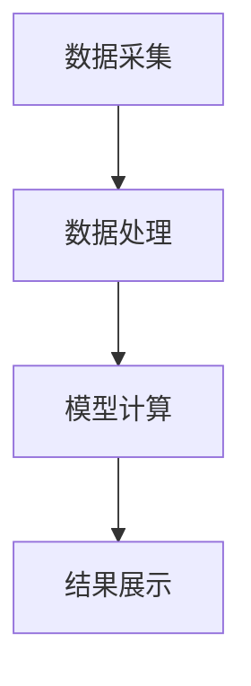
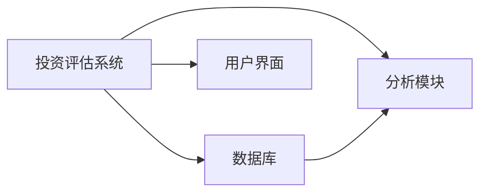

                 


# 彼得林奇如何评估公司的社会影响力投资回报

## 关键词
彼得林奇，社会影响力投资，投资回报，现金流分析，风险评估

## 摘要
本文探讨了彼得·林奇如何评估公司的社会影响力投资回报，结合其投资理念和方法，分析了社会影响力投资的核心要素、评估指标及数学模型，最后通过具体案例展示评估过程和方法。

## 第1章: 社会影响力投资的背景与概念

### 1.1 社会影响力投资的定义与核心要素
#### 1.1.1 什么是社会影响力投资
社会影响力投资是指投资者在追求财务回报的同时，积极投资于解决社会问题，创造积极的社会影响。

#### 1.1.2 社会影响力投资的核心要素
- **财务回报**：投资产生的经济收益。
- **社会影响**：投资对社会问题的解决程度。
- **影响力测量**：量化社会影响的方法。

#### 1.1.3 社会影响力投资与传统投资的区别
| 方面 | 社会影响力投资 | 传统投资 |
|------|----------------|-----------|
| 目标 | 社会影响+回报 | 财务回报 |
| 风险 | 社会影响不确定性 | 市场风险 |

### 1.2 彼得·林奇的投资理念
#### 1.2.1 彼得·林奇的投资风格概述
彼得·林奇以基本面分析和长期投资著称，注重公司基本面和管理团队。

#### 1.2.2 彼得·林奇对社会影响力投资的看法
林奇认为，社会影响力投资与财务回报并不矛盾，优质企业具备可持续的社会价值。

#### 1.2.3 林奇投资理念与社会影响力投资的结合
将社会影响力作为投资筛选的重要标准，寻找兼具社会价值和盈利能力的公司。

## 第2章: 社会影响力投资的评估指标

### 2.1 财务回报指标
#### 2.1.1 内部收益率（IRR）
IRR是投资项目的期望回报率，衡量资金效率。

#### 2.1.2 净现值（NPV）
NPV是未来现金流的现值与初始投资的差额，判断投资可行性。

#### 2.1.3 投资回收期
回收期是投资回收初始投资所需的时间，评估项目快速回报能力。

### 2.2 社会影响评估指标
#### 2.2.1 社会影响的量化方法
通过问卷调查、访谈等方式收集数据，评估项目对社会的影响程度。

#### 2.2.2 影响力的层次分析法（AHP）
AHP是一种结构化决策方法，用于评估多个影响因素的重要性。

#### 2.2.3 社会影响的外部性评估
分析项目带来的正外部性和负外部性，量化其社会价值。

## 第3章: 彼得·林奇的评估方法与模型

### 3.1 彼得·林奇的现金流分析
#### 3.1.1 现金流分析的基本原理
现金流分析通过预测项目各阶段的现金流，评估其可行性和收益能力。

#### 3.1.2 现金流分析的步骤与方法
1. 预测未来现金流。
2. 确定合适的折现率。
3. 计算净现值、内部收益率等指标。

#### 3.1.3 现金流分析在社会影响力投资中的应用
使用现金流分析评估项目财务可行性，同时结合社会影响指标。

### 3.2 彼得·林奇的风险评估模型
#### 3.2.1 风险评估的基本概念
风险是投资回报的不确定性，需通过模型量化。

#### 3.2.2 风险评估的指标与方法
- **标准差**：衡量投资回报的波动性。
- **贝塔系数**：评估资产相对于市场的波动性。

#### 3.2.3 风险评估在社会影响力投资中的应用
结合社会影响因素，评估项目整体风险，优化投资组合。

## 第4章: 社会影响力投资的数学模型与公式

### 4.1 内部收益率（IRR）的计算公式
$$ IRR = r \text{ 满足 } \sum_{t=0}^{n} \frac{CF_t}{(1 + r)^t} = 0 $$

### 4.2 净现值（NPV）的计算公式
$$ NPV = \sum_{t=0}^{n} \frac{CF_t}{(1 + r)^t} $$

### 4.3 影响力评估的层次分析法（AHP）公式
$$ \lambda_{max} = \frac{\sum_{j=1}^{n} \lambda_i a_{ij}}{\sum_{j=1}^{n} a_{ij}} $$

## 第5章: 社会影响力投资的系统架构设计

### 5.1 投资评估系统的模块划分
#### 5.1.1 数据采集模块
收集公司财务数据和社会影响数据。

#### 5.1.2 数据处理模块
清洗和转换数据，准备分析。

#### 5.1.3 模型计算模块
应用现金流分析和风险评估模型。

#### 5.1.4 结果展示模块
输出评估结果，包括财务回报和社会影响指标。

### 5.2 系统功能设计


### 5.3 系统架构设计


## 第6章: 项目实战

### 6.1 环境安装
安装Python、Pandas、NumPy等库，配置开发环境。

### 6.2 核心代码实现
```python
import numpy as np

def calculateIRR(cash_flows, discount_rate):
    return np.irr(cash_flows)

cash_flows = [-100, 50, 50, 50]
discount_rate = 0.1
print(f"IRR: {calculateIRR(cash_flows, discount_rate)}")
```

### 6.3 案例分析
评估一家环保企业的投资回报，计算IRR和NPV，分析社会影响。

## 第7章: 最佳实践

### 7.1 小结
社会影响力投资需结合财务回报和社会影响，选择具备可持续价值的企业。

### 7.2 注意事项
- 定期评估项目进展。
- 综合考虑社会因素和财务指标。
- 风险管理至关重要。

### 7.3 拓展阅读
推荐书籍和文章，深入学习社会影响力投资。

## 作者
作者：AI天才研究院 & 禅与计算机程序设计艺术

---

这篇文章系统地介绍了彼得·林奇评估社会影响力投资回报的方法，结合理论、模型和实际案例，提供了全面的分析和指导。

