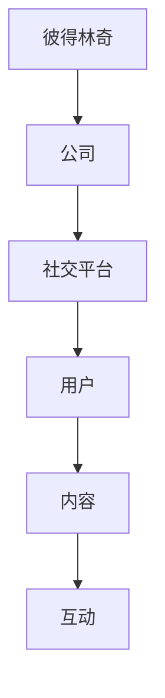
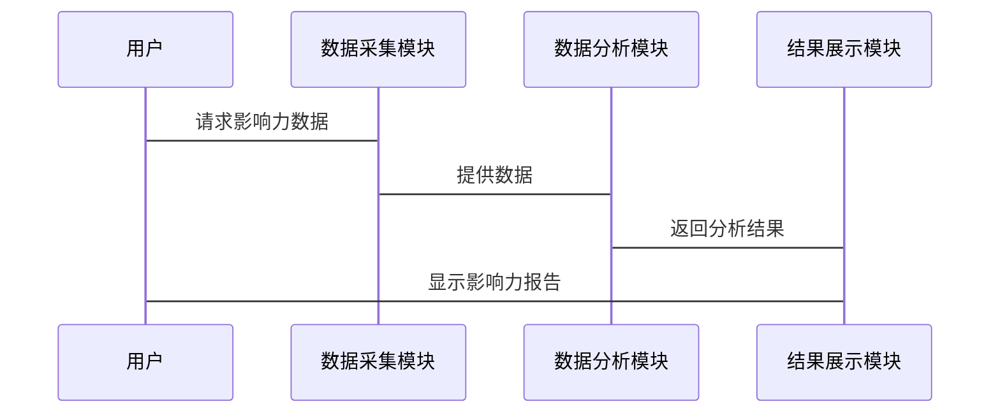

                 


# 彼得林奇如何评估公司的社会网络影响力

> 关键词：彼得林奇，社会网络影响力，影响力评估，投资决策，影响力传播模型

> 摘要：本文结合彼得林奇的投资方法和现代社交网络分析技术，探讨如何评估公司的社会网络影响力。通过构建影响力传播模型和设计系统架构，提出一种新的影响力评估方法，帮助投资者做出更明智的投资决策。

---

# 第一部分: 彼得林奇如何评估公司的社会网络影响力概述

## 第1章: 社会网络影响力的基本概念

### 1.1 社会网络影响力概述

#### 1.1.1 社会网络的定义
社会网络是指由个体（如个人、公司或组织）及其之间的关系构成的网络结构。在现代社会中，社会网络不仅是信息传播的渠道，也是影响力扩散的重要载体。

#### 1.1.2 社会网络影响力的核心概念
社会网络影响力是指个体或组织在社会网络中对其他个体或组织产生影响的能力。这种影响力可以是信息的传播、舆论的形成或行为的引导。

#### 1.1.3 彼得林奇与社会网络影响力的关系
彼得林奇是著名的投资专家，他通过分析公司及其在社会网络中的影响力，来评估公司的市场地位和潜在价值。他注重从社交网络的角度理解公司的影响力，这为现代影响力评估提供了重要的思路。

### 1.2 彼得林奇的评估方法

#### 1.2.1 彼得林奇的投资哲学
彼得林奇强调长期投资和基本面分析。他认为，公司的社会网络影响力是其长期价值的重要组成部分。通过分析公司在社交平台上的影响力，可以更好地评估其市场地位和潜在增长空间。

#### 1.2.2 彼得林奇如何分析公司影响力
彼得林奇关注公司在社交平台上的互动情况，包括用户的活跃度、内容的传播广度以及用户对公司的信任度。他通过分析这些指标来评估公司的影响力。

#### 1.2.3 影响力评估的核心要素
- 用户数量和活跃度
- 内容传播速度和范围
- 用户互动频率和深度
- 用户对公司的信任度和忠诚度

### 1.3 社会网络影响力的重要性

#### 1.3.1 影响力在商业中的作用
影响力可以影响消费者的购买决策、塑造品牌形象以及推动市场扩展。一家公司在社交网络上的影响力越大，其市场影响力也越强。

#### 1.3.2 影响力对投资决策的影响
投资者可以通过分析公司在社交网络中的影响力，评估其市场地位和潜在价值。影响力强的公司往往具有更高的投资价值。

#### 1.3.3 影响力评估的现实意义
在数字时代，社交网络影响力已成为公司竞争力的重要组成部分。通过评估影响力，投资者可以更全面地了解公司的市场表现和潜在风险。

---

## 第2章: 彼得林奇影响力评估的核心概念

### 2.1 影响力评估的定义与属性

#### 2.1.1 影响力评估的定义
影响力评估是指通过分析公司在社交网络中的互动情况，评估其对目标受众的影响能力。

#### 2.1.2 影响力评估的主要属性
- **传播性**：信息在社交网络中的传播速度和范围。
- **互动性**：用户与公司之间的互动频率和深度。
- **信任度**：用户对公司的信任程度和忠诚度。

#### 2.1.3 影响力评估的核心要素
- 用户数量和活跃度
- 内容传播速度和范围
- 用户互动频率和深度
- 用户对公司的信任度和忠诚度

### 2.2 影响力评估的特征对比

#### 2.2.1 不同评估方法的对比
| 评估方法         | 基于用户数量 | 基于互动频率 | 基于内容传播 |
|------------------|--------------|--------------|--------------|
| 优点             | 简单直观     | 考虑用户行为   | 考虑内容价值   |
| 缺点             | 忽略用户活跃度 | 忽略内容价值   | 计算复杂       |

#### 2.2.2 影响力与传统财务指标的差异
传统财务指标关注公司的财务表现，而影响力评估关注公司在社交网络中的互动情况。两者结合可以更全面地评估公司价值。

#### 2.2.3 影响力评估的优劣势分析
- **优势**：能够反映公司在市场中的实际表现。
- **劣势**：难以量化，且受平台算法影响较大。

### 2.3 影响力评估的ER实体关系图

```mermaid
er
  actor 彼得林奇
  actor 公司
  actor 社交平台
  relation 拥有
  relation 关注
  relation 互动
```

### 2.4 影响力网络结构图



---

## 第3章: 影响力评估的算法原理

### 3.1 影响力传播模型

#### 3.1.1 模型概述
影响力传播模型通过模拟信息在社交网络中的传播过程，评估公司的影响力。模型假设信息传播是通过用户之间的互动完成的。

#### 3.1.2 模型的核心算法
影响力传播模型的核心算法是基于用户之间的传播概率进行计算。公式如下：

$$ P = \sum_{i=1}^{n} w_i \cdot f_i $$

其中，$P$ 表示传播概率，$w_i$ 表示第 $i$ 个用户的权重，$f_i$ 表示第 $i$ 个用户的互动频率。

#### 3.1.3 算法流程图


### 3.2 影响力传播的数学模型

#### 3.2.1 基本公式
影响力传播的基本公式如下：

$$ I = \sum_{i=1}^{n} w_i \cdot f_i $$

其中，$I$ 表示影响力，$w_i$ 表示第 $i$ 个用户的权重，$f_i$ 表示第 $i$ 个用户的互动频率。

#### 3.2.2 权重计算公式
权重计算公式如下：

$$ w_i = \frac{f_i}{\sum_{j=1}^{m} f_j} $$

其中，$w_i$ 表示第 $i$ 个用户的权重，$f_i$ 表示第 $i$ 个用户的互动频率，$\sum_{j=1}^{m} f_j$ 表示所有用户的互动频率之和。

### 3.3 算法实现

#### 3.3.1 环境安装
```bash
pip install networkx
```

#### 3.3.2 核心实现代码

```python
import networkx as nx

def calculate_influence(G):
    nodes = list(G.nodes())
    influence = {}
    total_frequency = sum([G.nodes[node]['frequency'] for node in nodes])
    for node in nodes:
        weight = G.nodes[node]['frequency'] / total_frequency
        influence[node] = weight * G.nodes[node]['value']
    return influence

G = nx.DiGraph()
G.add_nodes_from(['A', 'B', 'C'])
G.nodes['A']['frequency'] = 5
G.nodes['B']['frequency'] = 3
G.nodes['C']['frequency'] = 2
G.nodes['A']['value'] = 10
G.nodes['B']['value'] = 8
G.nodes['C']['value'] = 6

influence = calculate_influence(G)
print(influence)
```

---

## 第4章: 影响力评估的系统架构设计

### 4.1 系统功能设计

#### 4.1.1 系统功能模块
- 数据采集模块
- 数据分析模块
- 结果展示模块

#### 4.1.2 系统功能流程图


### 4.2 系统架构设计

#### 4.2.1 系统架构图


### 4.3 系统接口设计

#### 4.3.1 API 接口设计
- `/api/influence`: 获取影响力数据
- `/api/users`: 获取用户数据
- `/api/interactions`: 获取互动数据

### 4.4 系统交互流程图



---

## 第5章: 影响力评估的项目实战

### 5.1 项目环境安装

```bash
pip install networkx matplotlib
```

### 5.2 系统核心实现代码

```python
import networkx as nx
import matplotlib.pyplot as plt

def calculate_influence(G):
    nodes = list(G.nodes())
    total_frequency = sum([G.nodes[node]['frequency'] for node in nodes])
    influence = {}
    for node in nodes:
        weight = G.nodes[node]['frequency'] / total_frequency
        influence[node] = weight * G.nodes[node]['value']
    return influence

G = nx.DiGraph()
G.add_nodes_from(['A', 'B', 'C'])
G.nodes['A']['frequency'] = 5
G.nodes['B']['frequency'] = 3
G.nodes['C']['frequency'] = 2
G.nodes['A']['value'] = 10
G.nodes['B']['value'] = 8
G.nodes['C']['value'] = 6

influence = calculate_influence(G)
print(influence)
```

### 5.3 项目小结

通过本文的分析和实战，我们可以看到，彼得林奇的影响力评估方法结合了传统投资哲学和现代社交网络分析技术，为投资者提供了一种全新的评估工具。通过构建影响力传播模型和设计系统架构，我们可以更全面地评估公司的社会网络影响力，从而做出更明智的投资决策。

---

## 第6章: 影响力评估的总结与展望

### 6.1 总结

本文结合彼得林奇的投资哲学和现代社交网络分析技术，提出了影响力评估的方法和系统架构。通过影响力传播模型和系统实现，我们可以更全面地评估公司的社会网络影响力，从而为投资者提供更有力的决策支持。

### 6.2 最佳实践 tips

- 在评估公司影响力时，应结合传统财务指标和社交网络影响力。
- 使用影响力传播模型时，需考虑用户互动频率和内容传播速度。
- 系统架构设计应注重数据采集和分析的效率。

### 6.3 小结

通过本文的分析和实战，我们可以看到，彼得林奇的影响力评估方法结合了传统投资哲学和现代社交网络分析技术，为投资者提供了一种全新的评估工具。通过构建影响力传播模型和设计系统架构，我们可以更全面地评估公司的社会网络影响力，从而做出更明智的投资决策。

### 6.4 注意事项

- 影响力评估需结合具体场景和数据进行调整。
- 算法实现需考虑数据质量和平台差异。
- 系统设计应注重用户体验和数据安全。

### 6.5 拓展阅读

- 彼得林奇的《投资到底是什么》
- 社交网络分析的经典著作《网络科学导论》

---

作者：AI天才研究院/AI Genius Institute & 禅与计算机程序设计艺术/Zen And The Art of Computer Programming

