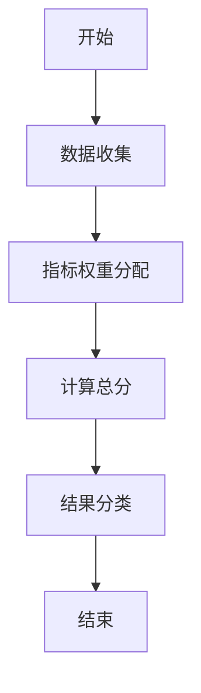
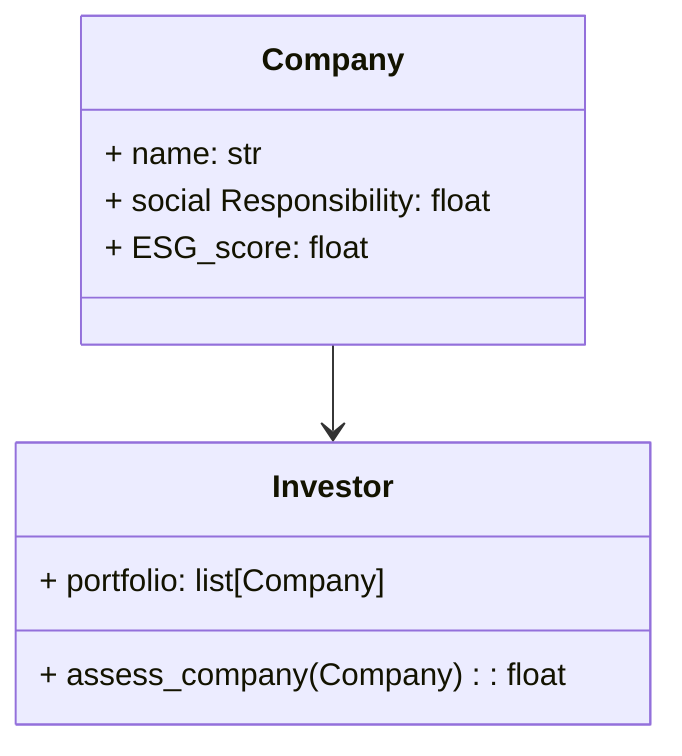
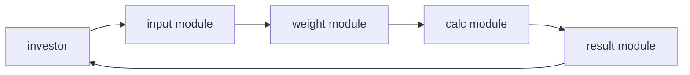

                 


# 彼得林奇如何评估公司的社会责任表现

## 关键词：彼得林奇、社会责任、公司治理、ESG、投资策略、可持续发展、评估模型

## 摘要：本文将介绍彼得·林奇如何评估公司的社会责任表现。我们将从背景介绍、核心概念、算法原理、数学模型、系统分析、项目实战到最佳实践等部分，逐步分析社会责任的表现及其评估方法。通过本文，读者将了解如何将社会责任纳入投资决策，以及如何利用彼得·林奇的方法进行评估。

---

## 第1章 引言

### 1.1 背景介绍

#### 1.1.1 社会责任的重要性
- 什么是社会责任？
- 为什么社会责任在投资中重要？

#### 1.1.2 彼得·林奇的背景与投资理念
- 彼得·林奇的简介
- 他的投资策略与社会责任的联系

#### 1.1.3 本书的目的
- 为什么评估社会责任表现重要
- 本书的结构与内容概述

---

## 第2章 社会责任的核心概念

### 2.1 核心概念

#### 2.1.1 环境（Environmental）
- 环境影响的定义
- 彼得·林奇的评估标准

#### 2.1.2 社会（Social）
- 员工福利与公平性
- 社区贡献

#### 2.1.3 治理（Governance）
- 公司治理结构
- 透明度与道德标准

### 2.2 彼得·林奇的评估方法

#### 2.2.1 投资理念的延伸
- 从财务表现到社会责任

#### 2.2.2 非财务指标的考量
- 社会责任指标的选择

#### 2.2.3 综合评估模型的构建
- 多因素模型的构建与应用

---

## 第3章 社会责任评估的核心概念与联系

### 3.1 核心概念原理

#### 3.1.1 ESG框架的详细解释
- ESG的定义与框架结构
- ESG在投资中的作用

#### 3.1.2 各维度的权重分配
- 环境、社会、治理的权重分配方法
- 彼得·林奇的权重分配策略

### 3.2 概念属性特征对比表格

#### 3.2.1 不同社会责任指标的对比分
- 环境、社会、治理指标的对比
- 彼得·林奇的评分标准

---

## 第4章 算法原理

### 4.1 社会责任评估算法原理

#### 4.1.1 算法步骤分解
- 数据收集
- 指标权重分配
- 计算总分
- 评估结果分类

#### 4.1.2 算法流程图


### 4.2 数学模型

#### 4.2.1 权重分配公式
$$ \text{权重}_i = \frac{\text{指标}_i}{\sum \text{指标}_j} $$

#### 4.2.2 总评分公式
$$ \text{总评分} = \sum (\text{指标}_i \times \text{权重}_i) $$

#### 4.2.3 评分等级划分
- 优秀：90分以上
- 良好：70-89分
- 一般：50-69分
- 不达标：50分以下

### 4.3 算法实现代码

#### 4.3.1 Python代码实现
```python
def calculate_social Responsibility_score(company_data):
    # 数据预处理
    # 计算各个指标的权重
    weights = company_data['weights'].sum()
    # 计算总评分
    score = sum(company_data['指标'] * weights)
    return score
```

---

## 第5章 系统分析

### 5.1 系统功能设计

#### 5.1.1 领域模型


#### 5.1.2 功能模块
- 数据输入模块
- 权重分配模块
- 评分计算模块
- 结果展示模块

### 5.2 系统架构设计

#### 5.2.1 系统架构图


### 5.3 系统接口设计

#### 5.3.1 输入接口
- 接收公司数据
- 设置权重

#### 5.3.2 输出接口
- 返回社会责任评分
- 显示结果

### 5.4 系统交互流程

#### 5.4.1 交互流程图


---

## 第6章 项目实战

### 6.1 环境安装

#### 6.1.1 Python环境安装
- 安装Python
- 安装必要的库（如pandas, numpy）

#### 6.1.2 数据获取
- 数据来源
- 数据预处理

### 6.2 核心实现代码

#### 6.2.1 权重分配代码
```python
import pandas as pd

# 数据加载
data = pd.read_csv('company_data.csv')
# 权重计算
weights = data['weights'].sum()
# 计算总分
score = data['指标'] * weights
score = score.sum()
print(f"社会责任评分为：{score}")
```

#### 6.2.2 评分结果展示
- 使用图表展示评分结果
- 生成报告

### 6.3 实际案例分析

#### 6.3.1 案例分析
- 具体公司的分析
- 评分结果与解释

#### 6.3.2 详细解读
- 如何选择公司
- 评分的关键因素

### 6.4 项目小结

#### 6.4.1 经验总结
- 成功的方面
- 可改进的地方

#### 6.4.2 项目工具
- 使用的工具与资源

---

## 第7章 最佳实践

### 7.1 小结

#### 7.1.1 核心观点总结
- 社会责任的重要性
- 彼得·林奇方法的有效性

### 7.2 注意事项

#### 7.2.1 数据收集的挑战
- 数据质量
- 数据来源的可靠性

#### 7.2.2 模型的局限性
- 评估模型的局限
- 如何克服这些局限

### 7.3 拓展阅读

#### 7.3.1 推荐书籍
- 《彼得·林奇的成功投资法则》
- 其他相关书籍

#### 7.3.2 相关资源
- 网站链接
- 论文推荐

---

## 第8章 结论

### 8.1 重要性再强调
- 社会责任的长期影响
- 投资者的责任

### 8.2 未来展望
- 持续关注社会责任
- 结合最新投资策略

---

## 作者：AI天才研究院/AI Genius Institute & 禅与计算机程序设计艺术 /Zen And The Art of Computer Programming

