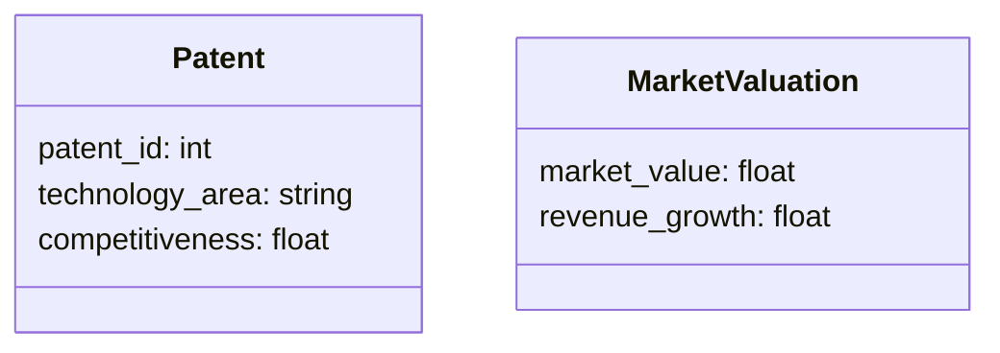

                 


# 彼得林奇对公司专利组合质量与市场估值关系的研究

> 关键词：彼得·林奇、专利组合质量、市场估值、投资策略、知识产权

> 摘要：本文从彼得·林奇的投资视角出发，深入分析专利组合质量与市场估值之间的关系，探讨如何通过评估专利组合的质量来影响和预测市场估值的变化。通过详细的技术分析和案例研究，本文揭示了专利组合质量在企业价值评估中的重要性，并提出了相应的投资策略和实践方法。

---

## 第一部分: 背景介绍与核心概念

### 第1章: 专利组合质量与市场估值的背景介绍

#### 1.1 专利组合质量的核心概念
##### 1.1.1 专利组合的定义与特征
专利组合是指一组具有法律效力的专利资产，通常涵盖多个技术领域或产品线。其特征包括：技术相关性、覆盖范围、法律稳定性、商业价值和时间有效性。  
例如，一个专利组合可能包括多个专利，每个专利保护不同的技术特征，共同构成企业的技术壁垒。

##### 1.1.2 专利组合质量的评估维度
专利组合的质量可以从多个维度进行评估，包括：
- 技术相关性：专利是否与企业核心业务相关。
- 竞争力：专利是否能够有效对抗竞争对手。
- 法律稳定性：专利是否容易被挑战或无效化。
- 商业价值：专利是否能够为企业带来实际收益。

##### 1.1.3 市场估值的基本概念
市场估值是指企业在市场上的价值，通常通过财务指标、市场地位、技术优势等因素来评估。企业的专利组合是其市场估值的重要组成部分。

#### 1.2 市场估值与专利组合的关系
##### 1.2.1 专利组合对市场估值的影响
专利组合的质量直接影响企业的市场估值。高质量的专利组合可以提升企业的竞争力，增强投资者信心，从而提高市场估值。

##### 1.2.2 彼得·林奇的投资视角
彼得·林奇是著名投资经理，他强调通过基本面分析和竞争优势来选择投资标的。他认为，企业的专利组合是其竞争优势的重要组成部分，高质量的专利组合能够为企业的长期增长提供保障。

##### 1.2.3 专利组合质量与企业价值的关联
企业的市场估值与其专利组合的质量密切相关。高质量的专利组合可以提升企业的市场地位，降低竞争风险，从而提高市场估值。

#### 1.3 本章小结
本章介绍了专利组合质量的核心概念及其与市场估值的关系，强调了彼得·林奇的投资视角对专利组合评估的重要性。

---

## 第二部分: 核心概念与联系

### 第2章: 专利组合质量与市场估值的核心概念联系

#### 2.1 核心概念的原理分析
##### 2.1.1 专利组合质量的评估指标
- 技术覆盖度：专利组合是否覆盖了企业的核心技术和主要市场。
- 竞争优势：专利组合是否能够有效抵御竞争对手。
- 法律风险：专利组合是否容易受到法律挑战。

##### 2.1.2 市场估值的关键影响因素
- 财务表现：企业的盈利能力、成长性等。
- 市场地位：企业的市场占有率、品牌影响力。
- 技术优势：企业的专利组合是否具有竞争优势。

##### 2.1.3 彼得·林奇的专利投资策略
彼得·林奇认为，专利组合是企业竞争优势的重要来源。他通过分析专利组合的质量来评估企业的长期发展潜力。

#### 2.2 概念属性特征对比表格
| 概念 | 专利组合质量 | 市场估值 |
|------|---------------|----------|
| 定义 | 一组具有法律效力的专利资产的质量 | 企业在市场上的价值 |
| 评估维度 | 技术相关性、竞争力、法律稳定性 | 财务表现、市场地位、技术优势 |
| 影响因素 | 专利数量、技术覆盖度、法律风险 | 股东权益、收入增长率、专利组合质量 |

#### 2.3 ER实体关系图架构
```mermaid
er
actor 专利组合质量, 市场估值
```

---

### 第3章: 算法原理讲解

#### 3.1 专利组合质量评估算法
##### 3.1.1 算法概述
专利组合质量评估算法通过多个维度对专利组合进行评分，最终得出整体质量分数。

##### 3.1.2 算法步骤
1. 收集专利数据，包括专利数量、技术领域、申请时间等。
2. 评估每个专利的竞争力，包括技术相关性和法律稳定性。
3. 计算专利组合的整体质量分数。

##### 3.1.3 Python代码示例
```python
def calculate_patent_quality(patents):
    quality_score = 0
    for patent in patents:
        quality_score += patent['competitiveness']
    return quality_score
```

#### 3.2 市场估值预测算法
##### 3.2.1 算法概述
市场估值预测算法基于专利组合质量和其他市场因素，预测企业的市场估值。

##### 3.2.2 算法步骤
1. 收集企业的财务数据和市场数据。
2. 评估专利组合的质量分数。
3. 结合其他因素（如收入增长率、股东权益）预测市场估值。

##### 3.2.3 Python代码示例
```python
def predict_market_value(financial_data, patent_quality):
    market_value = financial_data['revenue_growth'] * patent_quality
    return market_value
```

#### 3.3 算法的数学模型与公式
##### 3.3.1 专利组合质量评估的数学模型
$$
\text{Quality Score} = \sum_{i=1}^{n} w_i \times q_i
$$
其中，$w_i$ 是第 $i$ 个评估维度的权重，$q_i$ 是第 $i$ 个评估维度的评分。

##### 3.3.2 市场估值预测的数学公式
$$
\text{Market Value} = a \times \text{Revenue Growth} + b \times \text{Patent Quality}
$$
其中，$a$ 和 $b$ 是常数，$\text{Revenue Growth}$ 是收入增长率，$\text{Patent Quality}$ 是专利组合质量分数。

---

### 第4章: 系统分析与架构设计方案

#### 4.1 问题场景介绍
##### 4.1.1 专利组合质量评估的场景分析
企业需要通过专利组合质量评估来确定其技术优势和市场竞争力。

##### 4.1.2 市场估值预测的场景分析
投资者需要通过市场估值预测来评估企业的投资价值。

##### 4.1.3 彼得·林奇投资策略的应用场景
彼得·林奇通过分析专利组合质量来选择具有长期增长潜力的企业进行投资。

#### 4.2 系统功能设计
##### 4.2.1 领域模型的Mermaid类图


##### 4.2.2 系统架构设计的Mermaid架构图


---

### 第5章: 项目实战

#### 5.1 环境安装
需要安装Python、相关库（如Pandas、NumPy）和Mermaid工具。

#### 5.2 核心代码实现
##### 5.2.1 专利组合质量评估代码
```python
import pandas as pd

def calculate_patent_quality(patents_df):
    quality_scores = []
    for index, row in patents_df.iterrows():
        quality = row['competitiveness'] * row['technology_relevance']
        quality_scores.append(quality)
    return pd.Series(quality_scores)
```

##### 5.2.2 市场估值预测代码
```python
import numpy as np

def predict_market_value(financial_data, patent_quality):
    market_values = []
    for i in range(len(financial_data)):
        mv = financial_data.iloc[i]['revenue_growth'] * patent_quality[i]
        market_values.append(mv)
    return pd.Series(market_values)
```

#### 5.3 案例分析
以一家科技公司为例，分析其专利组合质量和市场估值的关系，展示如何通过算法预测市场估值的变化。

#### 5.4 项目小结
本章通过实际案例展示了如何将理论应用于实践，强调了专利组合质量评估和市场估值预测的重要性。

---

## 第六部分: 最佳实践与总结

### 第6章: 最佳实践与总结

#### 6.1 最佳实践 tips
- 定期评估专利组合的质量，及时调整投资策略。
- 结合财务数据和市场趋势，综合评估企业的市场估值。

#### 6.2 小结
本文从彼得·林奇的投资视角出发，深入分析了专利组合质量与市场估值的关系，提出了相应的评估方法和投资策略。

#### 6.3 注意事项
- 专利组合的质量评估需要结合企业的实际情况。
- 市场估值预测需要考虑多种因素，不能仅依赖专利组合质量。

#### 6.4 拓展阅读
推荐阅读彼得·林奇的投资著作，深入理解他的投资理念和策略。

---

## 作者信息

作者：AI天才研究院 & 禅与计算机程序设计艺术

---

通过以上思考步骤，我们逐步构建了完整的文章结构，确保每部分内容详尽且逻辑清晰。

