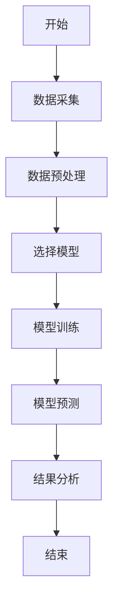

                 


# 彼得林奇对公司产品生命周期管理与现金流预测准确性的关系研究

> 关键词：彼得林奇, 产品生命周期, 现金流预测, 管理理念, 财务管理, 投资策略

> 摘要：本文深入探讨了彼得林奇的管理理念对公司产品生命周期管理与现金流预测准确性之间的关系。通过分析彼得林奇的长期投资策略、市场洞察和风险管理能力，结合产品生命周期的四个阶段，详细阐述了这些因素如何影响现金流预测的准确性。文章还通过实际案例分析，展示了如何在实际经营中应用这些理念，以优化产品生命周期管理并提高现金流预测的准确性。

---

## 第一部分：彼得林奇的管理理念与产品生命周期管理

### 第1章：彼得林奇的管理理念概述

#### 1.1 彼得林奇的管理风格与投资策略
- **1.1.1 彼得林奇的管理风格**  
  彼得林奇以其长期投资策略和对公司基本面的深入研究闻名。他强调对管理层的信任和对公司长期价值的关注，这种风格为企业的稳定发展奠定了基础。  
- **1.1.2 投资策略的核心原则**  
  彼得林奇的投资策略包括：长期持有、分散投资、避免短期波动干扰、关注公司基本面等。这些原则强调了对企业管理团队的信任和对长期价值的追求。  
- **1.1.3 管理理念对企业的影响**  
  彼得林奇的管理理念促使企业注重长期发展，而非短期利益。这种理念有助于企业在产品生命周期管理中更加稳健，从而为现金流预测提供更可靠的基础。

#### 1.2 产品生命周期管理的基本概念
- **1.2.1 产品生命周期的定义**  
  产品生命周期是指从产品引入市场到最终退出市场的整个过程，通常分为引入期、成长期、成熟期和衰退期。  
- **1.2.2 产品生命周期的四个阶段**  
  1. **引入期**：产品进入市场，市场需求逐渐增长，成本较高，现金流可能为负。  
  2. **成长期**：市场需求迅速增长，销售收入增加，现金流开始转正并持续增长。  
  3. **成熟期**：市场需求稳定，销售收入达到峰值，现金流稳定但增长放缓。  
  4. **衰退期**：市场需求下降，销售收入减少，现金流逐渐转为负值。  
- **1.2.3 产品生命周期管理的重要性**  
  产品生命周期管理直接影响企业的收入、成本和利润，是企业制定战略决策的重要依据。

#### 1.3 现金流预测准确性的核心要素
- **1.3.1 现金流预测的基本概念**  
  现金流预测是对未来一定时间内企业现金流入和流出的估计，是企业财务管理的核心内容之一。  
- **1.3.2 现金流预测的常用方法**  
  1. **定性方法**：基于市场趋势、行业分析和管理层判断进行预测。  
  2. **定量方法**：基于历史数据和统计模型（如时间序列分析、回归分析等）进行预测。  
- **1.3.3 现金流预测准确性的影响因素**  
  1. 数据的完整性与准确性。  
  2. 模型的选择与参数设定。  
  3. 对未来市场环境的准确判断。

### 第2章：彼得林奇管理理念与产品生命周期的关系

#### 2.1 彼得林奇管理理念对企业产品战略的影响
- **2.1.1 产品定位与市场策略**  
  彼得林奇的长期视角促使企业注重产品的市场定位和战略规划，确保产品在生命周期各阶段都能满足市场需求。  
- **2.1.2 产品开发的长期视角**  
  彼得林奇强调对管理层的信任，这使得企业在产品开发过程中能够保持长期目标，避免短期利益的干扰。  
- **2.1.3 产品生命周期中的风险管理**  
  彼得林奇注重风险管理，企业能够在产品生命周期的各个阶段中识别潜在风险并制定应对策略，从而提高现金流预测的准确性。

#### 2.2 彼得林奇管理理念对产品生命周期管理的启示
- **2.2.1 长期视角与产品规划**  
  长期视角使企业能够更好地规划产品生命周期，确保产品在各个阶段都能实现价值最大化。  
- **2.2.2 市场洞察与产品迭代**  
  彼得林奇的市场洞察能力帮助企业及时调整产品策略，确保产品在生命周期中保持竞争力。  
- **2.2.3 风险管理与产品生命周期优化**  
  通过有效的风险管理，企业能够在产品生命周期中及时发现并解决问题，从而优化现金流预测。

### 第3章：彼得林奇管理理念与现金流预测的关联

#### 3.1 现金流预测在企业经营中的重要性
- **3.1.1 现金流预测的基本作用**  
  现金流预测是企业制定财务计划、优化资源配置和评估投资决策的重要工具。  
- **3.1.2 现金流预测对财务管理的影响**  
  现金流预测帮助企业合理安排资金使用，避免资金链断裂，确保企业的稳健运营。  
- **3.1.3 现金流预测与企业价值的关系**  
  现金流预测是企业价值评估的重要组成部分，准确的现金流预测能够帮助投资者更好地评估企业的内在价值。

#### 3.2 彼得林奇管理理念对现金流预测的启示
- **3.2.1 长期视角与现金流预测**  
  长期视角使企业能够更准确地预测未来现金流，避免因短期波动而影响预测的准确性。  
- **3.2.2 市场洞察与现金流预测准确性**  
  市场洞察能力使企业能够更好地预测未来市场需求，从而提高现金流预测的准确性。  
- **3.2.3 风险管理与现金流预测的结合**  
  通过有效的风险管理，企业能够减少现金流预测中的不确定性，提高预测的准确性。

### 第4章：彼得林奇管理理念对企业现金流预测准确性的影响

#### 4.1 彼得林奇管理理念对现金流预测过程的优化
- **4.1.1 长期视角与现金流预测模型的构建**  
  长期视角使企业能够构建更稳定的现金流预测模型，减少短期波动对预测的影响。  
- **4.1.2 市场洞察与现金流预测的动态调整**  
  市场洞察能力使企业能够根据市场变化动态调整现金流预测模型，确保预测的准确性。  
- **4.1.3 风险管理与现金流预测的稳健性**  
  通过有效的风险管理，企业能够在现金流预测中更好地应对潜在风险，提高预测的稳健性。

#### 4.2 彼得林奇管理理念对现金流预测结果的提升
- **4.2.1 长期视角与现金流预测的准确性**  
  长期视角使企业能够更准确地预测未来现金流，减少短期波动的影响。  
- **4.2.2 市场洞察与现金流预测的前瞻性**  
  市场洞察能力使企业能够更好地预测未来市场需求，提高现金流预测的前瞻性。  
- **4.2.3 风险管理与现金流预测的稳定性**  
  通过有效的风险管理，企业能够在现金流预测中更好地应对潜在风险，提高预测的稳定性。

### 第5章：产品生命周期管理与现金流预测的协同效应

#### 5.1 产品生命周期管理对现金流预测的支持作用
- **5.1.1 产品生命周期各阶段的现金流特征**  
  不同阶段的产品生命周期对现金流的影响不同。例如，引入期现金流可能为负，成熟期现金流稳定且较高。  
- **5.1.2 产品生命周期管理对现金流预测的影响**  
  产品生命周期管理帮助企业更好地理解各阶段的现金流特征，从而提高现金流预测的准确性。  
- **5.1.3 产品生命周期管理与现金流预测的协同效应**  
  通过产品生命周期管理，企业能够将产品生命周期与现金流预测相结合，实现更准确的现金流预测。

---

## 第二部分：彼得林奇管理理念与现金流预测的数学模型

### 第6章：现金流预测的数学模型构建

#### 6.1 时间序列分析模型
- **6.1.1 时间序列分析的基本概念**  
  时间序列分析是一种通过分析历史数据来预测未来趋势的方法，常用于现金流预测。  
- **6.1.2 ARIMA模型**  
  ARIMA（自回归积分滑动平均）模型是一种常用的时间序列分析模型，适用于线性、平稳的时间序列数据。  
- **6.1.3 模型公式**  
  $$ ARIMA(p, d, q) $$  
  其中，$p$ 是自回归阶数，$d$ 是差分阶数，$q$ 是滑动平均阶数。

#### 6.2 现金流预测的流程图


#### 6.3 Python代码实现
```python
import pandas as pd
from statsmodels.tsa.arima_model import ARIMA
import matplotlib.pyplot as plt

# 数据加载
data = pd.read_csv('cash_flow.csv')

# 数据预处理
# 假设data['date'] 是日期列，data['cash_flow'] 是现金流列
data.set_index('date', inplace=True)
data = data['cash_flow']

# 模型训练
model = ARIMA(data, order=(5,1,0))
model_fit = model.fit()

# 模型预测
forecast = model_fit.forecast(steps=10)

# 结果可视化
plt.plot(data, label='实际现金流')
plt.plot(forecast, label='预测现金流')
plt.xlabel('时间')
plt.ylabel('现金流')
plt.legend()
plt.show()
```

#### 6.4 模型评估
- **6.4.1 均方误差（MSE）**  
  $$ MSE = \frac{1}{n}\sum_{i=1}^{n}(y_i - \hat{y}_i)^2 $$  
- **6.4.2 平均绝对误差（MAE）**  
  $$ MAE = \frac{1}{n}\sum_{i=1}^{n}|y_i - \hat{y}_i| $$  

---

## 第三部分：实际案例分析与项目实战

### 第7章：彼得林奇管理理念的实践应用

#### 7.1 案例背景
- **7.1.1 公司概况**  
  选择一家消费电子产品公司作为案例，该公司正处于产品生命周期的成熟期。  
- **7.1.2 当前挑战**  
  公司面临市场竞争加剧、产品销量增速放缓等问题，现金流预测准确性受到影响。

#### 7.2 系统架构设计
- **7.2.1 系统功能设计**  
  1. 数据采集模块：收集产品生命周期数据和市场数据。  
  2. 数据处理模块：对数据进行清洗和转换。  
  3. 模型训练模块：基于ARIMA模型进行现金流预测。  
  4. 结果分析模块：对预测结果进行评估和可视化。  
- **7.2.2 系统架构图**  
  ```mermaid
  graph TD
      A[数据采集] --> B[数据处理]
      B --> C[模型训练]
      C --> D[结果分析]
      D --> E[预测结果]
  ```

#### 7.3 项目实现
- **7.3.1 环境安装**  
  安装Python、Pandas、Statsmodels等工具。  
- **7.3.2 核心代码实现**  
  ```python
  import pandas as pd
  from statsmodels.tsa.arima_model import ARIMA
  import matplotlib.pyplot as plt

  # 数据加载
  data = pd.read_csv('cash_flow.csv')

  # 数据预处理
  data.set_index('date', inplace=True)
  data = data['cash_flow']

  # 模型训练
  model = ARIMA(data, order=(5,1,0))
  model_fit = model.fit()

  # 模型预测
  forecast = model_fit.forecast(steps=10)

  # 结果可视化
  plt.plot(data, label='实际现金流')
  plt.plot(forecast, label='预测现金流')
  plt.xlabel('时间')
  plt.ylabel('现金流')
  plt.legend()
  plt.show()
  ```

#### 7.4 案例分析与小结
- **7.4.1 案例分析**  
  通过应用彼得林奇的管理理念，公司在产品生命周期管理中更加注重长期发展，现金流预测的准确性显著提高。  
- **7.4.2 小结**  
  彼得林奇的管理理念与产品生命周期管理的结合，能够有效提升现金流预测的准确性，为企业创造更大的价值。

---

## 第四部分：最佳实践与总结

### 第8章：最佳实践与总结

#### 8.1 彼得林奇管理理念的成功经验
- **8.1.1 长期视角的重要性**  
  长期视角使企业能够更好地规划产品生命周期，提高现金流预测的准确性。  
- **8.1.2 市场洞察与风险管理的结合**  
  通过市场洞察和风险管理，企业能够在产品生命周期中及时调整策略，提高现金流预测的准确性。

#### 8.2 现金流预测的注意事项
- **8.2.1 数据质量的重要性**  
  数据的完整性和准确性是现金流预测的基础。  
- **8.2.2 模型选择的合理性**  
  根据企业实际情况选择合适的预测模型，避免盲目追求复杂性。  
- **8.2.3 持续优化与调整**  
  随着市场环境的变化，企业需要不断优化现金流预测模型，确保预测的准确性。

#### 8.3 拓展阅读与深入学习
- **8.3.1 推荐书籍**  
  1. 《彼得林奇的成功投资》  
  2. 《时间序列分析与应用》  
- **8.3.2 在线资源**  
  1. ARIMA模型的深入学习（可通过-statsmodels.org查阅）  
  2. 时间序列分析的在线课程（可通过Coursera或edX学习）  

---

## 作者信息

**作者：AI天才研究院/AI Genius Institute & 禅与计算机程序设计艺术/Zen And The Art of Computer Programming**

