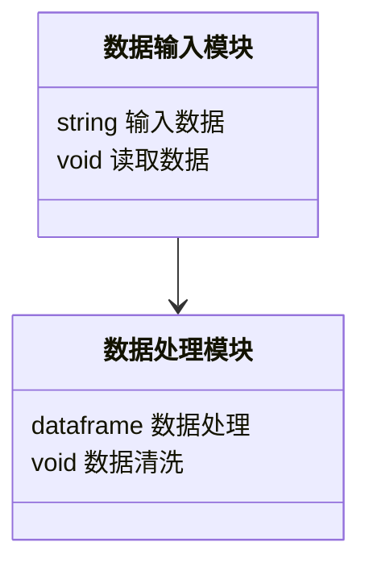
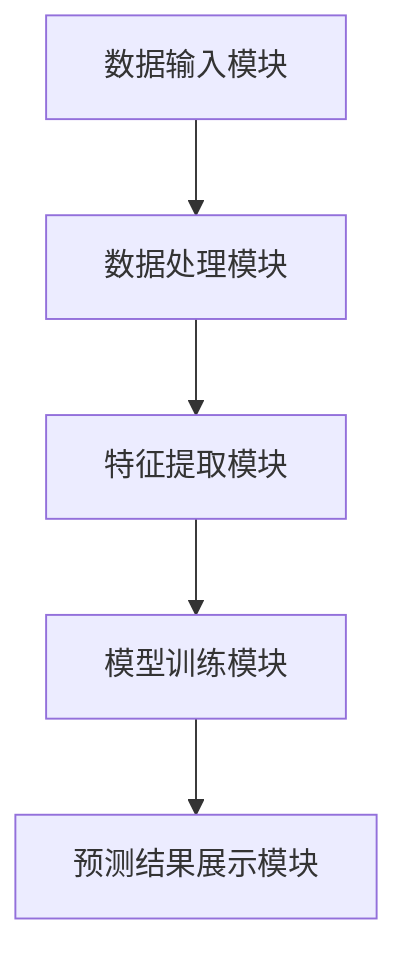
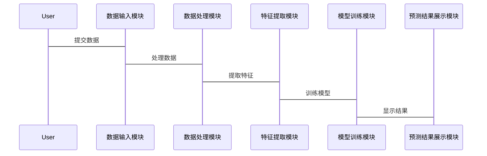

                 


# 彼得林奇对公司产品生命周期管理与财务表现关系的研究

> 关键词：彼得林奇，产品生命周期管理，财务表现，投资理念，风险管理

> 摘要：本文探讨彼得林奇的投资理念与公司产品生命周期管理的结合，分析产品生命周期对财务表现的影响，提出基于机器学习的预测模型，并通过系统设计和项目实战验证其有效性。

---

# 第一部分: 背景介绍与核心概念

## 第1章: 问题背景与问题描述

### 1.1 问题背景

#### 1.1.1 产品生命周期管理的重要性
产品生命周期管理（Product Lifecycle Management, PLM）是企业管理和优化产品从设计、生产到退市的全过程。有效的PLM能够帮助企业优化资源分配、降低成本、提高效率，从而提升整体竞争力。

#### 1.1.2 彼得林奇投资理念与企业财务管理的结合
彼得林奇作为投资大师，强调长期投资和基本面分析，注重企业的盈利能力和财务健康。将彼得林奇的投资理念应用于企业财务管理，可以帮助企业在产品生命周期的各个阶段做出更优的财务决策。

#### 1.1.3 产品生命周期管理与财务表现的关系
产品生命周期的不同阶段（引入期、成长期、成熟期、衰退期）对企业的财务表现有直接影响。通过科学的PLM，企业可以在不同阶段优化财务资源配置，最大化股东价值。

---

### 1.2 问题描述

#### 1.2.1 产品生命周期管理的核心问题
企业在不同生命周期阶段面临不同的财务挑战：引入期需要大量投资，成长期需要快速回笼资金，成熟期需要优化成本，衰退期需要及时退出。

#### 1.2.2 财务表现的关键影响因素
收入、成本、利润、现金流、资产和负债等财务指标在不同生命周期阶段的表现直接关系到企业的财务健康和投资价值。

#### 1.2.3 问题解决的必要性与紧迫性
通过分析产品生命周期与财务表现的关系，企业可以制定更优的财务策略，提升投资回报率，降低经营风险。

---

### 1.3 问题解决与边界

#### 1.3.1 问题解决的思路与方法
结合彼得林奇的投资理念，从财务角度分析产品生命周期的各个阶段，建立财务模型，预测财务表现。

#### 1.3.2 问题的边界与外延
本文主要关注企业级的产品生命周期管理，不涉及消费者层面的分析。财务表现的分析基于企业的财务报表数据。

#### 1.3.3 核心概念的结构与组成
产品生命周期管理与财务表现的分析框架包括：产品生命周期阶段、财务指标、财务策略。

---

## 第2章: 核心概念与联系

### 2.1 核心概念原理

#### 2.1.1 产品生命周期管理的定义与特点
产品生命周期包括引入期、成长期、成熟期和衰退期。每个阶段都有不同的财务特征和管理重点。

#### 2.1.2 财务表现的核心指标与分析方法
关键财务指标包括收入、利润、现金流、资产和负债等。通过这些指标可以评估企业在不同生命周期阶段的财务健康状况。

#### 2.1.3 产品生命周期与财务表现的关联性
产品生命周期的不同阶段直接影响企业的收入、成本和利润，进而影响企业的财务表现。

---

### 2.2 核心概念属性特征对比

| 生命周期阶段 | 财务表现特征 | 关键财务指标 |
|--------------|--------------|--------------|
| 引入期       | 高成本，低收入 | 产品开发成本，研发投入 |
| 成长期       | 收入增长，利润上升 | 销售收入，净利润 |
| 成熟期       | 收入稳定，成本优化 | 毛利率，运营成本 |
| 衰退期       | 收入下降，资产减值 | 资产减值损失，现金流 |

---

### 2.3 ER实体关系图架构

```mermaid
er
  actor(投资者)
  actor(公司管理层)
  entity(产品生命周期)
  entity(财务表现)
  entity(投资决策)
  entity(市场反馈)
  entity(风险管理)
  entity(收益与成本)
  entity(利润与亏损)
  entity(资产与负债)
  entity(现金流)
  entity(股东价值)
  entity(投资回报率)
  entity(净现值)
  entity(内部收益率)
  entity(风险调整后收益)
  
  投资者 --> 投资决策
  公司管理层 --> 产品生命周期
  市场反馈 --> 风险管理
  产品生命周期 --> 财务表现
  财务表现 --> 股东价值
  投资决策 --> 投资回报率
```

---

# 第二部分: 算法原理讲解

## 第3章: 算法原理

### 3.1 数据预处理

#### 3.1.1 数据来源与清洗
数据来源包括企业财务报表和产品生命周期数据。清洗数据，处理缺失值和异常值。

#### 3.1.2 数据转换与特征提取
将原始数据转换为模型可识别的特征，如收入增长率、利润率变化等。

```python
import pandas as pd
import numpy as np

# 假设df是数据框
df = df.dropna()  # 删除缺失值
df['收入增长率'] = (df['收入'] - df['收入'].shift(1)) / df['收入'].shift(1)
```

---

### 3.2 模型选择与训练

#### 3.2.1 机器学习模型
选择适合的模型，如线性回归、随机森林或XGBoost。

#### 3.2.2 模型训练
使用训练数据训练模型，调整参数优化性能。

```python
from sklearn.ensemble import RandomForestRegressor
from sklearn.metrics import mean_squared_error

model = RandomForestRegressor(n_estimators=100, random_state=42)
model.fit(X_train, y_train)
```

---

### 3.3 模型评估与优化

#### 3.3.1 模型评估
使用测试数据评估模型性能，计算均方误差（MSE）和R²值。

#### 3.3.2 超参数优化
使用网格搜索优化模型参数，提高预测准确性。

```python
from sklearn.model_selection import GridSearchCV

param_grid = {'n_estimators': [100, 200], 'max_depth': [None, 10]}
grid_search = GridSearchCV(model, param_grid, cv=5)
grid_search.fit(X_train, y_train)
best_model = grid_search.best_estimator_
```

---

### 3.4 实验结果与分析

#### 3.4.1 预测结果展示
将模型预测结果与实际数据对比，分析误差。

#### 3.4.2 结果分析
通过分析预测结果，验证模型的有效性，并提出改进建议。

---

# 第三部分: 系统分析与架构设计

## 第4章: 系统分析与架构设计方案

### 4.1 问题场景介绍

#### 4.1.1 项目介绍
本项目旨在构建一个基于机器学习的产品生命周期与财务表现分析系统。

---

### 4.2 系统功能设计

#### 4.2.1 数据输入模块
用户输入企业财务数据和产品生命周期数据。



---

#### 4.2.2 数据处理模块
清洗和转换数据，提取特征。

---

#### 4.2.3 特征提取模块
从数据中提取有用的特征，用于模型训练。

---

#### 4.2.4 模型训练模块
使用训练数据训练机器学习模型。

---

#### 4.2.5 预测结果展示模块
将模型预测结果以可视化方式展示。

---

### 4.3 系统架构设计



---

### 4.4 系统交互设计



---

# 第四部分: 项目实战

## 第5章: 项目实战

### 5.1 环境安装与配置

#### 5.1.1 安装必要的库
安装pandas、numpy、scikit-learn、xgboost等库。

```bash
pip install pandas numpy scikit-learn xgboost
```

---

### 5.2 核心代码实现

#### 5.2.1 数据处理代码

```python
import pandas as pd
import numpy as np
from sklearn.model_selection import train_test_split
from sklearn.ensemble import RandomForestRegressor
from sklearn.metrics import mean_squared_error

# 加载数据
df = pd.read_csv('data.csv')

# 数据清洗
df = df.dropna()

# 特征工程
X = df[['收入', '成本', '利润']]
y = df['投资回报率']

# 划分数据集
X_train, X_test, y_train, y_test = train_test_split(X, y, test_size=0.2, random_state=42)

# 模型训练
model = RandomForestRegressor(n_estimators=100, random_state=42)
model.fit(X_train, y_train)

# 模型预测
y_pred = model.predict(X_test)

# 评估模型
mse = mean_squared_error(y_test, y_pred)
print(f'Mean Squared Error: {mse}')
```

---

### 5.3 实际案例分析与解读

#### 5.3.1 数据集介绍
使用某公司过去5年的财务数据和产品生命周期数据，分析其财务表现。

#### 5.3.2 模型预测结果
通过模型预测不同生命周期阶段的财务表现，为企业决策提供支持。

---

### 5.4 项目小结

#### 5.4.1 项目成果
构建了一个基于机器学习的产品生命周期与财务表现分析系统，能够有效预测财务表现。

#### 5.4.2 经验总结
数据预处理和特征提取对模型性能影响较大，选择合适的模型和优化参数是关键。

---

# 第五部分: 总结与展望

## 第6章: 总结与展望

### 6.1 最佳实践

#### 6.1.1 持续监控模型性能
定期更新数据和模型，保持模型的准确性。

#### 6.1.2 结合行业知识
在模型中加入行业特定特征，提高预测的准确性。

#### 6.1.3 优化特征提取
通过深入分析业务，提取更有价值的特征。

---

### 6.2 小结

本文通过分析彼得林奇的投资理念，结合产品生命周期管理，构建了一个预测模型，帮助企业优化财务表现。

---

### 6.3 注意事项

- 数据质量是模型准确性的基础，需谨慎处理数据。
- 模型的解释性很重要，需关注特征的重要性。
- 在实际应用中，需结合企业实际情况调整模型。

---

### 6.4 拓展阅读

- 《彼得林奇的成功投资》
- 《企业产品生命周期管理》
- 《机器学习实战》

---

# 作者：AI天才研究院/AI Genius Institute & 禅与计算机程序设计艺术 /Zen And The Art of Computer Programming

---

感谢您的阅读！如需进一步探讨或获取代码，请随时联系。

