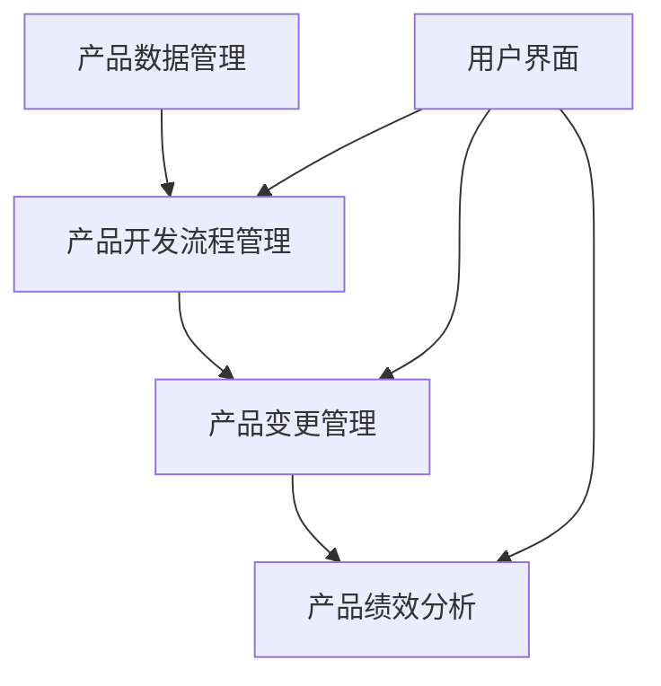
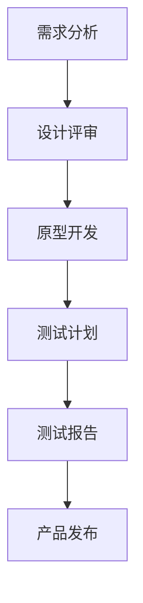
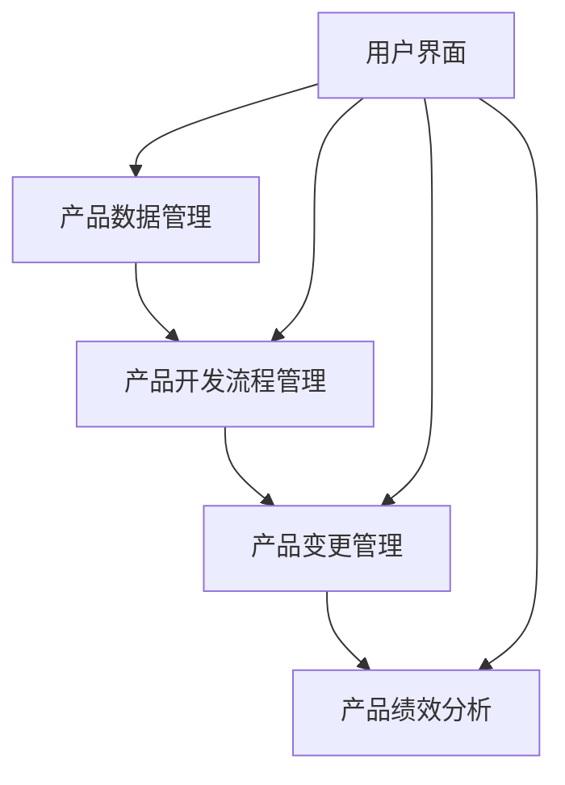

                 

# 彼得林奇对公司产品生命周期管理能力的评估

> 关键词：产品生命周期管理（PLM）、彼得林奇、投资评估、系统架构、能力评估

> 摘要：本文从彼得林奇的投资视角出发，分析了产品生命周期管理（PLM）的核心概念、评估指标、系统架构设计及实际应用案例，探讨了如何通过PLM能力的评估来提升企业的产品竞争力和投资价值。

---

## 第1章: 产品生命周期管理（PLM）的核心概念

### 1.1 产品生命周期管理的定义与背景

#### 1.1.1 产品生命周期管理的定义
产品生命周期管理（Product Lifecycle Management，简称PLM）是指从产品构思、设计、生产、销售到退市的全生命周期中，对产品相关的数据、流程和资源进行系统化管理的一种管理模式。它涵盖了产品的整个生命周期，旨在优化资源利用、提高效率、降低风险并提升客户满意度。

#### 1.1.2 产品生命周期管理的重要性
在现代企业中，PLM的重要性体现在以下几个方面：
- **提高效率**：通过系统化管理，减少重复劳动，提高产品开发和生产的效率。
- **降低风险**：通过全面监控和记录产品生命周期中的关键节点，降低产品缺陷和质量问题的发生。
- **提升竞争力**：通过快速响应市场变化和客户需求，提升企业的市场竞争力。
- **降低成本**：通过优化资源分配和流程管理，降低企业的运营成本。

#### 1.1.3 产品生命周期管理的核心要素
产品生命周期管理的核心要素包括：
1. **产品数据管理**：对产品的所有数据（如设计图纸、技术文档、生产参数等）进行统一管理和版本控制。
2. **产品开发流程管理**：规范产品开发的流程，确保每个阶段的顺利衔接。
3. **产品变更管理**：对产品在生命周期中的变更进行记录、评估和管理。
4. **产品绩效分析**：通过对产品在市场中的表现进行分析，为后续的产品开发和改进提供数据支持。

### 1.2 产品生命周期管理的演进与发展趋势

#### 1.2.1 从传统制造业到现代PLM的演变
传统的制造业中，产品管理往往依赖人工记录和管理，效率低下且容易出错。随着信息技术的发展，PLM逐渐从手工管理向数字化、智能化方向演变。现代PLM已经融入了大数据、人工智能和物联网等先进技术，能够更高效地管理产品的全生命周期。

#### 1.2.2 数字化与智能化对PLM的影响
数字化和智能化技术的应用极大地推动了PLM的发展。例如：
- **大数据分析**：通过对海量数据的分析，帮助企业更准确地预测市场需求和产品趋势。
- **人工智能**：利用AI技术优化产品设计和生产流程，提高效率和质量。
- **物联网（IoT）**：通过物联网技术实时监控产品的运行状态，及时发现和解决问题。

#### 1.2.3 全球化背景下的PLM挑战
在全球化背景下，企业需要面对更复杂的市场环境和供应链管理。PLM需要具备跨地域、跨部门的协作能力，能够支持全球范围内的产品开发和管理。

### 1.3 彼得林奇的投资理念与PLM的联系

#### 1.3.1 彼得林奇的投资策略简介
彼得·林奇是美国著名的投资专家，他的投资策略以“基本面分析”为核心，注重企业的财务状况、市场地位、管理团队和竞争优势。他认为，企业的产品创新能力、市场适应能力和运营效率是决定企业价值的重要因素。

#### 1.3.2 产品生命周期管理能力对企业价值的影响
在彼得林奇看来，企业的产品生命周期管理能力直接影响其市场竞争力和投资价值。优秀的PLM能力能够帮助企业：
- 快速响应市场需求，推出符合消费者需求的产品。
- 优化产品开发流程，降低研发成本。
- 提高产品质量，降低售后成本。
- 建立竞争优势，提升企业的市场地位。

#### 1.3.3 投资视角下的PLM评估维度
从投资视角来看，评估企业的PLM能力需要关注以下几个维度：
1. **产品开发效率**：企业是否能够高效地完成产品开发，从概念到量产的时间是否合理。
2. **产品变更响应速度**：企业是否能够快速响应市场变化，及时调整产品设计和生产计划。
3. **产品数据完整性**：企业是否具备完善的产品数据管理系统，确保数据的准确性和安全性。
4. **产品生命周期透明度**：企业是否能够清晰地记录和监控产品生命周期中的关键节点，确保信息的透明化和可追溯性。

---

## 第2章: 产品生命周期管理的核心要素与系统架构

### 2.1 产品生命周期的四个关键阶段

#### 2.1.1 概念阶段：从创意到立项
在概念阶段，企业需要对市场需求进行分析，明确产品的目标用户、功能需求和市场定位。这一阶段的关键是确定产品的可行性，为后续开发奠定基础。

#### 2.1.2 开发阶段：从设计到测试
在开发阶段，企业需要进行产品设计、原型制作和测试。这一阶段的目标是确保产品的功能和质量符合预期。

#### 2.1.3 生产阶段：从量产到交付
在生产阶段，企业需要组织生产、供应链管理和质量控制。这一阶段的目标是确保产品能够按时、按质、按量交付给客户。

#### 2.1.4 维护阶段：从支持到退市
在维护阶段，企业需要对产品进行售后服务、技术支持和市场反馈收集。这一阶段的目标是延长产品的生命周期，收集数据为后续产品开发提供参考。

### 2.2 产品生命周期管理系统的功能模块

#### 2.2.1 产品数据管理模块
产品数据管理模块负责对产品的所有数据进行统一管理，包括设计图纸、技术文档、生产参数等。它支持数据的版本控制、权限管理和数据检索。

#### 2.2.2 产品开发流程管理模块
产品开发流程管理模块用于规范和监控产品开发的流程，包括需求分析、设计评审、测试计划等。它确保开发团队按照既定流程高效推进项目。

#### 2.2.3 产品变更管理模块
产品变更管理模块用于记录和管理产品生命周期中的变更请求，包括需求变更、设计变更和生产变更。它确保变更的透明性和可追溯性。

#### 2.2.4 产品绩效分析模块
产品绩效分析模块通过对市场数据、销售数据和客户反馈的分析，评估产品的市场表现和用户满意度。它为后续的产品优化和开发提供数据支持。

### 2.3 产品生命周期管理系统的架构设计

#### 2.3.1 系统整体架构图

#### 2.3.2 数据流与业务流程图

#### 2.3.3 系统模块间的交互关系

---

## 第3章: 产品生命周期管理能力的评估指标与方法

### 3.1 产品生命周期管理能力的核心评估维度

#### 3.1.1 产品开发效率
产品开发效率是指企业在产品开发阶段完成任务的速度和质量。评估指标包括开发周期、开发成本和开发质量。

#### 3.1.2 产品变更响应速度
产品变更响应速度是指企业在产品生命周期中对变更请求的响应速度和效率。评估指标包括变更处理时间、变更成功率和变更成本。

#### 3.1.3 产品数据完整性
产品数据完整性是指企业在产品生命周期中对数据的准确性和完整性管理能力。评估指标包括数据准确性、数据完整性、数据安全性。

#### 3.1.4 产品生命周期透明度
产品生命周期透明度是指企业在产品生命周期中的关键节点和信息的透明化程度。评估指标包括信息透明度、过程透明度和决策透明度。

### 3.2 产品生命周期管理能力的评估框架

#### 3.2.1 评估框架的构建逻辑
评估框架的构建逻辑包括以下几个步骤：
1. **确定评估目标**：明确评估的目的和范围。
2. **选择评估指标**：根据目标选择合适的评估指标。
3. **设计评估方法**：制定具体的评估方法和流程。
4. **实施评估**：对企业的PLM能力进行实际评估。
5. **分析结果**：根据评估结果提出改进建议。

#### 3.2.2 评估指标的权重分配
评估指标的权重分配需要根据企业的实际情况和评估目标来确定。通常，权重分配可以采用层次分析法（AHP）进行。

#### 3.2.3 评估方法的优劣势对比
评估方法的优劣势对比可以通过制作对比表格来展示，例如：

| 评估方法 | 优势 | 劣势 |
|----------|------|------|
| 层次分析法（AHP） | 能够综合考虑各指标的权重，结果具有较高的科学性 | 计算过程较为复杂，需要较多的主观判断 |
| 指数法 | 计算简单，易于理解和应用 | 不能充分体现各指标的重要性差异 |
| 标杆法 | 能够提供明确的改进方向 | 标杆的选择具有一定的主观性 |

### 3.3 彼得林奇投资视角下的PLM评估模型

#### 3.3.1 投资决策中的PLM评估维度
在投资决策中，彼得林奇通常关注以下几个PLM评估维度：
1. **产品开发效率**：企业的研发团队是否高效，能否按时完成产品开发。
2. **产品变更响应速度**：企业在市场变化时是否能够快速调整产品策略。
3. **产品数据完整性**：企业是否具备完善的产品数据管理系统，确保数据的安全性和准确性。
4. **产品生命周期透明度**：企业是否能够清晰地记录和监控产品生命周期中的关键节点。

#### 3.3.2 评估模型的构建
彼得林奇的PLM评估模型可以通过以下步骤构建：
1. **确定评估维度**：根据投资视角确定PLM评估维度。
2. **设计评估指标**：为每个维度设计具体的评估指标。
3. **分配指标权重**：根据各维度的重要性和影响程度分配权重。
4. **实施评估**：对企业的PLM能力进行评估。
5. **分析结果**：根据评估结果进行投资决策。

---

## 第4章: 产品生命周期管理能力的优化与提升

### 4.1 优化产品生命周期管理的策略

#### 4.1.1 技术创新
技术创新是提升PLM能力的重要途径。企业可以通过引入大数据、人工智能和物联网等先进技术，优化产品开发和管理流程。

#### 4.1.2 流程优化
流程优化是提升PLM效率的关键。企业可以通过重新设计和优化产品生命周期中的各个流程，减少不必要的环节，提高效率和质量。

#### 4.1.3 组织变革
组织变革是提升PLM能力的重要保障。企业需要建立高效的组织结构和协作机制，确保各部门之间的高效配合。

### 4.2 提升产品生命周期管理能力的最佳实践

#### 4.2.1 采用先进的PLM软件
采用先进的PLM软件是提升PLM能力的重要工具。企业可以选择市场上成熟的PLM软件，如SAP PLM、PTC Windchill等，这些软件能够提供全面的产品生命周期管理功能。

#### 4.2.2 建立跨部门协作机制
建立跨部门协作机制是确保PLM顺利实施的重要保障。企业需要打破部门之间的壁垒，建立高效的沟通和协作机制。

#### 4.2.3 培训与知识共享
培训与知识共享是提升员工PLM能力的重要手段。企业可以通过培训、知识分享和经验交流，提高员工的产品管理能力和技术水平。

---

## 第5章: 结论与展望

### 5.1 研究总结
本文从彼得林奇的投资视角，系统地分析了产品生命周期管理的核心概念、评估指标和优化策略。通过构建PLM评估模型，为企业提升产品竞争力和投资价值提供了理论依据和实践指导。

### 5.2 未来展望
未来，随着大数据、人工智能和物联网等技术的不断发展，PLM将更加智能化和自动化。企业需要积极拥抱新技术，优化产品生命周期管理能力，以应对日益复杂的市场环境。

---

## 作者：AI天才研究院/AI Genius Institute & 禅与计算机程序设计艺术 /Zen And The Art of Computer Programming

