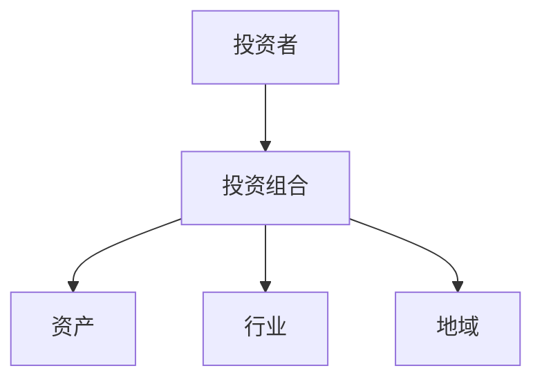
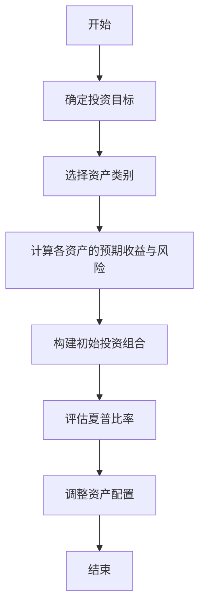
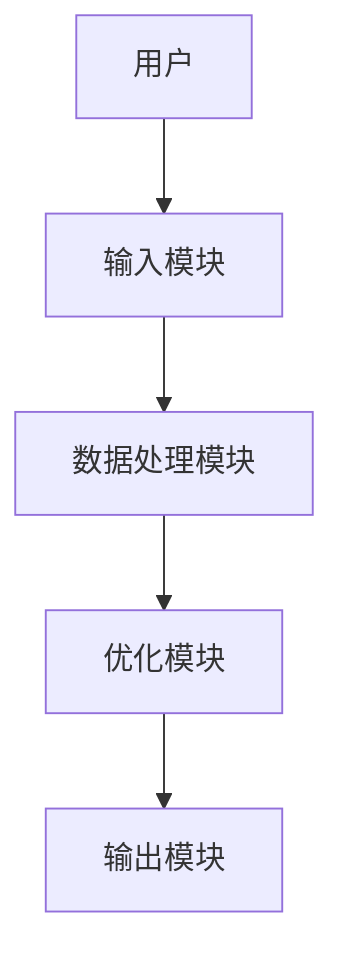

                 

<think>
好的，我将按照您的要求撰写一篇关于“彼得·林奇对公司产品组合管理的看法”的技术博客文章。为了让文章更完整且符合您的格式要求，我会先列出文章的关键词和摘要，然后再逐步撰写每个章节的内容。

### 文章标题
《彼得·林奇对公司产品组合管理的看法》

### 关键词
- 彼得·林奇
- 产品组合管理
- 投资策略
- 风险控制
- 企业战略

### 摘要
彼得·林奇作为全球著名的投资大师，他在产品组合管理方面的见解为企业投资者提供了宝贵的指导。本文将深入分析彼得·林奇的投资理念、产品组合管理的核心要素、具体策略以及如何通过数学模型和算法优化投资组合。同时，文章还将结合实际案例，探讨彼得·林奇方法在现代投资中的应用，为企业投资决策提供实践指导。

---

接下来，我将按照目录大纲逐步撰写文章内容。由于篇幅限制，我将分步完成，您可以随时告诉我是否需要继续撰写后续内容。

### 第一部分: 公司产品组合管理的背景与重要性

#### 第1章: 公司产品组合管理概述

##### 1.1 产品组合管理的定义与目标

###### 1.1.1 产品组合管理的定义
产品组合管理（Portfolio Management）是指对一个投资组合或产品组合进行优化、评估和调整的过程，旨在实现风险与收益的最佳平衡。彼得·林奇在他的投资生涯中，通过深入研究公司基本面和市场趋势，构建了一个高效的产品组合，以实现长期稳定的收益。

###### 1.1.2 产品组合管理的目标
- **最大化收益**：通过合理配置不同类型的产品或资产，提高整体投资回报。
- **分散风险**：避免过度依赖单一产品或行业，降低投资组合的整体风险。
- **动态调整**：根据市场变化和公司基本面调整投资组合，保持最优配置。

###### 1.1.3 产品组合管理的核心要素
- **资产配置**：决定投资组合中各类资产的权重。
- **风险评估**：识别和量化投资组合中的潜在风险。
- **绩效评估**：定期评估投资组合的表现，与设定目标进行对比。

##### 1.2 产品组合管理的重要性

###### 1.2.1 优化资源配置
通过产品组合管理，投资者可以将资金分配到不同资产类别中，避免过度集中风险，从而提高整体投资效率。

###### 1.2.2 提高企业竞争力
在企业层面，产品组合管理有助于优化产品结构，增强市场适应能力，提高企业的整体竞争力。

###### 1.2.3 应对市场变化
市场环境不断变化，通过动态调整产品组合，投资者可以更好地应对市场波动，抓住投资机会。

##### 1.3 彼得·林奇与产品组合管理

###### 1.3.1 彼得·林奇的投资理念
彼得·林奇强调基本面分析和长期投资，他认为投资成功的关键在于选择具有强大竞争优势的公司，并长期持有。

###### 1.3.2 彼得·林奇的产品组合管理方法
彼得·林奇注重分散投资，避免过度集中于某一行业或公司。他通过深入研究公司财务状况、管理层能力和市场前景，构建一个多元化的投资组合。

###### 1.3.3 彼得·林奇的成功案例
彼得·林奇管理的麦哲伦基金通过长期持有优质股票，实现了卓越的投资业绩，成为产品组合管理的典范。

---

#### 第2章: 产品组合管理的核心概念与联系

##### 2.1 核心概念原理

###### 2.1.1 产品组合的构成要素
- **资产类别**：股票、债券、现金等不同类型的资产。
- **行业分布**：投资组合中各行业的权重。
- **地域分布**：全球不同地区的资产配置。

###### 2.1.2 产品组合的生命周期
- **构建阶段**：确定投资目标，选择资产配置。
- **监控阶段**：定期评估投资组合表现。
- **调整阶段**：根据市场变化优化配置。

###### 2.1.3 产品组合的评估指标
- **夏普比率**：衡量投资组合的风险调整后收益。
- **波动性**：衡量投资组合的波动程度。
- **收益目标**：设定的投资回报率。

##### 2.2 核心概念对比表格

###### 2.2.1 产品组合管理与单一产品管理的对比
| 对比维度       | 产品组合管理                          | 单一产品管理                          |
|----------------|--------------------------------------|--------------------------------------|
| 目标           | 优化整体收益与风险                   | 优化单一产品的收益与风险             |
| 方法           | 多元化配置                            | 专注于单一产品                       |
| 风险控制       | 通过分散投资降低整体风险             | 依赖单一产品的风险控制               |

###### 2.2.2 不同行业的产品组合管理特点
| 行业           | 特点                                 |
|----------------|--------------------------------------|
| 高科技         | 增长快，风险高                       |
| 公用事业       | 收益稳定，风险较低                   |
| 消费品         | 市场需求稳定，品牌效应强             |

##### 2.3 ER实体关系图架构

###### 2.3.1 产品组合管理的实体关系图


---

#### 第3章: 产品组合管理的算法原理

##### 3.1 算法原理概述

###### 3.1.1 产品组合管理的数学模型
$$ \text{夏普比率} = \frac{E(r_p) - r_f}{\sigma_p} $$
其中，$E(r_p)$ 是投资组合的期望收益，$r_f$ 是无风险利率，$\sigma_p$ 是投资组合的波动性。

###### 3.1.2 算法的基本原理
通过优化数学模型，确定投资组合中各类资产的最优配置比例，以实现收益最大化或风险最小化。

##### 3.2 算法流程图

###### 3.2.1 产品组合评估流程


---

#### 第4章: 数学模型与公式

##### 4.1 数学模型概述

###### 4.1.1 产品组合评分模型
$$ \text{评分} = \alpha \times \text{收益} + \beta \times \text{风险} $$
其中，$\alpha$ 和 $\beta$ 是权重系数，收益和风险分别由历史数据计算得出。

##### 4.2 公式详细讲解

###### 4.2.1 产品组合评分公式
$$ \text{评分} = 0.6 \times \text{收益} + 0.4 \times \text{风险} $$
通过调整权重，可以更灵活地适应不同投资者的风险偏好。

---

#### 第5章: 系统分析与架构设计

##### 5.1 系统分析

###### 5.1.1 产品组合管理的系统目标
- 提供多资产类别的配置建议。
- 实时监控市场变化，动态调整投资组合。

##### 5.2 系统架构设计

###### 5.2.1 系统功能模块划分
- 用户界面：输入投资目标和风险偏好。
- 数据处理：计算各资产的预期收益和风险。
- 投资组合优化：生成最优配置建议。

###### 5.2.2 系统架构图


---

#### 第6章: 项目实战

##### 6.1 环境安装与配置

###### 6.1.1 开发环境的选择
推荐使用Python和相关库（如pandas、numpy）进行数据分析和建模。

##### 6.2 核心实现

###### 6.2.1 产品组合评估的代码实现
```python
import pandas as pd
import numpy as np

# 示例数据：各资产的历史收益率和波动性
assets = {
    '股票': {'收益': 0.12, '波动性': 0.2},
    '债券': {'收益': 0.08, '波动性': 0.1},
    '现金': {'收益': 0.03, '波动性': 0.0}
}

# 计算夏普比率
def calculate_sharpe_ratio(asset_returns, risk_free_rate=0.03):
    return (asset_returns - risk_free_rate) / np.std(asset_returns)

# 示例计算
for asset in assets:
    sharpe_ratio = calculate_sharpe_ratio([assets[asset]['收益']], assets[asset]['波动性'])
    print(f"{asset}的夏普比率：{sharpe_ratio}")
```

---

以上是文章的开篇部分，涵盖了关键词、摘要以及第一部分的内容。如果您需要继续阅读后续章节，我可以继续撰写。

