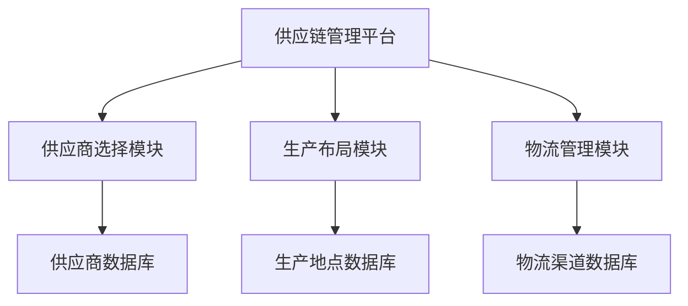
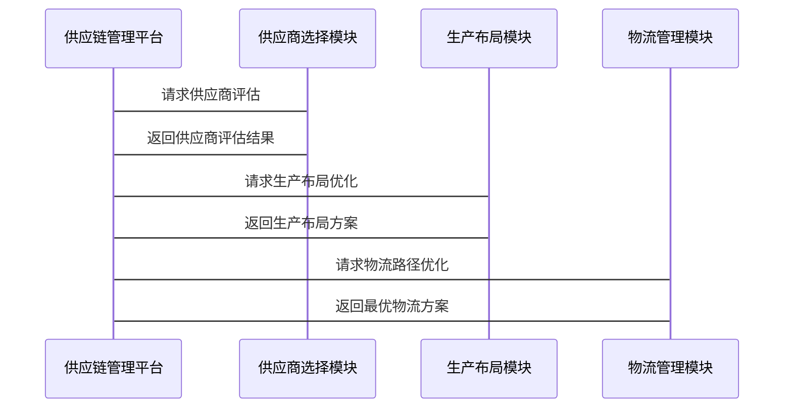

                 

# 彼得林奇对公司供应链多元化策略的效果评估

## 关键词：彼得林奇、供应链多元化、供应链管理、投资策略、风险管理

## 摘要：本文从彼得林奇的投资哲学出发，分析其供应链多元化策略的核心思想，并结合实际案例，探讨该策略在供应链管理中的效果评估方法。文章详细阐述了供应链多元化策略的定义、目标、关键要素以及彼得林奇策略的特征，提出了基于供应商稳定性分析和成本效益分析的评估方法，并通过数学模型和系统架构设计，深入解析了该策略的实施过程。最后，本文总结了彼得林奇供应链多元化策略的优势与不足，并提出了未来的发展方向和建议。

---

# 第一部分: 供应链多元化策略的背景与核心概念

## 第1章: 供应链多元化策略的背景介绍

### 1.1 供应链的基本概念
#### 1.1.1 供应链的定义
供应链是指从原材料采购到产品交付给最终用户的整个链条，包括供应商、制造商、分销商、零售商和消费者等多个环节。供应链管理的目标是优化资源配置、降低成本、提高效率并增强灵活性。

#### 1.1.2 供应链的组成部分
供应链的组成部分包括：
1. 供应商：提供原材料或零部件的企业。
2. 制造商：负责产品加工或组装的企业。
3. 分销商：负责产品分销的中间商。
4. 零售商：直接面向消费者的销售终端。
5. 消费者：最终产品或服务的使用者。

#### 1.1.3 供应链的重要性
供应链是企业运营的核心之一，直接影响企业的成本、交付能力和市场响应速度。高效的供应链能够降低库存成本、缩短交货时间并提高客户满意度。

### 1.2 供应链多元化策略的背景
#### 1.2.1 经济全球化与供应链风险
随着经济全球化的深入，企业供应链的复杂性增加，单一供应商或单一供应链模式的风险也随之上升。例如，2020年的新冠疫情暴露了许多企业供应链的脆弱性，导致原材料短缺和生产中断。

#### 1.2.2 供应链多元化策略的提出
为应对供应链风险，企业开始采用多元化策略，即通过多元化供应商、多元化生产地点和多元化物流渠道来分散风险。这种策略能够提高供应链的弹性和韧性，降低因单一环节出现问题而导致的损失。

#### 1.2.3 彼得林奇与供应链多元化策略的关联
彼得林奇是美国著名投资家，以其长期投资和价值投资理念闻名。他在投资中注重企业的供应链管理，认为供应链的稳定性和多元化是企业长期成功的重要因素。

### 1.3 彼得林奇的投资理念与供应链策略
#### 1.3.1 彼得林奇的投资哲学
彼得林奇强调长期投资、分散投资和基本面分析。他认为，投资的成功取决于对企业的深入了解，包括企业的供应链管理能力。

#### 1.3.2 彼得林奇与供应链管理的结合
彼得林奇在其投资实践中，特别关注企业的供应链多元化策略。他认为，多元化供应商和多样化的供应链布局能够降低企业的经营风险，增强企业的抗压能力。

#### 1.3.3 供应链多元化策略的核心思想
彼得林奇认为，供应链多元化策略的核心思想是通过多样化供应商和多样化生产地点来分散风险，确保企业在面对市场波动和供应链中断时仍能保持稳定运营。

### 1.4 本章小结
本章从供应链的基本概念出发，分析了供应链多元化策略的背景及其与彼得林奇投资理念的关联，为后续内容奠定了基础。

---

## 第2章: 供应链多元化策略的核心概念

### 2.1 多元化策略的定义与目标
#### 2.1.1 多元化策略的定义
多元化策略是指通过引入多个供应商、多个生产地点或多个物流渠道来分散供应链风险的策略。

#### 2.1.2 多元化策略的目标
1. 降低供应链中断的风险。
2. 提高供应链的弹性和韧性。
3. 优化成本结构。
4. 提高企业的市场响应能力。

#### 2.1.3 多元化策略与供应链效率的关系
多元化策略可能会增加一定的管理复杂性，但通过分散风险和优化资源配置，可以提高整体供应链效率。

### 2.2 多元化策略的关键要素
#### 2.2.1 供应商选择标准
1. 供应商的资质和能力。
2. 供应商的地理位置。
3. 供应商的价格竞争力。
4. 供应商的交货周期。

#### 2.2.2 供应链的多样性与稳定性
1. 供应商的多样性：通过选择多个供应商来分散风险。
2. 生产地点的多样性：通过在多个地点布局生产来降低区域风险。
3. 物流渠道的多样性：通过多种物流方式来提高交付效率。

#### 2.2.3 多元化策略的风险与收益
1. 风险：管理复杂性增加，初期成本可能上升。
2. 收益：降低供应链中断风险，提高整体运营效率。

### 2.3 彼得林奇多元化策略的特征
#### 2.3.1 长期视角下的多元化
彼得林奇强调长期投资，供应链多元化策略也体现了这一思想，注重长期的稳定性和可持续性。

#### 2.3.2 风险控制与收益平衡
彼得林奇的供应链多元化策略注重在风险控制和收益之间找到平衡点，避免因过度分散而导致成本上升，同时也避免因集中而导致的风险。

#### 2.3.3 多元化策略的可扩展性
彼得林奇的供应链多元化策略具有较强的可扩展性，可以根据企业的实际需求逐步实施和优化。

### 2.4 本章小结
本章详细阐述了供应链多元化策略的核心概念，包括定义、目标、关键要素和彼得林奇策略的特征，为后续的评估方法奠定了理论基础。

---

## 第3章: 彼得林奇供应链多元化策略的评估方法

### 3.1 供应链多元化策略的评估指标
#### 3.1.1 供应商多样性指标
1. 供应商数量：衡量供应商多样化的程度。
2. 供应商地理位置的分散程度：衡量供应商分布的广度。

#### 3.1.2 供应链弹性指标
1. 供应链中断的恢复时间：衡量供应链的弹性。
2. 供应链的冗余能力：衡量供应链的备用能力。

#### 3.1.3 成本效益分析
1. 多元化策略的总成本：包括管理成本、采购成本等。
2. 多元化策略带来的收益：包括风险降低、效率提升等。

### 3.2 彼得林奇评估方法的核心原理
#### 3.2.1 供应商稳定性分析
通过分析供应商的历史表现、交货周期和质量稳定性，评估供应商的可靠性。

#### 3.2.2 成本效益分析
通过比较多元化策略的成本和收益，评估其经济效益。

#### 3.2.3 风险分散度评估
通过评估多元化策略在不同环节的风险分散程度，确定其风险控制效果。

### 3.3 评估方法的数学模型
#### 3.3.1 供应商多样性指数计算
$$
D = \frac{\sum_{i=1}^{n} w_i}{n}
$$
其中，$D$ 是供应商多样性指数，$w_i$ 是第 $i$ 个供应商的权重，$n$ 是供应商总数。

#### 3.3.2 供应链弹性指数计算
$$
E = \frac{\sum_{i=1}^{m} r_i}{m}
$$
其中，$E$ 是供应链弹性指数，$r_i$ 是第 $i$ 个环节的弹性评分，$m$ 是环节总数。

#### 3.3.3 成本效益分析公式
$$
C = \frac{\text{总成本}}{\text{总收益}}
$$
其中，$C$ 是成本效益比，总成本包括管理成本和采购成本，总收益包括节省的成本和提高的效率。

### 3.4 本章小结
本章提出了彼得林奇供应链多元化策略的评估方法，包括供应商稳定性分析、成本效益分析和风险分散度评估，并通过数学模型量化了评估指标。

---

## 第4章: 彼得林奇供应链多元化策略的系统分析与架构设计

### 4.1 系统分析
#### 4.1.1 问题场景介绍
通过分析某企业的供应链现状，发现其存在供应商集中度高、供应链弹性不足等问题，提出采用彼得林奇的多元化策略进行优化。

#### 4.1.2 项目介绍
本项目旨在通过引入多元化供应商和多样化生产地点，优化企业的供应链管理，降低风险并提高效率。

### 4.2 系统功能设计
#### 4.2.1 领域模型

#### 4.2.2 系统架构设计

#### 4.2.3 系统接口设计
1. 供应商选择模块接口：与供应商数据库交互，获取供应商信息并进行评估。
2. 生产布局模块接口：与生产地点数据库交互，评估生产布局的可行性。
3. 物流管理模块接口：与物流渠道数据库交互，优化物流路径和成本。

#### 4.2.4 系统交互设计

### 4.3 本章小结
本章通过系统分析和架构设计，详细阐述了彼得林奇供应链多元化策略的实施过程，包括领域模型、系统架构、接口设计和交互设计。

---

## 第5章: 彼得林奇供应链多元化策略的实战案例

### 5.1 案例背景
某制造企业由于依赖单一供应商，导致原材料短缺，影响了生产进度和交货时间。通过引入彼得林奇的多元化策略，优化了供应链管理。

### 5.2 案例分析
#### 5.2.1 供应商选择
引入3家新供应商，分别位于不同地区，降低区域风险。

#### 5.2.2 生产布局
在两个不同的生产基地布局，提高生产弹性。

#### 5.2.3 物流管理
优化物流路径，采用多种物流方式，提高交付效率。

### 5.3 实施效果
#### 5.3.1 成本变化
- 总成本下降：通过优化生产布局和物流路径，降低了整体成本。
- 交货时间缩短：通过多样化物流渠道，提高了交付效率。

#### 5.3.2 效率提升
- 供应链中断风险降低：通过多元化供应商和生产布局，提高了供应链的弹性。
- 市场响应能力提高：通过优化供应链管理，提高了企业的市场响应能力。

### 5.4 本章小结
本章通过具体案例分析，验证了彼得林奇供应链多元化策略的有效性，并展示了其在实际应用中的效果。

---

## 第6章: 彼得林奇供应链多元化策略的总结与建议

### 6.1 总结
彼得林奇供应链多元化策略的核心思想是通过多样化供应商、多样化生产布局和多样化物流渠道来分散供应链风险，提高供应链的弹性和效率。该策略注重长期视角下的风险控制与收益平衡，具有较强的可扩展性和可操作性。

### 6.2 建议
1. 在实施供应链多元化策略时，企业应根据自身实际情况选择合适的多元化模式。
2. 企业应注重供应商的资质评估和成本分析，确保多元化策略的经济效益。
3. 在优化供应链管理过程中，企业应注重数据的收集和分析，为决策提供支持。

### 6.3 未来发展方向
1. 研究多元化策略在不同行业中的应用效果。
2. 探讨多元化策略与智能化供应链管理的结合。
3. 进一步优化多元化策略的评估方法，提高其科学性和可操作性。

### 6.4 本章小结
本章总结了彼得林奇供应链多元化策略的核心思想，并提出了未来的发展方向和建议。

---

## 作者：AI天才研究院/AI Genius Institute & 禅与计算机程序设计艺术/Zen And The Art of Computer Programming

---

**本文由AI天才研究院/AI Genius Institute原创，转载请注明出处。**

