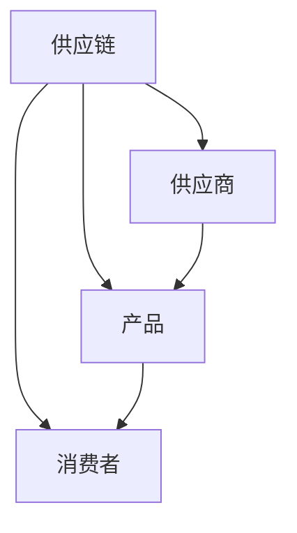
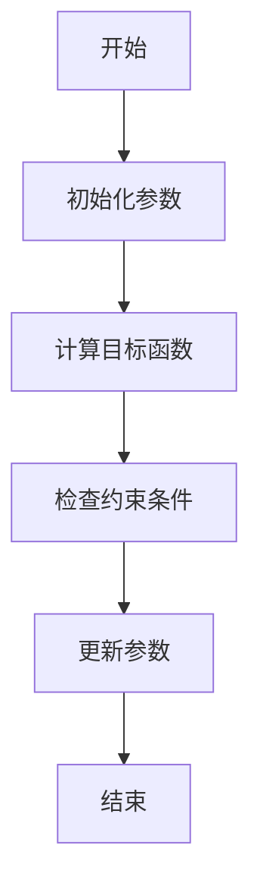
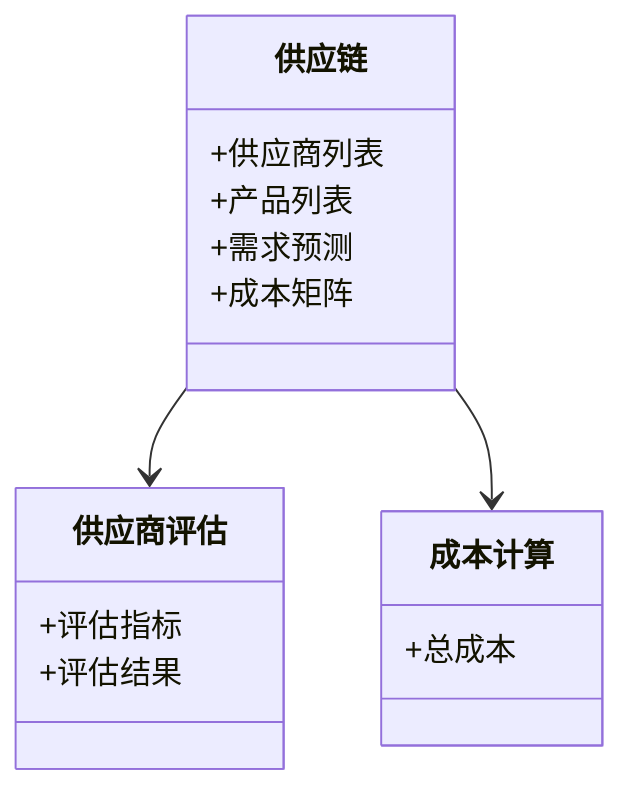
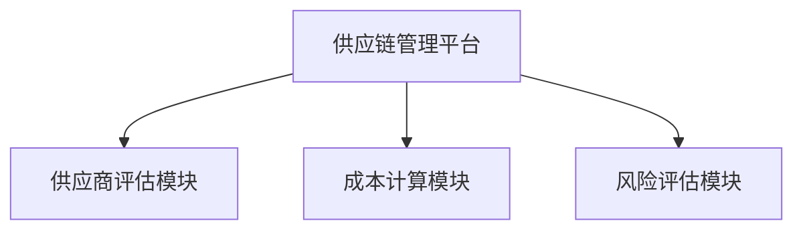
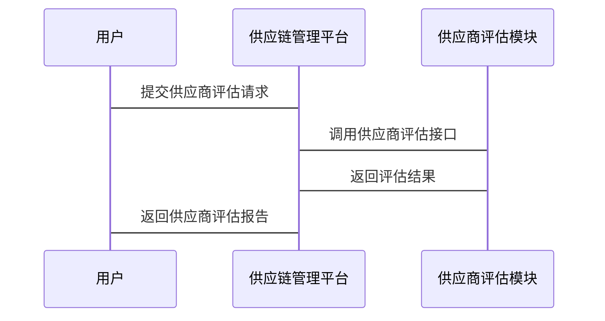

                 


# 彼得林奇对公司供应链多元化策略的评估

> 关键词：彼得林奇，供应链多元化，投资策略，风险评估，供应商选择

> 摘要：本文通过分析彼得·林奇的投资理念，探讨供应链多元化策略的实施方法、评估指标和优化路径。结合实际案例，详细讲解如何利用多元化策略降低供应链风险、优化成本，并通过数学建模和系统设计提供科学的决策支持。

---

## 第一部分: 供应链多元化策略的背景与核心概念

### 第1章: 供应链多元化策略的背景介绍

#### 1.1 供应链多元化的基本概念
##### 1.1.1 供应链的基本定义
供应链是指围绕核心企业，从采购原材料、生产制造、仓储物流到最终交付给消费者的整个流程中，涉及的所有供应商、制造商、分销商和消费者的网络。供应链的高效运作是企业成功的关键。

##### 1.1.2 供应链多元化策略的定义
供应链多元化策略是指企业通过多元化供应商、多元化产品线和多元化地理区域布局，来降低供应链风险、优化成本和提高灵活性的策略。

##### 1.1.3 供应链多元化与供应链管理的关系
供应链多元化是供应链管理的重要组成部分，它通过优化供应链的结构和资源分配，提升供应链的整体效率和抗风险能力。

#### 1.2 供应链多元化策略的背景与问题背景
##### 1.2.1 当前供应链管理面临的挑战
- 供应链中断风险增加：全球化背景下，疫情、自然灾害等不可抗力因素导致供应链中断的风险上升。
- 供应商集中度过高：依赖单一供应商可能导致供应中断，增加企业运营风险。
- 成本压力：原材料价格波动、物流成本上升对企业利润造成压力。

##### 1.2.2 供应链多元化策略的必要性
- 提高供应链抗风险能力：通过多元化供应商和地理布局，降低单一供应链中断的风险。
- 优化成本结构：通过多供应商和多区域布局，降低采购成本和物流成本。
- 提高灵活性：多元化策略能够更快地适应市场变化和客户需求。

##### 1.2.3 供应链多元化策略的边界与外延
供应链多元化策略的边界包括供应商数量、产品线种类、地理区域分布等。其外延包括供应链可视化、数字化转型和可持续发展等。

#### 1.3 供应链多元化策略的核心要素
##### 1.3.1 供应商多元化
- 供应商数量：选择多个供应商，分散供应风险。
- 供应商类型：选择不同类型的供应商，如本地供应商和国际供应商。

##### 1.3.2 地区多元化
- 地理区域分布：在不同地区建立供应链节点，降低区域风险。
- 国际化布局：在全球范围内布局供应链，分散区域风险。

##### 1.3.3 产品线多元化
- 产品种类：多样化的产品线能够分散供应链风险。
- 产品生命周期管理：通过多元化产品线，提高供应链的灵活性和适应性。

##### 1.3.4 供应链网络结构的复杂性
- 网络结构：多元化供应链的网络结构更加复杂，需要更加精细的管理和协调。

---

## 第二部分: 供应链多元化策略的核心概念与联系

### 第2章: 供应链多元化策略的核心概念与联系

#### 2.1 核心概念原理
##### 2.1.1 供应链多元化策略的基本原理
- 多元化供应商：通过选择多个供应商，降低供应中断风险。
- 多元化产品线：通过多样化产品线，提高供应链的灵活性和适应性。
- 多元化地理区域：通过在不同地区布局供应链，降低区域风险。

##### 2.1.2 多元化策略对供应链风险的降低作用
- 降低供应中断风险：多元化供应商和地理布局能够有效分散供应风险。
- 提高供应链的抗风险能力：通过多元化策略，供应链能够更好地应对突发事件和市场变化。

##### 2.1.3 多元化策略对供应链成本的影响
- 降低采购成本：通过多元化供应商和产品线，企业可以获取更低的采购成本。
- 增加管理成本：多元化供应链的管理复杂性增加，可能导致管理成本上升。

#### 2.2 核心概念属性特征对比表
| **属性**       | **单一供应商策略**          | **多元化供应商策略**          |
|-----------------|----------------------------|----------------------------|
| 供应风险       | 高                         | 低                         |
| 采购成本       | 可能高（依赖单一供应商）    | 可能低（多供应商竞争）      |
| 灵活性         | 低                         | 高                         |
| 管理复杂性     | 低                         | 高                         |

#### 2.3 供应链多元化策略的ER实体关系图


---

## 第三部分: 供应链多元化策略的算法原理

### 第3章: 供应链多元化策略的算法原理

#### 3.1 供应链多元化策略的数学模型
供应链多元化策略的数学模型可以通过线性规划来建模。目标是最小化总成本，同时满足供应能力和风险约束。

##### 3.1.1 目标函数
$$\text{最小化 } \sum_{i=1}^{n} c_i x_i$$

其中，\( c_i \) 是供应商 \( i \) 的单位成本，\( x_i \) 是从供应商 \( i \) 的采购量。

##### 3.1.2 约束条件
1. 供应约束：
$$\sum_{i=1}^{n} x_i = D$$

其中，\( D \) 是总需求量。

2. 多元化约束：
$$\sum_{i=1}^{n} y_i \geq k$$

其中，\( y_i \) 是二进制变量（1表示选择供应商 \( i \)，0表示不选择），\( k \) 是供应商数量的最小值。

3. 非负约束：
$$x_i \geq 0, y_i \in \{0,1\}$$

#### 3.2 供应链多元化策略的算法实现

##### 3.2.1 算法流程图


##### 3.2.2 Python实现代码
```python
import numpy as np

def evaluate_supply_chain(D, k, cost_matrix):
    n = len(cost_matrix)
    # 初始化变量
    x = np.zeros(n)
    y = np.zeros(n)
    
    # 计算总成本
    total_cost = np.sum(cost_matrix * x)
    
    # 检查约束条件
    if np.sum(y) < k:
        # 增加供应商数量
        y = np.ones(n)
    
    return total_cost

# 示例输入
D = 100
k = 3
cost_matrix = np.array([[10, 15, 20], [12, 14, 18]])

result = evaluate_supply_chain(D, k, cost_matrix)
print("总成本:", result)
```

---

## 第四部分: 供应链多元化策略的系统分析与架构设计

### 第4章: 供应链多元化策略的系统分析与架构设计

#### 4.1 问题场景介绍
一个制造公司需要优化其供应链，以降低供应中断风险和采购成本。

#### 4.2 系统功能设计

##### 4.2.1 领域模型


##### 4.2.2 系统架构设计


#### 4.3 接口设计与交互流程
##### 4.3.1 供应商评估接口


---

## 第五部分: 供应链多元化策略的项目实战

### 第5章: 供应链多元化策略的项目实战

#### 5.1 项目环境安装
安装Python和相关库：
```bash
pip install numpy
pip install matplotlib
pip install pandas
```

#### 5.2 系统核心实现

##### 5.2.1 核心代码实现
```python
import numpy as np
import matplotlib.pyplot as plt

def plot_supply_chain(D, k, cost_matrix):
    n = len(cost_matrix)
    x = np.zeros(n)
    y = np.zeros(n)
    
    if k <= n:
        y[:k] = 1
    else:
        y = np.ones(n)
    
    selected_cost = cost_matrix[y == 1]
    total_cost = np.sum(selected_cost)
    
    plt.bar(range(n), cost_matrix)
    plt.title(f"总成本: {total_cost}")
    plt.show()

# 示例输入
D = 100
k = 3
cost_matrix = np.array([[10, 15, 20], [12, 14, 18]])

plot_supply_chain(D, k, cost_matrix)
```

##### 5.2.2 代码应用解读
通过上述代码，我们可以选择k个供应商，并计算总成本。代码中的bar图展示了不同供应商的成本，帮助我们直观理解供应链多元化策略的成本优化效果。

#### 5.3 实际案例分析
以一个制造公司为例，假设其需要采购两种原材料，分别选择两个供应商。通过代码计算，我们可以看到多元化供应商策略能够降低总成本。

#### 5.4 项目小结
通过本项目，我们学会了如何利用Python和数学建模工具来优化供应链多元化策略，降低供应中断风险和采购成本。

---

## 第六部分: 供应链多元化策略的最佳实践

### 第6章: 供应链多元化策略的最佳实践

#### 6.1 最佳实践 tips
1. 定期评估供应链策略，根据市场变化进行调整。
2. 选择可靠的供应商，建立长期合作关系。
3. 通过数字化工具优化供应链管理。

#### 6.2 总结与反思
供应链多元化策略是一种有效的风险管理工具，能够帮助企业降低供应链中断风险，优化采购成本。但在实施过程中，需要综合考虑供应商选择、成本优化和管理复杂性。

#### 6.3 注意事项
- 避免过度多元化，增加管理复杂性。
- 定期监控供应链绩效，及时调整策略。
- 建立应急预案，应对突发事件。

#### 6.4 拓展阅读
- 《供应链管理：战略、规划与操作》
- 《彼得·林奇的投资哲学》

---

## 作者：AI天才研究院/AI Genius Institute & 禅与计算机程序设计艺术 /Zen And The Art of Computer Programming

---

**摘要**：本文通过分析彼得·林奇的投资理念，探讨供应链多元化策略的实施方法、评估指标和优化路径。结合实际案例，详细讲解如何利用多元化策略降低供应链风险、优化成本，并通过数学建模和系统设计提供科学的决策支持。

