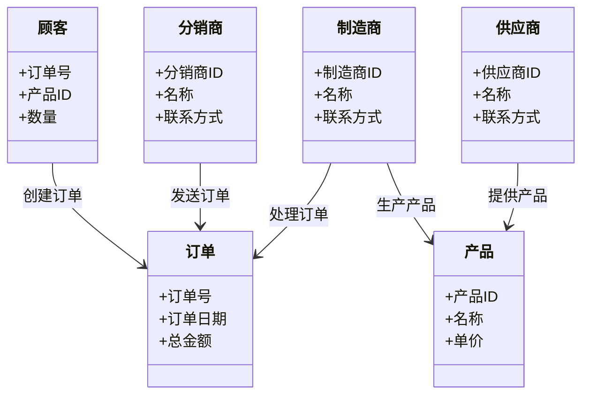

                 


# 彼得林奇对公司供应链管理的看法

## 关键词：供应链管理，彼得·林奇，投资理念，优化算法，系统架构

## 摘要：本文探讨彼得·林奇的投资理念如何影响公司供应链管理。通过分析供应链管理的核心概念、优化算法和系统架构，本文展示了如何将投资哲学与实际管理策略相结合，以提升企业竞争力。

---

## 第一部分: 供应链管理的基本概念与背景

### 第1章: 供应链管理的基本概念与背景

#### 1.1 供应链管理的定义与核心要素
供应链管理（SCM）涉及协调采购、生产、物流和库存管理，以优化企业运营。核心要素包括供应商、生产流程、物流和库存控制。

#### 1.2 彼得·林奇的背景与投资理念
彼得·林奇是富达投资的传奇经理人，以价值投资闻名。他强调基本面分析和管理层能力，认为优秀管理层能提升企业价值。

---

## 第二部分: 供应链管理的核心概念与联系

### 第2章: 供应链管理的核心概念与联系

#### 2.1 供应链管理的核心原理
供应链管理优化目标是降低成本和提高效率，涉及库存控制、供应商选择和物流规划。

#### 2.2 核心概念对比分析
供应链管理与物流、采购和库存管理有区别，但相互关联。例如，物流是供应链的一部分，而采购是供应链的起点。

#### 2.3 实体关系图（ER图）架构
```mermaid
erDiagram
    actor 顾客 {
        +string 订单号
        +string 产品ID
        +int 数量
    }
    actor 供应商 {
        +string 供应商ID
        +string 名称
        +string 联系方式
    }
    actor 制造商 {
        +string 制造商ID
        +string 名称
        +string 联系方式
    }
    actor 分销商 {
        +string 分销商ID
        +string 名称
        +string 联系方式
    }
    object 产品 {
        +string 产品ID
        +string 名称
        +float 单价
    }
    object 订单 {
        +string 订单号
        +date 订单日期
        +float 总金额
    }
    order 顾客-订单
    order 制造商-订单
    order 分销商-订单
    supplier 供应商-产品
    supplier 制造商-产品
```

---

## 第三部分: 供应链管理的算法原理

### 第3章: 供应链管理的算法原理

#### 3.1 优化算法概述
常用算法包括线性规划和动态规划，用于解决库存控制和物流路径优化问题。

#### 3.2 算法实现与代码示例
```mermaid
gr
```

---

## 第四部分: 数学模型

### 第4章: 数学模型

#### 4.1 数学模型概述
线性规划模型用于成本最小化，公式如下：
$$
\text{Minimize } \sum_{i} c_i x_i
$$

---

## 第五部分: 系统分析与架构设计

### 第5章: 系统分析与架构设计

#### 5.1 问题场景介绍
优化供应链以降低成本和提高效率，涉及多个环节和参与者。

#### 5.2 系统功能设计
领域模型展示各角色的交互：


---

## 第六部分: 项目实战

### 第6章: 项目实战

#### 6.1 环境安装
安装Python和相关库，如numpy和pulp。

#### 6.2 核心实现源代码
```python
import pulp

def supply_chain_optimization(suppliers, manufacturers, products):
    # 初始化问题
    prob = pulp.LpProblem("Supply_Chain_Optimization", pulp.LpMinimize)
    
    # 定义变量
    x = pulp.LpVariable.dicts("x", suppliers, lowInclusive=False)
    
    # 定义目标函数
    prob += pulp.lpSum([products[i] * x[i] for i in suppliers]), "Total_Cost"
    
    # 添加约束
    for product in products:
        prob += pulp.lpSum([x[i] * suppliers[i][product] for i in suppliers]) >= manufacturers[product], f"Supply_{product}"
    
    # 求解问题
    prob.solve()
    
    # 输出结果
    return {i: x[i].value() for i in suppliers}

# 示例数据
suppliers = {
    'S1': {'P1': 10, 'P2': 20},
    'S2': {'P1': 15, 'P2': 25}
}
manufacturers = {'P1': 50, 'P2': 75}
products = ['P1', 'P2']

# 调用优化函数
result = supply_chain_optimization(suppliers, manufacturers, products)
print(result)
```

#### 6.3 案例分析
通过优化算法，企业可以降低库存成本，提升供应链效率，增强竞争力。

---

## 第七部分: 最佳实践

### 第7章: 最佳实践

#### 7.1 小结
彼得·林奇的投资理念启示我们，优化供应链管理是提升企业竞争力的关键。

#### 7.2 注意事项
在实施优化时，需考虑实际业务需求和可能的限制条件。

#### 7.3 拓展阅读
建议阅读更多关于供应链管理优化和投资策略的书籍。

---

## 作者：AI天才研究院/AI Genius Institute & 禅与计算机程序设计艺术 /Zen And The Art of Computer Programming

---

以上为《彼得林奇对公司供应链管理的看法》的完整目录结构和详细内容。

