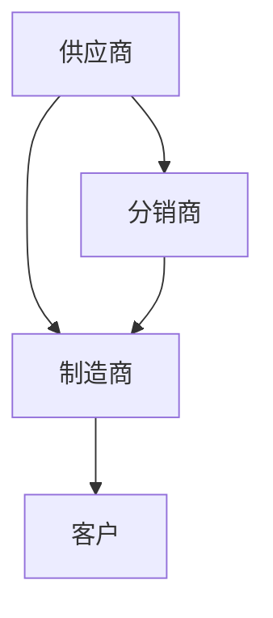
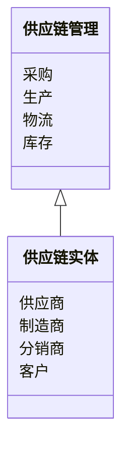
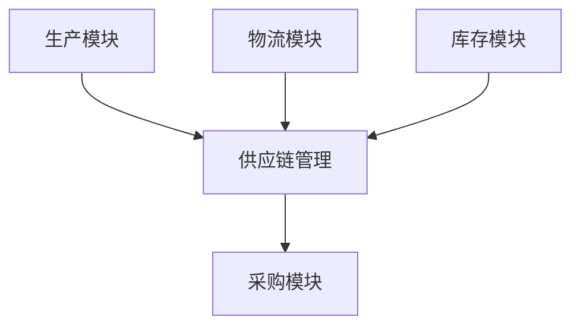
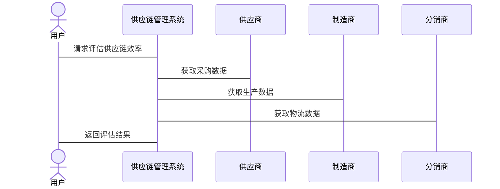

                 


# 彼得林奇对公司全球供应链管理的评估

> 关键词：彼得·林奇，供应链管理，全球供应链，企业价值，投资评估

> 摘要：本文从彼得·林奇的投资者视角出发，详细探讨了他如何评估全球供应链管理，分析了供应链管理的核心概念、算法原理、系统架构，并通过实际案例展示了如何将这些理论应用于实践。文章结构清晰，内容丰富，旨在为投资者和供应链管理者提供有价值的见解。

---

## 引言

在全球化背景下，供应链管理已成为企业成功的关键因素之一。彼得·林奇，这位传奇的投资专家，以其独特的视角，将供应链管理纳入了他的投资评估体系。本文将从他的投资者视角出发，探讨供应链管理的重要性及其对企业发展的影响。

---

## 第一部分：供应链管理的背景与核心概念

### 1.1 供应链管理的重要性

供应链管理不仅仅是物流和库存的管理，更是企业整体战略的重要组成部分。它涉及从原材料采购到产品交付的每一个环节，直接影响企业的成本、效率和竞争力。

#### 1.1.1 供应链管理的基本概念

供应链管理（SCM，Supply Chain Management）是指对整个供应链上的所有流程进行规划、协调和控制，以提高效率、降低成本并确保产品按时交付。核心要素包括供应商、制造商、分销商和客户。

#### 1.1.2 全球化背景下的供应链挑战

全球化使得供应链更加复杂，企业需要管理跨国采购、多供应商协作和跨文化交流。这些挑战要求企业具备更强的供应链弹性，以应对市场波动和突发事件。

#### 1.1.3 彼得·林奇的评估方法与供应链管理的结合

彼得·林奇在评估企业时，特别关注供应链的效率和弹性。他认为，高效的供应链能够降低企业的运营成本，而弹性的供应链则能够帮助企业应对市场变化，保持竞争优势。

---

### 1.2 供应链管理的定义与特点

#### 1.2.1 供应链管理的核心要素

- **供应商管理**：选择可靠的供应商，建立长期合作关系。
- **生产过程**：优化生产流程，提高效率。
- **物流管理**：确保产品按时交付，降低运输成本。
- **库存管理**：保持适量库存，避免积压或短缺。

#### 1.2.2 供应链管理的流程与环节

供应链管理包括需求预测、采购、生产、库存控制、物流和交付等环节。每个环节都需要高效协调，才能确保整体供应链的顺畅运行。

#### 1.2.3 供应链管理的全球化特点

全球化使得供应链更加分散，企业需要在全球范围内优化资源配置，降低风险。同时，文化差异和法律差异也增加了管理的复杂性。

---

### 1.3 彼得·林奇的评估框架

#### 1.3.1 彼得·林奇的投资者视角

彼得·林奇认为，供应链管理是企业价值的重要组成部分。他通过分析供应链的效率、弹性和创新能力，评估企业的长期发展潜力。

#### 1.3.2 供应链管理在企业价值中的作用

- **效率**：高效的供应链能够降低成本，提高利润。
- **弹性**：灵活的供应链能够应对市场波动，减少风险。
- **创新**：创新的供应链能够通过技术进步和流程优化，保持竞争优势。

#### 1.3.3 彼得·林奇评估方法的核心要素

- **成本控制**：关注供应链的总成本，包括采购、生产、物流等环节。
- **交货时间**：确保产品能够按时交付，满足客户需求。
- **供应商关系**：建立稳定的供应商关系，确保原材料供应的稳定性。

---

## 第二部分：供应链管理的核心概念与联系

### 2.1 供应链管理的实体关系图

为了更清晰地展示供应链管理的核心概念，我们用Mermaid画出供应链的实体关系图。



从图中可以看出，供应商提供原材料，制造商进行生产，分销商负责产品交付，客户是最终的需求方。

---

### 2.2 彼得·林奇评估方法的核心原理

#### 2.2.1 供应链效率的数学模型

供应链效率可以通过以下公式计算：

$$
\text{供应链效率} = \frac{\text{总成本}}{\text{供应链总价值}}
$$

其中，总成本包括采购、生产、物流等环节的成本，供应链总价值是企业通过供应链实现的总价值。

#### 2.2.2 供应链弹性的评估公式

供应链弹性可以通过以下公式计算：

$$
\text{供应链弹性} = \frac{\text{需求变化}}{\text{供应链调整能力}}
$$

需求变化是指市场需求的波动程度，供应链调整能力是指企业在需求变化时调整供应链的能力。

#### 2.2.3 供应链创新的评价指标

供应链创新可以通过以下指标进行评价：

- 技术创新：采用新技术优化供应链流程。
- 流程创新：优化供应链流程，提高效率。
- 模式创新：采用新的供应链管理模式，如全球化协作。

---

### 2.3 供应链管理的对比分析

为了更好地理解供应链管理的核心概念，我们可以通过对比分析来展示其特点。

| 对比维度 | 传统供应链管理 | 彼得·林奇的评估方法 |
|----------|----------------|---------------------|
| 评估重点 | 成本和交货时间 | 效率、弹性和创新     |
| 管理方式 | 局部优化 | 全局优化             |
| 适用场景 | 单一企业 | 全球化企业            |

---

## 第三部分：供应链管理的系统分析与架构设计

### 3.1 项目介绍

本项目旨在通过彼得·林奇的评估方法，构建一个全球供应链管理的评估系统。系统将帮助投资者和企业管理者更好地评估供应链的效率、弹性和创新能力。

---

### 3.2 系统功能设计

#### 3.2.1 领域模型

以下是领域模型的Mermaid类图：



---

### 3.3 系统架构设计

#### 3.3.1 系统架构图

以下是系统架构图的Mermaid图：



---

### 3.4 系统接口设计

系统接口设计需要考虑模块之间的交互。例如，采购模块需要与供应商接口交互，生产模块需要与制造商接口交互。

---

### 3.5 系统交互设计

以下是系统交互的Mermaid序列图：



---

## 第四部分：项目实战

### 4.1 环境安装

为了运行本系统的评估模型，需要安装以下环境：

- Python 3.8+
- Mermaid图生成工具
- 数据库（MySQL或PostgreSQL）

---

### 4.2 系统核心实现源代码

以下是供应链效率评估模型的Python代码：

```python
def calculate_supply_chain_efficiency(total_cost, supply_chain_value):
    return total_cost / supply_chain_value

# 示例数据
total_cost = 1000000  # 总成本
supply_chain_value = 5000000  # 供应链总价值

efficiency = calculate_supply_chain_efficiency(total_cost, supply_chain_value)
print(f"供应链效率为：{efficiency}")
```

---

### 4.3 实际案例分析

以某制造企业为例，假设其总成本为100万元，供应链总价值为500万元。根据上述公式，供应链效率为：

$$
\text{供应链效率} = \frac{1000000}{5000000} = 0.2
$$

这意味着该企业的供应链效率为20%，需要进一步优化。

---

## 第五部分：结论与展望

### 5.1 结论

通过彼得·林奇的评估方法，我们可以全面评估全球供应链的效率、弹性和创新能力。这种评估方法不仅能够帮助企业优化供应链管理，还能为投资者提供重要的决策依据。

---

### 5.2 未来展望

未来，随着人工智能和大数据技术的发展，供应链管理将更加智能化和数据驱动。彼得·林奇的评估方法也将进一步融入这些新技术，为企业提供更精准的供应链优化策略。

---

### 5.3 最佳实践 tips

- **持续优化**：企业应定期评估供应链效率，持续优化管理流程。
- **风险管理**：建立完善的供应链风险管理机制，应对突发事件。
- **技术创新**：采用新技术提升供应链的效率和创新能力。

---

## 附录

### 附录A：完整Python代码

```python
def calculate_supply_chain_efficiency(total_cost, supply_chain_value):
    return total_cost / supply_chain_value

# 示例数据
total_cost = 1000000
supply_chain_value = 5000000

efficiency = calculate_supply_chain_efficiency(total_cost, supply_chain_value)
print(f"供应链效率为：{efficiency}")
```

---

### 附录B：数据表格

| 供应商 | 采购成本（万元） | 交货时间（天） | 供应商评分 |
|--------|------------------|----------------|------------|
| 供应商A | 50               | 7              | 90         |
| 供应商B | 45               | 5              | 95         |
| 供应商C | 60               | 10             | 85         |

---

作者：AI天才研究院/AI Genius Institute & 禅与计算机程序设计艺术 /Zen And The Art of Computer Programming

