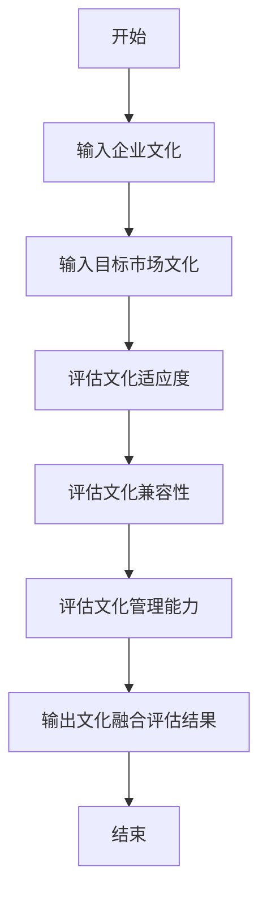
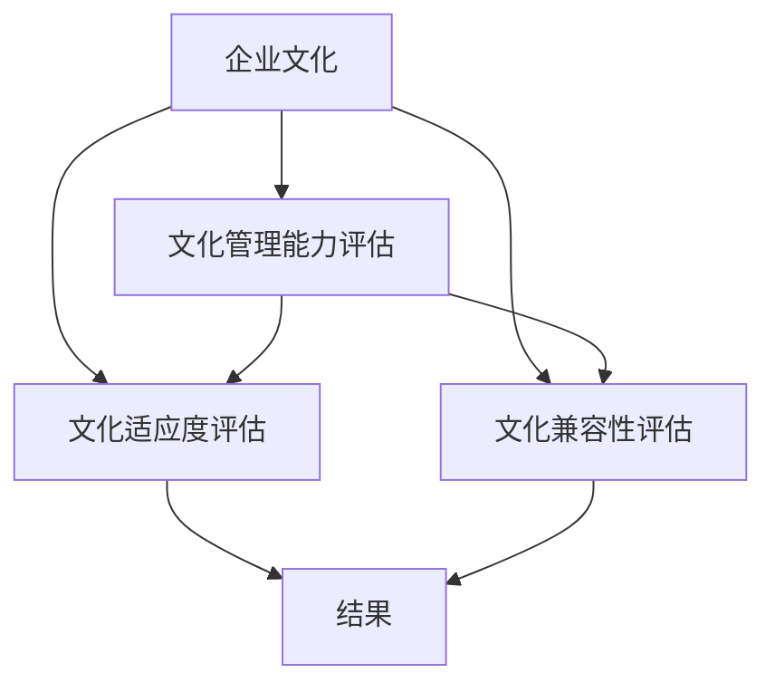
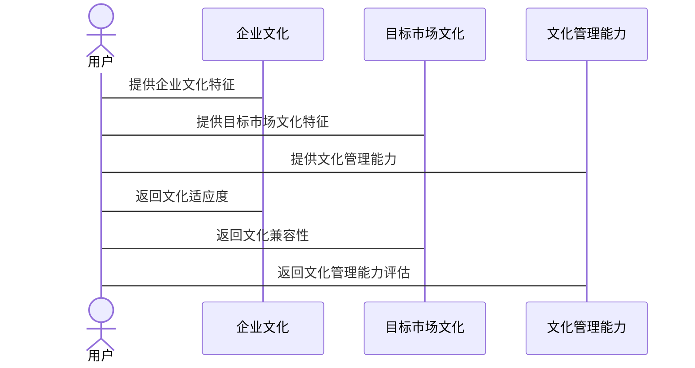

                 


# 彼得林奇对公司全球化战略的文化融合评估

## 关键词：全球化战略、文化融合、彼得林奇、评估模型、系统设计、项目实战

## 摘要：本文深入探讨了彼得林奇在全球化战略中的文化融合评估方法，结合实际案例分析，详细阐述了评估模型的算法原理和系统架构设计。通过项目实战和最佳实践，为读者提供了实用的指导和启示。

---

## 第1章 全球化战略与文化融合的背景

### 1.1 全球化战略概述

#### 1.1.1 全球化战略的定义
全球化战略是指企业在全球范围内扩展业务，利用不同市场的资源和机会，实现更大规模和更高效的运营。

#### 1.1.2 全球化战略的背景
随着经济的全球化，企业需要跨越国界进行业务扩展，文化差异成为影响企业绩效的重要因素。

#### 1.1.3 全球化战略的重要性
全球化战略能够帮助企业利用不同市场的优势，提升竞争力和利润率。

### 1.2 文化融合的重要性

#### 1.2.1 文化融合的定义
文化融合是指企业在跨国经营中，将不同国家的文化元素有机结合，形成统一的企业文化。

#### 1.2.2 文化融合与企业绩效的关系
文化融合能够提升员工的凝聚力，促进跨文化团队的合作，从而提高企业的整体绩效。

#### 1.2.3 文化融合的挑战
文化差异可能导致沟通障碍、管理冲突和员工士气低落，从而影响企业的全球化战略。

---

## 第2章 文化融合评估的核心概念与联系

### 2.1 评估模型的原理

#### 2.1.1 模型的输入
输入包括企业的文化背景、目标市场的文化特征、管理层的文化适应能力等。

#### 2.1.2 模型的输出
输出包括文化融合的可行性评估、潜在风险和改进建议。

#### 2.1.3 模型的核心要素
核心要素包括文化适应度、文化兼容性、文化管理能力等。

### 2.2 核心要素对比分析

#### 2.2.1 各要素的特征对比
| 要素         | 特征 |
|--------------|------|
| 文化适应度   | 员工对新文化的适应能力 |
| 文化兼容性   | 不同文化之间的相容性 |
| 文化管理能力 | 管理层的文化管理能力 |

#### 2.2.2 评估模型的属性特征表格
| 属性         | 描述                   |
|--------------|------------------------|
| 输入          | 企业文化和目标市场文化 |
| 输出          | 文化融合评估结果       |
| 核心要素      | 文化适应度、兼容性、管理能力 |

### 2.3 实体关系图

```mermaid
er
actor 企业文化
actor 目标市场文化
actor 文化管理能力
```

---

## 第3章 评估模型的算法原理

### 3.1 评估模型的算法流程



### 3.2 数学模型与公式

文化融合评估指数（CFEI）计算公式：

$$ CFEI = \frac{1}{3} \left( C_A + C_C + C_M \right) $$

其中：
- $C_A$ 表示文化适应度指数
- $C_C$ 表示文化兼容性指数
- $C_M$ 表示文化管理能力指数

### 3.3 举例说明

假设某企业在评估中得到：
- $C_A = 0.8$
- $C_C = 0.7$
- $C_M = 0.9$

则 CFEI = (0.8 + 0.7 + 0.9) / 3 = 0.8

---

## 第4章 系统分析与架构设计

### 4.1 问题场景介绍

企业在进行全球化扩张时，面临如何有效评估和管理文化融合的问题。

### 4.2 系统功能设计


### 4.3 系统架构设计



### 4.4 系统接口设计

接口描述：
- 输入：企业文化特征、目标市场文化特征、文化管理能力
- 输出：文化融合评估结果

### 4.5 系统交互设计



---

## 第5章 项目实战

### 5.1 环境安装

安装Python和以下库：
- `pandas`
- `numpy`
- `matplotlib`

### 5.2 核心代码实现

```python
def calculate_cfei(cultural_adjustment, cultural_compatibility, cultural_management):
    return (cultural_adjustment + cultural_compatibility + cultural_management) / 3

# 示例数据
cultural_adjustment = 0.8
cultural_compatibility = 0.7
cultural_management = 0.9

cfei = calculate_cfei(cultural_adjustment, cultural_compatibility, cultural_management)
print(f"文化融合评估指数：{cfei}")
```

### 5.3 案例分析

假设某公司扩展到日本市场，计算其文化融合评估指数为0.8，表明文化融合较为可行。

### 5.4 项目小结

通过代码实现评估模型，企业可以快速获得文化融合的评估结果，为全球化战略提供数据支持。

---

## 第6章 最佳实践与总结

### 6.1 经验与教训

- **经验**：及时进行文化培训和沟通，可以显著提升文化适应度。
- **教训**：忽视文化兼容性可能导致市场进入失败。

### 6.2 未来研究方向

- 进一步优化评估模型，加入更多文化因素。
- 研究文化融合对长期企业绩效的影响。

---

## 作者

**作者：AI天才研究院/AI Genius Institute & 禅与计算机程序设计艺术 /Zen And The Art of Computer Programming**

---

通过以上结构，文章详细介绍了彼得林奇的文化融合评估方法，并结合实际案例和系统设计，为读者提供了全面的技术指导和实践参考。

