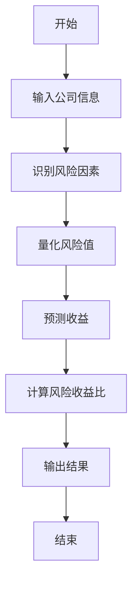

                 


# 彼得林奇对公司全球化战略的风险收益评估

## 关键词：彼得·林奇，风险收益评估，全球化战略，投资策略，企业战略，风险控制

## 摘要：  
本文从彼得·林奇的投资理念出发，结合全球化战略的特点，系统地分析了全球化战略中的风险与收益，并提出了风险收益评估的框架和方法。通过实际案例分析和数学模型的应用，本文为企业在全球化战略中提供了可操作的风险收益评估策略。

---

# 第一部分: 引言

## 1.1 全球化战略的背景与重要性  
全球化战略是企业扩大市场份额、提升竞争力的重要手段。随着经济的全球化，企业需要拓展国际市场，优化资源配置，实现跨文化、跨地区的协同发展。然而，全球化战略也伴随着复杂的风险和挑战，如市场波动、政策变化、文化差异等。因此，对企业而言，如何在全球化过程中平衡风险与收益，是实现可持续发展的关键。

## 1.2 彼得·林奇与投资策略  
彼得·林奇是美国著名的投资专家，以其独特的投资理念和卓越的投资业绩闻名。他的投资策略强调长期价值、分散投资和风险控制，这些理念与全球化战略的风险收益评估有着密切的联系。通过借鉴彼得·林奇的投资方法，我们可以更好地理解和应对全球化战略中的风险与收益问题。

## 1.3 本书的核心目标  
本文的核心目标是通过彼得·林奇的视角，系统地分析全球化战略中的风险与收益，提出一套可操作的风险收益评估框架，并通过实际案例分析，为企业在全球化战略中的决策提供参考。

---

# 第二部分: 全球化战略的风险收益评估背景

## 2.1 全球化战略的定义与核心要素  
全球化战略是指企业在全球范围内进行市场拓展、资源整合和价值创造的系统性战略。其核心要素包括：  
1. **市场扩展**：进入新市场，拓展客户群体。  
2. **资源配置**：优化全球资源的分配和利用。  
3. **风险管理**：识别和控制全球化过程中的风险。  
4. **文化融合**：在全球化过程中，实现不同文化的融合与协调。

## 2.2 风险收益评估的基本原理  
风险收益评估是通过数学模型和数据分析，对企业在全球化战略中的风险和收益进行量化分析的过程。其基本原理包括：  
1. **风险与收益的定义**：风险是指可能对企业造成的损失或不利影响，收益是指全球化战略为企业带来的经济和社会价值。  
2. **风险收益的对比分析**：通过对比风险和收益的大小，评估全球化战略的可行性和可持续性。  
3. **彼得·林奇的评估方法**：彼得·林奇强调长期价值和分散投资，这为全球化战略的风险收益评估提供了重要参考。

---

# 第三部分: 风险收益评估的核心概念与联系

## 3.1 风险收益评估的数学模型  
风险收益评估的数学模型可以通过以下公式表示：  

$$\text{风险收益比} = \frac{\text{预期收益}}{\text{风险值}}$$  

其中，风险值可以通过标准差或方差来衡量，而预期收益则可以通过概率加权的方法计算。

## 3.2 核心概念的ER实体关系图  
以下是一个简单的ER实体关系图，展示了公司、风险和收益之间的关系：

```mermaid
erDiagram
    company {
        id : int
        name : string
        industry : string
    }
    risk {
        id : int
        name : string
        type : string
    }
    reward {
        id : int
        name : string
        value : float
    }
    company --> risk : "面临的风险"
    company --> reward : "产生的收益"
```

## 3.3 风险收益评估的算法流程  
以下是一个风险收益评估的算法流程图：



---

# 第四部分: 全球化战略的风险收益评估框架

## 4.1 全球化战略的风险类型  
全球化战略中的风险类型包括：  
1. **市场风险**：市场需求波动、竞争加剧等。  
2. **政策风险**：政府政策变化、贸易壁垒等。  
3. **文化风险**：文化差异、法律差异等。  
4. **运营风险**：供应链中断、物流成本增加等。

## 4.2 全球化战略的收益类型  
全球化战略的收益类型包括：  
1. **市场份额扩大**：通过拓展国际市场，提升企业市场份额。  
2. **成本优化**：通过全球资源优化配置，降低生产成本。  
3. **品牌价值提升**：通过全球化战略，提升品牌知名度和影响力。  
4. **创新能力增强**：通过跨文化交流和合作，提升企业的创新能力。

## 4.3 风险收益评估的实施步骤  
1. **识别风险和收益因素**：通过市场调研和数据分析，识别全球化战略中的风险和收益因素。  
2. **量化风险和收益**：通过数学模型和数据分析，量化风险和收益的具体数值。  
3. **计算风险收益比**：根据量化结果，计算风险收益比，评估全球化战略的可行性和可持续性。  
4. **制定风险控制策略**：根据评估结果，制定相应的风险控制策略，降低全球化战略中的风险。

---

# 第五部分: 全球化战略的风险收益评估案例分析

## 5.1 案例背景介绍  
某跨国公司计划在全球范围内拓展市场，进入新兴市场。然而，新兴市场存在较高的政策风险和市场波动风险。通过风险收益评估，企业可以更好地应对这些风险，制定合理的市场进入策略。

## 5.2 风险收益评估的实施  
1. **风险识别**：识别新兴市场中的政策风险、市场波动风险等。  
2. **风险量化**：通过历史数据分析，量化这些风险的具体数值。  
3. **收益预测**：预测进入新兴市场后的预期收益。  
4. **风险收益比计算**：根据风险和收益的量化结果，计算风险收益比。  
5. **风险控制策略制定**：根据评估结果，制定相应的风险控制策略，如分散投资、建立风险管理团队等。

## 5.3 评估结果分析  
通过风险收益评估，企业可以清晰地看到进入新兴市场的风险和收益之间的关系。如果风险收益比低于预期，企业可能需要重新评估市场进入策略，或者采取其他风险控制措施。

---

# 第六部分: 全球化战略的风险收益评估的最佳实践

## 6.1 小结  
全球化战略的风险收益评估是企业实现可持续发展的关键。通过借鉴彼得·林奇的投资理念，企业可以更好地应对全球化过程中的风险和挑战。

## 6.2 注意事项  
1. **数据的准确性**：风险收益评估需要依赖准确的数据支持。  
2. **模型的合理性**：数学模型需要根据实际情况进行调整和优化。  
3. **团队的协作**：全球化战略的实施需要企业内部多个部门的协作。

## 6.3 拓展阅读  
1. 彼得·林奇的《投资任何股票的技巧》。  
2. 全球化战略相关的学术论文和案例分析。

---

# 附录: 工具与术语表

## 附录A: 风险收益评估工具  
1. 数据分析工具：如Excel、Python等。  
2. 风险管理工具：如风险管理系统、风险管理软件等。

## 附录B: 术语表  
- **风险收益比**：预期收益与风险值的比值。  
- **标准差**：衡量数据分布的离散程度。  
- **方差**：衡量数据分布的离散程度的平方。

---

# 作者：AI天才研究院/AI Genius Institute & 禅与计算机程序设计艺术 /Zen And The Art of Computer Programming

---

以上是《彼得林奇对公司全球化战略的风险收益评估》的技术博客文章的完整内容。

