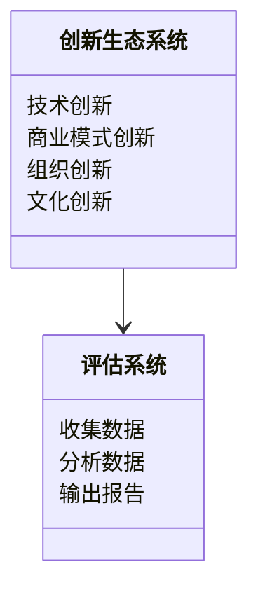

                 


# 彼得林奇对公司创新生态系统的可持续性评估

> 关键词：彼得林奇，创新生态系统，可持续性评估，公司创新，投资评估

> 摘要：本文从彼得林奇的投资视角出发，详细探讨了创新生态系统的核心概念、评估维度和方法。通过结合实际案例，分析了创新生态系统的构成要素及其对公司的价值影响，提出了创新生态系统可持续性评估的数学模型和算法，并给出了具体的实施步骤和代码示例。最后，通过实际案例分析，验证了该评估方法的有效性，并提出了最佳实践建议。

---

# 第一部分: 创新生态系统与可持续性评估概述

## 第1章: 创新生态系统与可持续性评估的背景

### 1.1 创新生态系统的核心概念

#### 1.1.1 创新生态系统的定义
创新生态系统是指由公司内部和外部的各种创新要素组成的动态系统，包括技术创新、商业模式创新、组织创新和文化创新等。该系统通过各要素之间的协同作用，推动公司的持续创新和发展。

#### 1.1.2 可持续性评估的必要性
可持续性评估是确保创新生态系统能够长期为公司创造价值的关键。通过评估，可以识别系统的瓶颈和风险，优化资源配置，提升创新效率。

#### 1.1.3 彼得林奇视角下的创新生态系统
彼得林奇从价值投资的角度，关注公司的创新生态系统是否能够为股东创造长期价值。他认为，创新生态系统不仅是技术驱动的，还与公司的战略、文化和组织能力密切相关。

---

## 第2章: 创新生态系统的核心要素

### 2.1 创新生态系统的构成要素

#### 2.1.1 技术创新
技术创新是创新生态系统的核心驱动力，包括研发投入、技术储备和创新能力。

#### 2.1.2 商业模式创新
商业模式创新决定了公司如何创造和获取价值，包括客户定位、收入模式和价值主张。

#### 2.1.3 组织创新
组织创新是创新生态系统的重要保障，包括组织结构、管理方式和团队协作。

#### 2.1.4 文化创新
文化创新是创新生态系统的精神内核，包括企业愿景、价值观和创新文化。

### 2.2 核心要素之间的关系

#### 2.2.1 技术与商业模式的协同效应
技术创新为商业模式创新提供基础，而商业模式创新则为技术创新提供方向和动力。

#### 2.2.2 组织与文化对创新的支持作用
组织结构和文化氛围直接影响创新的速度和质量，是创新生态系统的重要保障。

#### 2.2.3 创新要素的动态平衡
创新生态系统是一个动态平衡系统，各要素之间需要相互协调，才能实现可持续发展。

---

## 第3章: 创新生态系统评估的核心维度

### 3.1 创新能力评估

#### 3.1.1 技术研发能力
评估公司研发投入、研发团队能力和技术储备情况。

#### 3.1.2 产品创新能力
评估公司新产品开发速度、市场竞争力和客户满意度。

#### 3.1.3 市场响应能力
评估公司对市场变化的敏感性和快速反应能力。

### 3.2 可持续性评估指标

#### 3.2.1 财务可持续性
评估公司财务健康状况，包括盈利能力、现金流和资产负债情况。

#### 3.2.2 经营可持续性
评估公司经营环境的稳定性和竞争优势的持续性。

#### 3.2.3 创新可持续性
评估创新生态系统的可持续性，包括创新速度、创新质量和创新文化。

---

## 第4章: 彼得林奇的创新生态系统评估方法

### 4.1 彼得林奇投资理念与创新生态系统

#### 4.1.1 彼得林奇的价值投资理念
彼得林奇认为，投资的核心是寻找具有持续竞争优势和良好管理的公司。

#### 4.1.2 创新生态系统与价值投资的结合
彼得林奇将创新生态系统作为评估公司长期价值的重要指标，重点关注公司的技术创新能力、商业模式创新能力和组织创新能力。

### 4.2 创新生态系统评估的步骤

#### 4.2.1 确定评估目标
明确评估的目的，例如识别高潜力创新公司或优化公司创新战略。

#### 4.2.2 收集评估数据
收集公司的财务数据、技术创新数据、市场数据和管理数据。

#### 4.2.3 分析与评估
通过数学模型和算法对创新生态系统进行综合评估。

#### 4.2.4 评估结果的应用
将评估结果应用于投资决策或公司战略优化。

---

## 第5章: 创新生态系统评估的数学模型

### 5.1 创新能力评估模型

#### 5.1.1 指标权重分配
根据彼得林奇的投资理念，确定各创新要素的权重。

#### 5.1.2 指标权重计算公式
$$ w_i = \frac{\sum_{j=1}^{n} s_{ij}}{\sum_{j=1}^{n} \sum_{i=1}^{m} s_{ij}} } $$
其中，$w_i$为第$i$个创新要素的权重，$s_{ij}$为第$j$个样本中第$i$个创新要素的评分。

#### 5.1.3 综合评估公式
$$ C = \sum_{i=1}^{m} w_i \cdot x_i $$
其中，$C$为创新能力评分，$x_i$为第$i$个创新要素的评分。

### 5.2 可持续性评估模型

#### 5.2.1 综合评估指标
综合考虑创新能力、财务表现和治理评分。

#### 5.2.2 可持续性评分公式
$$ S = \alpha \cdot C + \beta \cdot F + \gamma \cdot G $$
其中，$S$为可持续性评分，$C$为创新能力评分，$F$为财务表现评分，$G$为治理评分，$\alpha, \beta, \gamma$为权重系数。

---

## 第6章: 系统分析与架构设计方案

### 6.1 问题场景介绍

#### 6.1.1 问题背景
公司需要对其创新生态系统进行可持续性评估，以优化创新战略和投资决策。

#### 6.1.2 项目目标
开发一个创新生态系统可持续性评估系统，支持彼得林奇的投资理念。

### 6.2 系统功能设计

#### 6.2.1 领域模型


#### 6.2.2 系统架构设计
```mermaid
rectangle 数据库 {
    创新数据
    财务数据
    治理数据
}
class 评估模块 {
    计算创新能力评分
    计算可持续性评分
}
class 报告模块 {
    生成评估报告
}
数据库 --> 评估模块
评估模块 --> 报告模块
```

#### 6.2.3 接口设计
- 数据输入接口：接收公司创新数据、财务数据和治理数据。
- 数据处理接口：对数据进行清洗和预处理。
- 报告生成接口：输出创新生态系统可持续性评估报告。

---

## 第7章: 项目实战

### 7.1 环境安装

#### 7.1.1 安装Python
```bash
python --version
pip install --upgrade pip
```

#### 7.1.2 安装依赖库
```bash
pip install numpy
pip install pandas
pip install matplotlib
```

### 7.2 系统核心实现源代码

#### 7.2.1 创新能力评估代码
```python
import numpy as np
import pandas as pd

def calculate_weights(scores):
    total = np.sum(scores)
    weights = np.array([score / total for score in scores])
    return weights

def calculate创新能力(技术创新, 商业模式创新, 组织创新, 文化创新):
    scores = [技术创新, 商业模式创新, 组织创新, 文化创新]
    weights = calculate_weights(scores)
    return np.dot(scores, weights)

# 示例数据
技术创新 = 80
商业模式创新 = 70
组织创新 = 75
文化创新 = 85
创新能力 = calculate创新能力(技术创新, 商业模式创新, 组织创新, 文化创新)
print(f"创新能力评分：{创新能力}")
```

#### 7.2.2 可持续性评估代码
```python
def calculate可持续性(创新能力, 财务表现, 治理评分, α=0.5, β=0.3, γ=0.2):
    return α * 创新能力 + β * 财务表现 + γ * 治理评分

# 示例数据
创新能力 = 78
财务表现 = 85
治理评分 = 80
可持续性评分 = calculate可持续性(创新能力, 财务表现, 治理评分)
print(f"可持续性评分：{可持续性评分}")
```

### 7.3 案例分析

#### 7.3.1 案例背景
某科技公司，技术创新评分80，商业模式创新评分70，组织创新评分75，文化创新评分85，财务表现评分85，治理评分80。

#### 7.3.2 实施步骤
1. 计算创新能力评分：78
2. 计算可持续性评分：78 * 0.5 + 85 * 0.3 + 80 * 0.2 = 77.5

#### 7.3.3 结果分析
该公司的创新生态系统可持续性评分为77.5，属于较高水平，具有较大的投资价值。

---

## 第8章: 最佳实践与总结

### 8.1 小结

通过彼得林奇的投资理念，我们提出了创新生态系统可持续性评估的方法，并通过数学模型和代码示例进行了详细说明。该方法能够帮助投资者和公司识别创新潜力，优化创新战略。

### 8.2 注意事项

在实际应用中，需要注意数据的准确性和模型的适用性。建议根据具体行业和公司特点，调整模型参数和评估指标。

### 8.3 拓展阅读

建议进一步研究创新生态系统在不同行业中的应用，以及如何结合人工智能技术提升评估的准确性。

---

# 结语

创新生态系统是公司持续发展的核心驱动力，通过彼得林奇的评估方法，我们可以更好地识别具有长期价值的公司，并为投资者和公司提供科学的决策支持。

---

作者：AI天才研究院/AI Genius Institute & 禅与计算机程序设计艺术 /Zen And The Art of Computer Programming

