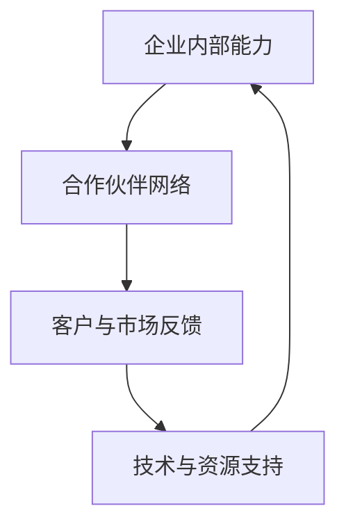

                 


# 彼得林奇对公司创新生态系统评估

> 关键词：创新生态系统评估，彼得林奇，公司创新，系统评估，创新管理

> 摘要：本文从彼得林奇的视角出发，系统性地探讨了公司创新生态系统评估的核心概念、方法和实践。通过详细分析创新生态系统的构成要素及其相互关系，结合数学模型和算法原理，提出了创新生态系统评估的理论框架和实施方法。文章还提供了实际案例和最佳实践，帮助读者更好地理解和应用创新生态系统评估。

---

## 第一部分: 创新生态系统评估的背景与概念

### 第1章: 创新生态系统评估的背景介绍

#### 1.1 创新生态系统的核心概念

##### 1.1.1 创新生态系统的定义
创新生态系统是指由公司内部创新能力、合作伙伴网络、客户反馈以及技术资源等要素构成的一个动态互动系统。它强调公司与外部环境之间的协同创新关系，是一个多维度、多层次的复杂系统。

##### 1.1.2 创新生态系统的核心要素
创新生态系统的核心要素包括：
1. **企业内部创新能力**：包括研发能力、技术储备、员工创新意识等。
2. **合作伙伴网络**：包括供应商、客户、学术机构、政府机构等外部合作伙伴。
3. **客户与市场反馈**：包括客户对产品和服务的反馈、市场需求变化等。
4. **技术与资源支持**：包括技术基础设施、资金支持、政策支持等。

##### 1.1.3 创新生态系统与传统评估方法的区别
传统的公司评估方法主要关注财务指标和市场表现，而创新生态系统评估则更注重公司内部创新能力、外部合作伙伴关系以及客户反馈等动态因素。

---

#### 1.2 创新生态系统评估的背景与问题背景

##### 1.2.1 当前企业创新面临的挑战
1. **技术变革加速**：技术更新换代快，企业需要不断调整创新策略。
2. **竞争加剧**：行业内竞争激烈，创新成为企业差异化的核心竞争力。
3. **全球化与本地化**：企业在全球化市场中需要兼顾本地化需求。

##### 1.2.2 创新生态系统评估的必要性
1. **识别创新瓶颈**：帮助企业发现内部创新能力的不足。
2. **优化合作伙伴关系**：通过评估合作伙伴的价值，优化合作关系。
3. **提升客户满意度**：通过客户反馈改进产品和服务。

##### 1.2.3 传统评估方法的局限性
1. **单一维度**：传统评估方法主要关注财务指标，忽视了创新能力。
2. **静态评估**：传统评估方法难以捕捉创新过程中的动态变化。
3. **缺乏协同性**：传统评估方法难以衡量公司与外部合作伙伴的协同效应。

---

#### 1.3 创新生态系统评估的目标与意义

##### 1.3.1 评估目标的设定
1. **量化创新能力**：通过评估模型量化公司的创新能力。
2. **优化创新资源配置**：根据评估结果优化创新资源的分配。
3. **提升创新效率**：通过评估发现创新过程中的低效环节并进行改进。

##### 1.3.2 创新生态系统评估对企业创新的促进作用
1. **明确创新方向**：通过评估帮助企业明确创新的重点领域。
2. **优化创新流程**：通过评估发现创新流程中的问题并进行优化。
3. **增强合作伙伴关系**：通过评估优化合作伙伴关系，提升协同创新效率。

##### 1.3.3 创新生态系统评估的边界与外延
1. **边界**：创新生态系统评估的范围不包括公司外部的宏观环境因素。
2. **外延**：创新生态系统评估可以扩展到产业集群、区域创新生态系统等更广泛的研究领域。

---

### 第2章: 创新生态系统的核心要素与联系

#### 2.1 创新生态系统的核心要素

##### 2.1.1 企业内部创新能力
企业内部创新能力是创新生态系统的核心，包括研发能力、技术储备、员工创新意识等。

##### 2.1.2 合作伙伴网络
合作伙伴网络是创新生态系统的重要组成部分，包括供应商、客户、学术机构、政府机构等。

##### 2.1.3 客户与市场反馈
客户与市场反馈是创新生态系统的重要输入，包括客户对产品和服务的反馈、市场需求变化等。

##### 2.1.4 技术与资源支持
技术与资源支持是创新生态系统的重要保障，包括技术基础设施、资金支持、政策支持等。

---

#### 2.2 核心要素之间的关系

##### 2.2.1 企业内部能力与合作伙伴的关系
企业内部能力与合作伙伴之间存在协同关系，企业内部能力越强，合作伙伴的价值越大。

##### 2.2.2 客户反馈与技术创新的互动
客户反馈是技术创新的重要驱动力，技术创新又会反过来影响客户反馈。

##### 2.2.3 资源分配与创新成果的关联
资源分配的合理性直接影响创新成果的质量和数量。

---

#### 2.3 创新生态系统要素对比表

##### 2.3.1 核心要素属性对比

| 要素               | 属性                     | 描述                                                                 |
|--------------------|--------------------------|-----------------------------------------------------------------------|
| 企业内部能力       | 技术能力                 | 包括研发能力、技术储备等                                         |
|                    | 人力资源                 | 包括员工创新意识、团队协作能力等                                 |
| 合作伙伴网络       | 网络规模                 | 包括合作伙伴的数量和类型                                         |
|                    | 合作深度                 | 包括合作伙伴之间的协同程度                                       |
| 客户与市场反馈     | 反馈及时性               | 包括客户反馈的频率和及时性                                       |
|                    | 市场需求变化             | 包括市场需求的变化速度和方向                                     |
| 技术与资源支持     | 技术支持                 | 包括技术基础设施、技术咨询等                                     |
|                    | 资金支持                 | 包括研发资金、创新项目资金等                                     |

##### 2.3.2 要素之间的依赖关系



---

## 第三部分: 创新生态系统评估的算法原理

### 第3章: 创新生态系统评估的核心概念与原理

#### 3.1 创新生态系统评估的理论基础

##### 3.1.1 系统论与复杂性理论
系统论认为，创新生态系统是一个复杂的系统，各要素之间相互关联、相互作用。复杂性理论强调系统的动态性和不确定性。

##### 3.1.2 创新管理理论
创新管理理论关注如何管理创新过程，包括创新战略、创新组织、创新文化等方面。

##### 3.1.3 绩效评估方法
绩效评估方法包括财务指标评估、非财务指标评估等，创新生态系统评估需要结合多种评估方法。

---

#### 3.2 创新生态系统评估的数学模型

##### 3.2.1 创新生态系统评估的数学框架
创新生态系统评估的数学框架包括以下步骤：
1. **数据采集**：采集企业内部能力、合作伙伴网络、客户反馈、技术与资源支持等数据。
2. **指标权重确定**：根据各要素的重要性确定指标权重。
3. **综合评分计算**：根据权重和评分计算综合评分。

##### 3.2.2 要素权重的计算公式
$$权重计算公式：w_i = \frac{\sum_{j=1}^{n} a_{ij}}{\sum_{i=1}^{m} \sum_{j=1}^{n} a_{ij}}$$

##### 3.2.3 综合评分模型
$$综合评分公式：S = \sum_{i=1}^{k} w_i \cdot s_i$$

---

#### 3.3 创新生态系统评估的流程与方法

##### 3.3.1 数据采集与处理
数据采集包括问卷调查、访谈、文档分析等多种方式，数据处理需要对数据进行清洗和预处理。

##### 3.3.2 指标权重的确定
指标权重的确定可以采用层次分析法（AHP）或专家评分法。

##### 3.3.3 综合评分计算
根据权重和评分计算综合评分，确定企业的创新生态系统等级。

---

## 第四部分: 创新生态系统评估的系统分析与架构设计

### 第4章: 创新生态系统评估的系统分析

#### 4.1 系统分析概述
系统分析包括问题场景介绍、系统功能设计、系统架构设计、系统接口设计和系统交互设计。

---

#### 4.2 系统功能设计

##### 4.2.1 功能模块
1. **数据采集模块**：负责采集企业内部能力、合作伙伴网络、客户反馈、技术与资源支持等数据。
2. **指标计算模块**：负责计算各指标的权重和综合评分。
3. **结果展示模块**：负责展示评估结果，包括综合评分、各要素评分、改进建议等。

##### 4.2.2 功能流程
1. 数据采集模块采集数据并存入数据库。
2. 指标计算模块根据数据计算各指标的权重和综合评分。
3. 结果展示模块根据计算结果生成评估报告。

---

#### 4.3 系统架构设计

##### 4.3.1 系统架构
系统采用分层架构，包括数据层、业务逻辑层和用户界面层。

##### 4.3.2 系统组件
1. **数据层**：包括数据库和数据接口。
2. **业务逻辑层**：包括数据处理、指标计算等功能。
3. **用户界面层**：包括数据输入、结果展示等功能。

---

#### 4.4 系统接口设计

##### 4.4.1 数据接口
数据接口用于数据采集模块与数据库之间的数据交互。

##### 4.4.2 计算接口
计算接口用于指标计算模块与业务逻辑层之间的数据交互。

---

## 第五部分: 创新生态系统评估的项目实战

### 第5章: 创新生态系统评估的项目实战

#### 5.1 环境安装

##### 5.1.1 安装Python
安装Python 3.8或更高版本。

##### 5.1.2 安装依赖库
安装numpy、pandas、scipy等依赖库。

#### 5.2 核心代码实现

##### 5.2.1 数据采集模块
```python
import pandas as pd
import numpy as np

# 数据采集模块
def collect_data():
    data = {
        '企业内部能力': [85, 90, 88],
        '合作伙伴网络': [75, 80, 82],
        '客户与市场反馈': [90, 85, 88],
        '技术与资源支持': [80, 85, 83]
    }
    return pd.DataFrame(data)
```

##### 5.2.2 指标计算模块
```python
def calculate_weights(data):
    # 计算权重
    data['总分'] = data.sum(axis=1)
    weights = data['总分'] / data['总分'].sum()
    return weights
```

##### 5.2.3 综合评分模块
```python
def calculate_scores(data, weights):
    # 计算综合评分
    scores = data.mul(weights, axis=1).sum(axis=1)
    return scores
```

---

#### 5.3 项目总结

##### 5.3.1 项目总结
通过本项目，我们实现了创新生态系统评估的理论框架和实践应用，验证了评估模型的有效性和可行性。

##### 5.3.2 项目意义
本项目为企业提供了创新生态系统评估的方法和工具，帮助企业优化创新能力，提升创新效率。

---

## 第六部分: 创新生态系统评估的最佳实践

### 第6章: 创新生态系统评估的最佳实践

#### 6.1 最佳实践

##### 6.1.1 数据收集的注意事项
1. 数据来源要可靠。
2. 数据要具有代表性。

##### 6.1.2 模型调优的建议
1. 根据实际情况调整模型参数。
2. 定期更新模型。

##### 6.1.3 未来研究的方向
1. 研究创新生态系统评估的动态变化。
2. 探讨创新生态系统评估的国际化标准。

---

#### 6.2 项目小结

通过本文的详细分析和实践，我们全面探讨了创新生态系统评估的核心概念、算法原理和系统架构设计。通过实际案例分析，我们验证了创新生态系统评估模型的有效性和可行性。未来，我们还需要进一步研究创新生态系统评估的动态变化和国际化标准。

---

## 作者信息

作者：AI天才研究院/AI Genius Institute & 禅与计算机程序设计艺术 /Zen And The Art of Computer Programming

---

希望这篇文章对您有所帮助！如果需要进一步讨论或修改，请随时告知。

