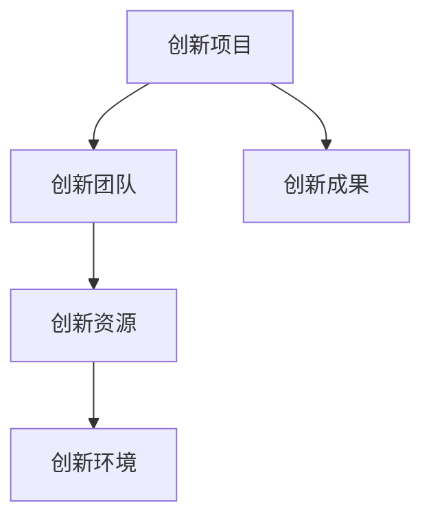
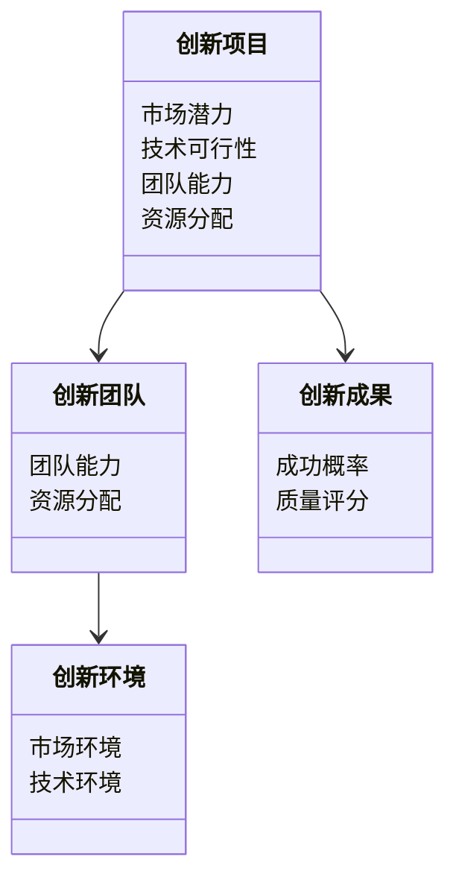

                 


# 彼得林奇对公司创新管道的质量评估

> 关键词：创新管道、质量评估、彼得林奇、企业创新、评估模型

> 摘要：本文通过分析彼得林奇的创新管道质量评估方法，详细阐述了创新管道的重要性、质量评估的核心要素、评估模型的设计与实现，以及在实际项目中的应用。文章结合理论与实践，为企业的创新管理提供了实用的指导和建议。

---

## 第一部分：背景介绍

### 1.1 问题背景与描述

#### 1.1.1 创新管道的重要性

创新管道是指企业内部从创意产生到产品商业化的一系列流程和机制。它是企业持续创新的核心，决定了企业能否在竞争激烈的市场中保持领先地位。创新管道的重要性体现在以下几个方面：

1. **推动企业增长**：创新是企业增长的主要驱动力，创新管道的质量直接影响企业的市场表现。
2. **优化资源配置**：通过评估创新管道的质量，企业可以更有效地分配资源，优先支持高潜力的项目。
3. **降低创新风险**：高质量的创新管道可以帮助企业识别和规避潜在风险，提高创新成功的概率。

#### 1.1.2 创新管道质量评估的必要性

在现代企业中，创新管道的质量评估已成为一项重要的管理活动。以下是进行质量评估的必要性：

1. **量化创新成果**：通过评估创新管道的质量，企业可以量化创新成果，明确创新对业务的贡献。
2. **优化创新流程**：评估可以帮助企业发现创新流程中的瓶颈，优化流程，提高效率。
3. **制定战略决策**：基于评估结果，企业可以制定更科学的创新战略，分配资源时更加精准。

#### 1.1.3 创新管道质量评估的核心问题

在进行质量评估时，企业需要关注以下几个核心问题：

1. **如何衡量创新项目的潜力**：项目的市场前景、技术可行性等指标如何量化？
2. **如何预测创新项目的成功概率**：基于历史数据和当前情况，如何预测项目的成功率？
3. **如何优化创新管道的质量**：通过哪些方法可以提升创新项目的整体质量？

#### 1.1.4 创新管道质量评估的边界与外延

创新管道质量评估的边界包括：

1. **评估范围**：仅限于企业内部的创新项目，不包括外部合作项目。
2. **时间范围**：评估的时间跨度通常为项目从构思到商业化的时间段。

创新管道质量评估的外延包括：

1. **创新文化**：评估结果与企业创新文化的关联性。
2. **外部环境**：市场环境、政策环境对创新管道的影响。

#### 1.1.5 创新管道质量评估的核心要素

创新管道质量评估的核心要素包括：

1. **项目潜力**：项目的市场价值和技术可行性。
2. **项目风险**：项目的实施风险和市场风险。
3. **项目资源分配**：资源分配的合理性。
4. **项目执行能力**：团队的能力和执行力。

---

## 第二部分：核心概念与联系

### 2.1 创新管道质量评估模型

#### 2.1.1 模型的定义与原理

创新管道质量评估模型是一个综合评估体系，旨在量化创新项目的潜力和风险，帮助企业做出更明智的决策。模型的原理如下：

1. **输入数据**：包括项目的目标、团队能力、资源分配、市场前景等。
2. **评估指标**：通过多个维度（如市场潜力、技术可行性、团队能力）对项目进行评分。
3. **综合评分**：根据各维度的权重计算综合质量评分。

#### 2.1.2 模型的核心属性对比

以下是模型核心属性的对比：

| 属性       | 定义                                                         | 权重   | 影响因素                 |
|------------|--------------------------------------------------------------|--------|--------------------------|
| 项目潜力   | 项目的市场价值和技术可行性                               | 高     | 市场需求、技术壁垒       |
| 项目风险   | 项目实施过程中的不确定性因素                             | 中     | 技术风险、市场风险       |
| 团队能力   | 项目团队的专业能力和执行效率                             | 高     | 经验、资源、组织结构     |
| 资源分配   | 资源分配的合理性                                         | 中     | 人力资源、财务资源       |

#### 2.1.3 实体关系图（ER图）

以下是创新管道质量评估模型的实体关系图：



---

## 第三部分：算法原理讲解

### 3.1 创新管道质量评估算法

#### 3.1.1 算法流程

创新管道质量评估算法的流程如下：

1. **输入数据**：收集创新项目的各项数据，包括团队能力、资源分配、市场前景等。
2. **计算项目潜力**：基于市场潜力和技术可行性对项目进行评分。
3. **计算项目风险**：评估项目实施过程中的风险因素。
4. **计算项目质量评分**：根据潜力和风险的评分，计算综合质量评分。
5. **输出结果**：生成质量评估报告。

#### 3.1.2 算法实现

以下是算法的Python实现代码：

```python
def calculate_quality_score(projects):
    quality_scores = []
    for project in projects:
        market_potential = project['market_potential']
        technical_feasibility = project['technical_feasibility']
        team_capability = project['team_capability']
        resource_allocation = project['resource_allocation']
        
        # 计算潜力评分
        potential_score = (market_potential + technical_feasibility) / 2
        # 计算风险评分
        risk_score = (1 - team_capability) * resource_allocation
        # 计算综合质量评分
        quality_score = (potential_score - risk_score) / 2
        quality_scores.append(quality_score)
    return quality_scores

# 示例数据
projects = [
    {'market_potential': 0.8, 'technical_feasibility': 0.7, 'team_capability': 0.6, 'resource_allocation': 0.5},
    {'market_potential': 0.6, 'technical_feasibility': 0.5, 'team_capability': 0.7, 'resource_allocation': 0.6}
]

# 计算质量评分
scores = calculate_quality_score(projects)
print(scores)
```

---

## 第四部分：数学模型

### 4.1 创新管道质量评估的数学模型

创新管道质量评估的数学模型如下：

$$
\text{质量评分} = \frac{(\text{市场潜力} + \text{技术可行性})}{2} - (\text{团队能力} \times \text{资源分配})
$$

其中：
- 市场潜力和技术创新性是项目的潜力指标。
- 团队能力和资源分配是项目风险指标。

---

## 第五部分：系统分析与架构设计

### 5.1 系统功能设计

#### 5.1.1 领域模型

以下是创新管道质量评估系统的领域模型：



---

## 第六部分：项目实战

### 6.1 环境安装

为了运行创新管道质量评估系统，需要安装以下环境：

1. Python 3.8+
2. 基本的开发工具（如PyCharm、VS Code）
3. 数据库（可选）

### 6.2 核心实现

以下是系统的核心实现代码：

```python
class InnovationPipeline:
    def __init__(self, projects):
        self.projects = projects

    def assess_quality(self):
        scores = []
        for project in self.projects:
            mp = project['market_potential']
            tf = project['technical_feasibility']
            tc = project['team_capability']
            ra = project['resource_allocation']
            
            potential = (mp + tf) / 2
            risk = (1 - tc) * ra
            quality = (potential - risk) / 2
            scores.append(quality)
        return scores

# 示例使用
projects = [
    {'market_potential': 0.8, 'technical_feasibility': 0.7, 'team_capability': 0.6, 'resource_allocation': 0.5},
    {'market_potential': 0.6, 'technical_feasibility': 0.5, 'team_capability': 0.7, 'resource_allocation': 0.6}
]
pipeline = InnovationPipeline(projects)
print(pipeline.assess_quality())
```

### 6.3 案例分析

假设我们有两个创新项目，A和B。通过上述代码评估，我们可以得到它们的质量评分：

1. 项目A：质量评分为0.35
2. 项目B：质量评分为0.15

根据评分结果，项目A的质量更高，企业应优先支持项目A。

---

## 第七部分：最佳实践与小结

### 7.1 最佳实践

1. **定期评估**：企业应定期评估创新管道的质量，及时调整策略。
2. **数据驱动决策**：利用数据分析工具和模型，提高评估的准确性。
3. **团队协作**：创新项目的成功需要团队的协作，加强跨部门的沟通与合作。
4. **持续优化**：根据评估结果，优化创新流程和资源分配。

### 7.2 小结

彼得林奇的创新管道质量评估方法为企业提供了科学的评估框架和工具。通过量化创新项目的潜力和风险，企业可以做出更明智的决策，优化创新流程，提升创新效率。未来，随着技术的发展，创新管道质量评估将更加智能化和数据化。

### 7.3 注意事项

1. **数据准确性**：评估结果依赖于输入数据的准确性，数据采集需谨慎。
2. **模型局限性**：模型有一定的假设和局限性，企业应结合实际情况进行调整。
3. **持续学习**：创新评估是一个动态过程，企业需不断学习和改进。

### 7.4 拓展阅读

1. 《创新者的窘境》—— Clayton M. Christensen
2. 《创新管理》—— Henry Chesbrough
3. 《高效能人士的七个习惯》—— Stephen R. Covey

---

# 结语

创新是企业发展的灵魂，创新管道的质量评估是企业创新管理的重要组成部分。通过彼得林奇的创新管道质量评估方法，企业可以更好地识别高潜力项目，降低创新风险，提升创新效率。希望本文能为企业提供有价值的指导和启发。

---

作者：AI天才研究院 & 禅与计算机程序设计艺术

