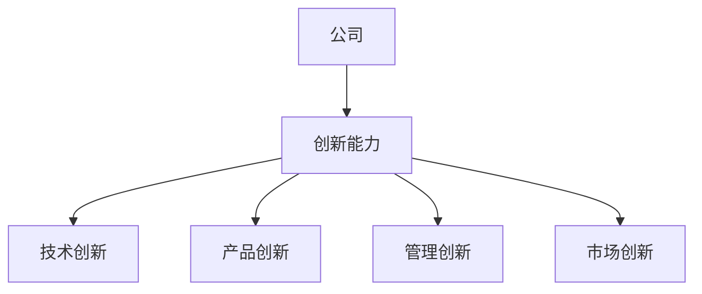
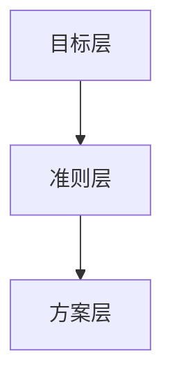
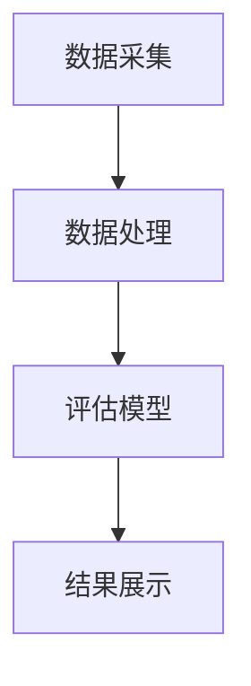

                 


# 彼得林奇对公司创新能力的评估体系

> 关键词：公司创新能力，彼得林奇，评估体系，投资策略，技术创新，企业成长

> 摘要：本文详细探讨了彼得林奇对公司创新能力的评估体系，从背景、核心概念、评估指标、算法原理、系统架构到项目实战，全面剖析了如何科学、系统地评估公司的创新能力。通过实际案例分析和详细的技术实现，本文为投资者和企业管理者提供了实用的评估方法和工具。

---

# 第1章: 公司创新能力评估的背景与重要性

## 1.1 什么是公司创新能力

### 1.1.1 公司创新能力的定义
公司创新能力是指企业在市场中通过技术创新、产品创新、管理创新和市场创新等方面，持续推出新产品、新服务或新商业模式的能力。它是企业保持竞争优势、实现可持续增长的核心动力。

### 1.1.2 创新能力的核心要素
- **技术创新**：技术的研发投入、专利数量、技术领先性。
- **产品创新**：产品的更新迭代速度、市场适应性。
- **管理创新**：管理模式、组织架构的优化。
- **市场创新**：市场拓展能力、品牌影响力。

### 1.1.3 创新能力的边界与外延
创新能力不仅包括技术创新，还包括商业模式的创新，甚至包括企业文化的创新能力。创新能力的外延涉及企业内外部资源的整合能力。

---

## 1.2 为什么评估公司创新能力

### 1.2.1 创新能力对企业发展的影响
创新能力是企业在激烈市场竞争中胜出的关键。创新能力强的企业能够更快地适应市场变化，抓住新兴机会。

### 1.2.2 创新能力对投资者的价值
对于投资者来说，创新能力是判断一家公司长期价值的重要指标。创新能力强的公司具有更高的成长潜力和投资价值。

### 1.2.3 创新能力与公司竞争优势的关系
创新能力是公司竞争优势的核心来源。通过创新能力，企业可以不断推出新产品、优化管理、拓展市场，从而在竞争中占据优势。

---

## 1.3 彼得林奇与公司创新能力评估

### 1.3.1 彼得林奇的投资理念
彼得林奇是著名的投资专家，他强调长期投资、价值投资和基本面分析。他非常重视公司的创新能力，认为创新能力是公司长期增长的关键。

### 1.3.2 彼得林奇对创新公司的关注
彼得林奇关注那些具有持续创新能力的公司，尤其是那些能够不断推出新产品、优化管理模式的企业。

### 1.3.3 彼得林奇评估体系的核心思想
彼得林奇的评估体系强调对公司创新能力的全面分析，包括技术创新、产品创新、管理创新和市场创新等多个维度。

---

## 1.4 本章小结

---

# 第2章: 公司创新能力的核心概念与联系

## 2.1 创新能力的核心要素

### 2.1.1 技术创新
技术创新是公司创新能力的核心要素之一。技术创新包括研发投入、技术领先性、专利数量等方面。

### 2.1.2 产品创新
产品创新是公司创新能力的重要体现。产品创新能力强的公司能够不断推出新产品，满足市场需求。

### 2.1.3 管理创新
管理创新是公司创新能力的重要组成部分。有效的管理创新能够提高企业的运营效率，降低管理成本。

### 2.1.4 市场创新
市场创新是公司创新能力的重要表现。市场创新能力强的公司能够快速拓展市场，提升品牌影响力。

---

## 2.2 创新能力与公司绩效的关系

### 2.2.1 创新能力与公司收入增长
创新能力与公司收入增长密切相关。创新能力越强的公司，收入增长速度越快。

### 2.2.2 创新能力与公司利润率
创新能力与公司利润率密切相关。创新能力越强的公司，利润率越高。

### 2.2.3 创新能力与公司市场地位
创新能力与公司市场地位密切相关。创新能力越强的公司，市场地位越高。

---

## 2.3 创新能力的对比分析

### 2.3.1 不同行业创新能力的对比
不同行业的创新能力存在显著差异。例如，科技行业创新能力较强，传统行业创新能力较弱。

### 2.3.2 不同规模公司创新能力的对比
大型公司创新能力较强，小型公司创新能力较弱。但小型公司具有灵活性优势，创新能力可能更强。

### 2.3.3 创新能力与公司生命周期的关系
创新能力与公司生命周期密切相关。初创期公司创新能力较强，成熟期公司创新能力可能较弱。

---

## 2.4 创新能力的ER实体关系图



---

## 2.5 本章小结

---

# 第3章: 公司创新能力评估的算法原理

## 3.1 创新能力评估的指标体系

### 3.1.1 技术创新指标
技术创新指标包括研发投入占比、专利数量、技术领先性等。

### 3.1.2 产品创新指标
产品创新指标包括新产品推出速度、产品生命周期、市场反馈等。

### 3.1.3 管理创新指标
管理创新指标包括管理效率、组织架构优化、成本控制等。

### 3.1.4 市场创新指标
市场创新指标包括市场份额、品牌影响力、市场拓展速度等。

---

## 3.2 创新能力评估的数学模型

### 3.2.1 层次分析法（AHP）



层次分析法是一种常用的决策分析方法，适用于多指标评估问题。通过构建层次分析模型，可以将复杂的评估问题分解为多个层次，逐步分析各层次的重要性。

---

## 3.3 算法实现与案例分析

### 3.3.1 算法实现步骤
1. 确定评估指标。
2. 构建层次分析模型。
3. 确定各指标的权重。
4. 计算各公司的创新能力得分。
5. 根据得分进行排序和分析。

### 3.3.2 创新能力评估的Python实现

```python
import numpy as np

def calculate创新能力得分(公司数据):
    # 计算技术创新得分
    技术创新得分 = 公司数据['研发投入占比'] * 0.4 + 公司数据['专利数量'] * 0.3
    # 计算产品创新得分
    产品创新得分 = 公司数据['新产品推出速度'] * 0.4 + 公司数据['市场反馈'] * 0.3
    # 计算管理创新得分
    管理创新得分 = 公司数据['管理效率'] * 0.4 + 公司数据['组织架构优化'] * 0.3
    # 计算市场创新得分
    市场创新得分 = 公司数据['市场份额'] * 0.4 + 公司数据['品牌影响力'] * 0.3
    # 综合创新能力得分
    综合得分 = 技术创新得分 * 0.3 + 产品创新得分 * 0.3 + 管理创新得分 * 0.2 + 市场创新得分 * 0.2
    return 综合得分

公司数据 = {
    '研发投入占比': 0.08,
    '专利数量': 10,
    '新产品推出速度': 0.15,
    '市场反馈': 0.7,
    '管理效率': 0.12,
    '组织架构优化': 0.18,
    '市场份额': 0.25,
    '品牌影响力': 0.8
}

得分 = calculate创新能力得分(公司数据)
print("综合创新能力得分:", 得分)
```

---

## 3.4 本章小结

---

# 第4章: 创新能力评估的数学模型与系统架构

## 4.1 创新能力评估的数学模型

### 4.1.1 综合创新能力模型
$$C = \sum_{i=1}^{n} w_i x_i$$
其中，$C$ 表示创新能力，$w_i$ 表示第$i$个指标的权重，$x_i$ 表示第$i$个指标的得分。

### 4.1.2 评估模型的优化
通过优化权重分配，可以提高评估模型的准确性。

---

## 4.2 系统架构设计

### 4.2.1 系统功能设计
1. 数据采集模块：采集公司创新能力相关的数据。
2. 数据处理模块：对数据进行清洗和预处理。
3. 评估模型模块：计算公司创新能力得分。
4. 结果展示模块：将评估结果以可视化形式展示。

### 4.2.2 系统架构图



---

## 4.3 本章小结

---

# 第5章: 项目实战与案例分析

## 5.1 项目背景

---

## 5.2 环境安装与代码实现

### 5.2.1 环境安装
需要安装Python、numpy、pandas等库。

### 5.2.2 核心代码实现

```python
import pandas as pd

# 读取公司数据
公司数据 = pd.read_csv('公司创新能力数据.csv')

# 计算创新能力得分
def calculate创新能力得分(row):
    # 技术创新得分
    技术创新得分 = row['研发投入占比'] * 0.4 + row['专利数量'] * 0.3
    # 产品创新得分
    产品创新得分 = row['新产品推出速度'] * 0.4 + row['市场反馈'] * 0.3
    # 管理创新得分
    管理创新得分 = row['管理效率'] * 0.4 + row['组织架构优化'] * 0.3
    # 市场创新得分
    市场创新得分 = row['市场份额'] * 0.4 + row['品牌影响力'] * 0.3
    # 综合得分
    综合得分 = 技术创新得分 * 0.3 + 产品创新得分 * 0.3 + 管理创新得分 * 0.2 + 市场创新得分 * 0.2
    return 综合得分

公司数据['创新能力得分'] = 公司数据.apply(calculate创新能力得分, axis=1)

# 输出结果
print(公司数据.head())
```

---

## 5.3 案例分析与结果解读

---

## 5.4 项目总结

---

## 5.5 本章小结

---

# 第6章: 最佳实践与注意事项

## 6.1 投资策略建议

---

## 6.2 注意事项

---

## 6.3 未来展望

---

## 6.4 本章小结

---

# 第7章: 总结与展望

## 7.1 全文总结

---

## 7.2 未来展望

---

## 7.3 本章小结

---

# 作者

作者：AI天才研究院/AI Genius Institute & 禅与计算机程序设计艺术 /Zen And The Art of Computer Programming

---

以上是完整的文章大纲和部分章节内容，您可以根据需要进一步补充完善。

