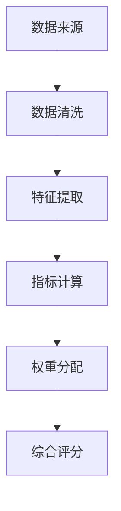
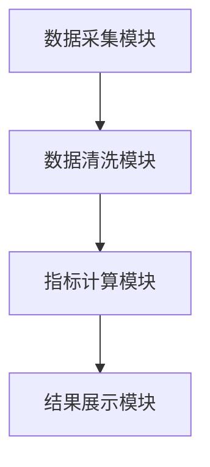

                 


# 彼得林奇对公司创新能力的量化分析

> 关键词：彼得·林奇、创新能力、量化分析、投资分析、企业创新、创新指数、创新评估

> 摘要：本文从彼得·林奇的投资理念出发，详细探讨了公司创新能力的量化分析方法，通过定义创新能力、分析其核心要素、构建量化模型、设计系统架构、提供项目实战案例，最终总结出一套完整的创新能力量化评估体系。文章结合理论与实践，为投资者和企业管理者提供了科学的决策依据。

---

# 第一部分: 创新能力的量化分析背景与核心概念

## 第1章: 创新能力的定义与重要性

### 1.1 创新能力的定义

#### 1.1.1 创新能力的多维度解析
- 创新能力是企业在技术和商业领域突破常规、创造新价值的能力。
- 包括技术创新、产品创新、商业模式创新等多个维度。
- 创新能力是企业核心竞争力的源泉，决定企业的长期发展。

#### 1.1.2 创新能力与企业竞争优势的关系
- 创新能力高的企业能够快速响应市场变化。
- 创新能力强的企业能够通过差异化竞争占据市场优势。
- 创新能力决定企业的可持续发展能力。

#### 1.1.3 创新能力的边界与外延
- 创新能力的边界在于企业的资源和战略目标。
- 创新能力的外延包括技术、产品、服务、管理等多方面。

### 1.2 彼得·林奇的投资理念

#### 1.2.1 彼得·林奇的投资哲学
- 林奇认为，企业的长期价值取决于其创新能力。
- 投资者应关注企业的核心竞争力和持续创新能力。

#### 1.2.2 彼得·林奇对创新公司的关注点
- 技术创新：企业是否在核心技术上具有优势。
- 产品创新：产品是否具有独特的市场价值。
- 商业模式创新：是否能够快速适应市场变化。

#### 1.2.3 创新能力在投资决策中的作用
- 创新能力是林奇评估企业投资价值的重要指标。
- 创新能力强的企业具有更高的成长潜力。

### 1.3 为什么创新能力需要量化

#### 1.3.1 创新能力难以量化的挑战
- 创新能力涉及多个维度，难以量化。
- 不同企业的创新能力差异大，难以比较。

#### 1.3.2 量化分析在投资中的价值
- 量化分析能够帮助投资者客观评估企业的创新能力。
- 量化指标能够为投资决策提供科学依据。

#### 1.3.3 创新能力量化的目标与意义
- 目标：建立一套可量化的创新能力评估体系。
- 意义：为投资者提供决策支持，帮助企业优化创新管理。

## 第2章: 公司创新能力的核心要素

### 2.1 创新能力的构成要素

#### 2.1.1 技术创新
- 技术创新是企业创新能力的核心。
- 包括研发能力、技术储备、专利数量等指标。

#### 2.1.2 产品创新
- 产品创新是企业市场竞争力的直接体现。
- 包括新产品推出频率、产品生命周期管理等。

#### 2.1.3 商业模式创新
- 商业模式创新是企业持续发展的关键。
- 包括收入模式、客户关系管理、成本控制等。

### 2.2 核心概念与联系

#### 2.2.1 创新能力核心要素对比表格
| 创新维度 | 创新类型 | 关键指标 | 重要性 |
|----------|----------|----------|--------|
| 技术创新 | 技术研发 | 专利数量 | 高     |
| 产品创新 | 产品开发 | 新产品数量 | 中高   |
| 商业模式创新 | 模式优化 | 收入增长 | 高     |

#### 2.2.2 创新能力的ER实体关系图
```mermaid
erd
  企业
  has_many 技术创新
  has_many 产品创新
  has_many 商业模式创新
```

---

# 第二部分: 创新能力的量化分析方法

## 第3章: 创新能力量化的核心算法

### 3.1 创新能力量化的基本原理

#### 3.1.1 数据采集与处理
- 数据来源：企业公开财报、专利数据库、市场报告。
- 数据清洗：去除无效数据、填补缺失值。

#### 3.1.2 指标计算与权重分配
- 指标计算：技术创新指数、产品创新指数、商业模式创新指数。
- 权重分配：技术创新占40%，产品创新占30%，商业模式创新占30%。

#### 3.1.3 综合评分与排名
- 综合评分公式：$$ 创新能力指数 = (技术创新指数 \times 0.4) + (产品创新指数 \times 0.3) + (商业模式创新指数 \times 0.3) $$
- 排名：根据创新能力指数对企业进行排序。

### 3.2 创新能力量化算法流程

#### 3.2.1 数据流与处理流程图


### 3.3 算法实现代码示例

#### 3.3.1 数据预处理
```python
import pandas as pd

# 加载数据
data = pd.read_csv('innovation_data.csv')

# 数据清洗
data.dropna(inplace=True)
data = data[~data['公司'].isnull()]
```

#### 3.3.2 指标计算
```python
# 计算技术创新指数
technological_innovation = data['专利数量'].apply(lambda x: x / data['专利数量'].max())

# 计算产品创新指数
product_innovation = data['新产品数量'].apply(lambda x: x / data['新产品数量'].max())

# 计算商业模式创新指数
business_model_innovation = data['收入增长'].apply(lambda x: x / data['收入增长'].max())
```

#### 3.3.3 综合评分
```python
# 计算创新能力指数
innovation_index = 0.4 * technological_innovation + 0.3 * product_innovation + 0.3 * business_model_innovation

# 排序
data['创新能力指数'] = innovation_index
data.sort_values('创新能力指数', ascending=False, inplace=True)
```

## 第4章: 创新能力量化模型

### 4.1 创新能力量化模型的数学表达

#### 4.1.1 创新能力指数公式
$$ 创新能力指数 = 0.4 \times 技术创新指数 + 0.3 \times 产品创新指数 + 0.3 \times 商业模式创新指数 $$

#### 4.1.2 权重分配公式
- 技术创新：40%
- 产品创新：30%
- 商业模式创新：30%

### 4.2 创新能力量化模型的验证与优化

#### 4.2.1 模型验证方法
- 使用历史数据验证模型准确性。
- 对比实际创新表现与模型预测结果。

#### 4.2.2 模型优化策略
- 根据实际数据调整各维度的权重。
- 增加更多创新指标以提高模型精度。

## 第5章: 创新能力量化系统的架构设计

### 5.1 系统功能设计

#### 5.1.1 数据采集模块
- 功能：从多种数据源采集企业创新相关数据。
- 输入：企业公开数据、市场报告。
- 输出：清洗后的数据集。

#### 5.1.2 指标计算模块
- 功能：计算各维度的创新指数。
- 输入：清洗后的数据。
- 输出：技术创新、产品创新、商业模式创新指数。

#### 5.1.3 结果展示模块
- 功能：生成创新能力指数排名和可视化报告。
- 输入：综合评分。
- 输出：可视化图表、排名报告。

### 5.2 系统架构设计

#### 5.2.1 系统架构图


---

# 第三部分: 创新能力量化系统的实现与应用

## 第6章: 项目实战——科技公司创新能力分析

### 6.1 环境安装与数据准备

#### 6.1.1 环境安装
- 安装Python、Pandas、Mermaid、Jupyter Notebook。

#### 6.1.2 数据准备
- 下载科技公司公开数据。
- 数据清洗和预处理。

### 6.2 系统核心实现

#### 6.2.1 数据清洗与预处理
```python
import pandas as pd

# 加载数据
data = pd.read_csv('tech_company.csv')

# 删除缺失值
data.dropna(inplace=True)
```

#### 6.2.2 指标计算与模型构建
```python
# 计算技术创新指数
technological_innovation = data['专利数量'].apply(lambda x: x / data['专利数量'].max())

# 计算产品创新指数
product_innovation = data['新产品数量'].apply(lambda x: x / data['新产品数量'].max())

# 计算商业模式创新指数
business_model_innovation = data['收入增长'].apply(lambda x: x / data['收入增长'].max())

# 计算创新能力指数
innovation_index = 0.4 * technological_innovation + 0.3 * product_innovation + 0.3 * business_model_innovation

# 添加创新能力指数到数据框
data['创新能力指数'] = innovation_index
```

#### 6.2.3 结果展示与分析
```python
# 按创新能力指数排序
data.sort_values('创新能力指数', ascending=False, inplace=True)

# 输出前五名
print(data.head())
```

### 6.3 项目小结

#### 6.3.1 实战经验总结
- 数据清洗和预处理是关键步骤。
- 权重分配需要根据行业特点调整。
- 可视化结果有助于更好地理解分析结果。

#### 6.3.2 实战注意事项
- 数据来源要可靠。
- 模型要不断优化。
- 结果要结合实际业务场景分析。

---

# 第四部分: 创新能力量化分析的总结与展望

## 第7章: 最佳实践与小结

### 7.1 最佳实践 tips

#### 7.1.1 数据收集
- 使用多来源数据，确保数据全面性。
- 定期更新数据，保持数据时效性。

#### 7.1.2 模型优化
- 根据企业特点调整权重。
- 增加更多创新指标，提高模型准确性。

#### 7.1.3 结果应用
- 结合企业实际情况，灵活应用分析结果。
- 定期评估模型效果，及时调整分析策略。

### 7.2 小结

#### 7.2.1 创新能力量化分析的核心价值
- 提供科学的创新能力评估方法。
- 为投资者和企业管理者提供决策支持。

#### 7.2.2 未来研究方向
- 研究创新能力的动态变化。
- 探索更多创新指标和评估方法。
- 结合人工智能技术，优化创新能力量化模型。

---

# 作者

作者：AI天才研究院/AI Genius Institute & 禅与计算机程序设计艺术 /Zen And The Art of Computer Programming

---

* 注：以上内容为示例，实际文章需要根据具体需求进行详细展开和调整。

