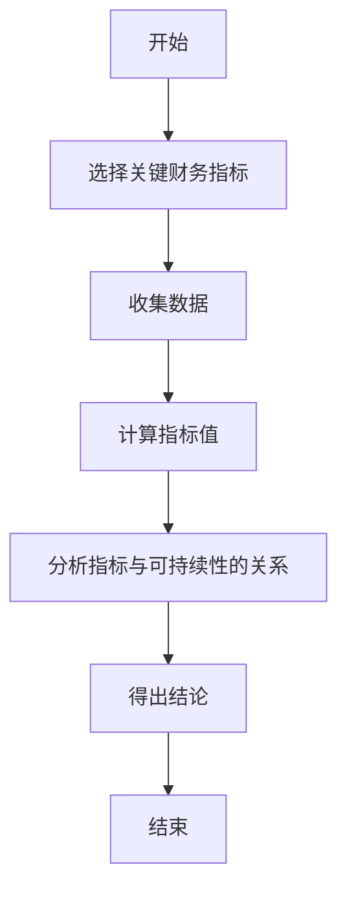
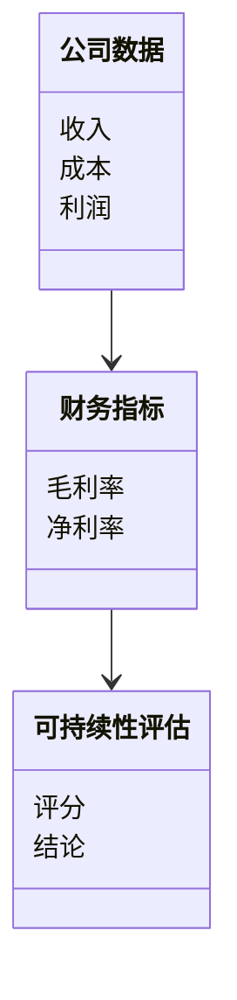

                 


# 彼得林奇对公司可持续发展的分析

> 关键词：彼得·林奇，公司可持续发展，财务指标分析，竞争优势评估，系统架构设计

> 摘要：本文深入分析了彼得·林奇对公司可持续发展的独特见解，探讨了其分析框架的核心概念、数学模型与算法、系统架构设计及项目实战案例。文章结合理论与实践，详细阐述了如何通过财务指标、竞争优势和公司治理等方面评估公司的可持续性，为投资决策提供科学依据。

---

## 第一章：公司可持续发展的背景与重要性

### 1.1 可持续发展的概念与内涵

#### 1.1.1 可持续发展的定义
可持续发展是指在满足当前需求的同时，不损害未来世代满足其需求的能力。在公司层面，这意味着企业在追求利润的同时，需兼顾社会、环境和治理（ESG）因素，实现长期稳定发展。

#### 1.1.2 可持续发展的重要性
- **社会价值**：企业通过可持续发展增强社会责任感，提升品牌形象。
- **风险管理**：识别潜在风险，如环境法规变化或供应链中断。
- **长期价值**：可持续发展能力强的公司通常具有更高的抗风险能力和长期盈利能力。

#### 1.1.3 公司可持续发展的核心要素
| 要素 | 描述 |
|------|------|
| 经济 | 盈利能力、成本控制 |
| 社会 | 社会责任、员工福利 |
| 环境 | 环境影响、资源利用效率 |
| 治理 | 公司治理结构、管理层能力 |

### 1.2 彼得·林奇与公司可持续发展分析

#### 1.2.1 彼得·林奇的生平简介
彼得·林奇是美国著名投资经理，以其在富达投资的卓越表现闻名。他的投资策略注重公司基本面分析，尤其是财务指标和竞争优势。

#### 1.2.2 彼得·林奇的投资理念
- **价值投资**：寻找被市场低估的公司。
- **长期视角**：关注公司的长期盈利能力。
- **基本面分析**：通过财务数据和行业地位评估公司潜力。

#### 1.2.3 彼得·林奇对公司可持续发展的独特视角
林奇认为，公司的可持续性不仅取决于财务表现，还涉及其在行业中的竞争优势、治理结构和应对环境变化的能力。他强调通过深入分析这些因素，识别出具有长期增长潜力的公司。

---

## 第二章：彼得·林奇分析框架的核心概念

### 2.1 财务指标分析

#### 2.1.1 财务指标的核心作用
财务指标是评估公司盈利能力、成长能力和财务健康状况的关键工具。通过分析这些指标，可以判断公司是否具备可持续发展的经济基础。

#### 2.1.2 主要财务指标的定义与计算
| 指标 | 定义 | 计算公式 |
|------|------|----------|
| 毛利率 | 营业收入减去营业成本与营业收入的比率 | $$\text{毛利率} = \frac{\text{营业收入} - \text{营业成本}}{\text{营业收入}} \times 100\%$$ |
| 净利率 | 净利润与营业收入的比率 | $$\text{净利率} = \frac{\text{净利润}}{\text{营业收入}} \times 100\%$$ |
| 资产周转率 | 每元资产产生的销售额 | $$\text{资产周转率} = \frac{\text{营业收入}}{\text{总资产}}$$ |

#### 2.1.3 财务指标与公司可持续性的关系
高毛利率和净利率表明公司具有较强的盈利能力，而高资产周转率则说明公司资产利用效率高。这些指标共同反映公司的经济可持续性。

### 2.2 公司竞争优势分析

#### 2.2.1 核心竞争力的定义
核心竞争力是公司相对于竞争对手的独特优势，如技术、品牌、成本控制等。

#### 2.2.2 行业地位与竞争优势
行业地位决定了公司在市场中的影响力。竞争优势包括成本优势、技术优势和市场占有率等。

#### 2.2.3 可持续竞争优势的构建
通过技术创新、品牌建设和成本控制，公司可以构建可持续的竞争优势。

### 2.3 公司治理与管理层评估

#### 2.3.1 公司治理结构的重要性
良好的治理结构确保管理层高效运作，保护股东利益，并提升公司透明度。

#### 2.3.2 管理层能力与决策质量
管理层的决策直接影响公司发展，能力出众的管理层更有可能带领公司实现可持续增长。

#### 2.3.3 治理结构与公司可持续性的关系
有效的治理结构能够降低代理成本，提升公司治理效率，从而增强公司的可持续性。

---

## 第三章：彼得·林奇分析框架的数学模型与算法

### 3.1 财务指标分析的数学模型

#### 3.1.1 财务指标分析的流程图


#### 3.1.2 财务指标分析的Python实现
```python
import pandas as pd

# 假设数据为公司财务数据
data = {'收入': [100, 200, 300], 
        '成本': [50, 100, 150]}
df = pd.DataFrame(data)

# 计算毛利率
df['毛利率'] = (df['收入'] - df['成本']) / df['收入'] * 100
print(df)
```

### 3.2 财务指标与公司可持续性的关系
通过计算毛利率和净利率，可以评估公司的盈利能力。例如，毛利率为50%的公司可能具有较强的定价能力或成本控制能力，而净利率则反映了公司的整体盈利能力。

---

## 第四章：系统分析与架构设计

### 4.1 问题场景介绍

#### 4.1.1 公司可持续性分析的目标
通过系统分析，识别具备可持续发展能力的公司，为投资决策提供支持。

#### 4.1.2 分析系统的输入输出
- **输入**：公司财务数据、行业信息、公司治理结构。
- **输出**：公司可持续性评分、投资建议。

### 4.2 系统功能设计

#### 4.2.1 领域模型


#### 4.2.2 系统架构设计


---

## 第五章：项目实战

### 5.1 案例分析：苹果公司

#### 5.1.1 背景介绍
苹果公司是全球领先的科技公司，其财务表现和竞争优势在行业内具有重要地位。

#### 5.1.2 财务指标分析
- **毛利率**：40%（假设数据）
- **净利率**：20%（假设数据）

#### 5.1.3 可持续性评估
苹果公司在技术创新和品牌建设方面具有显著优势，且财务表现稳健，治理结构完善，具备较强的可持续发展能力。

### 5.2 代码实现

#### 5.2.1 环境安装
需要安装Python和Pandas库。

#### 5.2.2 核心代码
```python
import pandas as pd

data = {'收入': [100, 200, 300], 
        '成本': [50, 100, 150]}
df = pd.DataFrame(data)
df['毛利率'] = (df['收入'] - df['成本']) / df['收入'] * 100
print(df)
```

---

## 第六章：总结与展望

### 6.1 最佳实践 tips
- **持续学习**：关注行业动态，提升分析能力。
- **多维度分析**：结合财务、行业和治理因素进行综合评估。

### 6.2 小结
本文通过分析彼得·林奇的公司可持续发展框架，探讨了财务指标、竞争优势和公司治理对投资决策的影响。通过案例分析和系统设计，展示了如何将理论应用于实践。

### 6.3 注意事项
在实际应用中，需结合市场环境和公司具体情况，灵活调整分析方法。

### 6.4 拓展阅读
建议阅读彼得·林奇的著作，深入理解其投资理念。

---

## 作者：AI天才研究院 & 禅与计算机程序设计艺术

通过本文，读者可以系统地了解彼得·林奇对公司可持续发展的分析方法，并将其应用于实际投资决策中。

