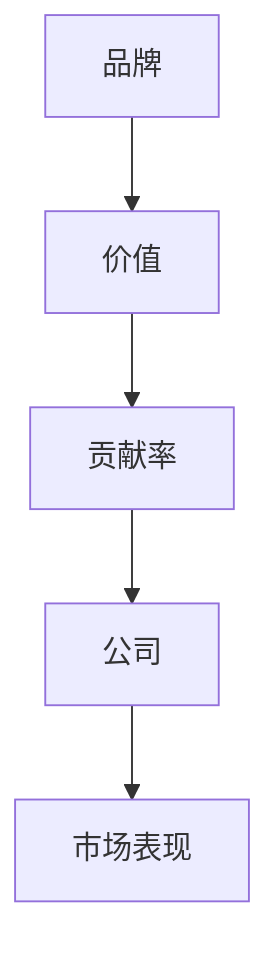
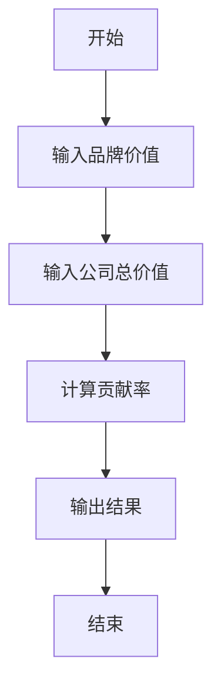
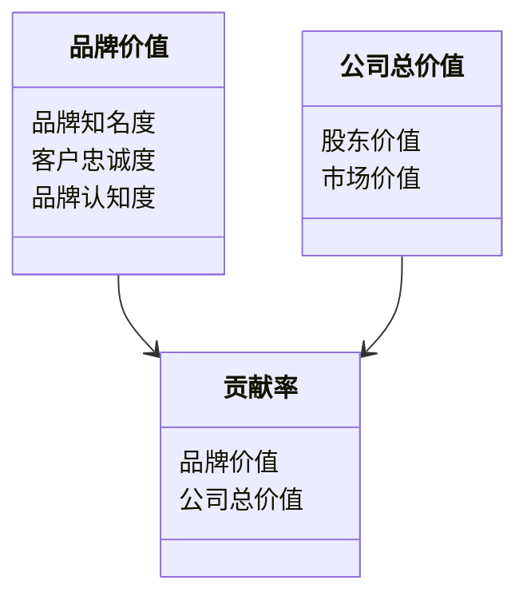

                 


# 彼得林奇对公司品牌价值贡献率的分析

> 关键词：彼得林奇、品牌价值、贡献率、投资分析、公司价值

> 摘要：本文通过分析彼得林奇的投资方法，探讨品牌价值对企业整体价值的贡献率，结合具体案例和数学模型，详细阐述品牌价值贡献率的计算方法及其在企业价值评估中的应用。

---

# 第1章: 公司品牌价值与贡献率的概述

## 1.1 品牌价值的定义与重要性

### 1.1.1 品牌价值的定义
品牌价值是指品牌为企业带来的经济价值，包括品牌知名度、客户忠诚度、品牌认知度等无形资产的价值总和。品牌价值是企业市场竞争力的重要组成部分。

### 1.1.2 品牌价值对企业的影响
品牌价值直接影响企业的市场地位、销售额和利润率。高品牌价值的企业通常能够以更高的价格出售产品或服务，并在市场中占据更大的份额。

### 1.1.3 品牌价值与公司整体价值的关系
品牌价值是公司整体价值的重要组成部分。通过品牌价值的提升，企业可以增加其市场价值和股东价值。

## 1.2 贡献率的定义与计算方法

### 1.2.1 贡献率的基本概念
贡献率是指品牌价值对公司整体价值的贡献程度。它是衡量品牌对企业发展的重要性的关键指标。

### 1.2.2 贡献率的计算公式
贡献率的计算公式为：
$$贡献率 = \frac{品牌价值}{公司总价值} \times 100\%$$

### 1.2.3 彼得林奇的贡献率分析方法
彼得林奇通过分析公司的财务数据和市场表现，结合品牌价值的评估，得出品牌对公司的贡献率。他强调品牌价值的稳定性、增长性和可持续性。

## 1.3 彼得林奇投资分析法的核心思想

### 1.3.1 彼得林奇的投资哲学
彼得林奇认为，投资的核心是选择具有强大品牌价值和市场竞争力的企业，长期持有并持续关注其发展。

### 1.3.2 彼得林奇对品牌的独特见解
彼得林奇认为，品牌不仅是企业的无形资产，更是企业长期盈利能力的重要保障。强大的品牌能够为企业带来稳定的客户群体和持续的收入来源。

### 1.3.3 彼得林奇分析法的适用范围
彼得林奇的分析法适用于所有行业的企业，尤其适合那些品牌价值占比较高、市场地位稳定的公司。

---

# 第2章: 品牌价值贡献率的核心概念与联系

## 2.1 核心概念原理

### 2.1.1 品牌价值的构成要素
品牌价值由品牌知名度、客户忠诚度、品牌认知度、品牌创新能力和品牌文化影响力等多个因素构成。

### 2.1.2 贡献率的计算模型
贡献率的计算模型将品牌价值与公司总价值结合起来，综合考虑品牌对公司的财务贡献和市场影响力。

### 2.1.3 彼得林奇分析法的数学模型
彼得林奇的分析法通过将品牌价值与公司总价值进行对比，得出品牌对公司的贡献率。

## 2.2 品牌价值与贡献率的对比分析

### 2.2.1 品牌价值与贡献率的属性对比
品牌价值是衡量品牌实力的指标，而贡献率是衡量品牌对公司的实际贡献的指标。

### 2.2.2 品牌价值与贡献率的联系与区别
品牌价值是贡献率的基础，而贡献率是品牌价值在公司总价值中的具体体现。

### 2.2.3 品牌价值与贡献率的协同效应
品牌价值的提升会直接提高贡献率，从而增强公司的整体价值。

## 2.3 ER实体关系图架构



---

# 第3章: 品牌价值贡献率的算法原理

## 3.1 算法原理概述

### 3.1.1 品牌价值贡献率的计算公式
贡献率的计算公式为：
$$贡献率 = \frac{品牌价值}{公司总价值} \times 100\%$$

### 3.2 算法流程图



## 3.3 Python实现代码

```python
def calculate_contribution_rate(branded_value, company_total_value):
    contribution_rate = (branded_value / company_total_value) * 100
    return contribution_rate

# 示例
branded_value = 500
company_total_value = 1000
result = calculate_contribution_rate(branded_value, company_total_value)
print(f"贡献率为: {result}%")
```

---

# 第4章: 系统分析与架构设计方案

## 4.1 问题场景介绍

### 4.1.1 问题背景
在企业价值评估中，品牌价值的贡献率是衡量品牌对企业发展的重要性的关键指标。

### 4.1.2 问题目标
通过分析品牌价值和贡献率，帮助企业更好地评估品牌对整体价值的贡献。

### 4.1.3 问题约束
品牌价值的评估需要考虑多个因素，包括品牌知名度、客户忠诚度、市场地位等。

## 4.2 系统功能设计

### 4.2.1 领域模型



---

# 第5章: 项目实战与案例分析

## 5.1 环境安装

### 5.1.1 系统需求
需要安装Python编程环境和必要的开发工具。

### 5.1.2 安装步骤
1. 安装Python：从官网下载并安装Python 3.8及以上版本。
2. 安装Mermaid：在项目中集成Mermaid图表生成工具。

## 5.2 系统核心实现源代码

### 5.2.1 品牌价值贡献率的计算

```python
def calculate_contribution_rate(branded_value, company_total_value):
    contribution_rate = (branded_value / company_total_value) * 100
    return contribution_rate

# 示例
branded_value = 500
company_total_value = 1000
result = calculate_contribution_rate(branded_value, company_total_value)
print(f"贡献率为: {result}%")
```

### 5.2.2 系统架构实现


## 5.3 案例分析

### 5.3.1 案例背景
假设某公司的品牌价值为500万元，公司总价值为1000万元。

### 5.3.2 案例分析
贡献率 = (500 / 1000) × 100% = 50%

### 5.3.3 分析结果
品牌价值贡献率为50%，说明品牌对公司的整体价值贡献了一半。

---

# 第6章: 最佳实践与小结

## 6.1 最佳实践 tips

### 6.1.1 数据准确性
确保输入的数据准确无误，尤其是品牌价值和公司总价值。

### 6.1.2 持续监测
定期监测品牌价值和贡献率的变化，及时调整投资策略。

### 6.1.3 结合实际
根据企业的实际情况，灵活应用彼得林奇的分析方法。

## 6.2 小结
本文通过分析彼得林奇的投资方法，详细阐述了品牌价值贡献率的计算方法和应用。通过实际案例分析，验证了该方法的有效性和实用性。

## 6.3 注意事项

### 6.3.1 数据偏差
品牌价值的评估可能存在主观性，需要注意数据偏差。

### 6.3.2 市场变化
市场环境的变化可能会影响品牌价值和贡献率，需要及时调整分析策略。

## 6.4 拓展阅读

### 6.4.1 相关书籍
1. 《彼得林奇选股术》
2. 《品牌管理学》

### 6.4.2 相关网站
1. 彼得林奇官方网站
2. 投资分析论坛

---

作者：AI天才研究院/AI Genius Institute & 禅与计算机程序设计艺术 /Zen And The Art of Computer Programming

