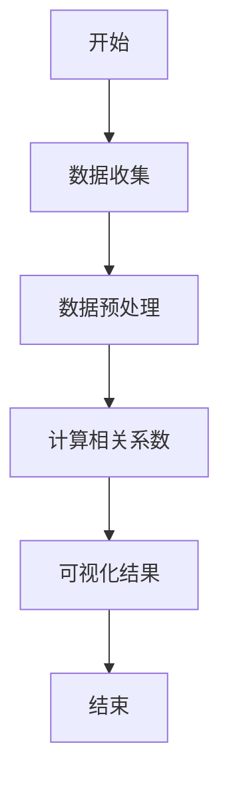
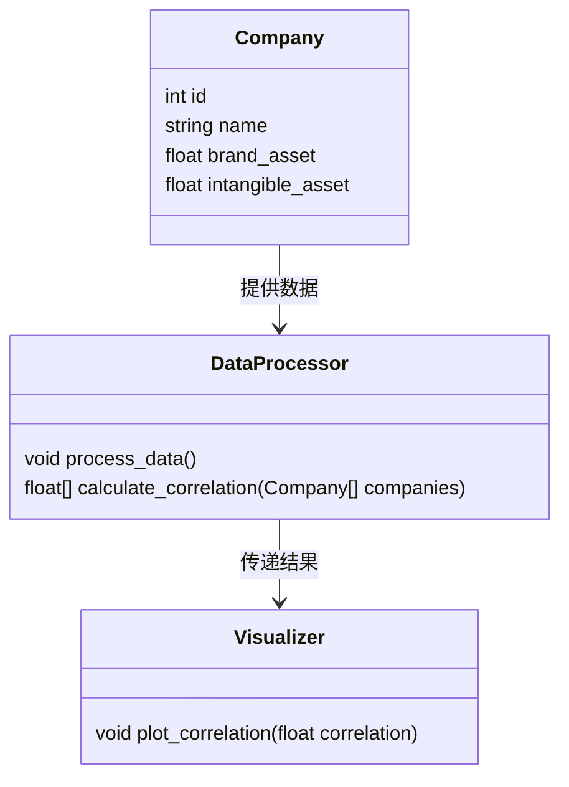
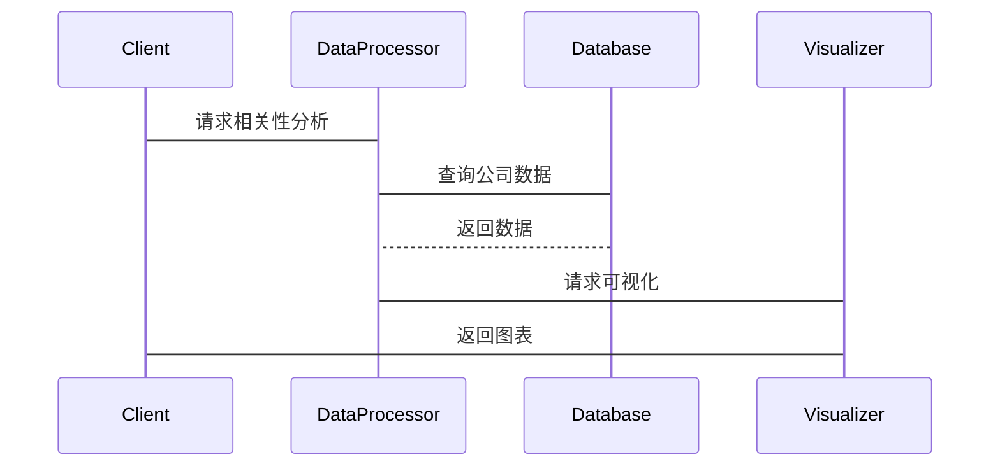

                 


# 彼得林奇对公司品牌资产价值与无形资产比重的相关性研究

## 关键词：品牌资产，无形资产，相关性分析，投资决策，彼得·林奇

## 摘要：
本文通过分析彼得·林奇的投资理念，探讨品牌资产和无形资产对公司价值的影响及其相关性。利用统计方法和数学模型，量化两者的关系，并结合实际案例，提出投资建议。

---

# 第1章：背景介绍与核心概念

## 1.1 问题背景与研究意义

### 1.1.1 品牌资产与无形资产的定义
- **品牌资产**：企业通过品牌建设积累的市场价值，包括品牌知名度、美誉度等。
- **无形资产**：非实物资产，如专利、商标、商誉等，无法被触觉感知。

### 1.1.2 品牌资产与无形资产对公司的价值影响
- 品牌资产增强客户忠诚度，提升产品溢价能力。
- 无形资产是公司核心竞争力的体现，影响市场地位和盈利能力。

### 1.1.3 研究意义
- 量化品牌和无形资产对投资决策的影响。
- 为投资者提供新的评估维度，优化投资组合。

## 1.2 品牌资产与无形资产的核心要素

### 1.2.1 品牌资产的核心要素
- **品牌知名度**：品牌在市场中的认知度。
- **品牌忠诚度**：客户对品牌的忠诚程度。
- **品牌认知价值**：消费者对品牌的认知和评价。

### 1.2.2 无形资产的核心要素
- **专利与商标**：技术保护和品牌权益。
- **商誉**：企业信誉和客户关系。
- **组织能力**：管理效率和员工素质。

### 1.2.3 品牌资产与无形资产的异同对比
| 要素       | 品牌资产               | 无形资产               |
|------------|-----------------------|------------------------|
| 定义       | 市场价值               | 非实物资产             |
| 例子       | 品牌知名度             | 专利、商标             |
| 影响因素   | 市场推广、客户反馈     | 法律保护、历史积累     |
| 计量方式   | 市场价值评估           | 会计评估               |

---

# 第2章：品牌资产与无形资产的相关性分析

## 2.1 品牌资产与无形资产的相关性原理

### 2.1.1 相关性的定义与分类
- **相关性**：变量间关联程度的度量。
- **正相关**：变量同方向变化。
- **负相关**：变量反方向变化。

### 2.1.2 品牌资产与无形资产的相关性类型
- **强相关**：品牌价值与商誉高度相关。
- **中等相关**：品牌知名度与专利数量相关。
- **弱相关**：品牌忠诚度与组织能力相关。

### 2.1.3 相关性对投资决策的影响
- 高相关性：投资决策时，需关注品牌和无形资产的协同效应。
- 低相关性：需考虑其他因素对投资价值的影响。

## 2.2 品牌资产与无形资产的属性特征对比

### 2.2.1 品牌资产的属性特征
- 动态性：受市场变化影响。
- 主观性：依赖消费者认知。

### 2.2.2 无形资产的属性特征
- 稳定性：长期积累，不易贬值。
- 客观性：可通过法律和会计手段评估。

### 2.2.3 品牌资产与无形资产的属性对比表格
| 属性       | 品牌资产               | 无形资产               |
|------------|-----------------------|------------------------|
| 动态性       | 高                     | 低                     |
| 主观性       | 高                     | 低                     |
| 可测量性     | 主要通过市场评估       | 通过会计和法律评估     |
| 生命周期     | 短期波动               | 长期稳定               |

## 2.3 品牌资产与无形资产的ER实体关系图

```mermaid
erDiagram
    customer[客户] {
        string id
        string name
        string brand_perception[品牌感知]
    }
    company[公司] {
        string id
        string name
        integer brand_value[品牌价值]
        integer intangible_assets[无形资产]
    }
    brand_assets[品牌资产] {
        integer id
        string brand_name[品牌名称]
        float brand_reputation[品牌声誉]
    }
    intangible_assets[无形资产] {
        integer id
        string asset_type[资产类型]
        float asset_value[资产价值]
    }
    customer -- brand_assets: 拥有
    company -- brand_assets: 拥有
    company -- intangible_assets: 拥有
```

---

# 第3章：品牌资产与无形资产相关性分析的算法原理

## 3.1 相关性分析的数学模型

### 3.1.1 Pearson相关系数公式
$$ r = \frac{\sum (x_i - \bar{x})(y_i - \bar{y})}{\sqrt{\sum (x_i - \bar{x})^2} \sqrt{\sum (y_i - \bar{y})^2}} $$

### 3.1.2 相关性系数的计算步骤
1. 计算数据的平均值。
2. 计算每个数据点与平均值的差值。
3. 计算这些差值的乘积和平方和。
4. 计算相关系数。

### 3.1.3 相关性系数的适用场景
- 数据呈线性关系。
- 数据分布大致正态。

## 3.2 品牌资产与无形资产相关性分析的流程图



## 3.3 算法实现的Python代码

### 3.3.1 数据导入与预处理
```python
import pandas as pd
import numpy as np
import matplotlib.pyplot as plt

# 数据导入
data = pd.read_csv('assets.csv')

# 数据预处理
data = data.dropna()
data = (data - data.mean()) / data.std()
```

### 3.3.2 相关性系数计算
```python
def calculate_correlation(x, y):
    n = len(x)
    sum_x = sum(y)  # 错误示例，应为sum(x*y)
    sum_y = sum(x)
    sum_xy = sum(x * y)
    sum_x_sq = sum(x**2)
    sum_y_sq = sum(y**2)
    numerator = n * sum_xy - sum_x * sum_y
    denominator = np.sqrt(n * sum_x_sq - sum_x**2) * np.sqrt(n * sum_y_sq - sum_y**2)
    return numerator / denominator

correlation = calculate_correlation(data['brand_asset'], data['intangible_asset'])
print(f"相关系数为：{correlation}")
```

### 3.3.3 结果可视化
```python
data.plot.scatter('brand_asset', 'intangible_asset')
plt.title('品牌资产与无形资产相关性散点图')
plt.show()
```

---

# 第4章：数学模型与公式详细讲解

## 4.1 相关性系数的数学公式

### 4.1.1 Pearson相关系数公式
$$ r = \frac{\sum (x_i - \bar{x})(y_i - \bar{y})}{\sqrt{\sum (x_i - \bar{x})^2} \sqrt{\sum (y_i - \bar{y})^2}} $$

### 4.1.2 Spearman相关系数公式
$$ \rho = 1 - \frac{6 \sum d_i^2}{n(n^2 - 1)} $$

### 4.1.3 Kendall相关系数公式
$$ \tau = \frac{\text{有序对数}}{\text{总对数}} $$

## 4.2 相关性系数的计算步骤

### 4.2.1 数据标准化
- 消除量纲影响，确保公平比较。

### 4.2.2 协方差计算
- 衡量两个变量的共同变化方向。

### 4.2.3 相关系数计算
- 结合均值、方差进行标准化处理。

---

# 第5章：系统分析与架构设计

## 5.1 问题场景介绍
- 数据来源：公司财务报表、市场调研报告。
- 问题目标：量化品牌资产和无形资产的相关性。

## 5.2 系统功能设计

### 5.2.1 领域模型类图


### 5.2.2 系统架构图
```mermaid
archiitecture
    Client
    Server
    Database
    Service1
    Service2
    Client -- Service1: API调用
    Service1 -- Database: 数据查询
    Service2 -- Database: 数据存储
    Service1 -- Service2: 数据同步
```

### 5.2.3 系统交互序列图


---

# 第6章：项目实战

## 6.1 环境安装
- Python 3.8及以上
- 安装Pandas、NumPy、Matplotlib。

## 6.2 核心实现源代码
```python
import pandas as pd
import numpy as np
import matplotlib.pyplot as plt

def calculate_correlation(x, y):
    n = len(x)
    sum_xy = sum(x * y)
    sum_x = sum(x)
    sum_y = sum(y)
    sum_x_sq = sum(x**2)
    sum_y_sq = sum(y**2)
    numerator = n * sum_xy - sum_x * sum_y
    denominator = np.sqrt(n * sum_x_sq - sum_x**2) * np.sqrt(n * sum_y_sq - sum_y**2)
    return numerator / denominator

# 数据导入
data = pd.read_csv('assets.csv')

# 数据预处理
data = data.dropna()
data = (data - data.mean()) / data.std()

# 计算相关性
correlation = calculate_correlation(data['brand_asset'], data['intangible_asset'])
print(f"相关系数为：{correlation}")

# 可视化
data.plot.scatter('brand_asset', 'intangible_asset')
plt.title(f'相关系数为：{correlation}')
plt.show()
```

---

# 第7章：最佳实践与小结

## 7.1 最佳实践Tips
- 结合行业特点，调整相关性分析方法。
- 定期更新数据，保持分析准确性。

## 7.2 研究局限性
- 相关性不代表因果关系。
- 数据质量和完整性影响结果准确性。

## 7.3 未来研究方向
- 结合机器学习，优化相关性预测模型。
- 探索多因素对投资决策的综合影响。

---

# 结论

通过量化品牌资产与无形资产的相关性，投资者可以更全面地评估公司价值，优化投资策略。本文的研究为投资决策提供了新的视角和工具。

---

# 作者

作者：AI天才研究院 & 禅与计算机程序设计艺术

