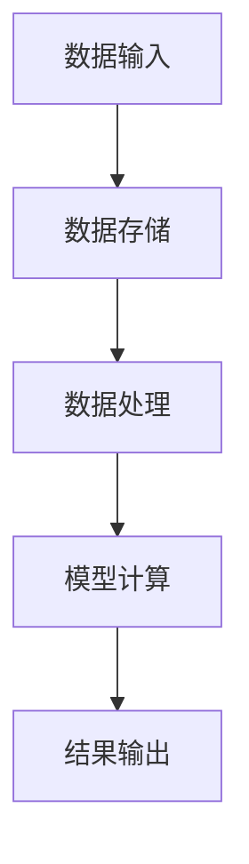
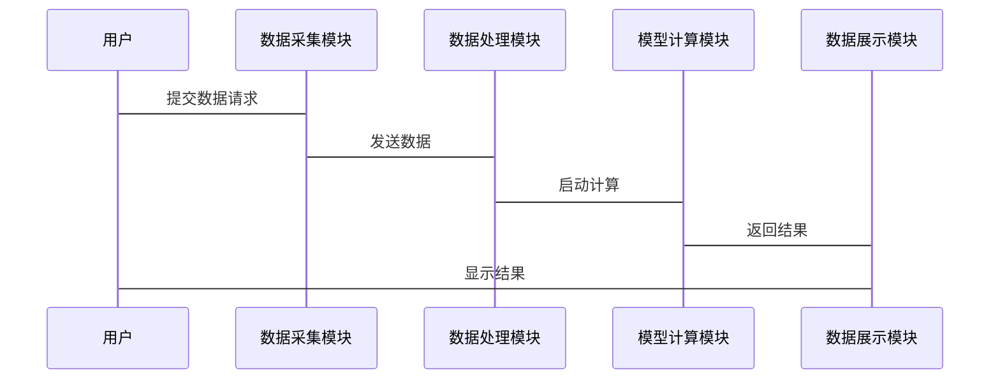

                 


```markdown
# 彼得林奇对公司品牌资产价值贡献的量化分析

> 关键词：品牌资产，彼得·林奇，量化分析，投资评估，资产价值

> 摘要：本文系统地探讨了彼得·林奇如何通过量化分析评估公司品牌资产的价值贡献。从品牌资产的定义和构成，到林奇的分析模型构建，再到系统的架构设计和实际案例分析，文章详细阐述了如何将品牌资产转化为可量化的价值指标，为投资决策提供科学依据。

---

## 第1章：品牌资产的定义与重要性

### 1.1 品牌资产的核心概念

- 1.1.1 品牌资产的定义：品牌资产是指品牌在市场中所具有的价值，包括品牌知名度、品牌忠诚度、品牌认知度等。
- 1.1.2 品牌资产的构成要素：包括品牌知名度、品牌忠诚度、品牌声誉、品牌创新力等。
- 1.1.3 品牌资产与企业价值的关系：品牌资产是企业价值的重要组成部分，直接影响企业的市场地位和盈利能力。

### 1.2 彼得·林奇的背景与投资理念

- 1.2.1 彼得·林奇的生平简介：介绍彼得·林奇作为著名投资经理的背景和成就。
- 1.2.2 林奇的投资策略与方法：包括基本面分析、价值投资等。
- 1.2.3 林奇对品牌资产的重视：林奇在投资中如何关注品牌资产的价值贡献。

---

## 第2章：品牌资产的量化分析框架

### 2.1 品牌资产的评估指标

- 2.1.1 品牌知名度的测量：通过市场调研、消费者调查等方式评估品牌知名度。
- 2.1.2 品牌忠诚度的评估：通过消费者行为分析、市场细分等方法评估品牌忠诚度。
- 2.1.3 品牌认知度的分析：评估消费者对品牌的认知深度和广度。

### 2.2 品牌资产的数学模型

- 2.2.1 品牌资产价值的公式表示：
$$ \text{品牌资产价值} = \sum (w_i \times v_i) $$
其中，\( w_i \) 是各指标的权重，\( v_i \) 是各指标的评估值。

### 2.3 林奇分析模型的构建

- 2.3.1 模型的输入变量：包括品牌知名度、品牌忠诚度、品牌认知度等。
- 2.3.2 模型的输出结果：品牌资产的量化价值。
- 2.3.3 模型的验证与优化：通过实际数据验证模型准确性，并进行参数调整。

---

## 第3章：品牌资产的评估方法比较

### 3.1 不同评估方法的对比

- 3.1.1 基于财务指标的评估：如市盈率、市净率等。
- 3.1.2 基于市场调研的评估：如消费者调查、品牌排名等。
- 3.1.3 基于消费者行为分析的评估：如购买频率、忠诚度等。

### 3.2 各种方法的优缺点

- 3.2.1 财务指标法的局限性：无法直接反映品牌价值。
- 3.2.2 市场调研法的适用性：数据收集成本高，但结果直观。
- 3.2.3 消费者行为分析法的深度：能够提供品牌忠诚度等关键指标。

---

## 第4章：彼得·林奇分析模型的详细步骤

### 4.1 数据收集与处理

- 4.1.1 数据来源的选择：包括财务报表、市场调研数据、消费者行为数据等。
- 4.1.2 数据清洗与预处理：去除无效数据，标准化数据格式。
- 4.1.3 数据的标准化处理：确保各指标在计算中具有可比性。

### 4.2 模型的构建与实现

- 4.2.1 模型的输入参数设置：根据品牌资产的评估指标设定权重。
- 4.2.2 模型的训练与优化：通过历史数据训练模型，调整权重以提高准确性。
- 4.2.3 模型的验证与测试：使用新数据验证模型的稳定性和准确性。

### 4.3 模型的应用与结果解读

- 4.3.1 模型的应用场景：在公司估值、投资决策中应用。
- 4.3.2 模型结果的解读方法：将量化结果与行业基准进行比较。
- 4.3.3 模型结果的实际意义：帮助投资者做出更明智的投资决策。

---

## 第5章：品牌资产量化分析的系统架构设计

### 5.1 系统功能设计

- 5.1.1 数据采集模块：收集品牌相关数据。
- 5.1.2 数据处理模块：清洗和预处理数据。
- 5.1.3 模型计算模块：运行林奇分析模型。
- 5.1.4 结果展示模块：以图表形式展示结果。

### 5.2 系统架构图



### 5.3 系统接口设计

- 5.3.1 数据接口：定义数据输入格式和接口调用方式。
- 5.3.2 API接口：提供RESTful API供其他系统调用。

### 5.4 系统交互流程图



---

## 第6章：项目实战——品牌资产量化分析案例

### 6.1 环境安装

- 安装必要的工具和库，如Python、Pandas、Scikit-learn等。

### 6.2 核心代码实现

```python
import pandas as pd
from sklearn.metrics import mean_squared_error

# 数据加载
data = pd.read_csv('brand_data.csv')

# 数据预处理
data = data.dropna()
data = (data - data.mean()) / data.std()

# 构建模型
def lynch_model(data):
    weights = [0.4, 0.3, 0.2, 0.1]
    return sum(w * v for w, v in zip(weights, data))

# 模型训练与预测
predicted = lynch_model(data)
actual = data['value']

# 模型评估
mse = mean_squared_error(actual, predicted)
print(f"均方误差: {mse}")
```

### 6.3 案例分析与结果解读

- 分析实际案例中品牌资产的量化结果，解释其对投资决策的影响。

---

## 第7章：总结与展望

### 7.1 总结

- 彼得·林奇的品牌资产量化分析方法的优势和实际应用效果。

### 7.2 展望

- 未来可能的研究方向，如结合其他因素优化模型。
- 提高模型的准确性和适用性。

---

## 作者

作者：AI天才研究院/AI Genius Institute & 禅与计算机程序设计艺术 /Zen And The Art of Computer Programming

---

通过以上内容，读者可以系统地了解彼得·林奇如何量化品牌资产，并在实际项目中应用这些方法。文章结合理论与实践，为投资决策提供了科学依据。
```

