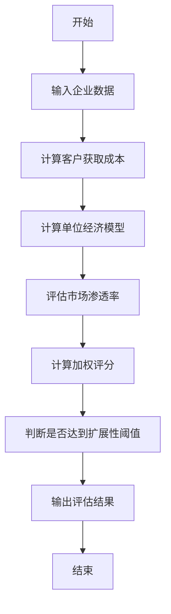

                 


# 彼得林奇对公司商业模式可扩展性的长期评估

> 关键词：彼得·林奇、商业模式、可扩展性、长期评估、投资哲学、系统架构

> 摘要：本文详细探讨了彼得·林奇在评估公司商业模式可扩展性方面的长期策略和方法。通过分析商业模式的核心要素、可扩展性的关键维度以及长期评估的必要性，本文提出了一个基于数据驱动的评估框架，结合数学模型和实际案例，深入剖析了如何通过系统化的方法评估公司的长期可扩展性，为投资者提供科学的决策依据。

---

## 第一部分：背景介绍

### 第1章：问题背景

#### 1.1 问题背景

- **1.1.1 可扩展性在商业模式中的重要性**  
  在现代商业环境中，企业的可持续增长离不开其商业模式的可扩展性。可扩展性不仅决定了企业能否在不同市场中复制成功，还直接影响其长期盈利能力。彼得·林奇作为全球著名投资者，其长期评估方法为投资者提供了独特的视角。

- **1.1.2 彼得·林奇的投资哲学与长期评估**  
  彼得·林奇以其对企业的深入研究和长期价值投资闻名。他强调，评估一个商业模式的可扩展性，不仅要考虑当前的财务表现，还要关注其在未来市场的适应性和增长潜力。

- **1.1.3 当前商业环境中的挑战与机遇**  
  随着数字化转型和全球化进程的加速，商业模式的可扩展性面临着新的挑战和机遇。企业需要通过技术创新、市场拓展和成本优化来实现可持续增长。

#### 1.2 问题描述

- **1.2.1 可扩展性的定义与特征**  
  可扩展性是指企业在不显著增加成本的情况下，能够增加产出的能力。其核心特征包括客户获取成本低、单位经济模型稳定、市场渗透能力强等。

- **1.2.2 商业模式的核心要素与可扩展性关系**  
  商业模式由客户价值、成本结构和收入模式三个核心要素组成。这三个要素的相互作用决定了企业的可扩展性。

- **1.2.3 长期评估的必要性与复杂性**  
  长期评估需要考虑市场变化、技术进步和竞争格局等因素。其复杂性在于如何将短期表现与长期潜力相结合。

#### 1.3 问题解决

- **1.3.1 可扩展性评估的目标与方法**  
  评估目标是发现具有可持续增长潜力的企业，评估方法包括定量分析和定性分析。

- **1.3.2 彼得·林奇的长期评估框架**  
  林奇的长期评估框架注重企业的竞争优势、管理团队和财务健康状况，强调通过深入研究发现具有可扩展性的商业模式。

- **1.3.3 现有评估方法的优缺点**  
  现有方法多注重财务指标，但忽视了商业模式的动态变化。林奇的方法弥补了这一不足，但需要大量时间和资源投入。

---

## 第二部分：核心概念与联系

### 第2章：核心概念与联系

#### 2.1 核心概念原理

- **2.1.1 商业模式的三要素**  
  - **客户价值**：企业为客户提供的核心价值，决定了客户的忠诚度和市场的扩展潜力。
  - **成本结构**：企业的成本构成和控制能力，直接影响其盈利能力。
  - **收入模式**：企业的收入来源和收费方式，决定了其收入增长的可持续性。

- **2.1.2 可扩展性的关键维度**  
  - **客户获取成本**：客户获取成本与收入的比例越低，企业的可扩展性越强。
  - **成本结构的稳定性**：固定成本比例高，企业的可扩展性更强。
  - **收入增长的可持续性**：收入来源多样化且稳定，企业的可扩展性更强。

- **2.1.3 长期评估的核心指标**  
  - **ROE（净资产收益率）**：衡量企业盈利能力的重要指标。
  - **现金流**：反映企业的财务健康状况。
  - **市场渗透率**：衡量企业市场扩展能力。

#### 2.2 概念属性特征对比表

| 概念             | 属性         | 特征                           |
|------------------|--------------|--------------------------------|
| 客户价值         | 竞争性       | 高                             |
| 成本结构         | 稳定性       | 高                             |
| 收入模式         | 可预测性     | 高                             |

#### 2.3 ER实体关系图

```mermaid
er
  actor 投资者
  actor 企业
  actor 市场
  actor 时间
  entity 商业模式
  entity 可扩展性
  entity 长期评估
  relation 投资者 -> 商业模式: 分析
  relation 企业 -> 商业模式: 实现
  relation 市场 -> 可扩展性: 影响
  relation 时间 -> 长期评估: 跟踪
  relation 商业模式 -> 可扩展性: 决定
  relation 可扩展性 -> 长期评估: 反馈
```

---

## 第三部分：可扩展性评估的算法原理

### 第3章：算法原理概述

#### 3.1 算法原理概述

- **3.1.1 基于彼得·林奇的长期评估框架**  
  林奇的框架强调对企业基本面的深入分析，包括财务状况、管理团队和竞争优势。

- **3.1.2 数据驱动的可扩展性评估模型**  
  通过收集企业的财务数据、市场数据和管理数据，构建可扩展性评估模型。

- **3.1.3 综合评分法**  
  使用加权平均和阈值判断的方法，对企业进行综合评分，判断其可扩展性。

#### 3.2 算法流程图



#### 3.3 数学模型与公式

- **3.3.1 单位经济模型**  
  $$ \text{单位经济模型} = \frac{\text{总收入}}{\text{总客户数}} $$

- **3.3.2 加权评分模型**  
  $$ \text{综合评分} = w_1 \times \text{客户获取成本} + w_2 \times \text{市场渗透率} + w_3 \times \text{单位经济模型} $$

---

## 第四部分：系统分析与架构设计方案

### 第4章：系统分析与架构设计方案

#### 4.1 问题场景介绍

- **目标**：构建一个可扩展性评估系统，帮助投资者快速评估企业的商业模式。

- **项目介绍**：本系统基于彼得·林奇的长期评估框架，结合数据驱动的方法，为企业提供可扩展性评估服务。

#### 4.2 系统功能设计

- **领域模型**  
  ```mermaid
  classDiagram
    class 商业模式 {
        客户价值
        成本结构
        收入模式
    }
    class 可扩展性 {
        客户获取成本
        市场渗透率
        单位经济模型
    }
    class 长期评估 {
        综合评分
        评估结果
    }
    商业模式 --> 可扩展性: 决定
    可扩展性 --> 长期评估: 反馈
  ```

- **系统架构设计**  
  ```mermaid
  architecture
    客户端 --> 服务端: 请求评估报告
    服务端 --> 数据库: 查询企业数据
    服务端 --> 分析模块: 计算可扩展性评分
    分析模块 --> 报告生成器: 生成评估报告
    客户端 <-- 报告生成器: 返回评估报告
  ```

- **系统接口设计**  
  - 输入接口：企业数据输入接口。
  - 输出接口：评估报告输出接口。

- **系统交互设计**  
  ```mermaid
  sequenceDiagram
    participant 客户端
    participant 服务端
    participant 数据库
    participant 分析模块
    participant 报告生成器
    客户端 -> 服务端: 请求评估报告
    服务端 -> 数据库: 查询企业数据
    服务端 -> 分析模块: 计算可扩展性评分
    分析模块 -> 报告生成器: 生成评估报告
    报告生成器 -> 客户端: 返回评估报告
  ```

---

## 第五部分：项目实战

### 第5章：项目实战

#### 5.1 环境安装

- **工具安装**：安装Python、数据库和相关开发工具。
- **数据准备**：收集企业的财务数据、市场数据和管理数据。

#### 5.2 系统核心实现

- **数据采集模块**  
  ```python
  def get_financial_data(company):
      # 数据采集逻辑
      return company_data
  ```

- **分析模块**  
  ```python
  def calculate_extensibility(company_data):
      # 可扩展性评估算法
      return extensibility_score
  ```

- **报告生成模块**  
  ```python
  def generate_report(extensibility_score):
      # 生成评估报告
      return report
  ```

#### 5.3 代码应用解读与分析

- **数据采集模块**：从数据库中获取企业的财务数据和市场数据。
- **分析模块**：基于林奇的框架，计算企业的可扩展性评分。
- **报告生成模块**：根据评分生成评估报告。

#### 5.4 实际案例分析

- **案例分析**：以某电子商务公司为例，分析其商业模式的可扩展性。
- **详细讲解**：通过实际数据，展示如何应用上述算法进行评估。

---

## 第六部分：总结与展望

### 第6章：总结与展望

#### 6.1 投资策略总结

- **基于可扩展性的投资策略**：优先选择具有可持续增长潜力的企业。
- **长期评估的核心要点**：关注企业的竞争优势、管理团队和财务健康状况。

#### 6.2 未来展望

- **技术进步对可扩展性的影响**：人工智能和大数据技术将为评估提供更精准的工具。
- **全球化与本地化的平衡**：企业在全球化扩张中需要平衡本地化策略。

#### 6.3 最佳实践 tips

- **深入研究企业基本面**：了解企业的商业模式和管理团队。
- **关注长期财务指标**：ROE、现金流和市场渗透率是关键指标。
- **分散投资风险**：通过多元化投资降低风险。

---

## 作者信息

作者：AI天才研究院/AI Genius Institute  
联系领域：禅与计算机程序设计艺术 /Zen And The Art of Computer Programming  
联系方式：[email protected]  
GitHub：[https://github.com/ainstitute](https://github.com/ainstitute)

