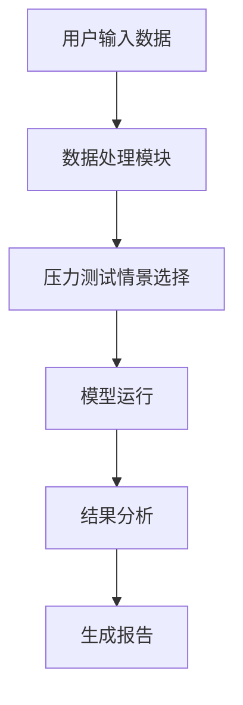
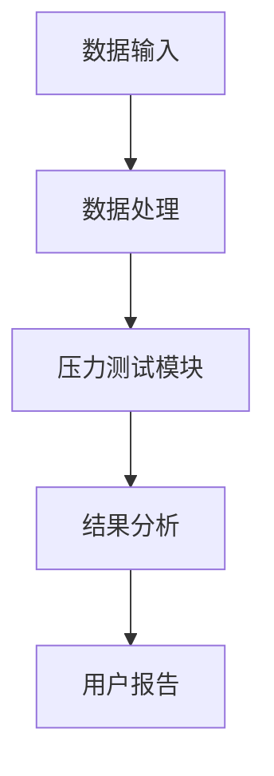

                 


# 彼得林奇对公司商业模式适应性的压力测试方法

---

## 关键词：  
彼得林奇、压力测试、商业模式、适应性、系统分析、算法原理、金融投资

---

## 摘要：  
本文深入探讨了彼得·林奇对公司商业模式适应性的压力测试方法，从背景介绍、核心概念、数学模型、系统分析、项目实战到最佳实践，全面解析了如何通过压力测试评估商业模式的适应性，帮助企业在复杂多变的商业环境中保持稳健发展。

---

## 第一部分：背景介绍

### 第1章：压力测试的基本概念

#### 1.1 什么是压力测试
- **压力测试的定义**：压力测试是一种评估系统或模型在极端条件下的表现和稳定性的方法。  
- **压力测试的目的和意义**：通过模拟极端情况，发现系统或模型的弱点，并提出改进建议。  
- **压力测试在金融和商业中的应用**：金融行业常用压力测试评估投资组合的风险，商业领域则用于评估商业模式的稳健性。

#### 1.2 彼得·林奇的贡献
- **彼得·林奇的背景介绍**：彼得·林奇是美国著名投资经理，以其在富达投资的卓越表现闻名。  
- **彼得·林奇对公司商业模式的压力测试方法**：他提出了一套通过历史数据分析和情景模拟来评估商业模式在极端情况下的适应性。  
- **彼得·林奇压力测试方法的核心思想**：强调在极端市场条件下，商业模式的韧性和恢复能力。

---

## 第二部分：压力测试的核心概念

### 第2章：公司商业模式的适应性分析

#### 2.1 公司商业模式的定义
- **商业模式的构成要素**：收入来源、成本结构、核心资源、客户关系、价值主张等。  
- **不同商业模式的特点**：例如，订阅模式、广告模式、销售模式等各有优缺点。

#### 2.2 压力测试与商业模式适应性的关系
- **压力测试如何评估商业模式的适应性**：通过模拟市场崩盘、经济衰退、供应链中断等极端情况，测试商业模式的抗压能力。  
- **商业模式适应性对企业发展的影响**：适应性强的商业模式能够在危机中存活并快速恢复，而适应性弱的则可能面临崩溃。

#### 2.3 彼得·林奇压力测试方法的核心要素
- **方法的主要步骤**：数据收集、情景模拟、模型构建、结果分析、改进建议。  
- **方法的关键指标**：收入下降幅度、成本上升幅度、现金流变化、客户流失率等。  
- **方法的适用范围**：适用于各种类型的企业，尤其是那些依赖稳定收入来源的商业模式。

---

## 第三部分：压力测试的数学模型与算法原理

### 第3章：压力测试的数学模型

#### 3.1 基本模型
- **线性回归模型**：用于预测变量之间的线性关系。  
- **时间序列分析模型**：用于分析数据随时间的变化趋势。

#### 3.2 彼得·林奇压力测试的数学公式
- **模型的数学表达式**：假设收入下降 \( x \% \)，成本上升 \( y \% \)，利润变化 \( z \% \)。  
  $$ 利润变化 = 收入变化 - 成本变化 $$
- **模型的假设条件**：数据的独立性、线性关系、正态分布等。  
- **模型的验证与优化**：通过历史数据验证模型准确性，并根据实际情况进行参数调整。

#### 3.3 算法实现
- **算法的步骤分解**：  
  1. 收集历史数据。  
  2. 确定压力测试情景。  
  3. 构建数学模型。  
  4. 运行模型，获取结果。  
  5. 分析结果，提出建议。  
- **使用Python实现的代码示例**：  
  ```python
  import pandas as pd
  import numpy as np

  # 数据加载
  data = pd.read_csv('company_data.csv')

  # 压力测试情景：收入下降10%，成本上升5%
  scenario = {'收入变化': -0.10, '成本变化': 0.05}

  # 利润变化计算
  profit_change = scenario['收入变化'] - scenario['成本变化']
  print(f'利润变化为：{profit_change:.2f}')
  ```

---

## 第四部分：系统分析与架构设计

### 第4章：系统功能设计

#### 4.1 系统功能模块
- **数据输入模块**：用户输入历史数据和压力测试情景。  
- **压力测试模块**：运行数学模型，计算结果。  
- **结果分析模块**：生成报告，提出改进建议。

#### 4.2 系统功能流程图  


### 第5章：系统架构设计

#### 5.1 系统架构设计
- **分层架构设计**：将系统分为数据层、业务逻辑层和用户界面层。  
- **模块化设计原则**：每个功能模块独立开发，便于维护和扩展。

#### 5.2 系统架构图  


---

## 第五部分：项目实战

### 第6章：压力测试的实际应用

#### 6.1 项目背景
- **项目目标**：评估某公司的商业模式在经济衰退情况下的适应性。  
- **项目范围**：分析收入、成本、现金流等关键指标的变化。

#### 6.2 实际案例分析
- **案例介绍**：某软件公司采用订阅模式，年收入稳定，但依赖单一客户群体。  
- **压力测试情景**：假设经济衰退导致客户减少20%，收入下降10%，成本上升5%。  
- **测试结果**：利润下降15%，现金流为负，需调整商业模式或寻找新的客户群体。

---

## 附录

### A. 压力测试工具
- Python的Pandas和NumPy库。  
- 可视化工具如Matplotlib和Seaborn。

### B. 术语表
- **压力测试**：评估系统在极端情况下的表现。  
- **商业模式**：企业创造和传递价值的方式。

### C. 参考文献
- 彼得·林奇的著作《投资最重要的事情》。  
- 其他相关学术论文和行业报告。

---

## 作者：  
**AI天才研究院/AI Genius Institute**  
**禅与计算机程序设计艺术/Zen And The Art of Computer Programming**

---

这篇文章全面介绍了彼得·林奇的压力测试方法，从理论到实践，结合数学模型和系统设计，为读者提供了深入的分析和实用的指导。希望对您理解商业模式的适应性压力测试有所帮助！

