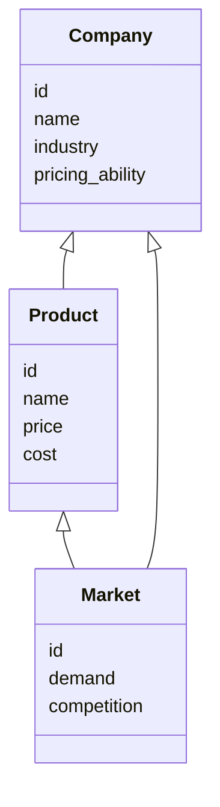
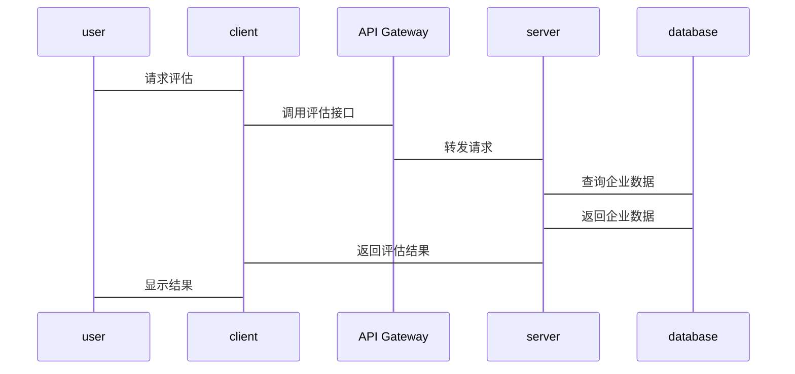
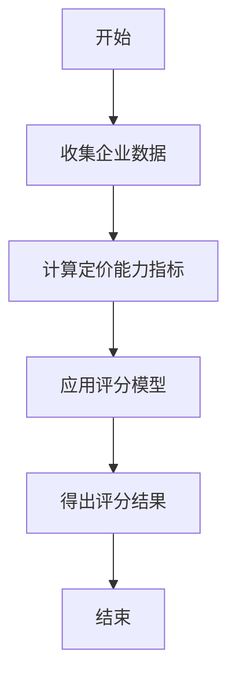

                 


# 彼得林奇对公司定价能力的评估

> 关键词：定价能力，彼得林奇，投资分析，企业估值，定价模型

> 摘要：本文深入分析了彼得林奇对公司定价能力的评估方法，探讨了定价能力在企业估值和投资决策中的重要性。通过系统化的分析框架、数学模型和实际案例，详细阐述了如何评估公司的定价能力，并提出了基于定价能力的企业估值方法。本文旨在为企业投资者和管理层提供实用的定价能力评估工具和策略。

---

# 第一部分: 定价能力的重要性与评估背景

## 第1章: 定价能力的定义与核心要素

### 1.1 定价能力的定义
定价能力是指企业在市场上对其产品或服务制定合理价格的能力，既包括定价策略的制定，也包括价格执行的灵活性。定价能力是企业核心竞争力的重要组成部分，直接影响企业的盈利能力、市场地位和长期发展。

### 1.2 定价能力的核心要素
定价能力的核心要素包括：
1. **市场分析能力**：对市场需求、竞争状况和价格敏感性的准确判断。
2. **成本控制能力**：对产品成本的精确计算和有效控制。
3. **定价策略**：包括成本加成定价、价值定价、竞争定价等多种策略。
4. **价格调整能力**：根据市场变化快速调整价格的能力。

### 1.3 定价能力的边界与外延
定价能力的边界主要在于企业对市场的定价权和价格调整的灵活性。外延则包括与定价相关的成本控制、市场推广、售后服务等多个方面。

---

## 第2章: 彼得林奇的定价能力评估框架

### 2.1 彼得林奇投资理念的概述
彼得林奇是美国著名的投资专家，他强调基本面分析和企业内在价值的评估。他认为，企业的定价能力是衡量企业竞争力和长期发展潜力的重要指标。

### 2.2 定价能力在投资分析中的地位
定价能力是彼得林奇投资分析的核心内容之一。他认为，企业能否在竞争激烈的市场中制定合理的定价策略，并根据市场变化快速调整价格，是企业能否长期盈利的关键。

### 2.3 彼得林奇定价能力评估的逻辑体系
彼得林奇的定价能力评估逻辑体系包括以下几个步骤：
1. **分析企业的定价策略**：了解企业如何制定价格。
2. **评估定价的灵活性**：判断企业在市场变化中的价格调整能力。
3. **分析定价的合理性和竞争力**：判断定价是否符合市场需求和企业利润目标。

---

## 第3章: 定价能力评估的背景与意义

### 3.1 当前市场环境下的定价能力的重要性
在当前全球化和互联网化的市场环境下，定价能力的重要性更加凸显。企业需要根据市场变化和竞争状况，灵活调整价格策略。

### 3.2 定价能力评估对企业价值的影响
定价能力评估能够帮助企业识别定价中的问题，优化定价策略，从而提升企业的盈利能力。同时，定价能力也是企业估值的重要指标之一。

### 3.3 定价能力评估对投资者决策的价值
对于投资者来说，定价能力评估能够帮助他们识别具有长期竞争优势的企业，从而做出更明智的投资决策。

---

# 第二部分: 定价能力的核心概念与联系

## 第4章: 定价能力的核心概念分析

### 4.1 定价能力的核心原理
定价能力的核心原理包括以下几个方面：
1. **市场需求与价格的关系**：价格必须与市场需求相匹配。
2. **成本与价格的关系**：价格必须覆盖成本并实现利润。
3. **竞争与价格的关系**：价格必须具有竞争力，才能在市场中占据优势。

### 4.2 定价能力的属性特征对比
以下是不同企业定价能力的对比分析：

| 特性       | 强定价能力企业 | 弱定价能力企业 |
|------------|----------------|----------------|
| 市场定价权 | 高              | 低              |
| 价格调整能力 | 强              | 弱              |
| 定价策略多样性 | 多              | 少              |
| 利润能力   | 高              | 低              |

### 4.3 定价能力的ER实体关系图
```mermaid
erDiagram
    company {
        id
        name
        industry
    }
    product {
        id
        name
        price
    }
    market {
        id
        demand
        competition
    }
    company -> product: 生产
    product -> market: 销售
    company -> market: 受市场影响
```

---

## 第5章: 定价能力的系统分析与架构设计

### 5.1 问题场景介绍
企业定价能力评估系统需要解决以下问题：
1. 如何准确评估企业的定价能力？
2. 如何将定价能力与企业估值相结合？
3. 如何通过定价能力评估优化企业的定价策略？

### 5.2 系统功能设计
以下是企业定价能力评估系统的功能模块设计：



### 5.3 系统架构设计
以下是企业定价能力评估系统的架构图：


### 5.4 系统交互设计
以下是系统交互的序列图：



---

# 第三部分: 定价能力评估的算法原理

## 第6章: 定价能力评估的数学模型

### 6.1 定价能力的线性回归模型
以下是定价能力的线性回归模型：

$$ y = \beta_0 + \beta_1x + \epsilon $$

其中，$y$ 表示定价能力，$x$ 表示相关变量，$\epsilon$ 表示误差项。

### 6.2 彼得林奇定价能力评估的评分模型
以下是评分模型的构建步骤：



### 6.3 算法实现的Python代码示例
以下是定价能力评估的Python代码示例：

```python
import pandas as pd
import numpy as np
from sklearn.linear_model import LinearRegression

# 示例数据
data = {
    'price': [10, 20, 30, 40],
    'cost': [5, 10, 15, 20],
    'profit': [3, 5, 7, 8]
}

df = pd.DataFrame(data)

# 训练线性回归模型
model = LinearRegression()
model.fit(df[['price', 'cost']], df['profit'])

# 预测定价能力
predictions = model.predict(df[['price', 'cost']])
print("预测的定价能力：", predictions)
```

---

## 第7章: 定价能力评估的系统实现

### 7.1 环境安装
以下是系统实现的环境要求：
- Python 3.8+
- Pandas、NumPy、Scikit-learn库
- Jupyter Notebook

### 7.2 系统核心实现源代码
以下是定价能力评估系统的Python代码实现：

```python
import pandas as pd
import numpy as np
from sklearn.linear_model import LinearRegression
from sklearn.metrics import mean_squared_error

# 数据加载
data = pd.read_csv('pricing_data.csv')

# 数据预处理
X = data[['price', 'cost']]
y = data['profit']

# 模型训练
model = LinearRegression()
model.fit(X, y)

# 模型评估
predictions = model.predict(X)
mse = mean_squared_error(y, predictions)
print("均方误差：", mse)

# 模型应用
new_data = pd.DataFrame({
    'price': [25, 30],
    'cost': [12, 15]
})
new_predictions = model.predict(new_data)
print("新数据的预测利润：", new_predictions)
```

### 7.3 代码应用解读与分析
上述代码实现了一个简单的定价能力评估模型。通过训练数据，模型可以预测企业在不同价格和成本下的利润情况。这为企业制定定价策略提供了数据支持。

---

## 第8章: 项目实战与案例分析

### 8.1 实际案例分析
以下是某企业定价能力评估的案例分析：

假设某企业生产电子产品，以下是其定价能力评估的步骤：
1. **数据收集**：收集企业过去三年的定价、成本、利润等数据。
2. **数据分析**：分析定价与利润的关系，计算定价能力指数。
3. **模型应用**：应用线性回归模型预测未来的价格和利润情况。

### 8.2 案例分析结果
通过分析，发现该企业的定价能力指数较高，具有较强的定价灵活性和盈利能力。

---

## 第9章: 项目小结

### 9.1 最佳实践 tips
1. 定价能力评估需要结合企业的实际情况，制定合理的定价策略。
2. 定价能力评估需要动态调整，根据市场变化及时优化。

### 9.2 小结
本文详细分析了彼得林奇对公司定价能力的评估方法，提出了基于定价能力的企业估值模型，并通过实际案例展示了如何将定价能力评估应用于企业管理和投资决策。

### 9.3 注意事项
1. 定价能力评估需要结合企业的行业特点和市场环境。
2. 定价能力评估需要综合考虑企业的成本、市场需求和竞争状况。

### 9.4 拓展阅读
推荐阅读彼得林奇的《投资最重要的Simple Truth》和《股票投资手册》。

---

# 作者：AI天才研究院/AI Genius Institute & 禅与计算机程序设计艺术 /Zen And The Art of Computer Programming

