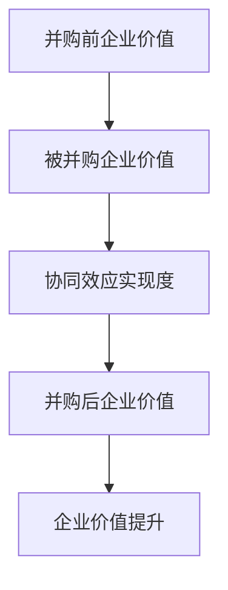

                 

# 彼得林奇对公司并购协同效应实现度的评估

> 关键词：彼得·林奇，并购，协同效应，实现度，企业价值

> 摘要：本文详细探讨了彼得·林奇对公司并购协同效应实现度的评估方法。通过分析协同效应的定义、类型及其在并购中的重要性，结合数学模型和实际案例，阐述了如何量化协同效应的实现度，并通过系统架构设计和项目实战，展示了如何在实际操作中应用这些评估方法。文章最后总结了最佳实践和未来研究方向。

---

## 第1章: 背景介绍

### 1.1 并购的基本概念

#### 1.1.1 并购的定义与类型
并购（Mergers and Acquisitions，简称M&A）是指一家企业与其他企业（被并购方）合并或收购其资产、股权等行为。并购可以分为以下几种类型：
- **吸收合并**：一家企业完全吸收另一家企业，后者失去独立法人资格。
- **新设合并**：两家或多家企业合并成立一家新企业。
- **收购**：一家企业购买另一家企业的部分或全部股权。

#### 1.1.2 协同效应的定义与分类
协同效应（Synergy）是指在并购后，双方企业通过整合资源、优化流程、共享成本等方式，产生的价值大于并购前的简单相加。协同效应可以分为以下几类：
- **成本协同效应**：通过整合供应链、减少重复部门等方式降低运营成本。
- **收入协同效应**：通过扩大市场、共享客户资源等方式增加收入。
- **管理协同效应**：通过整合管理团队、优化管理流程等方式提高管理效率。

#### 1.1.3 协同效应在并购中的重要性
协同效应是并购成功的关键因素之一。通过实现协同效应，企业可以提高市场竞争力、增强抗风险能力，并最终实现企业价值的最大化。

---

### 1.2 协同效应的实现机制

#### 1.2.1 协同效应的实现路径
协同效应的实现需要企业内部的整合，具体路径包括：
- **战略协同**：并购双方在战略目标上的互补性。
- **组织协同**：整合组织架构、优化管理流程。
- **资源协同**：共享人力资源、技术资源等。

#### 1.2.2 协同效应的度量方法
协同效应的度量方法主要包括：
- **财务指标法**：通过EBITDA（息税折旧及摊销前利润）等财务指标的变化来衡量。
- **市场法**：通过股价变化、市场估值等方法进行评估。

#### 1.2.3 协同效应的实现障碍
实现协同效应的过程中可能会遇到以下障碍：
- **文化冲突**：并购双方的企业文化差异可能导致整合困难。
- **管理问题**：管理团队的不协调可能影响协同效应的实现。
- **外部环境**：政策、市场环境等外部因素可能对协同效应的实现产生影响。

---

## 第2章: 协同效应的核心概念与联系

### 2.1 协同效应的核心原理

#### 2.1.1 协同效应的数学模型
协同效应的实现度可以通过以下公式进行评估：

$$
\text{协同效应实现度} = \frac{\text{并购后的企业价值} - (\text{并购前的企业价值} + \text{被并购企业价值})}{\text{被并购企业价值}}
$$

#### 2.1.2 协同效应的实现度与企业价值的关系
协同效应的实现度与企业价值呈正相关关系。实现的协同效应越大，企业价值提升越显著。

#### 2.1.3 协同效应的实现机制
协同效应的实现机制可以通过以下流程图表示：

---

### 2.2 协同效应的属性特征对比

#### 2.2.1 协同效应的分类与特征
以下是协同效应的分类与特征对比：

| 类型       | 特征描述                                   |
|------------|------------------------------------------|
| 成本协同效应 | 通过资源共享降低成本                     |
| 收入协同效应 | 通过市场扩展增加收入                     |
| 管理协同效应 | 通过优化管理流程提高效率                 |

#### 2.2.2 协同效应的实现度与企业绩效的关系
实现度高的协同效应通常能够显著提升企业的财务绩效，包括提高净利润率、ROE（净资产收益率）等。

---

## 第3章: 协同效应的实现度评估模型

### 3.1 协同效应的数学模型与公式

#### 3.1.1 协同效应的计算公式
协同效应的计算公式如下：

$$
\text{协同效应} = \text{并购后企业价值} - (\text{并购前企业价值} + \text{被并购企业价值})
$$

#### 3.1.2 协同效应实现度的评估公式
协同效应实现度的评估公式如下：

$$
\text{协同效应实现度} = \frac{\text{实际实现的协同效应}}{\text{预计的协同效应}} \times 100\%
$$

---

### 3.2 协同效应实现度的评估流程

#### 3.2.1 数据收集与处理
- 收集并购前后的财务数据。
- 清洗数据，确保数据的准确性和完整性。

#### 3.2.2 模型构建与验证
- 构建协同效应评估模型。
- 使用历史数据对模型进行验证和优化。

#### 3.2.3 结果分析与优化
- 分析协同效应实现度的结果。
- 根据结果优化模型参数。

---

## 第4章: 协同效应实现度的系统分析与架构设计

### 4.1 系统分析

#### 4.1.1 问题场景介绍
在企业并购中，协同效应的实现需要一个高效的系统来支持数据处理、模型构建和结果分析。

#### 4.1.2 项目介绍
本项目旨在构建一个协同效应实现度评估系统，帮助企业在并购过程中实现协同效应的量化评估。

#### 4.1.3 系统功能设计
系统功能设计包括：
- 数据采集模块：负责采集并购前后的财务数据。
- 模型构建模块：负责构建协同效应评估模型。
- 结果分析模块：负责分析协同效应实现度。

#### 4.1.4 系统架构设计
系统架构设计如下：

---

## 第5章: 协同效应实现度的项目实战

### 5.1 环境安装与配置

#### 5.1.1 开发环境搭建
- 安装Python编程语言。
- 安装必要的Python库（如Pandas、NumPy、Scikit-learn等）。

#### 5.1.2 数据库安装与配置
- 安装MySQL数据库。
- 创建数据库和表，用于存储并购数据。

#### 5.1.3 工具链安装与配置
- 安装Jupyter Notebook用于数据处理和模型构建。

---

### 5.2 核心功能实现

#### 5.2.1 数据采集与处理
- 使用Pandas库读取并购数据。
- 清洗数据，处理缺失值和异常值。

#### 5.2.2 模型训练与优化
- 使用Scikit-learn库构建协同效应评估模型。
- 通过交叉验证优化模型参数。

#### 5.2.3 结果可视化与分析
- 使用Matplotlib库绘制协同效应实现度的可视化图表。
- 分析结果，提取关键 insights。

---

## 第6章: 协同效应实现度评估的最佳实践与总结

### 6.1 最佳实践

#### 6.1.1 数据质量管理
- 确保数据的准确性和完整性。
- 定期更新和维护数据。

#### 6.1.2 模型选择与优化
- 根据实际情况选择合适的模型。
- 定期优化模型参数，提高评估精度。

#### 6.1.3 结果解释与应用
- 将协同效应实现度的评估结果应用于企业决策。
- 根据结果制定相应的整合策略。

---

### 6.2 总结与展望

#### 6.2.1 全书总结
本文详细探讨了彼得·林奇对公司并购协同效应实现度的评估方法，通过理论分析和实际案例展示了协同效应在并购中的重要性。

#### 6.2.2 未来研究方向
未来的研究可以进一步探索协同效应的实现机制，优化评估模型，提高评估的准确性和实用性。

#### 6.2.3 投资者的注意事项
投资者在进行并购决策时，应充分考虑协同效应的实现度，制定合理的整合策略，以实现企业价值的最大化。

---

## 作者：AI天才研究院 & 禅与计算机程序设计艺术

