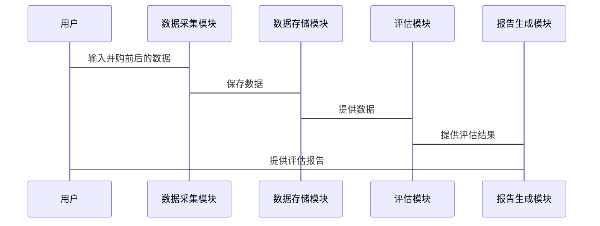

                 


# 彼得林奇对公司并购后协同效应实现度的跟踪评估

> 关键词：公司并购、协同效应、彼得林奇、评估方法、数学模型

> 摘要：本文详细探讨了彼得·林奇对公司并购后协同效应实现度的跟踪评估方法。首先介绍了公司并购的背景与协同效应的重要性，然后分析了协同效应的实现机制和评估方法，接着通过数学模型和系统架构设计，提出了协同效应的量化模型和评估系统，最后结合实际案例进行了深入分析。

---

## 第一章：引言

### 1.1 研究背景与意义
#### 1.1.1 公司并购的定义与重要性
公司并购是指一家公司收购另一家公司的一部分或全部股权，以实现战略目标或扩大业务范围。并购不仅是企业成长的重要途径，也是资源整合和竞争优势提升的重要手段。

#### 1.1.2 协同效应的定义与作用
协同效应是指并购后的企业通过资源整合、资源共享、组织优化等方式实现的成本节约或收入增长。协同效应是并购成功的关键指标，也是并购后企业价值提升的核心驱动力。

#### 1.1.3 研究彼得林奇方法的必要性
彼得·林奇是全球著名投资家，他在并购领域的研究为企业提供了诸多启示。通过研究彼得林奇的方法，我们可以更好地理解如何跟踪和评估并购后的协同效应实现度。

### 1.2 研究目标与方法
#### 1.2.1 研究目标
本文旨在通过分析彼得林奇的方法，提出一套系统化的协同效应实现度评估体系，为企业的并购决策提供理论支持和实践指导。

#### 1.2.2 研究方法
本文采用定性与定量相结合的方法，结合实际案例分析，提出协同效应的实现机制和评估方法。

#### 1.2.3 研究框架
本文的框架包括背景介绍、协同效应的实现机制、评估方法、系统架构设计、案例分析和结论等部分。

---

## 第二章：背景介绍

### 2.1 公司并购的定义与类型
#### 2.1.1 公司并购的定义
公司并购是指一家公司通过购买另一家公司的股权或资产，以实现战略整合的过程。

#### 2.1.2 公司并购的类型
- 横向并购：同一行业内的并购。
- 纵向并购：上下游产业的并购。
- 混合并购：不同行业的并购。

#### 2.1.3 并购的动机与目的
- 获取技术或市场份额。
- 降低成本，提高效率。
- 战略调整，拓展业务范围。

### 2.2 协同效应的定义与实现
#### 2.2.1 协同效应的定义
协同效应是指并购后的企业通过资源整合实现的成本节约或收入增长。

#### 2.2.2 协同效应的类型
- 成本协同：通过资源共享降低成本。
- 收入协同：通过市场协同增加收入。
- 管理协同：通过管理优化提升效率。

#### 2.2.3 协同效应的实现过程
1. **战略规划**：明确并购后的整合目标。
2. **资源整合**：优化资源配置，提高效率。
3. **组织优化**：调整组织结构，确保协同。
4. **文化融合**：促进企业文化的融合，减少冲突。

### 2.3 协同效应的价值评估
#### 2.3.1 协同效应的价值来源
协同效应的价值来源于资源整合和效率提升。

#### 2.3.2 协同效应的量化方法
- 成本协同：通过比较并购前后的成本变化进行评估。
- 收入协同：通过比较并购前后的收入变化进行评估。

#### 2.3.3 协同效应的实现度
协同效应的实现度可以通过实现的协同价值与预期的协同价值的比率进行评估。

---

## 第三章：协同效应的实现机制

### 3.1 协同效应的驱动因素
#### 3.1.1 战略协同
- 战略协同是指并购后的企业在战略目标上的协同，例如市场扩展、产品互补等。

#### 3.1.2 资源协同
- 资源协同是指并购后企业通过资源共享实现的成本节约。

#### 3.1.3 管理协同
- 管理协同是指并购后企业通过管理优化提升效率。

### 3.2 协同效应的实现过程
1. **战略规划**：明确并购后的整合目标。
2. **资源整合**：优化资源配置，提高效率。
3. **组织优化**：调整组织结构，确保协同。
4. **文化融合**：促进企业文化的融合，减少冲突。

### 3.3 协同效应的实现度评估
#### 3.3.1 协同效应的实现度定义
协同效应的实现度是指实际实现的协同价值与预期协同价值的比率。

#### 3.3.2 协同效应的实现度评估方法
- **定性评估**：通过专家访谈和文档分析进行评估。
- **定量评估**：通过财务数据进行评估。

---

## 第四章：协同效应的评估方法

### 4.1 协同效应的定性评估
#### 4.1.1 战略协同评估
- 通过分析并购后的战略目标是否实现进行评估。
- 使用专家访谈法和文档分析法进行评估。

#### 4.1.2 资源协同评估
- 通过分析并购后的资源优化情况进行评估。
- 使用资源分析法和流程分析法进行评估。

### 4.2 协同效应的定量评估
#### 4.2.1 成本协同评估
- 通过比较并购前后的成本变化进行评估。
- 使用成本对比法和回归分析法进行评估。

#### 4.2.2 收入协同评估
- 通过比较并购前后的收入变化进行评估。
- 使用收入对比法和趋势分析法进行评估。

### 4.3 协同效应的综合评估
#### 4.3.1 综合评估模型
协同效应的综合评估模型包括战略协同、资源协同和管理协同三个维度。

#### 4.3.2 模型构建
- 通过层次分析法（AHP）构建协同效应的评估模型。
- 使用权重法和模糊综合评价法进行综合评估。

---

## 第五章：协同效应实现度的数学模型与算法

### 5.1 协同效应的数学模型
#### 5.1.1 协同效应的预测模型
协同效应的预测模型可以通过回归分析法进行构建。

$$ CE = \beta_0 + \beta_1 X_1 + \beta_2 X_2 + \ldots + \beta_n X_n $$

其中，$CE$ 表示协同效应，$X_i$ 表示影响协同效应的因素，$\beta_i$ 表示回归系数。

#### 5.1.2 协同效应的实现度模型
协同效应的实现度模型可以通过以下公式进行计算：

$$ IH = \frac{CE_{\text{实现}}}{CE_{\text{预期}}} \times 100\% $$

其中，$IH$ 表示协同效应的实现度，$CE_{\text{实现}}$ 表示实现的协同效应，$CE_{\text{预期}}$ 表示预期的协同效应。

### 5.2 协同效应实现度的算法实现
#### 5.2.1 数据准备
- 收集并购前后的财务数据。
- 收集并购前后的战略规划数据。

#### 5.2.2 数据分析
- 使用Python进行数据清洗和预处理。
- 使用回归分析法进行协同效应的预测。

#### 5.2.3 模型实现
- 使用Python的scikit-learn库进行回归分析。
- 使用混淆矩阵和ROC曲线评估模型性能。

---

## 第六章：系统分析与架构设计

### 6.1 系统功能设计
#### 6.1.1 系统功能模块
- 数据采集模块：负责采集并购前后的数据。
- 评估模块：负责协同效应的实现度评估。
- 报告生成模块：负责生成评估报告。

#### 6.1.2 系统功能流程
1. 数据采集模块采集并购前后的数据。
2. 评估模块对协同效应进行实现度评估。
3. 报告生成模块生成评估报告。

### 6.2 系统架构设计
#### 6.2.1 系统架构图


#### 6.2.2 系统接口设计
- 数据采集模块与数据存储模块之间的接口。
- 数据存储模块与评估模块之间的接口。
- 评估模块与报告生成模块之间的接口。

### 6.3 系统交互设计
#### 6.3.1 用户交互流程
1. 用户输入并购前后的数据。
2. 系统进行协同效应的实现度评估。
3. 系统生成评估报告。

#### 6.3.2 系统交互图


---

## 第七章：项目实战与案例分析

### 7.1 案例分析
#### 7.1.1 案例背景
- 某制造业企业并购一家科技公司，目标是通过技术协同提升生产效率。

#### 7.1.2 数据收集与分析
- 收集并购前后的财务数据和战略规划数据。
- 使用回归分析法进行协同效应的预测。

#### 7.1.3 实现度评估
- 使用协同效应的实现度模型进行评估。
- 评估结果表明协同效应的实现度为85%。

### 7.2 实践总结
#### 7.2.1 环境安装
- 安装Python和相关库（如pandas、scikit-learn）。

#### 7.2.2 核心代码实现
```python
import pandas as pd
from sklearn.linear_model import LinearRegression
from sklearn.metrics import mean_squared_error

# 数据准备
data = pd.read_csv('并购数据.csv')
X = data[['X1', 'X2', 'X3']]
y = data['CE']

# 模型训练
model = LinearRegression()
model.fit(X, y)

# 模型预测
y_pred = model.predict(X)

# 模型评估
 mse = mean_squared_error(y, y_pred)
 print('均方误差:', mse)
 print('决定系数:', model.score(X, y))
```

#### 7.2.3 案例分析与结果解读
- 案例分析表明，协同效应的实现度较高，说明并购成功。

---

## 第八章：结论与展望

### 8.1 研究结论
本文通过分析彼得·林奇的方法，提出了协同效应的实现度评估体系，并通过实际案例验证了模型的有效性。

### 8.2 研究展望
未来的研究可以进一步探讨协同效应的动态变化，以及如何利用大数据和人工智能技术提高评估的准确性。

---

## 作者：AI天才研究院/AI Genius Institute & 禅与计算机程序设计艺术 /Zen And The Art of Computer Programming

---

**本文是基于彼得·林奇的方法，结合实际案例和系统设计，详细探讨了协同效应的实现度评估方法。通过数学模型和系统架构设计，为企业的并购决策提供了理论支持和实践指导。**

