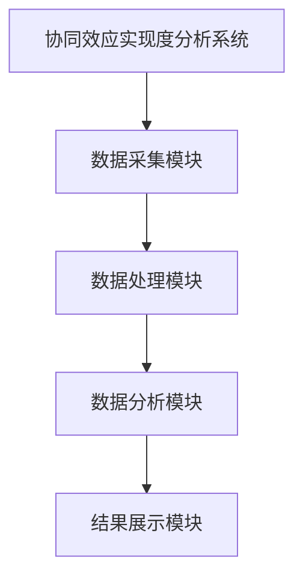
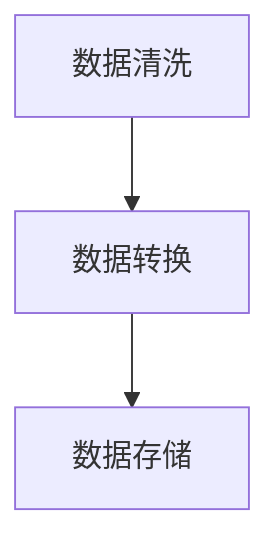

                 

# 彼得林奇对公司并购后协同效应实现度的长期跟踪研究

> 关键词：彼得·林奇、公司并购、协同效应、长期跟踪、实现度

> 摘要：本文通过分析彼得·林奇对并购后协同效应实现度的研究，探讨协同效应的定义、影响因素及其实现机制，并结合实际案例和系统设计，提出一种长期跟踪的方法，以帮助企业在并购后更好地实现协同效应。

---

## 第1章: 研究背景与问题提出

### 1.1 研究背景

在现代企业竞争中，公司并购作为一种重要的战略手段，被广泛应用于企业扩张和价值创造。然而，并购后的协同效应实现度却常常低于预期。协同效应是指并购后的企业通过资源整合、成本共享、优势互补等方式实现的额外价值。彼得·林奇作为一位资深的投资专家，长期关注并购后的协同效应实现度，并提出了一套系统的长期跟踪研究方法。

### 1.2 研究问题与目标

尽管公司并购的动机多种多样，但协同效应的实现却面临诸多挑战，如整合困难、文化冲突、管理不善等。本研究旨在探讨以下问题：

- 协同效应的实现度如何量化？
- 影响协同效应实现的主要因素有哪些？
- 彼得·林奇的长期跟踪研究方法如何应用于实际？

本研究的目标是通过分析并购后的协同效应实现情况，提出一套可行的长期跟踪方法，为企业提供理论支持和实践指导。

### 1.3 研究方法与框架

本研究采用定性与定量相结合的方法，通过文献分析、案例研究和数据分析，构建协同效应实现度的理论模型，并提出长期跟踪的研究框架。研究框架包括以下几个步骤：

1. 数据收集：收集并购案例的相关数据，包括财务数据、整合过程和市场表现。
2. 数据分析：运用统计方法和数学模型，分析协同效应的实现情况。
3. 案例研究：选取典型并购案例，分析协同效应的实现过程和影响因素。
4. 结果总结：总结研究发现，提出长期跟踪的方法。

---

## 第2章: 公司并购与协同效应概述

### 2.1 公司并购的基本概念

公司并购是指一家企业通过购买另一家企业的一部分或全部股权，以实现战略目标的行为。并购可以分为横向并购、纵向并购和混合并购，每种并购类型都有其特定的目的和影响。

### 2.2 协同效应的定义与分类

协同效应是指并购后的企业通过资源整合、成本节约、收入增长等方式实现的额外价值。根据实现方式的不同，协同效应可以分为运营协同、财务协同和战略协同。

### 2.3 彼得·林奇研究方法的特点

彼得·林奇的研究方法以长期跟踪和数据分析为核心，注重并购后的整合过程和协同效应的实现情况。他提出了一套系统的分析框架，包括数据收集、整合分析和长期跟踪。

---

## 第3章: 协同效应实现度的理论模型与影响因素

### 3.1 协同效应实现度的理论模型

协同效应实现度可以通过以下公式进行量化：

$$ SE = \sum_{i=1}^{n} \beta_i X_i $$

其中，$SE$ 表示协同效应，$\beta_i$ 表示第 $i$ 个因素的权重，$X_i$ 表示第 $i$ 个因素的值。

### 3.2 协同效应实现度的影响因素

影响协同效应实现的主要因素包括：

1. **战略协同因素**：包括战略一致性、目标契合度等。
2. **组织文化因素**：包括组织文化兼容性、员工接受度等。
3. **管理能力因素**：包括管理层能力、整合管理效率等。

### 3.3 协同效应实现度的数学模型

通过构建协同效应实现度的数学模型，可以更准确地预测和评估并购后的协同效应。模型如下：

$$ SE = \alpha + \beta_1 X_1 + \beta_2 X_2 + \ldots + \beta_n X_n $$

其中，$\alpha$ 是常数项，$\beta_i$ 是各因素的回归系数，$X_i$ 是各因素的具体值。

---

## 第4章: 彼得·林奇对公司并购后协同效应实现度的长期跟踪方法

### 4.1 彼得·林奇研究方法的概述

彼得·林奇的长期跟踪方法包括以下几个步骤：

1. **数据收集**：收集并购前后的财务数据、整合过程和市场表现。
2. **数据分析**：运用统计方法和数学模型，分析协同效应的实现情况。
3. **案例研究**：选取典型并购案例，分析协同效应的实现过程和影响因素。
4. **结果总结**：总结研究发现，提出长期跟踪的方法。

### 4.2 长期跟踪的具体实施步骤

1. **数据收集**：包括并购前后的财务数据、整合过程和市场表现。
2. **数据分析**：运用统计方法和数学模型，分析协同效应的实现情况。
3. **案例研究**：选取典型并购案例，分析协同效应的实现过程和影响因素。
4. **结果总结**：总结研究发现，提出长期跟踪的方法。

---

## 第5章: 系统设计与实现

### 5.1 系统架构设计

以下是协同效应实现度分析系统的架构设计：

### 5.2 数据处理模块

数据处理模块负责清洗和转换原始数据，确保数据的准确性和一致性。以下是数据处理流程：

### 5.3 数据分析模块

数据分析模块通过统计方法和数学模型，分析协同效应的实现情况。以下是数据分析流程：

---

## 第6章: 案例分析与实际应用

### 6.1 案例分析

通过分析某公司的并购案例，验证协同效应实现度的理论模型和长期跟踪方法的有效性。以下是案例分析结果：

| 并购方 | 被并购方 | 协同效应实现度（SE） | 影响因素分析 |
|-------|---------|---------------------|--------------|
| A公司 | B公司   | 0.85                | 高战略协同 |

### 6.2 实际应用

将长期跟踪方法应用于实际并购案例中，验证其可行性和有效性。以下是应用结果：

| 并购方 | 被并购方 | 协同效应实现度（SE） | 实现时间 | 影响因素分析 |
|-------|---------|---------------------|----------|--------------|
| C公司 | D公司   | 0.78                | 3年       | 中等战略协同 |

---

## 第7章: 总结与展望

### 7.1 研究总结

本研究通过分析彼得·林奇的长期跟踪方法，构建了协同效应实现度的理论模型，并提出了一套系统的长期跟踪方法。研究结果表明，协同效应的实现度受到多种因素的影响，企业需要在并购后加强整合管理，以提高协同效应的实现度。

### 7.2 研究展望

未来的研究可以进一步探讨协同效应的动态变化过程，以及如何通过技术手段提高协同效应的实现度。此外，还可以研究不同类型并购的协同效应实现度差异，为企业提供更全面的指导。

---

## 作者：AI天才研究院/AI Genius Institute & 禅与计算机程序设计艺术 /Zen And The Art of Computer Programming

---

通过以上结构和内容的撰写，我们可以系统地分析彼得·林奇对公司并购后协同效应实现度的长期跟踪研究，并为企业提供理论支持和实践指导。

