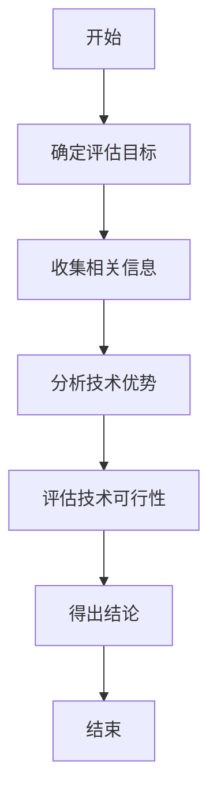
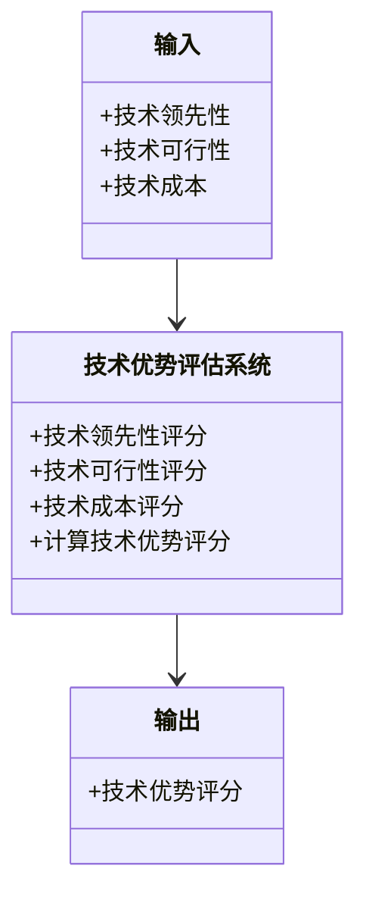
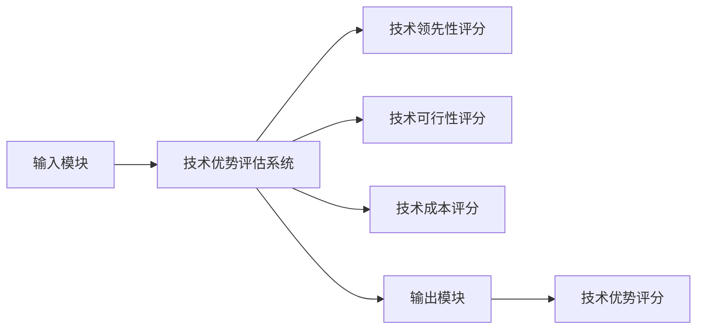

                 


# 彼得林奇对公司技术优势的评估方法

> 关键词：技术优势评估、彼得林奇、投资方法、技术可行性、企业竞争力

> 摘要：本文深入探讨了彼得林奇在评估公司技术优势方面的方法和策略，结合技术分析、投资决策和企业战略，详细阐述了技术优势的定义、评估指标、数学模型和实际应用。

---

## 第一部分: 技术优势评估的背景与重要性

### 第1章: 技术优势在企业竞争中的作用

#### 1.1 技术优势的核心定义
技术优势是指企业在技术开发、创新能力和应用水平上相对于竞争对手的领先地位。这种优势可以体现在技术领先性、技术可行性和技术成本等多个维度。

#### 1.2 技术优势对企业竞争力的影响
技术优势是企业核心竞争力的重要组成部分，它不仅决定了企业在市场中的地位，还影响着企业的盈利能力和发展潜力。拥有技术优势的企业更容易推出创新产品，吸引客户，提高市场份额。

#### 1.3 技术优势与企业长期价值的关系
技术优势是企业长期价值的基石。通过技术优势，企业可以在竞争中保持领先地位，降低被替代的风险，并为未来的技术发展奠定基础。

### 第2章: 彼得林奇的评估方法简介

#### 2.1 彼得林奇的背景与投资理念
彼得·林奇是美国著名投资家，以其独特的投资方法闻名。他强调对企业基本面的深入分析，尤其是对技术优势的评估，是他投资决策的重要依据。

#### 2.2 技术优势评估在投资决策中的地位
在彼得林奇的投资方法中，技术优势评估是筛选优质企业的关键步骤。他通过分析企业的技术优势，判断其是否具备长期增长的潜力。

#### 2.3 评估方法的核心原则与框架
彼得林奇的技术优势评估方法注重技术的可行性和可持续性，强调对企业技术资源、研发能力和市场应用潜力的综合分析。

---

## 第二部分: 技术优势评估的核心概念与框架

### 第3章: 技术优势评估的理论基础

#### 3.1 技术优势的定义与属性
技术优势包括技术领先性、技术可行性和技术成本三个主要属性。这些属性共同决定了企业技术优势的强弱。

#### 3.2 技术优势的层次结构
技术优势可以分为基础技术优势和应用技术优势两个层次。基础技术优势是技术优势的核心，而应用技术优势是基础技术优势的延伸。

#### 3.3 技术优势与企业战略的关系
技术优势是企业战略的重要组成部分。通过技术优势，企业可以制定更具竞争力的市场策略，提升整体竞争力。

### 第4章: 技术优势评估的关键指标

#### 4.1 技术领先性
技术领先性是指企业在技术开发和创新方面的领先地位。评估技术领先性需要考虑企业的研发投入、技术专利数量和技术创新能力。

#### 4.2 技术可持续性
技术可持续性是指企业技术的长期可行性和适应性。评估技术可持续性需要考虑技术的更新速度、市场需求和技术发展的趋势。

#### 4.3 技术可扩展性
技术可扩展性是指企业技术在不同应用场景下的适用性。评估技术可扩展性需要考虑技术的灵活性和适应性。

### 第5章: 彼得林奇评估模型的流程图



---

## 第三部分: 技术优势评估的数学模型与算法原理

### 第6章: 技术优势评估的数学模型

#### 6.1 技术优势评分公式
$$ S = \frac{w_1 \cdot T + w_2 \cdot E + w_3 \cdot C}{w_1 + w_2 + w_3} $$
其中，$S$ 表示技术优势评分，$T$ 表示技术领先性，$E$ 表示技术可行性，$C$ 表示技术成本，$w_1, w_2, w_3$ 表示权重系数。

#### 6.2 权重系数的确定方法
$$ w_i = \frac{e_i}{\sum_{j=1}^{n} e_j} $$
其中，$e_i$ 表示第 $i$ 个指标的专家评分，$n$ 表示指标总数。

### 第7章: 技术优势评估的算法实现

```python
def calculate_technical_advantage_score(tech_lead, tech_feasibility, tech_cost):
    weights = [0.4, 0.3, 0.3]
    score = (weights[0] * tech_lead + weights[1] * tech_feasibility + weights[2] * tech_cost) 
    return score

# 示例代码
tech_lead = 80
tech_feasibility = 70
tech_cost = 60
score = calculate_technical_advantage_score(tech_lead, tech_feasibility, tech_cost)
print("技术优势评分:", score)
```

---

## 第四部分: 系统分析与架构设计方案

### 第8章: 问题场景介绍

#### 8.1 项目介绍
我们选择一家高科技公司作为案例，分析其技术优势。通过评估技术领先性、技术可行性和技术成本，判断其技术优势的强弱。

### 第9章: 系统功能设计

#### 9.1 领域模型（Mermaid 类图）


### 第10章: 系统架构设计

#### 10.1 系统架构图


---

## 第五部分: 项目实战

### 第11章: 环境安装

#### 11.1 安装Python环境
需要安装Python 3.8及以上版本，并安装必要的库，如`mermaid`和`matplotlib`。

### 第12章: 系统核心实现源代码

#### 12.1 技术优势评估系统的实现
```python
def calculate_technical_advantage_score(tech_lead, tech_feasibility, tech_cost):
    weights = [0.4, 0.3, 0.3]
    score = (weights[0] * tech_lead + weights[1] * tech_feasibility + weights[2] * tech_cost) 
    return score

# 输入参数
tech_lead = 85
tech_feasibility = 75
tech_cost = 65

# 计算评分
score = calculate_technical_advantage_score(tech_lead, tech_feasibility, tech_cost)

# 输出结果
print(f"技术领先性: {tech_lead}%")
print(f"技术可行性: {tech_feasibility}%")
print(f"技术成本: {tech_cost}%")
print(f"技术优势评分: {score:.2f}")
```

### 第13章: 实际案例分析

#### 13.1 案例分析
以某高科技公司为例，评估其技术优势。假设其技术领先性评分为85%，技术可行性评分为75%，技术成本评分为65%。根据公式计算，技术优势评分为77.5%。

---

## 第六部分: 总结与扩展阅读

### 第14章: 最佳实践 tips

#### 14.1 关键tips
- 技术优势评估需要综合考虑技术领先性、技术可行性和技术成本。
- 权重系数的确定需要根据具体行业和企业特点进行调整。
- 定期更新评估模型，以适应技术和市场变化。

### 第15章: 小结

#### 15.1 项目小结
通过本文的分析，我们深入探讨了彼得林奇技术优势评估方法的核心概念、数学模型和实际应用。通过案例分析，验证了评估方法的有效性和实用性。

### 第16章: 注意事项

#### 16.1 重要注意事项
- 技术优势评估需要结合企业的实际情况进行。
- 权重系数的调整需要根据行业特点和企业战略目标进行。
- 技术优势评估结果需要结合其他因素进行综合判断。

### 第17章: 拓展阅读

#### 17.1 相关书籍
- 《彼得·林奇的投资哲学》
- 《技术优势与企业竞争力》

---

## 作者

作者：AI天才研究院/AI Genius Institute & 禅与计算机程序设计艺术 /Zen And The Art of Computer Programming

