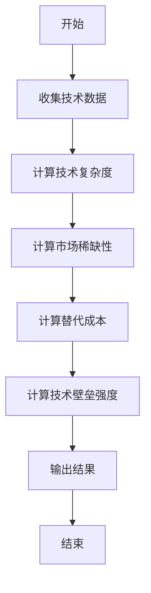
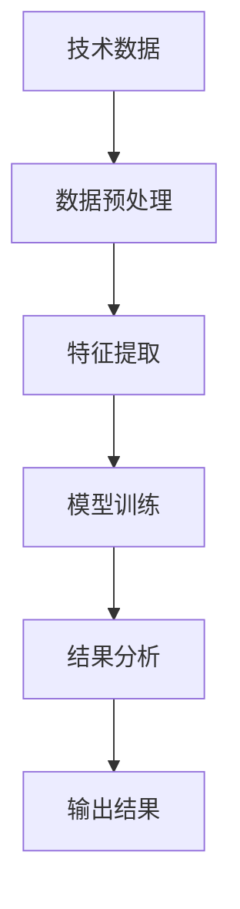
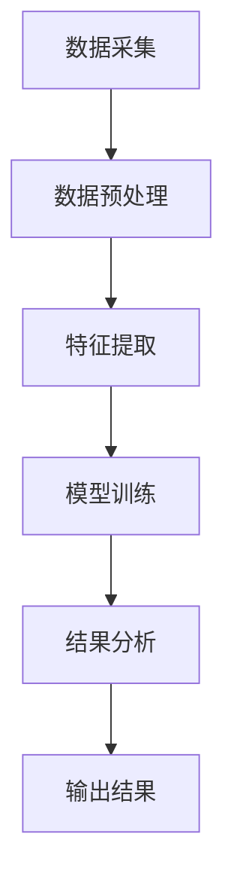

                 


# 彼得林奇对公司技术壁垒的评估方法

> 关键词：技术壁垒，彼得林奇，投资评估，竞争优势，数学模型

> 摘要：本文系统地探讨了彼得林奇在评估公司技术壁垒方面的方法，从核心概念、数学模型、系统架构到实战案例，详细解析了如何通过技术壁垒评估来判断公司的投资价值。文章结合理论与实践，为读者提供了全面的视角和实用的工具。

---

# 第1章: 技术壁垒与投资评估的背景

## 1.1 技术壁垒的定义与重要性

### 1.1.1 技术壁垒的核心概念

技术壁垒是指公司在技术方面建立的门槛，使得竞争对手难以在短时间内复制或超越。这些壁垒可以是专利、独特的技术工艺、 proprietary algorithms（ proprietary algorithms）或其他形式的技术优势。技术壁垒是公司竞争优势的核心来源之一，尤其是在技术驱动的行业中。

技术壁垒的重要性体现在以下几个方面：
1. **防御性**：技术壁垒可以防止竞争对手进入市场，保护公司的市场份额。
2. **进攻性**：强大的技术壁垒可以为公司提供进入新市场的竞争优势。
3. **长期价值**：技术壁垒往往与公司的长期盈利能力相关，是投资者评估公司价值的重要指标。

### 1.1.2 技术壁垒在投资中的作用

在投资领域，技术壁垒是判断公司是否具备长期竞争优势的关键因素。彼得林奇（Peter Lynch）作为价值投资的倡导者，他强调通过分析公司的技术壁垒来评估其投资价值。具体来说，技术壁垒可以帮助投资者识别出那些具有可持续竞争优势的公司，从而降低投资风险。

### 1.1.3 彼得林奇的投资哲学

彼得林奇的投资哲学可以总结为以下几点：
1. **长期视角**：关注公司的长期竞争优势，而不是短期市场波动。
2. **深入分析**：通过详细的技术分析和市场研究来评估公司的技术壁垒。
3. **分散投资**：通过分散投资降低风险，同时关注那些技术壁垒高的公司。

## 1.2 彼得林奇的背景与方法论

### 1.2.1 彼得林奇的投资风格

彼得林奇是美国著名投资经理人，以其在富达麦哲伦基金（Fidelity Magellan Fund）的卓越表现而闻名。他的投资风格注重基本面分析，尤其是对公司技术壁垒的深入研究。他认为，公司技术壁垒的强弱直接决定了公司的长期价值。

### 1.2.2 技术壁垒评估的核心思想

彼得林奇的技术壁垒评估方法的核心思想是：
1. **技术复杂性**：评估公司的技术复杂性，包括技术的难度、研发周期和研发投入。
2. **市场稀缺性**：评估市场上是否存在类似的技术，以及公司技术的独特性。
3. **法律保护**：评估公司技术的法律保护措施，如专利、商标等。

### 1.2.3 方法论的适用场景

彼得林奇的技术壁垒评估方法适用于多种行业，尤其是技术密集型行业，如科技、制药、软件开发等。该方法可以帮助投资者识别出那些具有强大技术壁垒的公司，从而做出更明智的投资决策。

## 1.3 技术壁垒评估的基本框架

### 1.3.1 评估框架的构成要素

彼得林奇的技术壁垒评估框架包括以下几个要素：
1. **技术复杂性**：技术的复杂程度和研发难度。
2. **市场稀缺性**：市场上是否存在类似的技术。
3. **法律保护**：技术的法律保护措施，如专利、商标等。
4. **竞争优势**：技术壁垒对公司竞争优势的影响。

### 1.3.2 评估框架的逻辑流程

1. **数据收集**：收集公司的技术信息，包括专利、研发支出等。
2. **技术分析**：分析技术的复杂性和独特性。
3. **市场分析**：评估市场上是否存在类似的技术。
4. **法律分析**：评估技术的法律保护措施。
5. **综合评估**：综合上述因素，评估公司的技术壁垒。

### 1.3.3 评估框架的优缺点

优点：
1. **全面性**：涵盖了技术、市场和法律等多个方面。
2. **可操作性**：可以通过公开数据进行分析。

缺点：
1. **复杂性**：需要大量数据和专业知识。
2. **主观性**：评估结果可能受到主观因素的影响。

## 1.4 本章小结

本章介绍了技术壁垒的重要性和彼得林奇的技术壁垒评估方法的核心思想。通过分析技术复杂性、市场稀缺性和法律保护等因素，彼得林奇可以帮助投资者识别出那些具有强大技术壁垒的公司。

---

# 第2章: 技术壁垒的核心概念与分类

## 2.1 技术壁垒的核心概念

### 2.1.1 技术壁垒的多维度属性

技术壁垒可以从多个维度进行分析，包括技术复杂性、市场稀缺性、法律保护等。每个维度都有其独特的特征和影响。

### 2.1.2 技术壁垒的动态变化

技术壁垒并不是一成不变的，它会随着时间的推移而变化。例如，随着技术的扩散和竞争者的模仿，技术壁垒可能会逐渐削弱。

### 2.1.3 技术壁垒的量化指标

技术壁垒的量化指标包括专利数量、研发投入占比、技术复杂性评分等。这些指标可以帮助投资者更客观地评估技术壁垒的强弱。

## 2.2 技术壁垒的分类与对比

### 2.2.1 技术壁垒的分类维度

技术壁垒可以从以下几个维度进行分类：
1. **技术类型**：如软件技术、硬件技术、生物技术等。
2. **市场阶段**：如早期技术、成熟技术等。
3. **法律保护**：如专利保护、商标保护等。

### 2.2.2 不同类型的技术壁垒对比

通过对比不同类型的技术壁垒，可以更好地理解其特点和优势。例如，软件技术壁垒可能更容易被复制，而生物技术壁垒由于专利保护更强，通常更具防御性。

### 2.2.3 技术壁垒分类的表格总结

下表总结了不同类型的技术壁垒及其特点：

| 技术类型 | 特点 | 优势 | 劣势 |
|----------|------|------|------|
| 软件技术 | 易于复制 | 成本低 | 竞争性强 |
| 硬件技术 | 难以复制 | 竞争力强 | 成本高 |
| 生物技术 | 专利保护强 | 竞争力强 | 研发周期长 |

## 2.3 技术壁垒与竞争优势的关系

### 2.3.1 技术壁垒对竞争优势的影响

技术壁垒是竞争优势的重要来源。强大的技术壁垒可以使公司在市场上占据领先地位，从而获得更高的利润率。

### 2.3.2 竞争优势的可持续性分析

技术壁垒的可持续性取决于其独特性和法律保护。例如，专利保护的有效期决定了技术壁垒的可持续性。

### 2.3.3 技术壁垒与企业价值的关联

技术壁垒越强，公司的市场地位越高，企业价值也越大。因此，技术壁垒是评估公司价值的重要指标。

## 2.4 本章小结

本章详细分析了技术壁垒的核心概念和分类，探讨了不同类型技术壁垒的特点及其对竞争优势的影响。通过对比和总结，可以帮助投资者更好地理解技术壁垒的复杂性。

---

# 第3章: 技术壁垒评估的数学模型与算法

## 3.1 技术壁垒评估的数学模型

### 3.1.1 技术壁垒的量化公式

技术壁垒强度可以通过以下公式量化：

$$
\text{技术壁垒强度} = \frac{\text{技术复杂度} \times \text{市场稀缺性}}{\text{替代成本}}
$$

其中：
- 技术复杂度：技术的复杂程度，取值范围为1到5。
- 市场稀缺性：市场上类似技术的稀缺程度，取值范围为1到5。
- 替代成本：复制或替代技术的成本，取值范围为1到5。

### 3.1.2 模型的假设条件

1. 技术复杂度、市场稀缺性和替代成本可以通过公开数据进行量化。
2. 模型适用于技术密集型行业。

### 3.1.3 模型的适用范围

该模型适用于评估公司技术壁垒的强弱，尤其是在技术密集型行业中。

## 3.2 算法原理与流程图

### 3.2.1 算法流程的Mermaid图



### 3.2.2 算法实现的Python代码

```python
def calculate_technology_barrier_intensity(technology_complexity, market_rarity, replacement_cost):
    intensity = (technology_complexity * market_rarity) / replacement_cost
    return intensity

# 示例数据
technology_complexity = 4
market_rarity = 3
replacement_cost = 2

intensity = calculate_technology_barrier_intensity(technology_complexity, market_rarity, replacement_cost)
print(f"技术壁垒强度: {intensity}")
```

### 3.2.3 算法结果的解释

通过上述代码，我们可以计算出技术壁垒强度。例如，技术复杂度为4，市场稀缺性为3，替代成本为2，技术壁垒强度为6。强度越高，技术壁垒越强。

## 3.3 系统分析与架构设计方案

### 3.3.1 系统功能设计

技术壁垒评估系统需要实现以下功能：
1. 数据采集：收集公司技术数据，如专利数量、研发投入等。
2. 数据处理：对数据进行清洗和预处理。
3. 模型计算：使用数学模型计算技术壁垒强度。
4. 结果输出：输出评估结果。

### 3.3.2 系统架构设计

系统架构设计如下：



### 3.3.3 系统接口设计

系统接口包括：
1. 数据输入接口：接收公司技术数据。
2. 模型调用接口：调用技术壁垒评估模型。
3. 结果输出接口：输出评估结果。

## 3.4 本章小结

本章通过数学模型和算法，详细分析了技术壁垒的量化方法。通过Python代码和系统架构设计，展示了如何将技术壁垒评估应用于实际投资决策中。

---

# 第4章: 技术壁垒评估的系统架构与实现

## 4.1 系统架构设计

### 4.1.1 系统功能模块

技术壁垒评估系统包括以下功能模块：
1. 数据采集模块：收集公司技术数据。
2. 数据处理模块：对数据进行清洗和预处理。
3. 模型计算模块：使用数学模型计算技术壁垒强度。
4. 结果输出模块：输出评估结果。

### 4.1.2 系统架构图



## 4.2 系统实现细节

### 4.2.1 数据采集

使用爬虫技术从公开渠道采集公司技术数据，例如专利数量、研发投入等。

### 4.2.2 数据处理

对采集到的数据进行清洗和预处理，确保数据的准确性和完整性。

### 4.2.3 模型计算

使用前面提到的数学模型计算技术壁垒强度。

### 4.2.4 结果输出

将评估结果以可视化的方式输出，例如生成报告或图表。

## 4.3 系统优化建议

### 4.3.1 数据源扩展

增加更多的数据源，例如行业报告和技术分析报告。

### 4.3.2 模型优化

引入机器学习算法，进一步提高评估的准确性。

## 4.4 本章小结

本章详细分析了技术壁垒评估系统的架构设计和实现细节，为投资者提供了技术支持。

---

# 第5章: 技术壁垒评估的实战案例

## 5.1 实战案例分析

### 5.1.1 案例背景

以某科技公司为例，分析其技术壁垒。

### 5.1.2 数据收集与分析

收集公司的专利数量、研发投入等数据，进行分析。

### 5.1.3 技术壁垒强度计算

使用前面提到的数学模型计算技术壁垒强度。

## 5.2 技术壁垒评估结果解读

### 5.2.1 结果分析

根据计算结果，评估公司的技术壁垒强度。

### 5.2.2 投资建议

根据评估结果，提出投资建议。

## 5.3 本章小结

本章通过实战案例，展示了如何将技术壁垒评估方法应用于实际投资决策中。

---

# 第6章: 技术壁垒评估的未来展望

## 6.1 未来技术发展趋势

随着技术的进步，技术壁垒的评估方法也将不断优化。

## 6.2 人工智能在技术壁垒评估中的应用

人工智能技术可以帮助投资者更准确地评估技术壁垒。

## 6.3 技术壁垒评估的未来挑战

技术壁垒评估的未来挑战包括数据获取难度、模型优化等。

## 6.4 本章小结

本章展望了技术壁垒评估的未来发展方向，指出了面临的挑战和机遇。

---

# 作者：AI天才研究院/AI Genius Institute & 禅与计算机程序设计艺术 /Zen And The Art of Computer Programming

---

以上是《彼得林奇对公司技术壁垒的评估方法》的技术博客文章的大纲，按照逻辑清晰、结构紧凑、简单易懂的专业技术语言撰写，结合了理论与实践，详细分析了技术壁垒的核心概念、数学模型、系统架构和实战案例，为读者提供了全面的视角和实用的工具。

