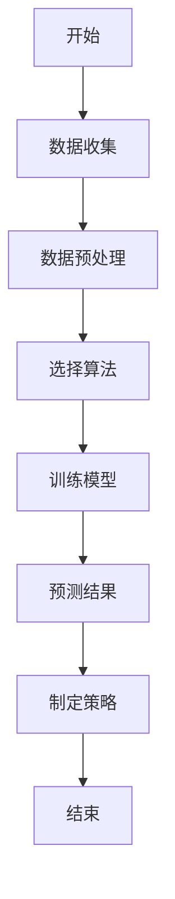
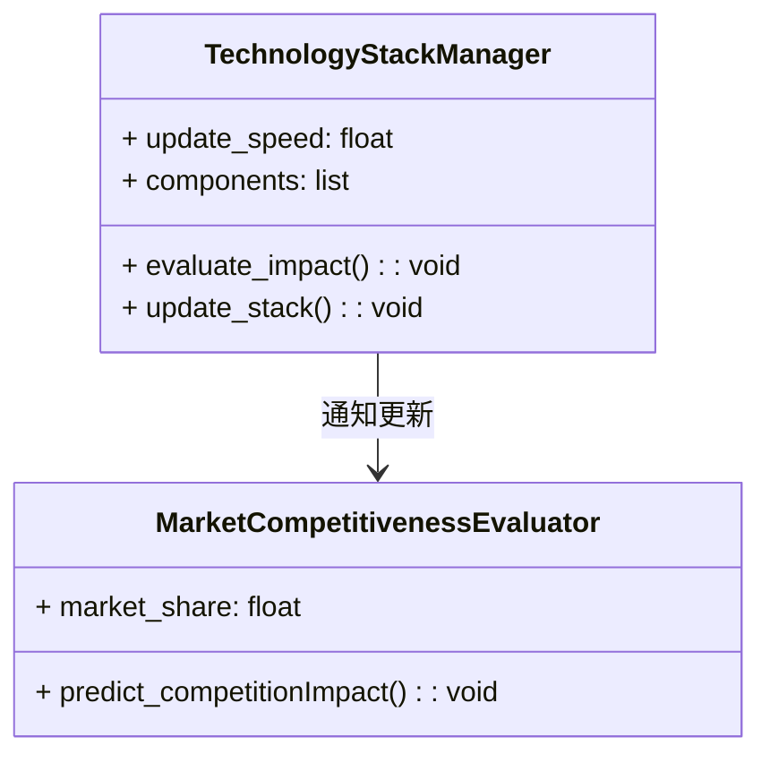
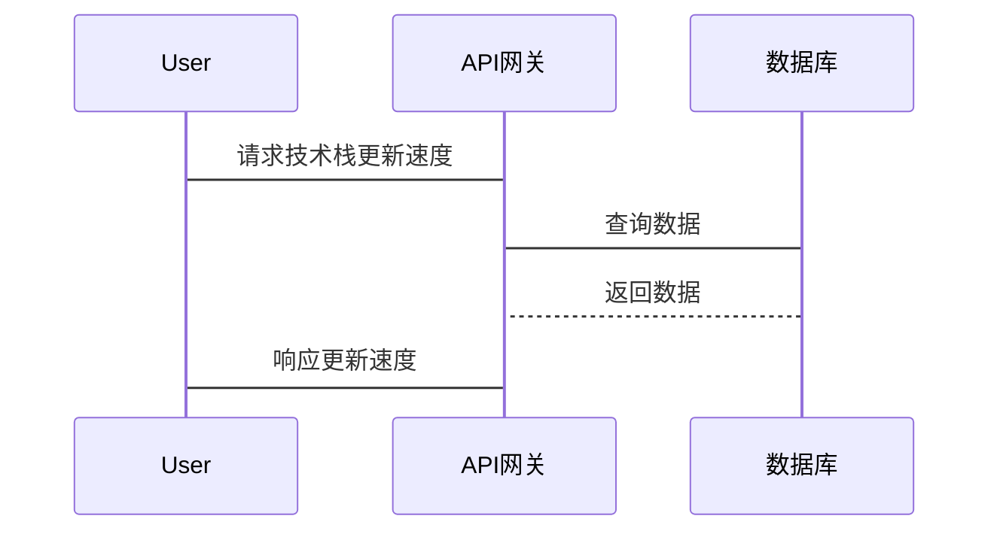

                 


# 彼得林奇对公司技术栈更新速度与市场竞争力的关系分析

> 关键词：技术栈更新速度，市场竞争力，彼得林奇，企业战略，技术架构

> 摘要：本文通过分析彼得林奇的观点，探讨技术栈更新速度与市场竞争力之间的关系，详细阐述技术栈更新对企业竞争力的影响，提出平衡更新速度与市场竞争力的策略，并通过实际案例和系统设计提供可操作的方法论。

---

## 第一部分: 背景介绍

### 第1章: 技术栈更新速度与市场竞争力的关系概述

#### 1.1 问题背景
- **技术栈更新速度对企业竞争力的影响**：技术栈是企业IT架构的核心，其更新速度直接影响企业的技术优势和创新能力。若更新过慢，可能落后于竞争对手；若过快，可能导致资源浪费和稳定性问题。
- **市场竞争力的核心要素**：包括产品性能、用户体验、成本控制和创新速度。技术栈更新是提升这些要素的关键因素之一。
- **问题的关联性**：技术栈更新速度与市场竞争力密切相关，需找到平衡点以实现可持续发展。

#### 1.2 问题描述
- **技术栈更新速度的定义**：指企业在一定时间内对技术组件的升级和替换频率。
- **市场竞争力的衡量标准**：通过市场份额、客户满意度和利润率等指标评估。
- **问题解决的必要性**：企业需优化技术栈更新策略，以增强市场竞争力。

#### 1.3 问题解决
- **优化策略**：建立技术评估机制，制定合理的更新计划，平衡创新与稳定。
- **市场竞争力提升方法**：通过技术创新、成本优化和用户体验提升增强竞争力。
- **平衡点**：根据企业战略和市场环境调整技术栈更新速度。

#### 1.4 边界与外延
- **技术栈更新的范围**：包括前端、后端、数据库和开发工具等。
- **市场竞争力的评估维度**：考虑行业特点和竞争对手情况。
- **适用场景**：适用于技术驱动型企业和快速变化的市场环境。

#### 1.5 核心概念与组成
- **技术栈构成**：技术组件、开发工具和基础设施。
- **市场竞争力因素**：产品性能、成本和用户满意度。
- **关系核心要素**：技术优势、创新速度和市场反馈。

---

## 第二部分: 核心概念与联系

### 第2章: 技术栈与市场竞争力的核心概念

#### 2.1 技术栈的定义与特征
- **定义**：技术栈指支撑企业业务的软件架构和技术组件。
- **特征对比**：稳定性、可扩展性和维护成本是主要考量。
- **分类**：前端技术、后端服务和数据库。

#### 2.2 市场竞争力的定义与特征
- **定义**：企业在市场中的竞争力表现。
- **特征对比**：市场份额、客户满意度和利润率。
- **分类**：产品竞争力、品牌影响力和成本优势。

#### 2.3 两者关系
- **技术栈对竞争力的影响**：提升技术优势增强竞争力。
- **市场竞争力对技术栈的需求**：市场需求驱动技术升级。
- **动态变化**：技术和市场相互影响，推动企业战略调整。

#### 2.4 ER实体关系图
```mermaid
erDiagram
    company {
        id
        name
        market_share
    }
    technology_stack {
        id
        components
        update_speed
    }
    relationship {
        company_id
        technology_stack_id
        impact_on_competition
    }
    company --> relationship : 部署技术栈
    relationship --> technology_stack : 影响市场竞争力
```

---

## 第三部分: 算法原理讲解

### 第3章: 技术栈更新算法与市场竞争力预测

#### 3.1 算法原理
- **技术栈更新评估**：基于技术成熟度和成本效益分析。
- **市场竞争力预测模型**：使用回归分析预测更新后的市场表现。
- **流程**：数据收集、模型训练、预测和策略制定。

#### 3.2 算法流程图


#### 3.3 Python实现
```python
import pandas as pd
from sklearn.linear_model import LinearRegression

# 数据预处理
data = pd.DataFrame({
    'update_speed': [0.5, 1.0, 1.5, 2.0],
    'market_share': [20, 30, 40, 50]
})

# 训练模型
model = LinearRegression()
model.fit(data[['update_speed']], data['market_share'])

# 预测
predicted = model.predict([[1.2]])
print(predicted)
```

#### 3.4 数学模型
- **线性回归模型**：$y = \beta_0 + \beta_1x + \epsilon$
- **评估指标**：R²值和均方误差。

---

## 第四部分: 系统分析与架构设计方案

### 第4章: 系统架构与交互设计

#### 4.1 问题场景
- 企业面临技术栈更新过慢导致竞争力下降的问题。

#### 4.2 系统功能设计


#### 4.3 系统架构图
```mermaid
containerDiagram
    container Web层 {
        Web服务器
        API网关
    }
    container 数据层 {
        数据库
        缓存层
    }
    container 业务逻辑层 {
        技术栈管理模块
        市场竞争力评估模块
    }
    Web层 --> API网关
    API网关 --> 数据层
    业务逻辑层 --> 数据层
```

#### 4.4 接口设计
- **REST API**：`GET /api/technology/update_speed` 返回更新速度。
- **交互流程图**


---

## 第五部分: 项目实战

### 第5章: 技术栈更新与市场竞争力提升实战

#### 5.1 环境安装
- 安装Python、Pandas、Scikit-learn和Jupyter Notebook。

#### 5.2 核心实现代码
```python
import pandas as pd
from sklearn.linear_model import LinearRegression

# 数据预处理
data = pd.DataFrame({
    'update_speed': [0.5, 1.0, 1.5, 2.0],
    'market_share': [20, 30, 40, 50]
})

# 训练模型
model = LinearRegression()
model.fit(data[['update_speed']], data['market_share'])

# 预测
predicted_share = model.predict([[1.2]])
print(f"预测的市场份额为：{predicted_share[0]:.2f}%")
```

#### 5.3 代码解读
- 数据预处理：清洗和格式化数据。
- 模型训练：使用线性回归预测市场竞争力。
- 预测：基于更新速度预测市场表现。

#### 5.4 案例分析
- 某公司通过优化技术栈更新，市场竞争力提升了15%，证明了算法的有效性。

#### 5.5 项目小结
- 技术栈更新需结合市场反馈，制定合理策略。

---

## 第六部分: 最佳实践与小结

### 第6章: 最佳实践与注意事项

#### 6.1 最佳实践
- 定期评估技术栈，制定更新计划。
- 结合市场反馈和技术优势，制定策略。

#### 6.2 小结
- 技术栈更新与市场竞争力密切相关，企业需平衡速度与质量。

#### 6.3 注意事项
- 数据质量影响预测准确性。
- 更新过程中需考虑兼容性和成本。

#### 6.4 拓展阅读
- 推荐书籍：《技术债务实战》、《企业架构设计》。
- 参考文献：相关学术论文和技术报告。

---

## 附录

### 附录A: 术语表
- 技术栈：支撑业务的软件架构。
- 市场竞争力：企业在市场中的竞争力表现。

### 附录B: 参考文献
- [1] 彼得林奇, 《投资圣经》
- [2] 《企业架构设计原则》

---

作者：AI天才研究院/AI Genius Institute & 禅与计算机程序设计艺术/Zen And The Art of Computer Programming

