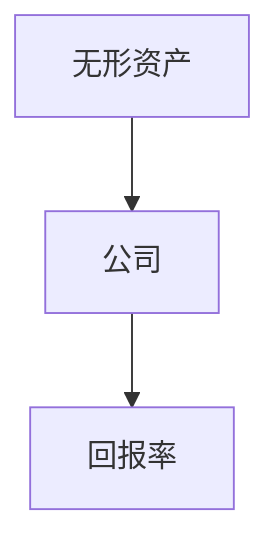
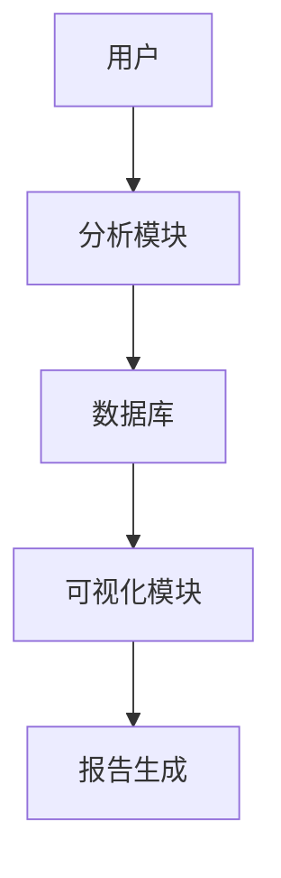

                 


# 彼得林奇对公司无形资产回报率的分析

## 关键词：彼得林奇，无形资产，回报率，公司价值，投资分析，财务指标

## 摘要：本文深入分析了彼得林奇对公司无形资产回报率的分析方法，探讨了其在公司价值评估中的重要性。通过定义、分类、计算公式、数学模型、系统架构和实际案例的详细讲解，帮助读者理解如何利用无形资产回报率进行投资决策。

---

## 第1章：背景介绍

### 1.1 无形资产的定义与分类

- **定义**：无形资产是公司拥有但无实体形态的资产，如专利权、商标权等。
- **分类**：
  - 专利权
  - 商标权
  - 版权
  - 商誉
  - 其他无形资产

### 1.2 无形资产回报率的背景与重要性

- **背景**：彼得林奇强调基本面分析，认为无形资产回报率能反映资产的盈利能力。
- **重要性**：无形资产在公司价值中起关键作用，影响投资决策。

---

## 第2章：核心概念与联系

### 2.1 无形资产回报率的定义与计算公式

- **定义**：回报率衡量无形资产对收益的贡献。
- **公式**：$$回报率 = \frac{净收益}{无形资产价值}$$

### 2.2 核心概念的ER实体关系图



---

## 第3章：数学模型与公式解析

### 3.1 无形资产回报率的计算

- **公式推导**：$$回报率 = \frac{净利润}{无形资产}$$
- **示例**：净利润100万元，无形资产500万元，回报率为20%。

---

## 第4章：系统分析与架构设计

### 4.1 问题场景介绍

- **问题**：如何评估无形资产对收益的影响？

### 4.2 系统功能设计

- **分析模块**：计算回报率。
- **可视化模块**：展示结果。

### 4.3 系统架构设计



---

## 第5章：项目实战

### 5.1 环境安装

- **安装**：Python与相关库（Pandas、NumPy）。

### 5.2 核心代码实现

```python
def calculate_return_rate(net_profit, intangible_assets):
    return net_profit / intangible_assets

net_profit = 1000000  # 净利润：100万元
intangible_assets = 5000000  # 无形资产：500万元
return_rate = calculate_return_rate(net_profit, intangible_assets)
print(f"无形资产回报率为：{return_rate:.2f}%")
```

### 5.3 案例分析

- **案例**：某科技公司，净利润100万元，无形资产500万元，回报率为20%。
- **图表**：生成柱状图展示回报率。

---

## 第6章：最佳实践与总结

### 6.1 小结

- 无形资产回报率是评估公司价值的重要指标。
- 彼得林奇的分析方法提供独特视角。

### 6.2 注意事项

- 定期评估，动态管理。
- 结合其他财务指标，全面分析。

### 6.3 拓展阅读

- 彼得林奇的其他投资策略。
- 财务分析方法论。

---

## 作者：AI天才研究院 & 禅与计算机程序设计艺术

---

通过以上结构，文章详细讲解了彼得林奇的分析方法，结合数学公式和实际案例，帮助读者理解如何利用无形资产回报率进行投资决策。

