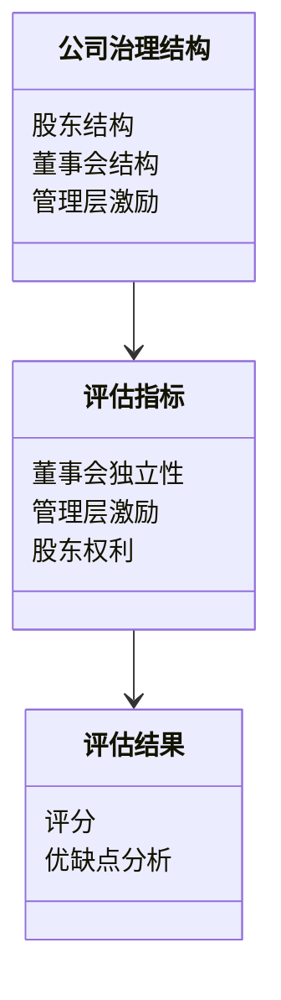

                 


# 彼得林奇对公司治理结构有效性的评估

---

## 关键词：公司治理，彼得林奇，投资评估，有效性，治理结构

---

## 摘要：  
本文通过分析彼得林奇的投资理念，探讨其对公司治理结构有效性的评估方法。文章从公司治理的基本概念出发，详细阐述了治理结构的核心要素，包括股东结构、董事会结构、管理层激励机制等，并结合实际案例，分析了如何通过有效的治理结构提升企业价值。文章还提出了基于彼得林奇评估框架的数学模型和算法，为投资者提供了一套系统化的评估方法。

---

## 第一部分: 公司治理结构有效性评估的背景与核心概念

### 第1章: 公司治理结构概述

#### 1.1 公司治理的基本概念

##### 1.1.1 公司治理的定义与内涵  
公司治理是确保公司有效运作和长期发展的制度安排，涉及股东、董事会、管理层和利益相关者之间的权利分配和制衡机制。

##### 1.1.2 公司治理的主要参与者  
- **股东**：拥有公司所有权，通过投票权影响公司决策。  
- **董事会**：负责监督管理层，制定公司战略和政策。  
- **管理层**：执行董事会的决策，管理日常运营。  
- **利益相关者**：包括员工、客户、债权人等。  

##### 1.1.3 公司治理的目标与功能  
- **目标**：实现公司价值最大化，保护利益相关者的权益。  
- **功能**：确保决策透明、合理，防范代理问题。  

#### 1.2 彼得林奇与公司治理的关系

##### 1.2.1 彼得林奇的投资理念  
彼得林奇是著名投资经理人，强调基本面分析和长期投资，认为公司治理是决定企业能否长期成功的关键因素之一。  

##### 1.2.2 公司治理在投资中的重要性  
- **治理结构**：影响企业的决策效率和风险控制。  
- **透明度**：影响投资者对公司的信任度。  
- **管理层激励**：影响管理层的积极性和创造力。  

##### 1.2.3 彼得林奇对治理结构的评价标准  
彼得林奇关注以下几个方面：  
1. **董事会独立性**：董事会成员是否独立，能否有效监督管理层。  
2. **管理层薪酬**：高管的薪酬是否合理，是否与公司绩效挂钩。  
3. **股东权利**：股东是否拥有足够的权利参与公司决策。  

---

### 第2章: 公司治理结构的有效性评估背景

#### 2.1 全球公司治理的发展历程

##### 2.1.1 美国公司治理模式  
美国采取“股东至上”模式，强调股东权益保护和市场机制的作用。  

##### 2.1.2 英国公司治理模式  
英国采取“利益相关者”模式，注重平衡股东、员工和债权人的利益。  

##### 2.1.3 其他主要国家的公司治理特点  
- **日本**：以家族控制和终身雇佣制为特点。  
- **德国**：以双层董事会和利益相关者参与为特点。  

#### 2.2 公司治理问题的现状与挑战

##### 2.2.1 治理失效的典型案例  
- **安然事件**：董事会失职导致公司破产。  
- **雷曼兄弟**：管理层过度冒险，忽视风险控制。  

##### 2.2.2 代理问题与利益冲突  
- 代理成本：管理层追求自身利益最大化，可能损害股东利益。  
- 利益冲突：不同利益相关者之间的矛盾。  

##### 2.2.3 全球化背景下的治理挑战  
- **跨国经营**：不同国家的治理规则差异带来挑战。  
- **全球监管**：国际监管趋严，要求更高的透明度和合规性。  

#### 2.3 公司治理与企业绩效的关系

##### 2.3.1 治理结构对企业价值的影响  
良好的治理结构能够提高企业效率，降低风险，从而提升企业价值。  

##### 2.3.2 治理效率与企业竞争力  
高效的治理结构能够快速响应市场变化，增强企业的竞争力。  

##### 2.3.3 治理创新与企业可持续发展  
创新的治理模式能够推动企业实现可持续发展，适应社会和环境的变化。  

---

## 第二部分: 公司治理结构的核心要素与评估框架

### 第3章: 公司治理的核心要素

#### 3.1 股东结构

##### 3.1.1 股权分散与集中  
- **股权分散**：多个小股东，缺乏统一的控制。  
- **股权集中**：大股东控制，可能引发控制权滥用。  

##### 3.1.2 主要股东的权利与义务  
- **权利**：投票权、知情权、收益权。  
- **义务**：遵守公司章程，维护公司利益。  

##### 3.1.3 股东 activism 的兴起  
- **股东 activism**：股东积极参与公司治理，推动管理层变革。  
- **影响**：提高公司治理透明度，促进管理层问责。  

#### 3.2 董事会结构

##### 3.2.1 董事会的组成与职责  
- **独立董事**：独立于管理层，提供客观的监督。  
- **执行董事**：代表管理层，参与公司战略决策。  

##### 3.2.2 董事会的独立性与专业性  
- **独立性**：董事会成员是否独立于管理层，能否客观决策。  
- **专业性**：董事会成员是否具备行业知识和经验。  

#### 3.3 管理层激励机制

##### 3.3.1 激励机制的类型  
- **股票期权**：通过分享公司增值收益，激励管理层创造价值。  
- **绩效奖金**：根据公司业绩发放奖金，激励管理层追求短期目标。  

##### 3.3.2 激励机制的有效性  
- **长期激励**：促进管理层关注企业长期发展。  
- **短期激励**：可能导致管理层追求短期业绩，忽视长期发展。  

---

## 第三部分: 公司治理结构的有效性评估方法

### 第4章: 彼得林奇评估框架的数学模型

#### 4.1 评估框架的构建

##### 4.1.1 评估指标的选取  
- **董事会独立性**：独立董事占比。  
- **管理层激励**：高管薪酬与公司绩效的关联度。  
- **股东权利**：股东是否有权参与重大决策。  

##### 4.1.2 指标的权重分配  
根据指标的重要性，赋予不同的权重。例如：  
- 董事会独立性：权重40%  
- 管理层激励：权重30%  
- 股东权利：权重30%  

#### 4.2 数学模型的建立

##### 4.2.1 综合评分模型  
$$ \text{治理有效性评分} = \sum (\text{指标得分} \times \text{权重}) $$  

##### 4.2.2 指标得分的计算  
- 每个指标按0-10分打分，满分10分。  

#### 4.3 案例分析

##### 4.3.1 苹果公司治理结构评估  
- 董事会独立性：高，独立董事占比超过50%。  
- 管理层激励：高管薪酬与公司绩效高度关联。  
- 股东权利：股东有权参与股东大会投票。  

##### 4.3.2 雅虎公司治理结构评估  
- 董事会独立性：低，独立董事占比不足30%。  
- 管理层激励：高管薪酬与公司绩效关联度低。  
- 股东权利：股东参与度低，股东大会形式化。  

---

## 第四部分: 系统分析与架构设计

### 第5章: 系统分析与架构设计方案

#### 5.1 问题场景介绍

##### 5.1.1 投资者如何评估公司治理结构  
投资者需要通过分析公司治理结构，判断公司是否具备长期投资价值。  

##### 5.1.2 企业如何优化治理结构  
企业需要根据投资者的评估标准，不断优化治理结构，提升竞争力。  

#### 5.2 系统功能设计

##### 5.2.1 领域模型（Mermaid 类图）  


#### 5.3 系统架构设计

##### 5.3.1 系统架构图（Mermaid 架构图）  


#### 5.4 系统接口设计

##### 5.4.1 输入接口  
- 接收公司治理结构数据，如董事会成员信息、股东结构等。  

##### 5.4.2 输出接口  
- 输出评估结果，包括评分和优缺点分析。  

#### 5.5 系统交互设计（Mermaid 序列图）  
```mermaid
sequenceDiagram
    投资者 -> 系统: 提交公司名称
    系统 -> 数据库: 查询公司治理数据
    并发
    系统 -> 第三方 API: 获取公司财报数据
    系统 -> 中间件: 计算评估指标
    系统 -> 投资者: 输出评估结果
```

---

## 第五部分: 项目实战与案例分析

### 第6章: 项目实战

#### 6.1 环境安装

##### 6.1.1 安装 Python 环境  
安装 Python 3.x 以上版本，并安装必要的库，如 `pandas`、`numpy`、`scikit-learn`。  

#### 6.2 系统核心实现源代码

##### 6.2.1 数据处理代码  
```python
import pandas as pd

# 读取公司治理数据
data = pd.read_csv('governance.csv')

# 计算独立董事占比
data['board_independence'] = data['independent_directors'] / data['total_directors']
```

##### 6.2.2 评估模型代码  
```python
def calculate_score(weights, scores):
    return sum(w * s for w, s in zip(weights, scores))

weights = [0.4, 0.3, 0.3]
scores = [8, 7, 9]
print(calculate_score(weights, scores))  # 输出：7.9
```

##### 6.2.3 可视化代码  
```python
import matplotlib.pyplot as plt

plt.bar(['董事会独立性', '管理层激励', '股东权利'], [8, 7, 9])
plt.title('公司治理结构评分')
plt.show()
```

#### 6.3 实际案例分析

##### 6.3.1 苹果公司治理结构评估  
- **董事会独立性**：独立董事占比为50%，评分8分。  
- **管理层激励**：高管薪酬与公司绩效高度关联，评分7分。  
- **股东权利**：股东参与度高，评分9分。  
- **综合评分**：$$ 0.4 \times 8 + 0.3 \times 7 + 0.3 \times 9 = 7.9 $$  

##### 6.3.2 雅虎公司治理结构评估  
- **董事会独立性**：独立董事占比为20%，评分5分。  
- **管理层激励**：高管薪酬与公司绩效关联度低，评分6分。  
- **股东权利**：股东参与度低，评分4分。  
- **综合评分**：$$ 0.4 \times 5 + 0.3 \times 6 + 0.3 \times 4 = 5.2 $$  

---

## 第六部分: 最佳实践与总结

### 第7章: 最佳实践与总结

#### 7.1 评估公司治理结构的有效性时的关键点

##### 7.1.1 关注董事会的独立性  
确保董事会成员中独立董事占比足够高，能够独立监督管理层。  

##### 7.1.2 重视管理层的激励机制  
高管薪酬应与公司绩效挂钩，激励管理层创造长期价值。  

##### 7.1.3 保护股东权利  
确保股东有权利参与公司重大决策，增强股东对公司治理的参与感。  

#### 7.2 投资策略的建议

##### 7.2.1 优先选择治理结构良好的公司  
在投资决策中，优先选择董事会独立性强、管理层激励合理、股东权利得到保障的公司。  

##### 7.2.2 定期评估公司治理结构  
随着市场环境和公司战略的变化，定期评估公司治理结构的有效性，及时调整投资策略。  

---

## 作者：AI天才研究院/AI Genius Institute & 禅与计算机程序设计艺术 /Zen And The Art of Computer Programming

---

**总结**：  
通过本文的分析，我们可以看到，彼得林奇对公司治理结构的有效性评估是一个系统化的过程，涉及多个核心要素和数学模型。投资者和企业都可以通过这种方法，更好地理解和优化公司治理结构，实现长期价值增长。

