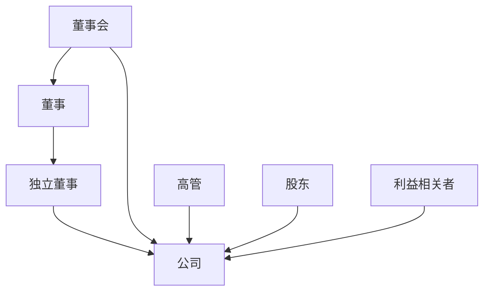
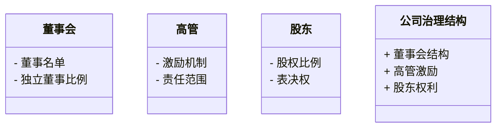

                 


# 彼得林奇对公司治理结构有效性的长期跟踪研究

## 关键词：公司治理结构、有效性评估、长期跟踪研究、彼得林奇、投资分析、管理优化

## 摘要：本文通过分析彼得·林奇对公司治理结构有效性的长期跟踪研究，探讨公司治理的核心要素、评估模型和优化方法。文章结合理论与实践，提供详细的数学模型和系统架构设计，帮助读者理解如何通过有效的公司治理结构提升企业绩效。

---

# 第1章: 公司治理结构概述

## 1.1 公司治理的基本概念
- 1.1.1 公司治理的定义与内涵
- 1.1.2 公司治理的核心要素：董事会、高管、股东
- 1.1.3 公司治理的目标与原则

## 1.2 彼得林奇与公司治理研究
- 1.2.1 彼得林奇的投资理念与公司治理
- 1.2.2 彼得林奇对公司治理的关注点
- 1.2.3 彼得林奇研究方法的特点

## 1.3 公司治理结构的有效性评估
- 1.3.1 有效性评估的定义与意义
- 1.3.2 有效性评估的关键指标
- 1.3.3 彼得林奇的长期跟踪研究方法

---

# 第2章: 公司治理的核心要素

## 2.1 董事会结构
- 2.1.1 董事会的组成与职责
- 2.1.2 独立董事的作用
- 2.1.3 董事会结构与公司绩效的关系

## 2.2 高管激励机制
- 2.2.1 激励机制的类型
- 2.2.2 激励机制的设计原则
- 2.2.3 激励机制与公司治理效果的关系

## 2.3 股东权利与义务
- 2.3.1 股东的基本权利
- 2.3.2 股东义务的履行
- 2.3.3 股东权利与公司治理结构的有效性

---

# 第3章: 核心概念与联系

## 3.1 核心概念的原理
- 3.1.1 董事会结构的原理
- 3.1.2 高管激励机制的原理
- 3.1.3 股东权利的原理

## 3.2 核心概念的属性特征对比
- 3.2.1 董事会结构的属性特征
- 3.2.2 高管激励机制的属性特征
- 3.2.3 股东权利的属性特征

## 3.3 ER实体关系图


---

# 第4章: 评估模型与算法原理

## 4.1 评估模型的构建
- 4.1.1 模型的输入变量：董事会结构、高管激励、股东权利
- 4.1.2 模型的输出结果：公司治理结构的有效性评分
- 4.1.3 模型的评估标准：评分与公司绩效的相关性

## 4.2 评估模型的数学表达
$$
\text{有效性评分} = \alpha \cdot \text{董事会结构评分} + \beta \cdot \text{高管激励评分} + \gamma \cdot \text{股东权利评分}
$$

其中，$\alpha + \beta + \gamma = 1$，且$\alpha, \beta, \gamma > 0$。

---

# 第5章: 系统分析与架构设计

## 5.1 系统功能设计
- 5.1.1 系统功能模块：数据采集、评估计算、结果展示
- 5.1.2 领域模型：公司治理结构的实体关系图


## 5.2 系统架构设计


---

# 第6章: 项目实战

## 6.1 环境安装
- 安装Python和相关库（如Pandas、NumPy、Plotly）

## 6.2 核心代码实现
```python
import pandas as pd
import numpy as np

def calculate_governance_score(board_score, exec_score, shareholder_score):
    alpha = 0.4
    beta = 0.3
    gamma = 0.3
    return alpha * board_score + beta * exec_score + gamma * shareholder_score
```

## 6.3 实际案例分析
- 案例分析：某公司治理结构的优化
- 数据分析与结果解读

---

# 第7章: 总结与展望

## 7.1 最佳实践 tips
- 定期评估公司治理结构
- 根据公司特点调整治理结构
- 引入外部专家进行评估

## 7.2 小结
- 本文总结了彼得林奇对公司治理结构有效性的研究方法
- 提供了数学模型和系统架构设计
- 强调了长期跟踪研究的重要性

## 7.3 注意事项
- 数据收集的准确性
- 模型的适用性
- 结果的可解释性

## 7.4 拓展阅读
- 推荐书籍和论文
- 关联话题：公司治理与风险管理

---

# 作者：AI天才研究院 & 禅与计算机程序设计艺术

# 版权声明：本文版权归作者所有，未经授权不得转载。

