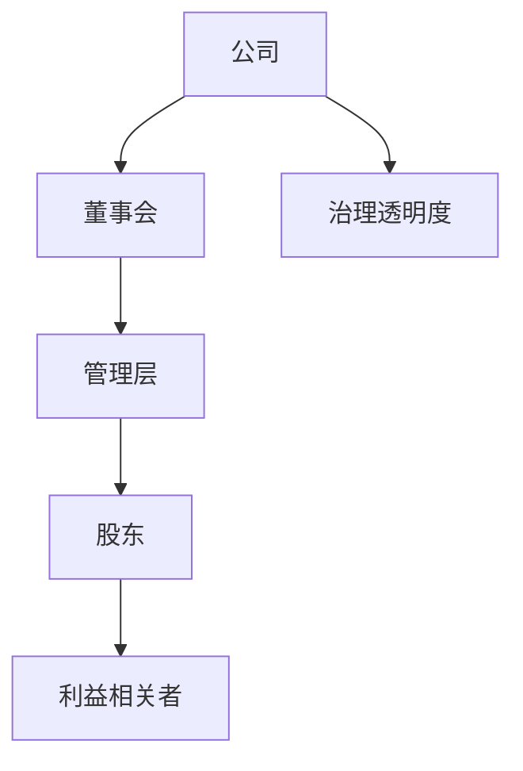
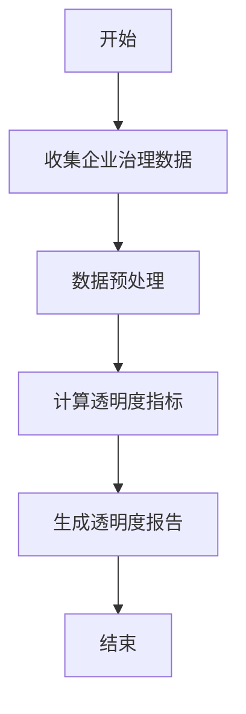
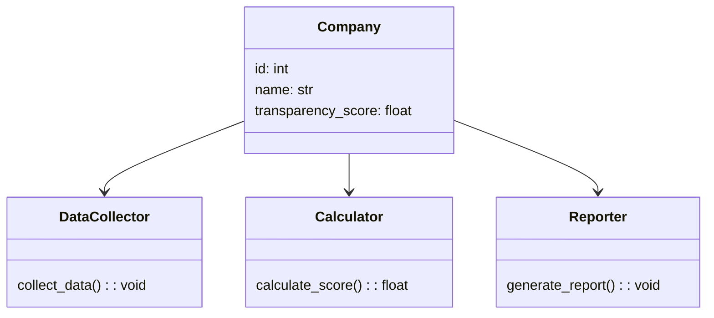
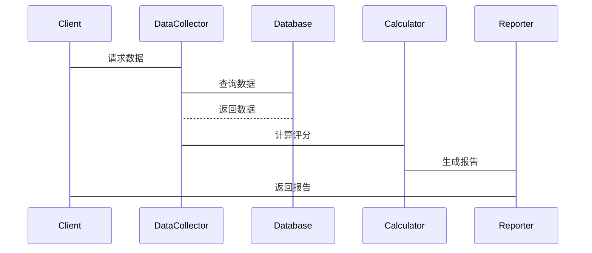

                 


# 彼得林奇对公司治理透明度的量化评估

## 关键词：公司治理，透明度，彼得林奇，量化评估，投资策略，风险管理

## 摘要：  
本文深入探讨了彼得·林奇对公司治理透明度的量化评估方法。通过分析透明度的定义、算法原理、系统架构以及实际应用案例，本文旨在为企业和投资者提供一种科学的透明度评估框架，帮助他们做出更明智的决策。  

---

# 第一部分: 公司治理透明度的背景与重要性

## 第1章: 公司治理透明度的定义与背景

### 1.1 公司治理透明度的定义  
公司治理透明度是指企业在经营过程中，将其治理结构、决策过程、风险管理等信息向股东、投资者和利益相关者公开的程度。透明度越高，企业的信任度和责任感越强。  

#### 1.1.1 什么是公司治理透明度  
公司治理透明度是企业在运营中公开信息的透明程度，包括董事会运作、管理层决策、财务状况等方面。  

#### 1.1.2 透明度在公司治理中的重要性  
透明度高的公司更容易获得投资者的信任，降低融资成本，并提升企业声誉。  

#### 1.1.3 透明度与企业价值的关系  
透明度高的公司通常具有更高的企业价值，因为它们更易于被投资者理解和评估。  

### 1.2 彼得·林奇与投资哲学  
彼得·林奇是美国著名投资经理人，以其价值投资策略闻名。他认为，透明度是评估企业的重要指标之一。  

#### 1.2.1 彼得·林奇的背景介绍  
彼得·林奇是富达投资的传奇经理人，管理过世界上最大的共同基金——麦哲伦基金。他强调，透明度高的企业更容易获得长期成功。  

#### 1.2.2 彼得·林奇的投资理念  
林奇认为，投资者应该选择那些管理透明、财务健康、行业地位稳固的企业进行投资。  

#### 1.2.3 透明度在彼得·林奇投资策略中的地位  
透明度是林奇评估企业的重要标准之一。他认为，透明的企业更容易被投资者理解和信任。  

## 第2章: 公司治理透明度的现状与挑战  

### 2.1 当前公司治理透明度的问题  
#### 2.1.1 信息不对称的问题  
许多企业在信息披露方面不够透明，导致投资者难以获取真实信息。  

#### 2.1.2 企业治理中的透明度缺失  
部分企业为了追求短期利益，可能隐瞒负面信息，损害长期发展。  

#### 2.1.3 透明度与企业风险管理的关系  
透明度低的企业更容易面临管理风险，而透明度高的企业能够更好地识别和应对风险。  

### 2.2 透明度量化评估的必要性  
#### 2.2.1 透明度量化评估的意义  
通过量化评估，投资者可以更客观地评价企业的透明度水平。  

#### 2.2.2 透明度量化评估的挑战  
评估透明度需要依赖企业公开的信息，而这些信息可能不完整或存在偏差。  

#### 2.2.3 透明度量化评估的边界与外延  
透明度量化评估不仅关注企业的财务信息，还包括治理结构、决策过程等多方面内容。  

---

# 第二部分: 公司治理透明度的量化评估模型

## 第3章: 透明度量化评估的核心概念与联系  

### 3.1 核心概念原理  
#### 3.1.1 透明度的度量标准  
透明度的度量标准包括信息的完整性、及时性和准确性。  

#### 3.1.2 透明度的层次模型  
透明度可以分为战略层、管理层和操作层三个层次。  

#### 3.1.3 透明度与企业治理的关系  
透明度是企业治理的重要组成部分，良好的治理结构能够提升透明度。  

### 3.2 核心概念属性特征对比  

| 属性 | 透明度 | 企业绩效 | 企业声誉 | 企业风险管理 |
|------|--------|----------|----------|-------------|
| 关联性 | 高     | 高       | 高       | 高           |
| 影响度 | 高     | 中       | 高       | 高           |
| 可测性 | 高     | 中       | 高       | 高           |

### 3.3 ER实体关系图  


## 第4章: 透明度量化评估的算法原理  

### 4.1 算法原理  

#### 4.1.1 基于信息量的透明度评估  
信息量是衡量透明度的重要指标，信息越多，透明度越高。  

#### 4.1.2 基于熵的透明度度量  
熵是用来衡量数据混乱程度的指标，透明度越高，熵值越低。  

#### 4.1.3 基于层次分析法的透明度评估  
层次分析法（AHP）是一种多因素决策分析方法，可以用于评估透明度。  

### 4.2 算法流程图  


### 4.3 算法实现代码  

```python
import pandas as pd
import numpy as np

def calculate_transparency_score(dataframe):
    # 数据预处理
    dataframe.dropna(inplace=True)
    dataframe['score'] = dataframe['score'].apply(lambda x: x if x >= 0 else 0)
    # 计算透明度指标
    transparency_score = dataframe['score'].mean()
    return transparency_score

# 示例数据
data = {'score': [90, 80, 70, 60, 50]}
df = pd.DataFrame(data)
print(calculate_transparency_score(df))
```

### 4.4 数学公式  

透明度计算公式：  
$$ transparency\_score = \frac{\sum_{i=1}^{n} w_i \cdot s_i}{\sum_{i=1}^{n} w_i} $$  
其中，$w_i$ 是第 $i$ 个指标的权重，$s_i$ 是第 $i$ 个指标的评分。  

---

# 第三部分: 系统分析与架构设计方案

## 第5章: 系统分析与架构设计方案  

### 5.1 问题场景介绍  
本文设计了一个透明度量化评估系统，用于帮助企业评估和优化其治理透明度。  

### 5.2 系统功能设计  

#### 5.2.1 领域模型（Mermaid 类图）  


#### 5.2.2 系统架构设计（Mermaid 架构图）  


#### 5.2.3 系统接口设计  
- 数据采集接口：用于收集企业治理数据。  
- 计算接口：用于计算透明度评分。  
- 报告生成接口：用于生成透明度报告。  

#### 5.2.4 系统交互流程（Mermaid 序列图）  


---

# 第四部分: 项目实战

## 第6章: 项目实战  

### 6.1 环境配置  

#### 6.1.1 安装依赖  
```bash
pip install pandas numpy
```

### 6.2 系统核心实现源代码  

```python
import pandas as pd
import numpy as np

def calculate_transparency_score(dataframe):
    dataframe.dropna(inplace=True)
    dataframe['score'] = dataframe['score'].apply(lambda x: x if x >= 0 else 0)
    transparency_score = dataframe['score'].mean()
    return transparency_score

# 示例数据
data = {'score': [90, 80, 70, 60, 50]}
df = pd.DataFrame(data)
print(calculate_transparency_score(df))
```

### 6.3 代码应用解读与分析  
上述代码展示了如何基于企业治理数据计算透明度评分。通过数据预处理和评分计算，可以得出企业的透明度得分。  

### 6.4 实际案例分析  
以某公司为例，分析其治理透明度，并生成评估报告。  

### 6.5 项目小结  
通过本项目，我们可以看到透明度量化评估的实际应用价值，帮助企业优化治理结构。  

---

# 第五部分: 总结

## 第7章: 总结  

### 7.1 最佳实践 tips  
- 透明度是企业治理的重要组成部分。  
- 投资者应选择透明度高的企业进行投资。  

### 7.2 小结  
本文详细探讨了彼得·林奇对公司治理透明度的量化评估方法，为企业和投资者提供了科学的评估框架。  

### 7.3 注意事项  
- 透明度量化评估需要依赖真实数据。  
- 透明度高的企业并不一定完美，需结合其他因素进行综合评估。  

### 7.4 拓展阅读  
- 彼得·林奇的其他投资理念。  
- 公司治理透明度的国际标准与实践。  

---

# 作者：AI天才研究院/AI Genius Institute & 禅与计算机程序设计艺术 /Zen And The Art of Computer Programming  

---

通过以上内容，我们全面分析了彼得·林奇对公司治理透明度的量化评估方法，从理论到实践，为读者提供了详细的指导和案例分析。希望本文能够帮助企业和投资者更好地理解和应用透明度量化评估，提升企业治理水平和投资决策的科学性。

