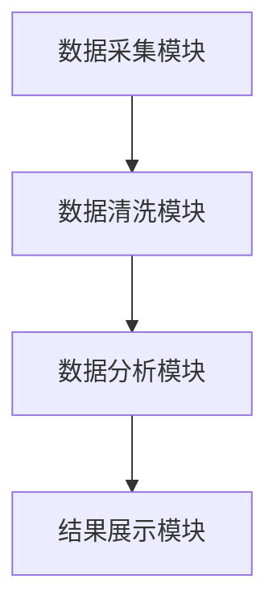

                 


# 彼得林奇对公司环境社会治理(ESG)报告的质量评估

> 关键词：彼得林奇，ESG报告，环境社会治理，质量评估，投资策略

> 摘要：本文深入分析了彼得·林奇在评估公司环境社会治理（ESG）报告质量方面的独特视角和方法。通过探讨ESG的核心概念、质量评估框架以及实际应用案例，本文详细阐述了如何将ESG因素融入投资决策，帮助投资者识别和选择优质投资标的。文章还提供了丰富的技术细节和实际操作指南，为读者提供了全面的理论和实践指导。

---

## 第1章: 公司环境社会治理（ESG）概述

### 1.1 ESG的核心概念

#### 1.1.1 环境（Environmental）的定义与内涵

环境因素关注企业在经营过程中对环境的影响，包括能源消耗、碳排放、污染治理等方面。企业通过减少对环境的负面影响，可以提升可持续发展能力。

#### 1.1.2 社会（Social）的定义与内涵

社会因素关注企业在社会中的责任履行，包括员工权益、社区关系、产品安全等方面。企业通过积极履行社会责任，可以提升品牌形象和公众信任度。

#### 1.1.3 治理（Governance）的定义与内涵

治理因素关注企业的内部管理结构和决策机制，包括董事会构成、高管薪酬、内部控制等方面。良好的治理结构可以提升企业的长期发展潜力和抗风险能力。

#### 1.1.4 ESG的整合与协同关系

ESG三者之间相互关联，共同构成了企业的可持续发展能力。例如，良好的环境管理可以降低企业的运营成本，优秀的社会责任履行可以提升品牌形象，而有效的治理结构可以确保企业战略的有效实施。

#### 1.1.5 ESG与企业可持续发展的关系

ESG是企业实现可持续发展的关键支柱。通过关注环境、社会和治理因素，企业可以在满足当前利益的同时，为未来的发展奠定基础。

### 1.2 ESG报告的重要性

#### 1.2.1 ESG报告对企业形象的影响

ESG报告是企业展示社会责任履行情况的重要途径。优秀的ESG报告可以提升企业的品牌形象，吸引更多关注可持续发展的投资者和客户。

#### 1.2.2 ESG报告对投资者决策的影响

投资者通过分析ESG报告，可以更好地评估企业的风险和机会。优秀的ESG表现通常与企业长期表现和抗风险能力密切相关。

#### 1.2.3 ESG报告对监管机构的作用

监管机构可以通过审查ESG报告，评估企业的合规性和透明度。这有助于推动企业遵守相关法律法规，促进市场的健康发展。

#### 1.2.4 ESG报告对企业内部管理的作用

企业通过编制ESG报告，可以识别自身的短板和改进空间。这有助于企业优化内部管理，提升整体竞争力。

---

## 第2章: ESG报告的核心要素与质量评估框架

### 2.1 ESG报告的核心要素

#### 2.1.1 环境要素的关键指标

- **碳排放**：企业的碳足迹，包括直接和间接排放。
- **能源消耗**：单位产品或服务的能源消耗情况。
- **环保投入**：企业在环保技术和研发上的投入情况。

#### 2.1.2 社会要素的关键指标

- **员工权益**：员工的工资、福利和工作条件。
- **社区关系**：企业对社区的支持和贡献。
- **产品安全**：产品是否符合安全标准。

#### 2.1.3 治理要素的关键指标

- **董事会构成**：董事会的多元化和独立性。
- **高管薪酬**：高管的薪酬结构和透明度。
- **内部控制**：企业内部的审计和监督机制。

### 2.2 ESG报告的质量评估框架

#### 2.2.1 评估框架的设计原则

- **全面性**：覆盖环境、社会和治理三方面。
- **可操作性**：评估指标应具体、可量化。
- **可比性**：不同企业的评估结果应具有可比性。
- **动态性**：评估指标应根据行业变化进行调整。

#### 2.2.2 评估指标的选择标准

- **相关性**：指标应与企业的可持续发展目标相关。
- **可量化性**：指标应能够通过数据进行量化评估。
- **独立性**：各指标之间应相对独立，避免重复。

#### 2.2.3 评估方法的多样性

- **定量评估**：通过数据指标进行量化分析。
- **定性评估**：通过文本分析和案例研究进行评估。
- **综合评估**：结合定量和定性方法，得出综合评分。

#### 2.2.4 评估结果的可比性

- **标准化评分**：通过标准化处理，使不同企业的评估结果具有可比性。
- **行业基准**：根据行业特点设定基准值，便于横向比较。

---

## 第3章: ESG质量评估的理论基础与方法论

### 3.1 ESG质量评估的理论基础

#### 3.1.1 公司治理理论

公司治理理论强调董事会和管理层的有效性，确保企业利益相关者的权益得到保护。这与ESG中的治理（Governance）密切相关。

#### 3.1.2 社会责任理论

社会责任理论认为企业应积极履行社会责任，包括保护环境、支持社区发展等。这与ESG中的环境（Environmental）和社会（Social）密切相关。

#### 3.1.3 可持续发展理论

可持续发展理论强调经济、社会和环境的协调发展。这与ESG的整合和协同关系密切相关。

### 3.2 ESG质量评估的方法论

#### 3.2.1 定性评估方法

定性评估方法通过分析企业的政策、承诺和实践，评估其在ESG方面的表现。例如，分析企业的ESG报告，评估其披露的信息是否全面、透明。

#### 3.2.2 定量评估方法

定量评估方法通过收集和分析数据，计算企业的ESG评分。例如，根据企业的碳排放、员工满意度等指标，计算综合评分。

#### 3.2.3 综合评估方法

综合评估方法结合定性和定量方法，得出综合评分。例如，先通过定性分析确定企业的ESG表现，再通过定量分析验证其数据支持。

#### 3.2.4 评估模型的构建与优化

评估模型的构建需要考虑指标的权重、数据的来源和计算方法。例如，使用加权平均法，根据各指标的重要程度赋予不同的权重。

---

## 第4章: 彼得·林奇的ESG投资策略与质量评估

### 4.1 彼得·林奇的投资哲学

#### 4.1.1 长期投资与价值发现

彼得·林奇强调长期投资，注重企业的基本面和长期发展潜力。他通过分析企业的财务状况、市场地位和管理团队，寻找具有竞争优势的投资标的。

#### 4.1.2 风险控制与收益平衡

彼得·林奇注重风险控制，避免过度集中投资。他通过分散投资和严格筛选标的，平衡风险和收益。

#### 4.1.3 投资决策中的ESG因素

彼得·林奇认为，企业的可持续发展能力是长期投资的重要因素。他通过分析企业的ESG表现，筛选出具有长期发展潜力的投资标的。

### 4.2 彼得·林奇与ESG报告质量评估

#### 4.2.1 ESG报告在投资决策中的作用

彼得·林奇认为，ESG报告是评估企业可持续发展能力的重要依据。他通过分析ESG报告，识别企业的潜在风险和机会。

#### 4.2.2 彼得·林奇的ESG评估标准

彼得·林奇的ESG评估标准包括：

- **环境因素**：企业的碳排放、能源消耗等指标。
- **社会因素**：员工权益、社区关系等指标。
- **治理因素**：董事会构成、高管薪酬等指标。

#### 4.2.3 通过ESG报告筛选优质投资标的

彼得·林奇通过分析企业的ESG报告，筛选出具有优秀环境表现、社会责任履行能力和良好治理结构的企业作为投资标的。

---

## 第5章: ESG报告质量评估的指标体系与权重分配

### 5.1 ESG报告质量评估的指标体系

#### 5.1.1 环境指标

- 碳排放强度（CO2 emissions intensity）
- 能源消耗效率（Energy efficiency）
- 环保投入比例（Environmental investment ratio）

#### 5.1.2 社会指标

- 员工满意度（Employee satisfaction）
- 社区支持度（Community support）
- 产品安全评级（Product safety rating）

#### 5.1.3 治理指标

- 董事会独立性（Board independence）
- 高管薪酬透明度（Executive compensation transparency）
- 内部控制有效性（Internal control effectiveness）

### 5.2 指标权重的分配

#### 5.2.1 权重分配的原则

- 根据行业特点和企业特点，调整各指标的权重。
- 例如，对于能源企业，环境指标的权重应更高；对于科技企业，治理指标的权重应更高。

#### 5.2.2 权重分配的具体方法

- **层次分析法（AHP）**：通过专家打分法，确定各指标的权重。
- **主成分分析法（PCA）**：通过数据降维，确定各指标的重要性。

---

## 第6章: 项目实战——ESG报告质量评估系统开发

### 6.1 项目背景与目标

#### 6.1.1 项目背景

随着ESG投资的兴起，开发一个高效的ESG报告质量评估系统具有重要的现实意义。

#### 6.1.2 项目目标

- 开发一个能够自动采集、分析和评估企业ESG报告的系统。
- 提供直观的评估结果和改进建议。

### 6.2 系统设计与实现

#### 6.2.1 系统功能设计

- 数据采集模块：从企业官网或数据库中采集ESG报告数据。
- 数据清洗模块：对采集的数据进行预处理，确保数据的完整性和准确性。
- 数据分析模块：根据设定的指标体系和权重，计算企业的ESG评分。
- 结果展示模块：以可视化的方式展示评估结果和改进建议。

#### 6.2.2 系统架构设计



#### 6.2.3 核心代码实现

```python
import pandas as pd
import numpy as np

# 数据清洗函数
def clean_data(data):
    data = data.dropna()
    return data

# ESG评分计算函数
def calculate_esg_score(data, weights):
    score = np.dot(data, weights)
    return score

# 数据加载与处理
data = pd.read_csv('esg_report.csv')
clean_data = clean_data(data)
weights = [0.4, 0.3, 0.3]  # 示例权重
esg_scores = calculate_esg_score(clean_data, weights)
```

### 6.3 项目小结

通过开发ESG报告质量评估系统，我们可以高效地评估企业的ESG表现，为投资者和企业提供有价值的参考。未来，可以进一步优化系统的功能，例如增加动态调整权重的功能，或者引入机器学习算法进行智能评估。

---

## 第7章: 总结与展望

### 7.1 总结

本文从理论和实践两个方面，深入分析了彼得·林奇在ESG报告质量评估方面的独特视角和方法。通过构建科学的指标体系和优化评估模型，我们可以更准确地评估企业的ESG表现，为投资决策提供有力支持。

### 7.2 展望

未来，随着ESG投资的进一步发展，我们需要进一步优化评估模型，引入更多的创新方法和技术，如大数据分析和人工智能，提升评估的准确性和效率。同时，我们还需要推动ESG评估的标准化，促进不同企业和行业之间的可比性。

---

## 作者：AI天才研究院/AI Genius Institute & 禅与计算机程序设计艺术 /Zen And The Art of Computer Programming

---

通过本文的分析和实践，我们不仅了解了彼得·林奇的ESG投资策略，还掌握了如何构建和优化ESG报告质量评估系统的方法。希望这些内容能够为读者在ESG投资和研究中提供有价值的参考和指导。

